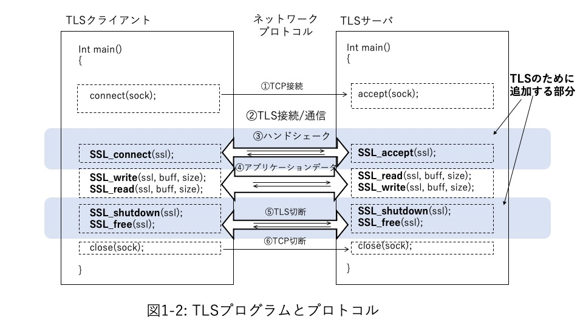
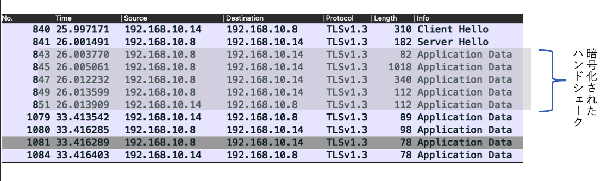
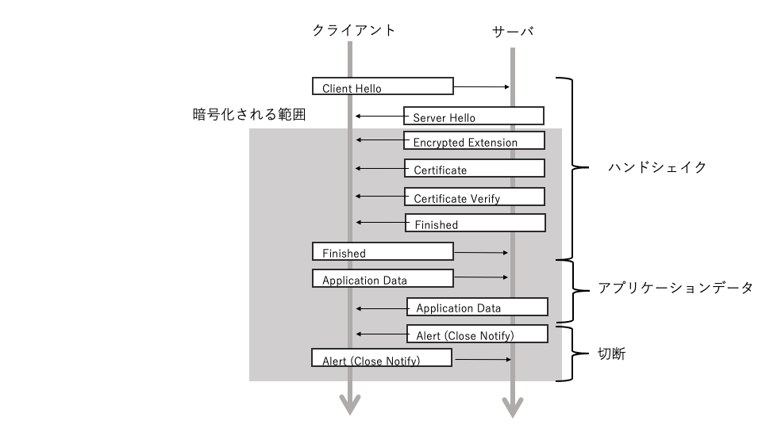
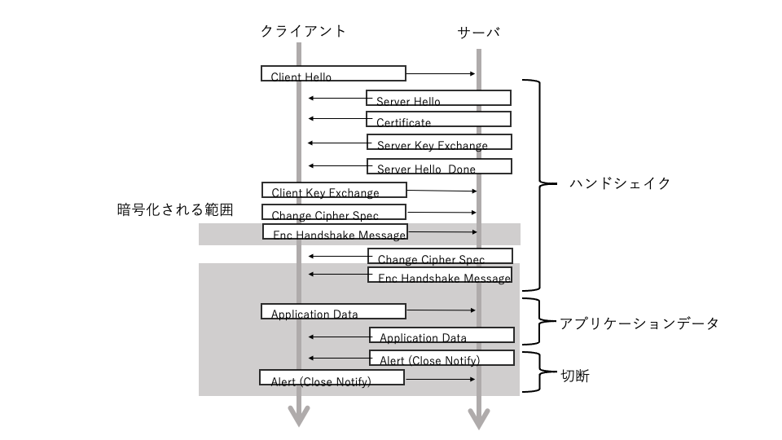
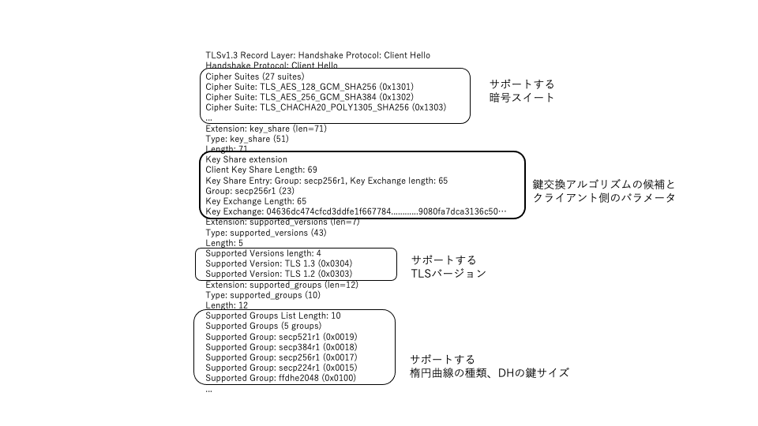
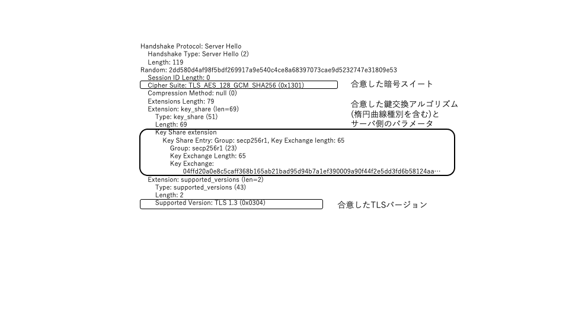

## Part 1 TLS technology

In Part 1, we'll look at the underlying technologies of TLS programming.

Chapter 1 provides an overview of the TLS protocol, starting with extending a simple C-based TCP client and server program to TLS clients and servers. Chapter 2 describes the TLS protocol, with a particular focus on TLS 1.3. In Chapter 3, we will look at the cryptographic algorithms and technologies used in TLS, especially in relation to TLS, to better understand the protocol. In addition, Chapter 4 summarizes the standards that support TLS, and Chapter 5 summarizes security considerations in TLS programming.

## Chapter 1 Simple TLS program

### 1.1 TCP client / server

In Chapter 1, we will look at how TLS programs and protocols are realized through a simple C client-server program.

This sample program is a simple program that sends and receives one round-trip application message from client to server and from server to client after TCP or TLS connection, and disconnects, but the TLS protocol is included in this program. You can see most of the main components that make up it.

All TLS protocols are implemented on top of TCP protocol connections. Figure 1.1 outlines a simple client and server program for TCP-only network communication.

If you omit the pre-processing on the program, TCP communication first enters the waiting state so that the server can accept the connection request from the other party (client) who wants to communicate with this server. Taking a BSD socket program as an example, we call `accept ()`.

On the other hand, the client makes a connection request to the server with which it wants to communicate. For BSD sockets this is a call to `connect ()`. When this request is accepted by the server, a TCP connection is established (Fig. 1.1 ①), and TCP communication is possible between the client and the server.

After that, this connection is used to repeatedly send and receive messages between the client and server as needed by the application (Fig. 1.1 (2)).

Finally, disconnect the TCP connection when the required messages have been sent and received (Fig. 1.1 (3)).

### 1.2 Add TLS layer

Now let's add TLS layer processing to this TCP client and server program. Figure 1.2 shows a program with TLS processing added.

Since TLS performs all communication on the TCP protocol, the TCP program connection (Fig. 1.2 ①) and disconnection process (Fig. 1.2 ⑤) are exactly the same as in Fig 1.1. All TLS records will be transferred on top of the TCP records between the TCP-connected client and server.

The entire TLS connection is a two-step process: a TCP layer connection and a TLS layer connection.

First, on the server side, accept () is called to wait for a TCP connection request from the client (Fig. 1.2 ①). When the client calls connect () and the connection request to the server is transmitted and the TCP connection is established, the accept () process is completed on the server side, and then SSL_accept () is called. The server side is now waiting for a TLS connection request from the client.

On the other hand, the client-side program calls TCP connect () followed by SSL_connect () for a TLS connection request. This call performs a series of TLS handshakes between the client and server (Figure 1.2 ③).

After the TLS connection is established, send and receive the target application data (Fig. 1.2 (4)). This is achieved programmatically by calling the API `SSL_read ()` / `SSL_wrote ()`. The plaintext message that the application wants to send is encrypted by `SSL_write ()`, then decrypted by `SSL_read ()` and passed to the other application in cleartext. At this time, as part of the TLS protocol processing, the received message is not tampered with from the source message, that is, "authenticity check" is also performed.

Finally, when the transmission and reception of application data is completed, disconnect in the order of TLS and TCP (Fig. 1.2 ⑤, ⑥).

<note>

The program code introduced in this manual is an excerpt. The sample program that can be compiled / executed including the variable definition to be used, preprocessing and error processing, and `Makefile` can be downloaded from the following URL as the data attached to this manual. Please refer to that as well.

--`https://www.shoeisha.co.jp/book/download/9784798161938` ☆

</ note>

### 1.3 A bird's-eye view of the TLS protocol

Now let's see how this sample program works at the TLS protocol layer.

You can see this with a packet capture tool like Wireshark. Here, we specify "tls" for the Wireshark filter so that we can focus only on the TLS handshake (Figure 1.3). In TLS 1.3, only the beginning part of the handshake is sent and received in plain text, and the rest are all encrypted exchanges, so in a normal packet capture you can only see the beginning "` Client Hello `" and "` Server Hello `". You can see that it is not possible.

In the TLS 1.3 handshake, "` Client Hello` "and" `Server Hello`" are followed by a series of message exchanges named as shown in the figure below. The handshake when the client and server establish a TLS connection for the first time "without prior knowledge of the other party", as in this example, is called a full handshake. Full hand shake

- A series of lists of cryptographic algorithms and other methods supported from the client side are shown as candidates.
- The server side agrees on it and agrees on a symmetric-key for subsequent exchanges of encrypted messages.

It has become a flow. At that time, peer authentication (server authentication, client authentication), which is called "confirmation that the other party of communication is a legitimate partner", is performed using the public key certificate.

For comparison, Figure 1.5 shows a full handshake with a similar connection made over TLS 1.2.
In TLS 1.2, encryption starts at the end of the handshake and is not encrypted during the handshake. In addition, the contents are also divided into the agreement part of the encryption method, the exchange of parameters of the key agreement, and the server authentication part, and there are many types of messages. With TLS 1.3, the handshake can be completed in almost one round trip, whereas before TLS 1.2, two round trips were required.

The following figure shows how the TLS 1.3 handshake is overlaid with the handshake messages up to TLS1.2 and how the messages are organized in TLS1.3. In TLS 1.2 "` Client Hello` "and" `Server Hello`", you only agree on an encryption method called a cipher suite, and the information actually required for encryption is the following "` Server Key Exchange `". It was supposed to be handed over by "` Client Key Exchange `".

In TLS1.3, thanks to the abolition and cleanup of the old cipher suites, it is now possible to pass that information all at once in "` Client Hello` "and" `Server Hello`". Thanks to that, encryption can be started from the early stage of the handshake, and there is no need for something like "` Server Hello Done `" or "` Change Cipehr Spec` "that indicates an intermediate state, and the hand. The entire handshake has been succinctly organized with a unified "Finished`" to indicate the end of the shake.

Table 1.1 summarizes how the TLS 1.2 handshake messages were organized in TLS 1.3 and how they correspond. In the past, there were two methods for organizing such handshakes: using a static RSA public key as a key agreement method and a method based on the Diffie-Hellman system. , In TLS 1.3, the security risk (complete forward secrecy) of the static RSA method has been pointed out and this has been abolished. The main reason is that the cipher suites that should be agreed upon can be simplified and organized because only the Diffie-Hellman system is available.

[Table 1.1]

| Message   TLS1.3 | Message   TLS1.2 and earlier | Direction | Description | Reffer to |
| --- | --- | --- | --- | --- |
| `Client Hello` |` Client Hello`   `Client Key Exchange` | Client → Server | TLS Connection Request | 2.1" Full Handshake "  2.1.2" Cipher Suite Agreement "  2.1.4 "Key Agreement" |
| `Server Hello` |` Server Hello`   `Server Key Exchange` | Client ← Server | TLS Connection Acceptance | 2.1" Full Handshake "  2.1.2" Cipher Suite Agreement "  2.1.4 "Key Agreement" |
| `Encrypted Extensions` || Client ← Server | Server Supplementary Information ||
| `Certificate` |` Certificate` | Client ← Server | Server Certificate | 2.1.6 Peer Authentication |
| `Certificate Verify` |` Server Key Exchange` | Client ← Server | Server Certificate Information | 2.1.6 Peer Authentication |
| `Finished` |` Server Hello Done`   `Change Cipher Spec`  ` Finished` | Client ← Server | Handshake Complete ||
| `Finished` |` Change Cipher Spec`   `Finished` | Client → Server | Handshake Complete ||
| `Application Data` |` Application Data` | Client → Server | Application Data | 2.4 "Record Protocol" |
| `Application Data` |` Application Data` | Client ← Server | Application Data | 2.4 "Record Protocol" |
| `Alert` |` Alert` | Client → Server | TLS Connection Termination | 2.5 "Alert Protocol" |
| `Alert` |` Alert` | Client ← Server | TLS Connection Termination | 2.5 "Alert Protocol" |

#### 1.3.1 Client Hello Message

Now let's take a closer look at TLS 1.3 capture.

The TLS protocol begins with a TLS connection request with a `Client Hello` message from the client to the server. This message contains the version of TLS you want to connect to (in this case TLS 1.3 is specified as "TLSv1.3") and a list of cipher suites available to the client. Especially for TLS 1.3, `key_share` also contains a set of client-side parameters for key agreement so that it can be encrypted from the rest of the handshake. This is the information sent by the `Client Key Exchange` on the second round trip of the handshake up to TLS1.2.

Figure 1.6 is an excerpt from the `Client Hello` message, where` Cipher Suites` has a list of cipher suites supported by the client, and `supported_versions` has the supported TLS versions,` You can see that supported_groups` shows the supported elliptic curve cryptographic curve types, RSA key lengths, and so on.

#### 1.3.2 Server Hello message

In response to the `Client Hello` message from the client, the server accepts the connection request with the` Server Hello` message. This message includes the suite selected by the server from the cipher suites presented by the client, the set of server-side parameters for key agreement, and so on.

So far, it is not so different from TLS1.2 or earlier, but in TLS1.3, in addition to them, `key_share` is characterized by storing client-side information necessary for key agreement. By matching the information of the `key_share` of Server Hello corresponding to this, the key agreement was established at this stage and encryption became possible. As we saw in Figure 1.3, all subsequent handshake messages are encrypted with the agreed symmetric key.

<note>

In addition to the full handshake, TLS also stipulates a handshake for pre-shared key (PSL: Pre-Shared Key) in which both parties in communication separately agree in advance on the symmetric-key used for encryption. It also stipulates a session resumption method for establishing a secure session and then establishing a second and third session.

The details of the full handshake are described in Section 2.1, “Full Handshake”. Pre-shared key (PSK) and session resumption are described in Section 2.2, “Pre-shared Key and Session Resume”.

</ note>

#### 1.3.3 Certificate / Certificate Verify message

After the server sends additional information, the `Certificate` and` Certificate Verify` messages send the server certificate and verification information to indicate that the server is a legitimate server. Then, on the client side that receives these, use the CA certificate that you have to confirm that this server is a legitimate server.

TLS stipulates a bidirectional authentication method for server authentication and client authentication, but server authentication is mandatory and client authentication is optional (optional). Therefore, in this example, only server authentication is performed.

#### 1.3.4 Finished message

When the processing up to this point is completed, both parties send and receive a short encrypted message to confirm the method, and send a `Finished` message to confirm the normal completion of the handshake. This means that the TLS connection is now securely established. In TLS1.2, at the end of the handshake, it was split into a `Change Cipher Spec` (in this case, a switch from plaintext to an agreed cipher suite) and a`Finished` to indicate a cipher suite switch. Also, the server side sent `Server Hello Done` to indicate the end of the first phase, but these are no longer needed and have been put together in` Finished`.

#### 1.3.5 Application Data Message

This sample program sends and receives one round-trip message from client to server and from server to client.

#### 1.3.6 Alert message

Finally, both send a `Alert` message with the Alert type" Close Notify "to indicate the termination of the TLS connection. Alert seems to indicate an abnormal condition, but the type Close Notify indicates the normal termination of TLS.

| Summary of TLS1.3 changes |
| --- |
| Handshake messages have been organized and can now be completed in one round trip |
| Handshake messages are now encrypted after Cleint Hello, Server Hello |
| This is made possible by the fact that the key agreement method has been organized only into (EC) DHE |