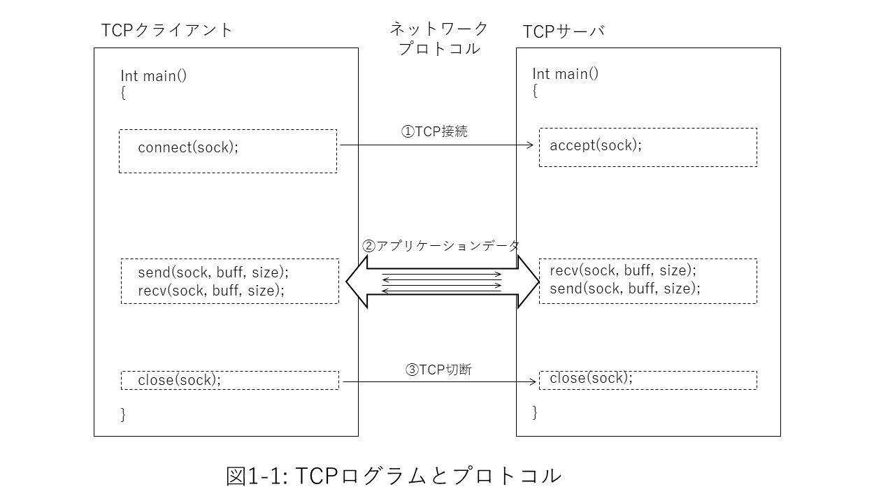
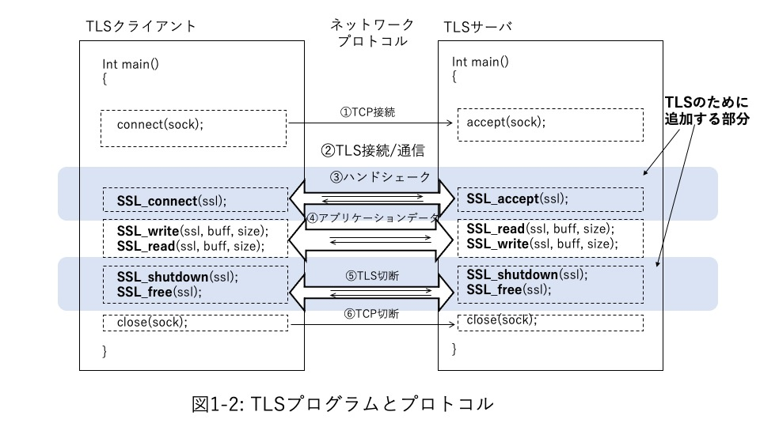
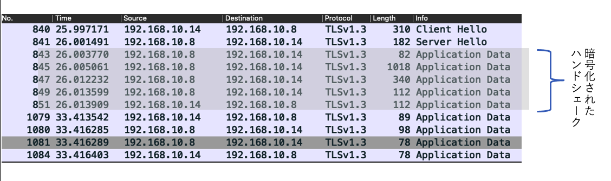
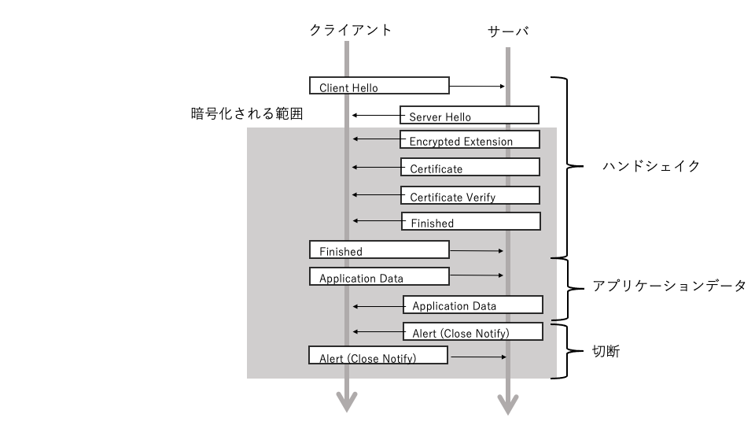
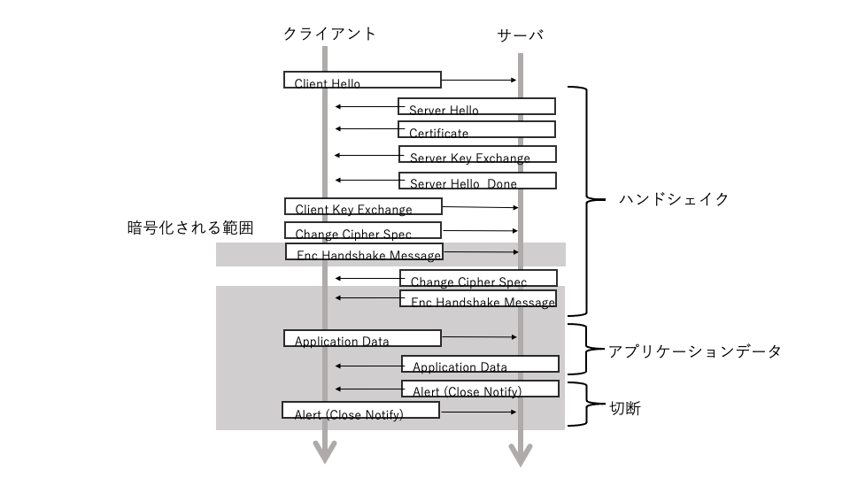
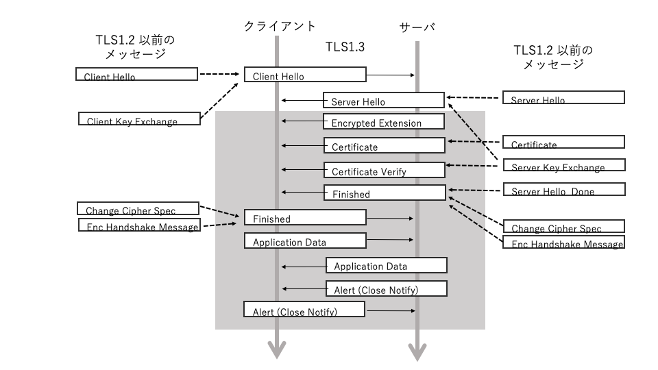
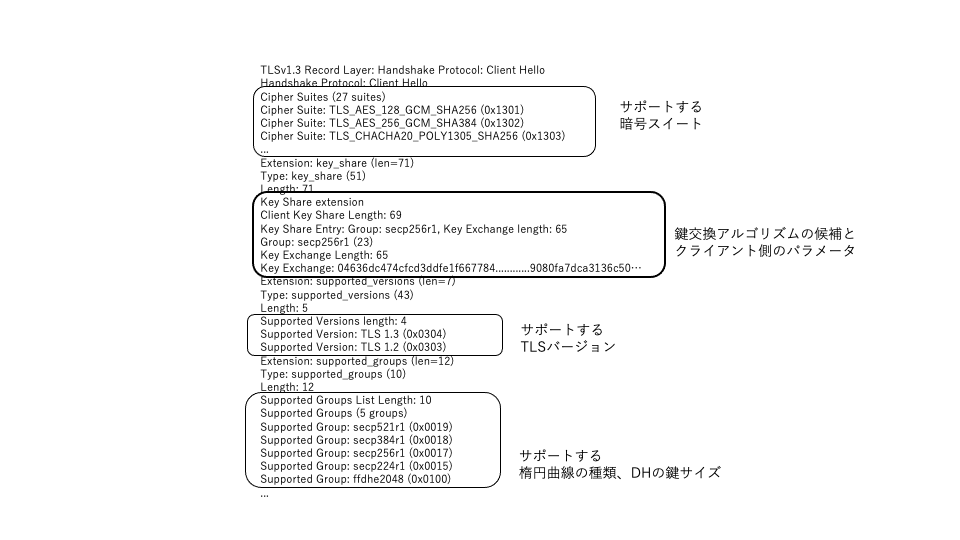
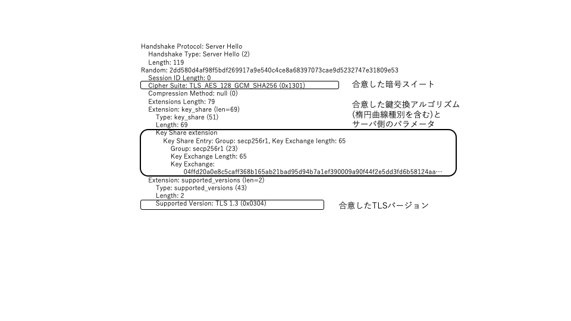

## Part 1 TLSの技術

Part 1では、TLSプログラミングの基礎となる技術について見ていきます。

Chapter 1では、C言語ベースの簡単なTCPクライアントとサーバープログラムをTLSによるクライアントとサーバーに拡張するところからスタートし、TLSプロトコルの概要を紹介します。Chapter 2では、TLSプロトコルについて特にTLS 1.3を中心に解説します。Chapter 3ではプロトコルをさらに詳細に理解するために、TLSに使われている暗号アルゴリズムや技術について、特にTLSとの関連を見ていきます。また、Chapter 4ではTLSを支える標準について、Chapter 5ではTLSプログラミングにおいてセキュリティ上考えておくべき事項についてまとめます。

## Chapter 1 簡単なTLSプログラム

### 1.1 TCPクライアント・サーバー

Chapter 1では、TLSのプログラムとプロトコルがどのように実現されているのかを、C言語の簡単なクライアント、サーバープログラムを通して見ていきます。

このサンプルプログラムでは、TCPないしTLS接続のあと、クライアントからサーバーへ、そしてサーバーからクライアントへという1往復のアプリケーションメッセージを送受信し、接続を解除するだけの単純なプログラムですが、この中にTLSプロトコルを構成する主要な要素のほとんどを見ることができます。

TLSプロトコルはすべて、TCPプロトコルによる接続の上に実現されます。図1.1にTCPだけのネットワーク通信のためのクライアントとサーバーの簡単なプログラムの概略を示します。

プログラム上の前処理などを省略すると、TCP通信ではまず、サーバー側でこのサーバーと通信したい相手（クライアント）からの接続要求を受け付けられるように待ち状態に入ります。BSDソケットによるプログラムを例とすると、`accept()`を呼び出すわけです。

一方、クライアントは通信したい相手のサーバーに対して接続要求を出します。BSDソケットでは`connect()`の呼び出しです。この要求がサーバーに受け入れられるとTCP接続が成立し（図1.1①）、クライアントとサーバーの間でTCP通信ができるようになります。

以降、この接続を使ってクライアントとサーバーの間でアプリケーションの必要に応じたメッセージの送信・受信を繰り返します（図1.1②）。

最後に、必要なメッセージの送受信が完了したらTCP接続を切断します（図1.1③）。

### 1.2 TLS層を追加する

それでは、このTCPクライアントとサーバープログラムにTLS層の処理を追加しましょう。図1.2はTLSの処理を追加したプログラムです。

TLSはすべての通信をTCPプロトコル上で行うので、TCPプログラムの接続（図1.2①）、切断処理（図1.2⑤）は図1.1とまったく変わりません。TLSのすべてのレコードはTCP接続されたクライアント、サーバー間のTCPレコードの上に載せて転送することになります。

TLSの接続全体は、TCPレイヤーの接続とTLSレイヤーの接続の二段階になります。

まず、サーバ側ではaccept()を呼び出しクライアントからのTCP接続要求を待ちます（図1.2①）。クライアントがconnect()を呼び出しサーバへの接続要求が伝えられTCP接続が成立するとサーバ側ではaccept()処理が完了し、次にSSL_accept()を呼び出します。これでサーバー側はクライアントからのTLS接続要求の待ち状態となります。

一方、クライアント側プログラムではTCPのconnect()に続いてTLSの接続要求のためにSSL_connect()を呼び出します。この呼び出しにより、クライアントとサーバー間での一連のTLSハンドシェイクが実行されます（図1.2③)。

TLS接続が確立したら、目的とするアプリケーションデータの送受信を行います（図1.2④)。これはプログラム上ではAPIの`SSL_read()`／`SSL_wrote()`を呼び出すことで実現されます。アプリケーションが送信したい平文のメッセージは`SSL_write()`によって暗号化され、さらに`SSL_read()`によって復号されて相手方のアプリケーションに平文で引き渡されます。このとき、TLSプロトコル処理の一環として、受け取ったメッセージが送信元メッセージから改竄されていないこと、つまり「真正性のチェック」も行います。

最後に、アプリケーションデータの送受信が完了したらTLS、TCPの順に切断します（図1.2⑤、⑥)。

<note>

本書中で紹介するプログラムコードは、その一部を抜粋したものです。使用する変数定義や前処理・エラー処理などを含めたコンパイル／実行可能なサンプルプログラムおよび`Makefile`などは、本書付属データとして以下のURLからダウンロードできます。そちらもあわせて参照してください。

- `https://www.shoeisha.co.jp/book/download/9784798161938`☆

</note>

### 1.3 TLSプロトコルを俯瞰する

それでは、このサンプルプログラムの動作をTLSプロトコルレイヤーで見てみましょう。

Wiresharkのようなパケットキャプチャツールを使うと、この様子を見ることができます。ここでは、TLSハンドシェイクだけに注目できるようにWiresharkのフィルターに「tls」を指定します（図1.3）。TLS 1.3では、ハンドシェイクの冒頭部分だけが平文で送受信され、残りはすべて暗号化されたやりとりとなるため普通のパケットキャプチャでは冒頭の「`Client Hello`」「`Server Hello`」しか見ることができないようになっているのがわかります。

TLS1.3のハンドシェイクでは「`Client Hello`」「`Server Hello`」に続いて下の図のように名付けられた一連のメッセージやりとりが行われます。この例のように、クライアントとサーバーが「通信相手に対する予備知識なしに」初めてTLS接続を確立する場合のハンドシェイクはフルハンドシェイクと呼ばれています。フルハンドシェイクは、

- クライアント側からサポートしている暗号アルゴリズムその他の方式に関する一連の一覧表を候補として示す
- サーバー側がそれに合意し、それ以後の暗号化メッセージのやりとりのための共通鍵を合意する

という流れとなっています。またその際、ピア認証（サーバー認証、クライアント認証）と呼ばれる、「通信の相手方が正当な相手であることの確認」を公開鍵証明書を使って行います。

比較のため、同様の接続をTLS 1.2で実行した場合のフルハンドシェイクを図1.5に示します。
TLS 1.2ではハンドシェイクの最終部分で暗号化が開始され、ハンドシェイク中は暗号化されません。また、その内容も暗号化方式の合意部分と鍵合意のパラメータの授受、サーバー認証部分に分かれていて、メッセージの種類も多くなっています。メッセージの往復回数もTLS1.3ではほぼ１往復でハンドシェイクを完了できるようになったのに対して、TLS1.2以前は２往復必要でした。

次の図は、TLS1.3のハンドシェイクにTLS1.2までのハンドシェイクメッセージを重ね合わせて、TLS1.3でどのようにメッセージが整理されたか対応を示しています。TLS1.2の「`Client Hello`」と「`Server Hello`」では暗号スイートと呼ばれる暗号化方式に関して合意するだけで、実際に暗号化に必要な情報は次の「`Server Key Exchange`」と「`Client Key Exchange`」で引き渡すようになっていました。

TLS1.3では、古い暗号スイートを廃止、整理したおかげで、それらの情報を「`Client Hello`」と「`Server Hello`」の中でいっぺんに引き渡すことが可能になりました。そのおかげで、ハンドシェイクの早い段階から暗号化を開始することができるようになるとともに、中間状態を示す「`Server Hello Done`」「`Change Cipehr Spec`」のようなものは不要となり、ハンドシェイクの終了を示す「`Finished`」に統一され、ハンドシェイク全体が簡潔に整理されました。

#### 1.3.1 Client Helloメッセージ

ここからは、TLS 1.3のキャプチャについてもう少し詳しく見ていくことにしましょう。

TLSプロトコルは、クライアントからサーバーへの`Client Hello`メッセージによるTLS接続要求で開始されます。このメッセージの中には、接続したいTLSのバージョン（この場合は「TLSv1.3」としてTLS 1.3が指定されている）、クライアントが使用できる暗号スイートの一覧が含まれています。特にTLS 1.3の場合には、残りのハンドシェイク部分から暗号化が可能なように、鍵合意のためのクライアント側のパラメータ一式も含まれています。

図1.6は`Client Hello`メッセージの一部を抜き出したものですが、`Cipher Suites`にはクライアントがサポートしている暗号スイートのリストが、`supported_versions`にはサポートしているTLSのバージョン、`supported_groups`にはサポートしている楕円曲線暗号の曲線の種類やRSAの鍵長などが示されていることがわかります。

#### 1.3.2 Server Helloメッセージ

クライアントからの`Client Hello`メッセージに対して、サーバーからは`Server Hello`メッセージによって接続要求の受け付けが行われます。このメッセージの中には、クライアントが提示した暗号スイートの中からサーバー側が選択したスイートや、鍵合意のためのサーバー側のパラメータ一式などが含まれます。

ここまではTLS1.2以前とそれほど大きく違わないのですが、TLS1.3ではそれらに加えて`Key Share`には鍵合意に必要なクライアント側の情報が格納されてるのが特徴です。これに対応したServer Helloの`Key Share`の情報を合わせることで、この段階で鍵合意が成立して、暗号化が可能となり、図1.3で見たように、以降のハンドシェイクメッセージは合意した共通鍵によってすべて暗号化されます。

<note>

TLSでは、フルハンドシェイクの他に、暗号化に使用する共通鍵を事前に別途通信の両者が合意しておく事前共有鍵（PSL：Pre-Shared Key）のためのハンドシェイクも規定しています。また、いったん安全なセッションを確立したあとに、また第二第三のセッションを確立するためのセッション再開の方式についても規定しています。

フルハンドシェイクの詳細については2.1節「フルハンドシェイク」で説明します。事前共有鍵（PSK）とセッション再開については2.2節「事前共有鍵とセッション再開」で説明します。

</note>

#### 1.3.3 Certificate／Certificate Verifyメッセージ

サーバーからの補足情報が送られたあと、`Certificate`メッセージと`Certificate Verify`メッセージにより「サーバーが正当なサーバーである」ことを示すためのサーバー証明書と検証情報が送られます。そしてこれらを受け取ったクライアント側では、自分の持っているCA証明書を使ってこのサーバーが正当なサーバーであることを確認します。

TLSでは、サーバー認証とクライアント認証の双方向の認証方式について規定していますが、サーバー認証は必須、クライアント認証はオプション（省略可）とされています。そのためこの例では、サーバー認証だけを行っています。

#### 1.3.4 Finishedメッセージ

ここまでの処理が終了すると、両者は`Finished`メッセージを送信してハンドシェイクの終了を宣言します。これにより以降はTLS接続が安全に確立したことになります。

#### 1.3.5 Application Dataメッセージ

このサンプルプログラムではクライアントからサーバーへ、サーバーからクライアントへという1往復のメッセージを送受信します。

#### 1.3.6 Alertメッセージ

最後に、TLS接続の終了を示すために、両者はAlert種別が「Close Notify」となる`Alert`メッセージを送信します。Alertというと異常状態を示すように見えますが、種別がClose NotifyのものはTLSの正常な終了を示します。

### 1.4 まとめ

TLS1.3では、ここで説明したようなフルハンドシェイク以外に、事前共有鍵による接続、セッション再開などについても規定しています。
本書ではこの後、第2章でハンドシェークについて詳しく解説します。表1.1に、フルハンドシェイクのメッセージと本書の解説項目の対応についてまとめます。

[表1.1]
|メッセージ TLS1.3|メッセージ TLS1.2以前|方向|説明|本文参照|
|---|---|---|---|---|
|`Client Hello`|`Client Hello` `Client Key Exchange`|クライアント→サーバー|TLS接続要求|2.1「フルハンドシェイク」 2.1.2「暗号スイートの合意」 2.1.4「鍵合意」|
|`Server Hello`|`Server Hello` `Server Key Exchange`|クライアント←サーバー|TLS接続受付|2.1「フルハンドシェイク」 2.1.2「暗号スイートの合意」 2.1.4「鍵合意」|
|`Encrypted Extensions`||クライアント←サーバー|サーバ補足情報||
|`Certificate`|`Certificate`|クライアント←サーバー|サーバ証明書|2.1.6ピア認証|
|`Certificate Verify`|`Server Key Exchange`|クライアント←サーバー|サーバ証明情報|2.1.6ピア認証|
|`Finished`|`Server Hello Done` `Change Cipher Spec` `End Handshake Message`|クライアント←サーバー|ハンドシェイク完了||
|`Finished`|`Change Cipher Spec` `End Handshake Message`|クライアント→サーバー|ハンドシェイク完了||
|`Application Data`|`Application Data`|クライアント→サーバー|アプリケーションデータ|2.4「レコードプロトコル」|
|`Application Data`|`Application Data`|クライアント←サーバー|アプリケーションデータ|2.4「レコードプロトコル」|
|`Alert`|`Alert`|クライアント→サーバー|TLS接続終了|2.5「アラートプロトコル」|
|`Alert`|`Alert`|クライアント←サーバー|TLS接続終了|2.5「アラートプロトコル」|
