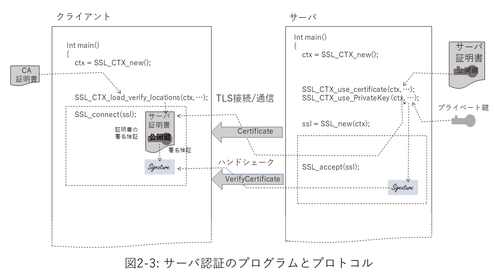
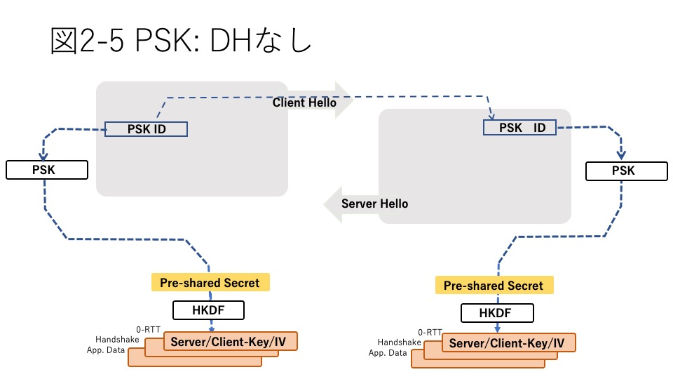

# 2. TLS protocol

Chapter 2 describes the TLS protocol specification, which is the basis for programming with TLS. The TLS protocol specification is specified in the IETF RFC. TLS 1.3 is specified in RFC 8446 and each RFC referenced from it (see Chapter 4 Standards Underpinning TLS for a system of standards around TLS).

The TLS protocol is divided into two phases: a handshake phase for exchanging messages between the server and client to establish a secure connection, and a handshake phase for sending and receiving actual application messages. Messages in either phase are sent and received in records called TLS records.

There are two types of handshakes: full handshakes and pre-shared key (PSK) connections. A full handshake is a handshake for initiating the first communication with no prerequisite information about the other party. "2.1 Pull Handshake" describes the format and content of the full handshake.

PSK is a handshake when the key used in the session is shared in advance by a method other than the communication channel used for communication. In TLS 1.3, pre-shared keys are also treated as one of these formats when a secure communication is established before, such as session resumption, and the handshake format is specified. "2.2 Pre-shared keys, session resumption" describes the format of these handshakes.

TLS1.3 specifies the exchange of some ancillary messages related to the protocol as well as the application message even after the handshake is completed. “2.3 Post-Handshake Message” describes them.

TLS records are a record format for sending and receiving messages for handshaking and application messages after a connection is established. The TLS record uses the session key established by the handshake to enable confidential message communication. "2.4 TLS Records" describes the record format.

## 2.1 Full hand shake
### 2.1.1 Overview
For communications where the client communicates TLS with the server for the first time, as described in "1.2 Simple TLS Program", the server must establish a secure TLS session with the other client without prior information. A full hand shake does this.

The three main purposes of a full handshake are:

1) Agree on the cipher suite used for both communications  
2) Agreeing a series of keys to be used in the session (key agreement)  
3) Confirm that the communication partner is the correct partner and that there is no spoofing (peer authentication)  

There are two types of peer authentication: server authentication, in which the client authenticates the legitimacy of the server, and client authentication, in which the server authenticates the legitimacy of the client. For TLS, server authentication is mandatory, but client authentication is optional.

### 2.1.2 Cipher Suite Agreement
The cipher suite and key agreement is made by the ClientHello record that the client first sends to the server and the response ServerHello record from the server to it. Let's first look at the cipher suite agreement. Figure 2-1 shows this for Client Hello and Server Hello.

   

   

The ClientHello record and ServerHello record have an area called TLS extension that stores various attribute information required for a TLS session. Information is stored in the following three TLS extensions for cipher suite agreements:

1) supported versions extension: List of supported TLS versions  
2) cipher suites extension: List of supported cipher suites  
3) supported group extension: Curve list of supported elliptic curve cryptography  

Each TLS extension in ClientHello lists the choices that the client has. ServerHello, on the other hand, shows the options that the server has agreed to. In the TLS handshake, both parties agree on the following three points based on these, and then the symmetric-key used for sending and receiving application data is obtained by the key agreement algorithm and the actual encrypted communication is performed.

1) TLS version agreement
2) Cipher suite type agreement
3) Agreement on cipher suite details

Let's take a closer look at this below.

#### 1) TLS version agreement
In order to establish a TLS session, you must first agree on the version of TLS to use.

Just as TLS 1.3 allows you to mix multiple TLS versions of the protocol on your network, Client Hello allows you to present multiple versions to support the Supported Versions extension (Figure 2-2 ①). On the other hand, the server side returns Server Hello in the format corresponding to the agreed version. This allows subsequent handshakes to proceed in the form of the agreed version.

Until TLS1.2, it was specified by a combination of TLS records and version fields of `Hello Client`, but by organizing it in` Supported Versions`, these fields are left for backward compatibility. However, it is no longer valid for TLS 1.3.

With TLS1.3, Secure Renegotiation has been deprecated, so if you agree on TLS1.3 here, you will have to comply with 1.3 afterwards.
Also, downgrade is not allowed in TLS1.3, so even if the client presents multiple versions including 1.3, the server side will always agree on 1.3 if it supports TLS1.3 and ServerHello on TLS1.3. Must be returned. At this time, if there is no TLS1.3 suite in the cipher suite list shown in ClientHello, it is considered as a kind of downgrade and the handshake is forcibly terminated.  

On the other hand, when the server supports multiple versions including TLS1.3, if the client side supports only TLS1.2 or less, it is allowed to operate equivalently to the case where the server side also supports only TLS1.2 or less. Has been done. However, in that case, a specific byte string to that effect is displayed at the end of the server random. Clients who expect to agree on TLS 1.3 make sure this value is not the specified value and prevent downgrade attacks.  

Table 2-1 summarizes the combinations of TLS versions supported by the client and server and the required behavior.
   

| Client   TLS1.2 or less |   TLS1.3 | Server   TLS1.2 or less |   TLS1.3 | Operation |
| --- | --- | --- | --- | --- |
| | ✓ | | ✓ | TLS1.3 Session |
| | ✓ | ✓ | ✓ | TLS1.3 session |
| | ✓ | ✓ | | Handshake error |
| ✓ | ✓ | | ✓ | TLS1.3 Session |
| ✓ | ✓ | ✓ | ✓ | TLS1.3 Session |
| ✓ | ✓ | ✓ | | TLS 1.2 or less session |
| ✓ | | | ✓ | Hand shake error |
| ✓ | | ✓ | ✓ | TLS1.2 or less session   (Note) |
| ✓ | | ✓ | | TLS 1.2 or less session |

 
Note: Server random tail 8 bytes  
    For TLS 1.2 Hexadecimal "44 4F 57 4E 47 52 44 01"  
    For TLS 1.1 or less Hexadecimal "44 4F 57 4E 47 52 44 00"    

   

#### 2) Cipher suite type agreement

Next, agree on the cipher suite to use. Up to TLS 1.2, cipher suites specified algorithms for key agreements, signatures, symmetric keys, and hashes. In TLS 1.3, these have been greatly organized as follows.

1) As a key consensus algorithm, static RSA has been abolished and only ECDHE / DHE has been used.

2) With the deprecation of static RSA, certificates are now used only for peer authentication. This allows key agreements and authentication to be completely separated and treated independently.

3) The compromised symmetric-key cryptographic algorithms have been significantly reorganized. Also, it has been organized into only the Authenticated Encryption with Associated Data (AEAD) algorithm. Along with this, the authenticity verification by MAC has also disappeared.

As a result, the TLS 1.3 cipher suite has been organized to specify only the symmetric-key and hash algorithm, while the other required items are specified in the TLS extension.

| Version | Cipher Suite Configuration |
| --- | --- |
| TLS1.2 | Key agreement + signature + symmetric-key + hash   Example: TLS_ECDHE_ECDSA_WITH_AES_256_GCM_SHA384 |
| TLS1.3 | Common key + hash   Example: TLS_AES_128_GCM_SHA256 |

        Table 2-1 TLS cipher suites

Cipher suites are a combination of algorithm types for each field of the suite, so there were hundreds in TLS 1.2. As a result of these arrangements, TLS 1.3 has narrowed down the available ones as follows.

| Cipher suite notation | ID |
|: ---: |: ---: |
| TLS_AES_128_GCM_SHA256 | 0x1301 |
| TLS_AES_256_GCM_SHA384 | 0x1302 |
| TLS_CHACHA20_POLY1305_SHA256 | 0x1303 |
| TLS_AES_128_CCM_SHA256 | 0x1304 |
| TLS_AES_128_CCM_8_SHA256 | 0x1305 |

        Table 2-2 TLS 1.3 cipher suite

The relationship between changing the cipher suite from TLS 1.2 to 1.3 and the associated TLS extensions can be summarized in the table below.

Suite   Items | TLS1.2 | TLS1.3 | Related TLS Extensions, Supplements |
| --- | --- | --- | --- |
| Key agreement | RSA   (EC) DH (E) | None | -SupportedGroups extension:   Elliptic curve list that can be used with ECDH   DH key length list   -Key_Share extension:   DH parameters up to the top 2 candidates |
Signature | RSA   DSA   ECDSA | None | Signature algorithm extension:   ECDSA elliptic curve and hash list   RSA key length, padding, hash list   DSA abolition |
Common key | Many | AES-GCM   AES-CCM (_8)   CHACHA20_POLY1305 | Abolished compromise algorithm   Only for AEAD |
Hash | Many | SHA256, SHA384 | MAC obsolete   Key derivation hash only |

        Table 2-3 Cipher Suite Items for TLS 1.2 / 1.3 and Corresponding TLS Extensions

ServerHello's Key Share stores the server-side DH public key in addition to the cipher suite agreement information so far. Both parties who receive them can calculate the premaster secret by the DH algorithm together with the private key generated by them (key agreement in Figure 2-2). The premaster secret is an integer value that is the basis of various symmetric-keys used for communication. In TLS 1.3, all Diffie-Hellman (DH) algorithms are used for key agreements. Key agreements and the Diffie-Hellmann algorithm are described in Chapter 3, 3.5 Public Key Cryptography.

In TLS1.3, the session key is derived by exchanging one round trip between ClientHello and ServerHello records in this way, but before TLS1.2, it took two round trips. This is because before TLS1.2, ClientHello and ServerHello records only agree on the cipher suite, and the server key and client key for key agreement are exchanged for the next ServerKeyExchange and ClientKeyExchange. In addition, since the session key can be derived at the beginning of the handshake in TLS1.3, it is possible to conceal the handshake after that and improve the security. The main reason why this is possible is that the key consensus algorithm is limited to the DH system.

### 2.1.5 Key derivation

In TLS, the key derivation algorithm is used to derive the key and IV for subsequent encryption and decryption by symmetric-key cryptography based on the premaster secret value (key derivation in Figure 2-2).

Up to TLS1.2, the master secret value is calculated by a pseudo-random number generation algorithm called PRF (pseudo-random function) that combines the premaster secret value, the client random value sent by Client Hello, and the server random value sent by Server Hello. I made it and derived the key and HMAC key value for each purpose based on it.

Client random and server random are 28-byte random values ​​generated for each session by the client and server (footnote), and are the values ​​sent to the other party by Client Hello and Server Hello, respectively.

Footnote: Initially, real time was put in the first 4 bytes to ensure the uniqueness of the value, but recently, in many cases, the entire 28 bytes are used as random values.

This was to prevent a third party (attacker) in the communication from easily deriving the key to steal the premaster secret and use it in the session by combining some of the handshake messages. However, in the middle of the TLS1.2 generation, it was pointed out that even with this derivation method, there was a danger that an attacker could guess the master secret, and an extended master secret (FRC7627: Extended Master Secret) was newly defined. The extended master secret uses the hash value of the entire handshake message for PRF input instead of client random and server random. Hashing also includes client random and server random contained in Client Hello and Server Hello, making it more difficult for an attacker to derive unless they capture the entire handshake message.

TLS1.3 uses the HMAC-SHA256-based key derivation algorithm HKDF (HMAC key derivation function, RFC 5869) as the derivation function. This has made it possible to derive keys for various purposes. HMAC keys up to TLS1.2 have been abolished because they are no longer needed in TLS1.3 because the symmetric-key cryptography is limited to the AEAD method.

The value to be derived is different depending on the key and the source (server side, client side) for IV. Also, in TLS 1.3, keys are used not only for encryption of application data, but also for applications such as 0-RTT during handshaking. Therefore, the security is further enhanced by deriving different values ​​for each application and using them as session keys.

The following table summarizes the input values ​​to HKDF for deriving the purpose-specific key from the premaster secret. There are three inputs for HKDF: the premaster secret, the key label, and the hash value of the handshake message. The key label is a string that represents the label as shown in the table.

The 0-RTT premaster secret is an Early Secret value that requires the PSK key value as the HKDF input. Input of the next hand shake Premaster secret inputs Early Secret
This is the Handshake Secret obtained from HKDF. On the other hand, the application data input premaster secret is a Master Secret that independently obtains 0 as the input of HKDF.

   
| Usage | Input | Input Secret | Label | Hash Range | Output |
|:-|:-|:-: |:-: |:-: |:-: |
| 0-RTT |||||
|| PSK | 0 |-|-| Early Secret |
||-| Early Secret | "ext binder \" \ | \ "res binder" |-| binder_key |
||-| Early Secret | "e exp master" | Client Hello | early_exporter_master_secret |
||-| Early Secret | "c exp master" | Client Hello | client_early_traffic_secret |
| Hand Shake |||||||
|| (EC) DHE | Early Secret | "derived" |-| Handshake Secret ||
||-| Handshake Secret | "c hs traffic" | Client Hello ~ Server Hello | client_handshake_traffic_secret |
||-| Handshake Secret | "s hs traffic" | Client Hello ~ Server Hello | server_handshake_traffic_secret |
| Application   Data |||||||
|| 0 | HandshakeSecret | "derived" |-| MasterSecret (MS) ||
||-| Handshake Secret | "c ap traffic" | Client Hello ~ server Finished | client_application_traffic_secret_0 |
||-| Handshake Secret | "s ap traffic" | Client Hello ~ server Finished | server_application_traffic_secret_0 |
||-| Handshake Secret | "exp master" | Client Hello ~ server Finished | exporter_master_secret |
||-| Handshake Secret | "res master" | Client Hello ~ client Finished | resumption_master_secret |
   

| Summary of TLS1.3 changes |
| --- |
| Hello Retry has been set up as a retrary if you can't agree on a Key share for Client Hello |
| Even in Diffie-Hellman used for key agreement, only the temporary key (Ephemeral) of DHE or ECDHE is available |
| Key derivation changed from PKF to HMAC-based HKDF |

### 2.1.6 Peer authentication

#### 1) Overview
Another primary purpose of the handshake is peer authentication (server authentication by client, client authentication by server). Server authentication is mandatory for TLS and client authentication is optional. However, whenever the server side requests client authentication, the client side must respond to it.
   

   
Figure 2-3 shows the relationship between the client, the server program, and the certificates, keys, and protocols used for server authentication. In the TLS program, the client side loads the certificate of the trusted CA in advance for server authentication. On the server side, load the server certificate and private key signed by the CA.

In handshake, the server side sends the loaded server certificate to the client in a Certificate message. In addition, the signature created by the corresponding private key will be sent in the Certificate Verify message. In TLS1.3, the following components are connected together for the signature target. The signature target contains a hash value for the content of all handshake messages, which means that the attacker needs to know the private key and at the same time cannot correctly generate the signature without knowing the content of the handshake message for the session. Become.

--Fixed value: 64 bytes 0x20
--Context string: "TLS 1.3, client Certificate Verify"
--Separator: 00
--32-byte SHA-256 hash value for all handshake messages from client Hello to client Finished

On the receiving client side, after checking the expiration date of the certificate and verifying the authenticity of the certificate sent by the loaded CA certificate, the signature sent by the stored public key To verify.

#### 2) Certificate chain
In actual operation, there are many cases where the CA is layered and the CA that signs the server certificate is not the trusted CA itself, but an intermediate CA that belongs to its subordinates. Also, the intermediate CA itself may not be a direct subordinate CA of the trusted CA, and there may be an intermediate CA. In such cases, the server sends the client as a chained certificate, including not only the server certificate but also the certificate of the intermediate CA. The receiving client validates the server certificate with the public key contained in the certificate of its higher intermediate CA to ensure that the chain connects to the trusted CA certificate it holds.

#### 3) Client authentication
Client authentication does much the same thing, with the client and server symmetrical. However, client authentication is optional, so the server sends a Certificate Request to the client as needed.

Regarding the peer authentication protocol, up to TLS1.2, the signature sent from the server side was stored in ServerKeyExchange, and there was a part that was not symmetrical in terms of the protocol, but in TLS1.3 it authenticates with the authenticating side as described above. Organized to be symmetrical on the side to be done.

#### 4) Signature algorithm extension
A list of algorithm combinations (schemes) used for signatures that can be used for peer authentication is stored in the signature algorithm (signature_algorithms) extension. In TLS, the signature is used in both the CertificateVerify message and the certificate sent in the Certificate message. If the schemes that can be used for both are the same, only the signature algorithm extension is used, but if they are different, the certificate signature algorithm (signature_algorithms_cert) extension is used to list the schemes that can be used for the certificate in the Certificate Verify message. The list of available schemes uses the signature algorithm extension.

The signing scheme is defined by the hash algorithm and the public key algorithm for signing it. In TLS1.3, RSA and ECDSA are defined as standard in the signature part. For RSA, it also defines the padding method. In TLS 1.3, PSS is required as a padding scheme for Certificate Verify messages. For ECDSA, the type of elliptic curve is also specified here. SHA1 or SHA2 is used as the hash.

Table 2-5 lists the signature schemes that can be used with TLS 1.3.

There are two OIDs (Object IDs) for RSA padding in X.509: rsaEncryption and RSASSA-PSS. rsaEncryption does not specify padding when signing with the public key if it is used for the public key. If rsa_pss_rsae receives this kind of public key, it will sign it with PSS padding during Certificate Verify. On the other hand, the public key of RSASSA-PSS is limited to PSS padding. rsa_pss_pss receives the RSA SA-PSS public key and signs it with PSS padding.

   
| Algorithm | Signature scheme | ID |
|: ---- |: ----: |: ----: |
| RSASSA PKCS # 1 v1.5 | | |
| | rsa_pcks1_sha256 | 0x0401 |
| | rsa_pcks1_sha384 | 0x0501 |
| | rsa_pcks1_sha512 | 0x0601 |
RSSASSA-PSS pub-key OID rsaEncryption || |
| | rsa_pss_rsae_sha256 | 0x0804 |
| | rsa_pss_rsae_sha384 | 0x0805 |
| | rsa_pss_rsae_sha256 | 0x0806 |
RSSASSA-PSS pub-key OID RSASSA-PSS || |
| | rsa_pss_pss_sha256 | 0x0809 |
| | rsa_pss_pss_sha384 | 0x080a |
| | rsa_pss_pss_sha512 | 0x080b |
| ECDSA | | |
| | ecdsa_secp256r1 | 0x0403 |
| | ecdsa_secp384r1 | 0x0503 |
| | ecdsa_secp521r1 | 0x0603 |
| EdDSA | | | |
| | ed25519 | 0x0807 |
| | ed448 | 0x0808 |
   

### 2.1.7 Certificate Status Information: OCSP Stapling

The public key certificate can be revoked even before the expiration date in the event of an unforeseen situation such as the leakage of the private key. For this reason, the recipient must verify the validity of the certificate received. Obtaining certificate validity information was initially realized by interaction between the client and the CA or an OCSP responder on behalf of the CA, outside the scope of the TLS handshake, such as CRL and OCSP (Online Certificate Status Protocol). .. However, in the later revision of OCSP Stapling, it was incorporated into the TLS extension as part of the handshake, and TLS 1.3 organized them to the present day.

In OCSP Stapling, the certificate validity information is obtained from the OCSP responder at the same time as the certificate on the peer-authenticated side (in the case of server authentication, the server side). Therefore, the authenticating side (client side in the case of server authentication) can only verify the validity of the handshake with the other party trying to establish a TLS session. Multiple authenticated parties
You can also bind authentication requests to the OCSP responder, which can significantly reduce traffic for the responder as well.

In TLS1.3, the peer authentication protocol has been organized so that it is almost symmetrical for server authentication and client authentication. As a result, OCSP status check requests can now be requested for both authentications. For server authentication
Make a request by putting the OCSP_status_request extension on ClientHello and the status_reques extension on the CertificateRequest record for client authentication.

The validity information from OCSP corresponds to the certificate in the certificate chain and the OCSP response signed in each CertifycateEntry is returned. At this time, the time stamp is also returned, so the authenticator can check the freshness of the status information.

(For OCSP, OCSP Stapling, see 3.9.3 Certificate Lifecycle)

## 2.1.8 Other TLS extensions

TLS provides purpose-specific TLS extensions to meet the various requirements of real-world network communications. This section describes the major TLS extensions.

#### 1) Server Name Indication (SNI)
In the early days of the Internet, there was a one-to-one correspondence between the physical server and IP address, which are the endpoints of communication transmission and reception, and TCP and TLS communication was also premised on the connection between the endpoints. However, due to advances in virtualization technology, there are many cases where the IP address, which is the physical end point, does not always match the unit of the target communication partner. To solve this, SNI extensions have been provided to indicate the logical counterparts of interest.

The client stores the server name of the logical server that it wants to make a TLS connection to in ClientHello's SNI extension. The server responds only if the SNI extension shows its server name and returns its server certificate. This allows the client to authenticate the server separately for each server that has a logical server name. In order for the SNI function to work, both the client and server must support SNI.

#### 2) Maximum Fragment Length Negotiation
The communication node connected to the network is not always a machine with abundant memory. In many cases, small embedded devices such as IoT devices have a limited amount of memory that can be used for communication. One of the issues in such cases is the size of the encrypted TLS record. In TLS, if the size of the application data to be sent is large, the TLS record is supposed to be divided into up to 16 kbytes and sent (Maximum Fragment Length). However, in small embedded devices, there are cases where it is necessary to divide the records into smaller records. In that case, the client attempting to initiate TLS communication will display the desired maximum record size in the Maximum Fragment Length extension, and if the server accepts it, the communication will be made with that size as the maximum record size.

#### 3) Certificate Status Request
OCSP Stapling is a protocol for online certificate validity checking for peer authentication. The Certificate Status Request extension is an extension for requesting OCSP (Online Certificate Status Protocol) stapling from the other party of the TLS connection. OCSP and OCSP Stapling are described in Chapter 4: Standards Related to TLS.

#### 4) ALPN: Application-Layer Protocol Negotiation
The ALPN extension is an extension to show the protocol of the application layer used for TLS connection in advance. Originally, the layers of the Internet protocol are independent in principle, but the ALPN extension was provided to avoid an extra handshake for negotiation at the application layer after TLS connection. Currently, it is used in SPDY, HTTP / 2, etc.

#### 5) Others
In addition, some TLS extensions used up to TLS 1.2 have been cleaned up in TLS 1.3.

The extended_master_secret extension is an extension designed to address the vulnerabilities recognized in the TLS 1.2 era. It shows that the range for calculating the hash value, which is one of the elements for calculating the master secret, is extended to Client Hello, which is the first part of communication. This hash range extension is mandatory in TLS 1.3 and has been discontinued as a TLS extension.

The encrypt_then_mac extension indicates that the MAC value of a TLS record is obtained by encrypting the data and then obtaining the MAC value. Also, Truncated HMAC is for using a value with a shorter number of bits than usual as the MAC value. In TLS 1.3, these TLS extensions are abolished because the authenticity check by MAC value is left to the symmetric-key cryptography by AEAD (see "Chapter 5 Security, Vulnerability").

The Compression Methods extension was an extension to show how to compress application data, but TLS 1.3 abolished data compression as a protocol because the regularity of compressed data risks causing vulnerabilities. rice field. The ec_point_formats extension is also an extension that indicates the compression method of key information for elliptic curve cryptography, but it has been abolished for the same reason.

   
| Value | Name | Description | Includes TLS   Message | CH | SH | CR | CT | EE | HRR | NST |
| ---: |:---|:---|---: |:---: |:---: |:---: |:---: |:---: |:---: |:---: |
| 0 | server_name | SNI (server name display) | 6066 || ✓ | | | | ✓ |||
| 1 | max_fragment_length | Maximum fragment size of message | 6066,8449 || ✓ | | | | ✓ |||
| 5 | status_request | Request OCSP response | 6960 || ✓ | | ✓ | ✓ |||
| 10 | supported_groups | (EC) Elliptic Curve Scheme for DH | 8422,7919 || ✓ | | | | ✓ |||
| 13 | signature_algorithms | Signature Algorithm | 8446 || ✓ | | ✓ |||||
| 14 | use_srtp | List of DTLS / SRTP profiles | 5674 || ✓ | | | | ✓ |||
| 15 | heartbeat | Heartbeat transmission mode | 6520 || ✓ | | | | ✓ |||
| 16 | application_layer_protocol_negotiation | ALPN Support Protocol Name List | 7301 || ✓ | | | | ✓ |||
| 18 | signed_certificate_timestamp | Timestamp of OCSP certificate status | 6692 || ✓ | | ✓ | ✓ ||||
| 19 | client_certificate_type | Client Certificate Format | 7250 || ✓ | | | | ✓ |||
| 20 | server_certificate_type | Server Certificate Format | 7250 || ✓ | | | | ✓ |||
| 21 | padding | padding | 7685 || ✓ | | | ||||
| 41 | pre_shared_key | PSK: Pre-shared key | 8446 || ✓ | ✓ | | ||||
| 42 | early_data | EarlyData | 8446 || ✓ | | | | ✓ || ✓ |
| 43 | supported_versions | Client-supported TLS versions | 8446 || ✓ | ✓ | | || ✓ ||
| 44 | cookie | ClientHello retry cookie | 8446 || ✓ | | | || ✓ ||
| 45 | psk_key_exchange_modes | Presenting PSK with key exchange | 8446 || ✓ | | | ||||
| 47 | certificate_authorities | Supported CA Lists | 8446 || ✓ | | ✓ | ||||
| 48 | oid_filters | Certificate Extension OID and Value Pairs | 8446 ||| | ✓ | ||||
| 49 | post_handshake_auth | post-handshake authentication | 8446 || ✓ | | | ||||
| 51 | key_share | Parameters for each key exchange scheme | 8446 || ✓ | ✓ | | || ✓ ||

 
TLS message CH: ClientHello, SH: ServerHello, CR: CertificateRequest, CT: Certificate, EE: EncryptedExtension, HRR: HelloRetryRequest, NST: NewSessionTicket

   

| Summary of TLS1.3 changes |
| --- |
| Peer authentication has been organized into Certificate and Certificate Verify   for both server authentication and client authentication. |
| This has deprecated Server Key Exchange |
| Certificate status OCSP has been organized so that both clients and servers can request it |

## 2.2 Pre-shared key and session restart
### 2.2.1 Pre-shared key (PSK)

#### 1) PSK program

Pre-shared key (PSK) allows both communicating parties to agree on a key in some way and use it to establish a TLS connection. You can simplify the handshake by using PSK. You can share multiple keys in advance, in which case you should share the key / ID pair. In Client Hello at the beginning of the handshake, tell the server side the ID of the key you want to use in the session. On the server side, the key corresponding to this ID is selected from the keys shared in advance and used to establish the session. You can omit the ID if you have shared only one key in advance. In any case, the handshake only conveys the ID and the key itself is not sent over the network (Figure 2-4).
   

   
In the program, the PSK callback function can be defined and registered in the library in order to separate the part that manages the key and ID used for PSK from the library that handles the TLS protocol in common. After securing the TLS context, registering a callback function in that context will cause the library to make a PSK connection instead of a full handshake. In addition, the registered callback function is called at the start of the handshake.

The client-side callback function returns the ID of the key you want to use and the value of that key in the argument. The received library stores the ID in ClientHello's Pre-Shared Key extension and sends it to the server side. On the receiving server side, the ID is passed to the argument of the PSK callback function on the server side registered in the same way, and the callback function searches for the corresponding key from the ID and returns the value to the argument.

#### 2) PSK protocol

In the PSK of TLS1.3, it is possible to use the pre-shared key indicated by the ID as it is (Fig. 2-5), but using that key, the same key agreement as in the case of full handshake is made and it is done. There is also a mode to use as a session key. If you continue to use the pre-shared key, you run the risk of forward secrecy, where once the session key is compromised, the confidentiality of all sessions can be traced back to the previous session. To avoid that risk, from TLS 1.3 it is recommended to use a PSK key for further key agreement by Diffie-Hellman (DH).
   

   
In this case, the PSK handshake is initiated when the client program calls SSL_connect, as shown in Figure 2-6. By default, Client Hello has a DH parameter and client side in the Key Share extension, along with the key ID of the Pre-Shared Key extension so that once the PSK to be used on the client and server is determined, it can be used for key agreement by DH. The DH public key of is also stored. It also returns the server-side DH public key to the Key Share extension on the server side.
   

   
If both the client and server agree not to have a DH key agreement, the PSK key will be used as is. After securing a TLS context on your program, you can make the library work that way by instructing that context in advance (wolfSSL_CTX_no_dhe_psk for wolfSSL).

### 2.2.2 Session resume

In TLS1.3, session resumption is organized as an extension of PSK, and the resumption protocol is positioned as one way to use the PSK protocol. As the PSK key for resumption, use the session ticket exchanged in the previously established TLS session. After the secure TLS session is established, the server side can send the session ticket to the client as one of the post-handshake messages. On the client side, the session ticket sent is used when resuming the session.

The session ticket uses the session resume secret derived by HKDF from the premaster secret of the currently established TLS session. The server properly encrypts the ticket for this secret and sends it to the client side with a new session ticket message. The client that receives the ticket associates the session restart secret derived from the current premaster secret with the received ticket and saves the pair as a session cache.

When resuming a session, the client requests the server to resume the session with the previously received session ticket as PSK Identity. Since the content of the session ticket is the session restart secret that was previously encrypted and handed over, the server side decrypts it and derives the PSK value by HKDF key derivation. Similarly, the client side derives the PSK value by HKDF.

If DH key exchange is specified, use the parameters specified in the KeyShare extension to perform the key exchange.

Figure 2-8 shows the association between the TLS 1.3 session ticket and the PSK used when resuming.

   

   

With TLS1.3 session resumption, it is not necessary to keep the session state on the server side in this way, and the client side does not know the contents of the ticket, so the received ticket can be designated as PSK Identity as it is. It is supposed to be good.

Prior to TLS1.2, there were two ways to resume a session: by session ID and by session ticket. For session ID, when the client requests a session ID with an empty Session ID extension for Client Hello, the server returns the corresponding session ID value with the Session ID extension for Server Hello. The client makes a resume request using this session ID when making a resume request. The session ticket is also requested by ClientHello's session ticket extension, obtained by the session ticket record at the end of the handshake, and used by ClientHello on resumption.

Resuming a session with a session ID puts a strain on the server because the server must somehow maintain its status. In the case of a ticket, all the information required for resuming is included in the ticket, so the burden on the server side does not increase in that respect.

In TLS1.3, the previous session ID and session ticket have been abolished. TLS1.3 also defines a method called session ticket that does not require the session state to be maintained on the server side, but it is different from the method before TLS1.2.

With TLS 1.3 session resumption, it is now up to the server to decide whether or not to send a session ticket. The session ticket is sent from the server to the client with a new session ticket message, which is one of the post-handshake messages. This allows the server to send tickets as many times as you like after the handshake, which can be used when you want to establish multiple sessions at the same time.

Table 2-4 summarizes the comparison of session resumption methods before TLS 1.2 and TLS 1.3.

| Method | TLS   Version | Phase | Description |
| --- | --- | --- | --- |
| Session ID | TLS1.2 or earlier | Request | Request by SessionID extension of Client Hello |
| | | Response | Return ID with Session ID of Server Hello |
| | | Session   Resume | Specify ID by SessionID of ClientHello |
| | TLS1.3 || Abolished |
||
Session ticket | TLS1.2 or earlier   RFC 5077 | Request | Request by Client Hello session ticket extension |
| | | Response | Response with Server Hello session ticket extension |
| | | Ticket   Send | Handshake Sent at the tail of New Session Ticket |
| | | Session   Resume | Specified by Client Hello session ticket extension |
| | TLS1.3 | | Abolition of session ticket extension |
| | | Request | Abolition of ticket request from client   It is up to the server to decide whether or not to issue it.
| | | Send | Post Handshake   Send by NewSessionTicket message |
| | | Session   Resume | Send ticket as PSK 0-RTT message |

 
Table 2-4 Comparison of session restart methods
 

### 2.2.3 Early Data

In the case of PSK or session restart described later, the information can be kept secret by using the key information of the previous session without waiting for the handshake. This is also called 0-RTT (Zero-Round Trip Time) because a confidential message can be sent as the first message without a round trip of the handshake. In TLS 1.3, as one of 0-RTT, Client Hello at the beginning of the TLS session indicates that there is an Early Data message with the TLS extension called Early Data extension, and application data can be encrypted and sent. increase.

However, keep in mind that this encryption sacrifices forward secrecy because it inherits and uses the key information from the previous session. It should also be noted that this feature has no defense against replay attacks. In order for the server that receives Early Data to take some self-defense measures, special consideration must be given at the application layer, such as sending only data with a specific pattern that the sender has agreed in advance.

Early Data does not change significantly as a handshake flow because it simply puts a dedicated TLS extension on Client Hello in terms of protocol, but programmatically it uses the API for sending and receiving Early Data prepared by the library. It will be. Specific programming is explained in "Part 2 TLS Programming".

| Summary of TLS1.3 changes |
| --- |
| PSK is organized into two types, with or without key exchange by DH |
| Session resumption has been organized as one of the protocol usages of PSK |
| Session ID is abolished in session resumption, and a new session ticket usage method different from that up to TLS 1.2 is defined |
| PSK, Early Data (0-RTT) that can send and receive application data at the beginning of session resumption is specified |

## 2.3 Message after handshake

When the TLS connection is established by the handshake, the target application data is sent and received, but in addition to the application message, messages that can be sent after the TLS session is established after the handshake are also defined.

#### 1) New session ticket

The session ticket is the data used when resuming the session described above (see 2.2.3 Resuming the session). The server can send a new Session Ticket message at any time after the handshake is completed and a secure session is established. The client will use the received session ticket at the next session restart. The server can send session tickets multiple times if it allows the client side to connect multiple sessions at the same time.

#### 2) Client reauthentication

If the client allows Client Hello to reauthenticate with the post-handshake authentication (post_nadshake_auth) extension, the server can request client authentication again during the session. In that case, as in the case of full handshake, the other party is requested to authenticate by the Certificate Request message, and it is authenticated by the Certificate Verify and Finished messages that are returned.

#### 3) Key and IV refresh

TLS1.3 allows you to refresh the keys and IVs used in a session at the right time if the session is long-term or transfers large amounts of data. The key is regenerated from the session's master secret using a key derivation algorithm and used as a new generation symmetric key and IV.
   

| Summary of TLS1.3 changes |
| --- |
| The session ticket has been changed to be sent as one of the messages after the handshake |
| Re-authentication, key and IV refresh added as post-handshake protocol |

## 2.4 Record Protocol

### 1) TLS record

All TLS messages, such as the handshake messages and application data described in this chapter, are sent and received as TLS records in the basic layer of the protocol. The record header stores the type, protocol version, and data length of the content data that the record carries, followed by the content data itself. For backward compatibility, the protocol version stores 0x0301 / 0x0303 indicating TLS1.0 / 1.2, but this content is ignored for TLS1.3 processing.

### 2) Maximum size

The maximum size of a TLS record is 16k bytes (2 ^ 14 bytes). If you want to transfer longer application data, send it in multiple TLS records (as fragments). The maximum size can also be 2 ^ n bytes agreed between the client and server by the "Maximum Fragment Length Negotiation".

### 3) Fragment, padding

TLS records are allowed to be split into fragments as appropriate, primarily for security reasons, even if the maximum record size has not been reached. It is also permitted to pad content data with a zero value of any length less than or equal to the maximum record size, and to send a record with zero content data length, providing a defense against traffic monitoring.

### 4) Content type and encryption

TLS 1.3 removes the Change_cipher_spec, which indicates a cipher suite switch in the final phase of the handshake, so there are three content types: handshake, alert, and application data. The alert will be sent as an encrypted record if a TLS connection is established at the time the alert is sent. Also, TLS 1.3 encrypts except at the beginning of the handshake. All of these are treated as "application data" as the basic content type for TLS records.

Additional content type and length data is added to the application data fields of the encrypted TLS records to distinguish between handshake messages, alerts, and application data. In TLS1.3, the symmetric-key cryptography is unified to AEAD, so the authentication tag information for that is also added to the encrypted content.

Content type (value) | Encrypted   type (value) | Description |
| --- | --- | --- |
| handshake (22) || Plaintext handshake |
| alert (21) || Plaintext Alert |
| application_data (23) | handshake (22) | Encrypted handshake message |
| application_data (23) | alert (21) | encryption alert |
| application_data (23) | application_data (23) | encrypted application data |
| change_cipher_spec (20) || Not used in TLS1.3   For backward compatibility |

#### TLS record content type

## 2.5 Alert Protocol

An alert record will be sent when TLS communication ends or an error occurs. An alert record is a record that has an alert in its content type and has two classes: end alerts and error alerts.

The termination alert is used to indicate the successful termination of the TLS connection and is not an error. When you receive the termination alert, let the application know.

Error alerts, on the other hand, indicate a one-sided termination of the connection. When you receive an error alert, the application is notified of the error. Also, once you receive an error alert, you will not be allowed to send or receive any data. The server and client destroy all secret values ​​and keys established on that connection, except for the session ticket and its associated PSK.

Prior to TLS 1.2, the importance (level) of the alert was indicated in addition to that, but in TLS 1.3 this field has no meaning. All alerts are treated as fatal.

Below is a list of TLS 1.3 alert types.

| Class | Name (value) |
| --- | --- |
| closure | close_notify (0) |
| Error | unexpected_message (10) |
| Error | bad_record_mac (20) |
| Error | record_overflow (22) |
| Error | handshake_failure (40) |
| Error | bad_certificate (42) |
| Error | unsupported_certificate (43) |
| Error | certificate_revoked (44) |
| Error | certificate_expired (45) |
| Error | certificate_unknown (46) |
| Error | illegal_parameter (47) |
| Error | unknown_ca (48) |
| Error | access_denied (49) |
| Error | decode_error (50) |
| Error | decrypt_error (51) |
| Error | protocol_version (70) |
| Error | insufficient_security (71) |
| Error | internal_error (80) |
| Error | inappropriate_fallback (86) |
| Error | user_canceled (90) |
| Error | missing_extension (109) |
| Error | unsupported_extension (110) |
| Error | unrecognized_name (112) |
| Error | bad_certificate_status_response (113) |
| Error | unknown_psk_identity (115) |
| Error | certificate_required (116) |
| Error | no_application_protocol (120) |
   

#### Alert list

| Summary of TLS1.3 changes |
| --- |
All alerts except close notify are now fatal and require immediate termination | 