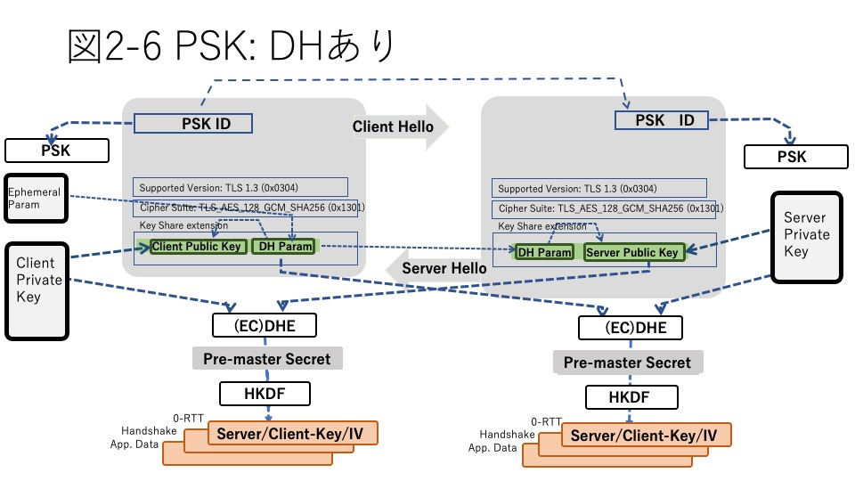
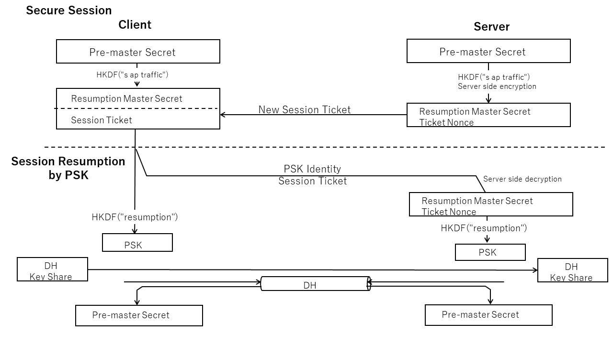

# 2. TLSプロトコル

第2章では、TLSを使ったプログラミングのベースとなるTLSプロトコル仕様について説明します。TLSのプロトコル仕様はIETFのRFCに規定されています。TLS1.3はRFC8446とそれから参照される各RFCで規定されています(TLSをめぐる標準の体系については Chapter 4 TLSを支える標準を参照)。

TLSプロトコルは安全な接続を確立するためにサーバー、クライアント間でメッセージのやりとりをするハンドシェイク・フェーズと実際のアプリケーションメッセージを送受信する2つのフェーズに分かれます。いずれのフェーズのメッセージもTLSレコードと呼ばれるレコードで送受信されます。

ハンドシェイクには、フルハンドシェイクと事前共有鍵(PSK)接続の2つの形式があります。フルハンドシェイクは通信の相手方に関する前提情報がまったくない初めての通信を開始するときのためのハンドシェイクです。「2.1 プルハンドシェイク」では、フルハンドシェイクの形式と内容について説明します。

PSKは、通信に使用する通信チャンネルとは別の方法で事前にセッションで使用する鍵を共有してある場合のハンドシェイクです。TLS1.3ではセッション再開のように以前に安全な通信を確立した際に事前共有鍵を共有しておく場合もこの形式の1つとして扱われ、ハンドシェイクの形式が規定されています。「2.2 事前共有鍵、セッション再開」ではこれらのハンドシェイクの形式について説明します。

TLS1.3では、ハンドシェイクが完了したあともアプリケーションメッセージだけでなく、プロトコルに関わるいくつかの付帯的なメッセージのやりとりを規定しています。「2.3 ハンドシェイク後メッセージ」ではそれらについて説明します。

TLSレコードは、ハンドシェイクのためのメッセージや接続が確立してからのアプリケーションメッセージを送受信するためのレコード形式です。TLSレコードでは、ハンドシェイクで確立したセッション鍵を使用して秘匿性のあるメッセージ通信を実現します。「2.4 TLSレコード」ではそのレコード形式について解説します。

## 2.1 フルハンドシェイク
### 2.1.1 フルハンドシェイクの目的
「1.2 簡単なTLSプログラム」で説明したようにクライアントが初めてサーバーとTLS通信するような通信では、サーバーは通信相手のクライアントに対して事前情報なしに安全なTLSセッションを確立する必要があります。これを行うのがフルハンドシェイクです。

フルハンドシェイクの主な目的は次の3つです。

1）通信の両者で使用する暗号スイートを合意すること 
2）セッションで使用する一連の鍵を合意すること（鍵合意） 
3）通信相手が正しい相手であること、成りすましがないことの確認すること（ピア認証） 

ピア認証とは、クライアントがサーバーの正当性を認証するサーバー認証とサーバーがクライアントの正当性を認証するクライアント認証の2つです。TLSの場合、サーバー認証は必須ですがクライアント認証はオプションとなっています。

### 2.1.2 暗号スイートの合意
暗号スイートと鍵の合意は、クライアントからサーバーに最初に送られるClientHelloレコードとそれに対しするサーバーからの応答ServerHelloレコードによって行われます。ここではまず、暗号スイートの合意に関する部分を見ていきます。図2-1はClientHelloとServerHelloについて、この様子を表したものです。

  

  

ClientHelloレコード、ServerHelloレコードにはTLS拡張と呼ばれるTLSセッションで必要となる各種の属性情報を格納するエリアがあります。暗号スイートの合意のためには次の3つのTLS拡張に情報が格納されます。

1）supported versions拡張：サポートするTLSバージョンのリスト 
2）cipher suites拡張：サポートする暗号スイートのリスト 
3）supported group拡張：サポートする楕円曲線暗号の曲線リスト 

ClientHelloの各TLS拡張拡張にはクライアントが持っているそれぞれの選択肢の一覧が示されます。一方、ServerHelloのほうには、それに対してサーバーが合意した選択肢が示されます。TLSハンドシェイクでは通信の両者がこれらに基づいて次の3つについて合意したうえで、アプリケーションデータの送受信に使用する共通鍵を鍵合意アルゴリズムで求めて実際の暗号通信を行うことになります。

1) TLSバージョンの合意
2) 暗号スイートの種類の合意
3) 暗号スイートの詳細の合意

以下、これをもう少し詳細に見ていきます。

#### 1) TLSバージョンの合意
TLSセッションを確立のためには、まず使用するTLSのバージョンについて合意する必要があります。

TLSではネットワーク上で複数のTLSバージョンのプロトコルが混在できるように、ClientHelloではSupported Versions拡張にサポートする複数のバージョンを提示することができるようになっています(図2-2①)。これに対してサーバー側は合意したバージョンに対応する形式のServerHelloを返送します。これによって、それ以後のハンドシェイクは合意したバージョンの形式で進めることができます。TLS1.3では、Secure Renegotiationは廃止されたので、ここでTLS1.3を合意した場合はその後すべて1.3に準拠する必要があります。

また、TLS1.3ではダウングレードは認められないので、クライアントが1.3を含む複数のバージョンを提示した場合でも、サーバー側はもしTLS1.3をサポートするならば必ず1.3で合意しTLS1.3のServerHelloを返却する必要があります。このとき、ClientHelloに示される暗号スイートリストにTLS1.3スイートがない場合はダウングレードの一種とみなされハンドシェイクは強制的に終了します。 

一方、サーバーがTLS1.3を含む複数のバージョンをサポートする場合に、クライアント側がTLS1.2以下のみサポートする場合は、サーバー側もTLS1.2以下しかサポートしない場合と等価の動作をすることが認められています。ただし、その場合にはサーバーランダムの後尾にその旨を示す特定のバイト列を表示します。TLS1.3で合意することを期待するクライアント側はこの値が規定されている値ではないことを確認し、ダウングレード攻撃を防止します。 

表2-1にクライアント、サーバーでサポートするTLSバージョンの組み合わせと求められる動作についてまとめます。
  

|クライアント TLS1.2以下| TLS1.3|サーバ TLS1.2以下| TLS1.3|動作|
|---|---|---|---|---|
|  |✓|  |✓|TLS1.3セッション|
|　|✓|✓|✓|TLS1.3セッション|
|  |✓|✓|  |ハンドシェークエラー|
|✓|✓|  |✓|TLS1.3セッション|
|✓|✓|✓|✓|TLS1.3セッション|
|✓|✓|✓|  |TLS1.2以下セッション|
|✓|　|  |✓|ハンドシェークエラー|
|✓|  |✓|✓|TLS1.2以下セッション (注)|
|✓|  |✓|  |TLS1.2以下セッション|

 
注：サーバーランダムの後尾8バイトに 
    TLS1.2の場合十六進"44 4F 57 4E 47 52 44 01" 
    TLS1.1以下の場合十六進"44 4F 57 4E 47 52 44 00"  

  

#### 2) 暗号スイートの種類の合意

次に、使用する暗号スイートについて合意します。TLS1.2までは暗号スイートには、鍵合意、署名、共通鍵、ハッシュに関するそれぞれのアルゴリズムを指定していました。TLS1.3ではこれらについて次のように大幅に整理されました。

1）鍵合意アルゴリズムとしては静的RSAを廃止し、ECDHE・DHEのみとなりました。

2）静的RSAが廃止されたため、証明書はピア認証のみに使用することになりました。これによって、鍵合意と認証は完全に分離、独立した扱いが可能となりました。

3）危殆化した共通鍵暗号アルゴリズムが大幅に整理されました。また、認証付き暗号(AEAD: Authenticated Encryption with Associated Data)アルゴリズムのみに整理されました。これに伴い、MACによる真正性検証もなくなりました。

この結果、TLS1.3の暗号スイートでは共通鍵とハッシュアルゴリズムのみを指定し、その他の必要な項目はTLS拡張で指定するように整理されました。

|バージョン|暗号スイートの構成|
|---|---|
|TLS1.2|鍵合意＋署名＋共通鍵＋ハッシュ 例：TLS_ECDHE_ECDSA_WITH_AES_256_GCM_SHA384|
|TLS1.3|共通鍵＋ハッシュ 例:TLS_AES_128_GCM_SHA256|

        表2-1 TLSの暗号スイート

暗号スイートはスイートの各フィールドごとのアルゴリズムの種類の組み合わせとなるためTLS1.2では数百にのぼっていました。TLS1.3ではこれらの整理の結果、利用できるものは以下の通りに絞り込まれています。

|暗号スイート表記|ID|
|:---:|:---:|
|TLS_AES_128_GCM_SHA256|0x1301|
|TLS_AES_256_GCM_SHA384|0x1302|
|TLS_CHACHA20_POLY1305_SHA256|0x1303|
|TLS_AES_128_CCM_SHA256|0x1304|
|TLS_AES_128_CCM_8_SHA256|0x1305|

        表2-2 TLS1.3の暗号スイート

TLS1.2から1.3への暗号スイートの暗号スイートの変更と関連するTLS拡張に関係は以下の表のようにまとめることができます。

|スイート 項目|TLS1.2|TLS1.3|関連するTLS拡張、補足|
|---|---|---|---|
|鍵合意|RSA (EC)DH(E)|なし|- SupportedGroups拡張: 　　ECDHで使用できる楕円曲線一覧 　　DHの鍵長一覧 - Key_Share拡張： 　　上位２候補までのDHパラメータ|
|署名|RSA DSA ECDSA|なし|署名アルゴリズム拡張： 　　ECDSAの楕円曲線とハッシュ一覧 　　RSA鍵長、パディング、ハッシュ一覧 DSAの廃止|
|共通鍵|多数|AES-GCM AES-CCM(_8) CHACHA20_POLY1305|危殆化アルゴリズムを廃止 AEADのみに|
|ハッシュ|多数|SHA256, SHA384|MACの廃止 鍵導出のハッシュのみ指定|

        表2-3 TLS1.2/1.3の暗号スイート項目と対応するTLS拡張

鍵合意の(EC)DH系の情報は、SupportedGroups拡張にECDHに使用できる楕円曲線種別の一覧、DHの場合のサポートする鍵長の一覧を格納します。この拡張はTLS1.2ではElliptic_curves拡張と呼ばれていましたが、1.3ではDHの鍵長の指定も含まれるため名前が変更されました。

また、Key_Share拡張にサポートする(EC)DHのうち上位2候補までの楕円曲線種別または鍵長と対応するDHパラメータを格納します。サーバー側でこれにマッチしない場合は一度だけHelloRetryRequestで次の候補を要求することができます。表にSupportedGroups拡張の例を示します。ECDHの場合は楕円曲線の種類、DHの場合は鍵長がIDによって定義されます。

|アルゴリズム|表記|ID|
|---|---|---|
|ECDH|secp224r1|0x0015|
|DH|ffdhe2048|0x0100|

署名アルゴリズムについては、署名アルゴリズム拡張にECDSAの楕円曲線とハッシュの組み合わせ一覧、RSAの鍵長、パディング、ハッシュの一覧を格納します。DSAは廃止されました。表に署名アルゴリズム拡張の例を示します。RSAの場合はパディングスキームとハッシュ、ECDSAの場合は楕円曲線の種類とハッシュがID値によって定義されます。

|アルゴリズム|表記|ID|
|---|---|---|
|RSA|rsa_pss_pss_sha256 rsa_pkcs1_sha512|0x0809 0x0601|
|ECDSA|ecdsa_secp256r1_sha256|0x0403|

ハッシュアルゴリズムは、TLS1.2では鍵導出におけるハッシュアルゴリズムとMACにおけるハッシュアルゴリズムを兼用して指定していました。TLS1.3でMACが廃止されたのに伴い、暗号スイート上のハッシュ表記はHKDF鍵導出のためのハッシュアルゴリズムのみを指定するものとなりました。

このようにTLS1.3では不要なものを削除するとともに本来独立、直交する項目については暗号スイートではなくTLS拡張で定義できるようなりました。そのようにすることで、TLS1.2では4項目の組み合わせであるために非常に多種のスイートができてしまったのに対して、TLS1.3では暗号スイートでは2項目の組み合わせを定義するのみとなりスイートの種類を大幅に絞り込むことに成功しています。現在、TLS1.3として定義されているスイートは以下の5種類です。

|暗号スイートの表記|ID|
|:---:|:---:|
|TLS_AES_128_GCM_SHA256|0x1301|
|TLS_AES_256_GCM_SHA384|0x1302|
|TLS_CHACHA20_POLY1305_SHA256|0x1303|
|TLS_AES_128_CCM_SHA256|0x1304|
|TLS_AES_128_CCM_8_SHA256|0x1305|

ハンドシェイクでは、クライアントとサーバーはまず暗号スイートの種類について合意することになります。

#### 3) 暗号スイートの詳細の合意

暗号スイートの合意の次に、Supported Groupで示される楕円曲線の種類を合意します。このとき、TLSバージョンとしてTLS1.3を合意している場合、TLS1.3の暗号スイートとKey Shareに示されるDHパラメータを合意することでその後のハンドシェイクメッセージで暗号化を開始できるようにします。

クライアントから示されるものに合意できるものがない場合、サーバーは再度のClientHello要求 (HelloRetryRequest) を1回だけ発行することができます。

TLSバージョンと暗号スイートに合意したら、サーバーはKey Share拡張に示されるDHパラメータとクライアントのDH公開鍵を受け取ります。また、これに対してServerHelloでサーバーのDH公開鍵を返します。これにより、両者それぞれでPre-Master Secret、またHKDFによりセッション鍵を導出します。

Key Share拡張にはディフィーヘルマン（楕円曲線DHを含む）鍵合意のためのDHパラメータとクライアント側のDH公開鍵を格納します。Key Shereには複数の候補を含むことができます。

### 2.1.3 HelloRetry
クライアント側が提示したKeyShare拡張のリストに対してサーバー側が合意できない場合はクライアントに対して1回だけ別の候補を要求することができます(HelloRetryRequest)。これに対して、クライアント側は2度目のClientHelloで次の候補を示します。サーバー側がこれに合意できない場合はハンドシェイクを中断します。提示されたリストに合意できるものがあれば各項目の合意する内容をServerHelloにて返却します。

### 2.1.4 鍵合意
ここまでで、TLSバージョン、暗号スイート、またDHのグループなどの詳細まで両者の間で合意できたので、実際にアプリケーションデータの送受信に使用する共通鍵を得るための鍵合意のプロセスに入ります。

  

  

TLS1.3では鍵合意に関する情報は暗号スイートから分離されたので、ECDHEに使用できる楕円曲線の種類については、別途Supported Group拡張にリストを示します。Groupの種類として標準的な楕円曲線の種別ID、またDHE向けには鍵長を示すIDが定義されています。TLS1.2までは、このTLS拡張は楕円曲線(Elliptic Curves)拡張と呼ばれていましたがDHE向けの情報も入ることがありSupported Groupと名称が変更されましたが、同じTLS拡張ID(10)が引き継がれています。また、TLS1.2の楕円曲線拡張ではピア認証の際の証明書に使われる楕円曲線のリストと兼用となっていましたが、TLS1.3ではその用途は署名アルゴリズム(signature_algorithms)拡張として明確に分離されました。署名アルゴリズム拡張については「2.1.6 ピア認証」で説明します。

表2-3にSupported Groupで使用される主なGroupとIDの一覧を示します。
  
|種別|ID||SECG|NIST|TSL1.2以前|TLS1.3|
|:--|:---:|:--:|:--:|:--:|:--:|:--:|
|ECDHE|19z||secp192r1|NIST P-192|✓|  |
||21||secp224r1|     NIST P-224|✓|  |
||23||secp256r1|     NIST P-256|✓|✓|
||24||secp384r1|     NIST P-384|✓|✓|
||25||secp521r1|     NIST P-521|✓|✓|
||29||x25519|                  |  |✓|
||30||x448|                    |  |✓|
|DHE| 256  |ffdhe2048   |        |||✓|
|| 257     |ffdhe3072   |        |||✓|
|| 258     |ffdhe4096   |        |||✓|
|| 259     |ffdhe6144   |        |||✓|
|| 260     |ffdhe8192   |        |||✓|

                表2-3 GroupとIDの一覧
  

ServerHelloのKey Shareには、ここまでの暗号スイート合意情報に加えてサーバー側のDH公開鍵も格納します。それらを受け取った両者は、自分の生成した秘密鍵とあわせてDHアルゴリズムによってプリマスターシークレットを算出することができます(図2-2の鍵合意)。プリマスターシークレットは、通信に使用する各種共通鍵の元になる整数値です。TLS1.3では鍵合意にはすべてディフィーヘルマン(DH)系のアルゴリズムが使用されます。鍵合意、ディフィーヘルマンアルゴリズムについては第3章3.5 公開鍵暗号で説明します。

TLS1.3ではこのようにClientHelloとServerHelloレコードの1往復のやりとりでセッション鍵の導出まで完了しますが、TLS1.2以前では2往復を要していました。これは、TLS1.2以前では、ClientHelloとServerHelloレコードでは暗号スイートの合意までしか行わず、鍵合意のためのサーバー鍵、クライアント鍵は次のServerKeyExchange, ClientKeyExchangeに交換されるためです。また、TLS1.3ではハンドシェイクの最初でセッション鍵が導出できるので、それ以降のハンドシェイクを秘匿することが可能となり安全性を高めています。このようなことが可能になったのは鍵合意アルゴリズムとしてDH系のみに絞られたことが大きな理由です。

### 2.1.5 鍵導出

TLSではプリマスターシークレット値をもとに鍵導出アルゴリズムによってその後の共通鍵暗号による暗号化、復号のための鍵、IVを導出します(図2-2の鍵導出)。

TLS1.2までは、プリマスターシークレットの値とClient Helloで送られるクライアントランダム値とServer Helloで送られるサーバーランダム値を合わせてPRF(pseudo-random function)と呼ばれる擬似乱数生成アルゴリズムによってマスターシークレット値を作り、それをもとに目的別の鍵とHMAC鍵値を導出していました。

クライアントランダム、サーバランダムはそれぞれクライアントとサーバでセッション毎に生成する28バイトの乱数値で(脚注)、Client Hello, Server Helloで相手側に送られる値です。

脚注：初期には値のユニーク性を担保するために先頭４バイトに実時間を入れていましたが、最近は多くの場合28バイト全体を乱数値としています。

これは、ハンドシェークメッセージの一部を組み合わせることで通信の第三者(攻撃者)がプリマスターシークレットを盗みセッションで使う鍵を簡単に導出することができないようにするためでした。しかし、TLS1.2世代の中頃にはこの導出方法でも攻撃者がマスターシークレットを推測しうる危険性が指摘され、拡張マスターシークレット(FRC7627: Extended Master Secret)が新たに定義されました。拡張マスターシークレットでは、PRFの入力にはクライアントランダムとサーバランダムではなく、ハンドシェークメッセージ全体のハッシュ値が使用されます。ハッシュの対象にはClient HelloとServer Helloに含まれるクライアントランダムとサーバランダムも含まれるので、攻撃者は従来よりさらにハンドシェークメッセージ全体をとらえない限り導出が難しくなったことになります。

TLS1.3では導出関数としてHMAC-SHA256ベースの鍵導出アルゴリズムであるHKDF(HMAC key derivation function、RFC5869)が採用されています。これによって、様々な目的別の鍵を導出できるようになりました。なお、TLS1.2までのHMAC鍵については、TLS1.3では共通鍵暗号がAEAD方式のみに絞られたために不要となったため廃止されました。

導出する値は、鍵、IVは送信元（サーバ側、クライアント側）によって異なる値が導出されます。また、TLS1.3では鍵はアプリケーションデータの暗号化だけではなく、ハンドシェーク中、0-RTTなどの用途にも使われるようになりました。そのため、それぞれの用途によって異なる値を導出しセッション鍵とすることで安全性をさらに高めています。

次の表はプリマスターシークレットから目的別鍵を導出するためのHKDFへの入力値をまとめたものです。HKDFの入力はプリマスターシークレット、鍵のラベル、ハンドシェークメッセージのハッシュ値の３つです。鍵のラベルは表に示すようなラベルを表す文字列です。

0-RTTのプリマスターシークレットはPSKの鍵値をHKDFの入力として求めるEarlySecret値です。次のハンドシェークの入力プリマスターシークレットはEarrlySecretを入力とする
HKDFで求めたHandshakeSecretです。一方、アプリケーションデータの入力プリマスターシークレットはそれらとは独立に0をHKDFの入力として求めたMasterSecretです。

  
|用途|入力|入力シークレット|ラベル|ハッシュ範囲|出力|
|:--|:--|:--:|:--:|:--:|:--:|
|0-RTT|||||
||PSK|0|-|-|EarlySecret|
||-|EarlySecret|"ext binder\"\| \"res binder"|-|binder_key|
||-|EarlySecret|"e exp master"|ClientHello|early_exporter_master_secret|
||-|EarlySecret|"c exp master"|ClientHello|client_early_traffic_secret|
|ハンドシェーク|||||||
||(EC)DHE|EarlySecret|"derived"|-|HandshakeSecret||
||-|HandshakeSecret|"c hs traffic"|ClientHello ~ ServerHello|client_handshake_traffic_secret|
||-|HandshakeSecret|"s hs traffic"|ClientHello ~ ServerHello|server_handshake_traffic_secret|
|アプリケーショ データ|||||||
||0|HandshakeSecret|"derived"|-|MasterSecret(MS)||
||-|HandshakeSecret|"c ap traffic"|ClientHello ~ server Finished|client_application_traffic_secret_0|
||-|HandshakeSecret|"s ap traffic"|ClientHello ~ server Finished|server_application_traffic_secret_0|
||-|HandshakeSecret|"exp master"|ClientHello ~ server Finished|exporter_master_secret|
||-|HandshakeSecret|"res master"|ClientHello ~ client Finished|resumption_master_secret|
  

### 2.1.6 ピア認証

#### 1) 概要
ハンドシェイクのもう1つの主要な目的はピア認証（クライアントによるサーバー認証、サーバーによるクライアント認証）です。TLSではサーバー認証は必須、クライアント認証はオプショナルです。しかし、サーバー側がクライアント認証を要求した場合はクライアント側は必ずそれに応答する必要があります。
  

  
図2-3は、クライアントとサーバープログラムとサーバー認証に使用される証明書や鍵、またプロトコルとの関係を示します。TLSプログラム上、クライアント側ではサーバー認証のためにあらかじめに信頼するCAの証明書をロードしておきます。サーバー側では、CAによって署名されたサーバー証明書とプライベート鍵をロードしておきます。

ハンドシェークでは、サーバ側はロードされたサーバ証明書をCertificateメッセージにてクライアントに送信します。また、それに対応するプライベート鍵によって作成した署名をCertificateVerifyメッセージにて送信します。TLS1.3では署名対象には次のコンポーネントを繋ぎ合わせたものを使います。署名対象にはすべてのハンドシェークメッセージの内容に対するハッシュ値が含まれている、攻撃者はプライベート鍵を知る必要があるのと同時に該当セッションのハンドシェークメッセージの内容を知らないと署名を正しく生成できないことになります。

- 固定値：64バイトの0x20
- コンテクスト文字列："TLS 1.3, client CertificateVerify"
- セパレータ：00
- clientHelloからclient Finishedまですべてのハンドシェークメッセージに対する32バイトのSHA-256ハッシュ値

受け取ったクライアント側では、証明書の有効期限のチェックなどとともに、ロードされたCA証明書で送られてきた証明書の真正性を検証したうえで、格納されている公開鍵によって送られてきた署名を検証します。

#### 2) 証明書チェーン
現実の運用では、CAが階層化されていてサーバー証明書に署名するCAは信頼するCA自身ではなく、その下位に属する中間CAであるケースも多々あります。また、その中間CA自身も信頼するCAの直接の下位CAではなく、さらに中間CAが存在する場合もあります。そのような場合、サーバーはサーバー証明書だけではなく中間CAの証明書も含めてチェーン証明書としてクライアントに送信します。受け取ったクライアントは、サーバー証明書をその上位の中間CAの証明書に含まれている公開鍵で検証し自分の保持している信頼するCA証明書までチェーンがつながることを確認します。

#### 3) クライアント認証
クライアント認証では、ほぼこれと同じことをクライアントとサーバーを対称にした形で行います。ただしクライアント認証のほうはオプショナルなので、サーバー側は必要に応じてクライアントに対して認証要求(CertificateRequest)を送信します。

ピア認証のプロトコルに関して、TLS1.2まではサーバー側から送られる署名はServerKeyExchangeに格納されるなど、プロトコル上一部対称でない部分がありましたが、TLS1.3では上記のように認証する側と認証される側で対称となるように整理されました。

#### 4) 署名アルゴリズム拡張
ピア認証で使用可能な署名に使われるアルゴリズムの組み合わせ（スキーム）の一覧は署名アルゴリズム(signature_algorithms)拡張に格納されます。TLSでは、署名はCertificateVerifyメッセージとCertificateメッセージで送られる証明書の2つで使われます。どちらに使用できるスキームも同じ場合は署名アルゴリズム拡張のみを使用しますが、両者が異なる場合には証明書署名アルゴリズム(signature_algorithms_cert)拡張を使用して証明書に使用できるスキーム一覧を示し、CertificateVerifyメッセージに使用できるスキーム一覧は署名アルゴリズム拡張を使用します。

署名スキームはハッシュアルゴリズムとそれに署名するための公開鍵アルゴリズムで規定されます。TLS1.3では、署名部分にはRSAとECDSAが標準として定義されています。RSAの場合、パディング方式も定義します。TLS1.3ではCertificateVerifyメッセージのパディングスキームとしてはPSSが必須となりました。ECDSAの場合、楕円曲線の種類もここで規定します。ハッシュとしてはSHA1またはSHA2が使用されます。

表2-5にTLS1.3で使用できる署名スキームの一覧を示します。

X.509のRSAパディングに関するOID(Object ID)としてはrsaEncryptionとRSASSA-PSSの2つがあります。rsaEncryptionはこれが公開鍵に用いられた場合、その公開鍵で署名する際のパディングについては規定していません。rsa_pss_rsaeではこの種の公開鍵を受け取った場合にはCertificate Verify中にPSSパディングで署名します。一方、RSASSA-PSSはその公開鍵はPSSパディングに限定されます。rsa_pss_pssではRSASSA-PSS公開鍵を受け取りPSSパディングで署名します。

  
|アルゴリズム| 署名スキーム	| ID	|
|:----|:----:|:----:|
|RSASSA PKCS#1 v1.5|                     |        |
|                  | rsa_pcks1_sha256    | 0x0401 |
|                  | rsa_pcks1_sha384    | 0x0501 |
|                  | rsa_pcks1_sha512    | 0x0601 |
|RSASSA-PSS pub-key OID rsaEncryption   ||        |
|                  | rsa_pss_rsae_sha256 | 0x0804 |
|                  | rsa_pss_rsae_sha384 | 0x0805 |
|                  | rsa_pss_rsae_sha256 | 0x0806 |
|RSASSA-PSS pub-key OID RSASSA-PSS      ||        |
|                  | rsa_pss_pss_sha256  | 0x0809 |
|                  | rsa_pss_pss_sha384  | 0x080a |
|                  | rsa_pss_pss_sha512  | 0x080b |
|ECDSA             |                     |        |
|                  | ecdsa_secp256r1     | 0x0403 |
|                  | ecdsa_secp384r1     | 0x0503 |
|                  | ecdsa_secp521r1     | 0x0603 |
|EdDSA             |                     |        |
|                  | ed25519             | 0x0807 |
|                  | ed448               | 0x0808 |
  

### 2.1.7 証明書ステータス情報：OCSP Stapling

公開鍵証明書は、秘密鍵の流出など不測の事態には有効期限内でも失効させることができます。このため、受け取り側は受け取った証明書の有効性について確認する必要があります。証明書の有効性情報の入手は当初CRLやOCSP(Online Certificate Status Protocol)のようにTLSハンドシェイクのスコープの外で、クライアントとCAないしCAを代理するOCSPレスポンダー間のやりとりで実現されていました。しかし、その後改版されたOCSP Stapling ではハンドシェイクの一部としてTLS拡張に取り込まれ、TLS1.3でそれらが整理され現在に至っています。

OCSP Stapling では、ピア認証される側(サーバー認証の場合、サーバー側）で証明書と同時に証明書の有効性情報をOCSPレスポンダーから取得しておきます。そのため、認証する側(サーバー認証の場合クライアント側)はTLSセッションを確立しようとしている相手側とのハンドシェイクのみ有効性確認をすることができます。認証される側は複数の
認証要求を束ねて(Binding)OCSPレスポンダーに要求を出せるので、レスポンダーにとってもトラフィックを大幅に削減することができます。

TLS1.3では、ピア認証プロトコルはサーバー認証、クライアント認証でほぼ対称になるように整理されました。これに伴ってOCSP状態確認要求もどちらの認証にも要求できるようになりました。サーバー認証の場合は
ClientHelloにOCSP_status_request拡張を、クライアント認証の場合はCertificateRequestレコードにstatus_reques拡張を乗せて要求を出します。

OCSPからの有効性情報は証明書チェーンの証明書と対応して、それぞれのCertifycateEntryの中に署名されたOCSPレスポンスが返却されます。このときタイムスタンプもあわせて返却されるので認証する側はステータス情報の鮮度を確認することができます。

(OCSP, OCSP Stapling については、3.9.3 証明書のライフサイクルを参照)

## 2.1.8 その他のTLS拡張

TLSでは、現実のネットワーク通信で必要となるさまざまな要件を満たすために目的別のTLS拡張を設けています。ここでは主要なTLS拡張について説明します。

#### 1) サーバー名表示(SNI: Server Name Indication)
初期のインターネットでは、通信の送受信の端点である物理的なサーバーとIPアドレスは１対1に対応していて、TCPやTLSによる通信もそれを前提とした端点間の接続を前提としていました。しかし、仮想化技術などの進歩によって、物理的な端点であるIPアドレスが必ずしも目的とする通信相手の単位と一致しないケースが多々出てくるようになってきました。それを解決するために、目的とする論理的な通信相手を示すためにSNI拡張が設けられました。

クライアントはTLS接続したい論理的なサーバーのサーバー名をClientHelloのSNI拡張に格納します。サーバーはSNI拡張に自分のサーバー名が示された場合のみに応答し、自分のサーバー証明書を返信します。これによってクライアントは論理的なサーバー名を持つサーバーごとに区別して、サーバー認証を行うことができます。SNI機能が成立するためには、クライアント、サーバーの双方がSNIに対応する必要があります。

#### 2) Maximum Fragment Length Negotiation
ネットワーク上につながる通信ノードは必ずしもメモリーを潤沢に搭載したマシンとは限りません。IoTデバイスのように小型の組み込み機器では通信に使用できるメモリー容量が限定されているケースも多々あります。そのような場合問題となる点の1つは暗号化されたTLSレコードのサイズです。TLSでは送信しようとするアプリケーションデータのサイズが大きい場合、TLSのレコードとしては最大16kバイトごとに分割して送信することになっています(Maximum Fragment Length)。しかし、小型の組み込み機器などではさらに小さなレコードに分割しなければならないケースが出てきます。その場合、TLS通信を開始しようとするクライアントは希望する最大レコードサイズをMaximum Fragment Length拡張に表示し、サーバーがこれを受け入れた場合には、そのサイズを最大レコードサイズとする通信が行われます。

#### 3) Certificate Status Request
OCSP Staplingはピア認証のための証明書の有効性チェックをオンラインで行うためのプロトコルです。Certificate Status Request拡張は、TLS接続の相手方に対してOCSP(Online Certificate Status Protocol) staplingを要求するための拡張です。OCSPとOCSP Staplingについては「第4章：TLSに関連する標準」で説明します。

#### 4) ALPN: Application-Layer Protocol Negotiation
ALPN拡張はTLS接続のうえで利用するアプリケーション層のプロトコルをあらかじめ示しておくための拡張です。本来、インターネットプロトコルの階層はそれぞれ独立しているのが原則ですが、ALPN拡張はTLS接続後のアプリケーション層でのネゴシエーションのための余分なハンドシェイクを回避するために設けられました。現状ではSPDY, HTTP/2などで利用されています。

#### 5) その他
その他、TLS1.2までに利用されいたいくつかのTLS拡張がTLS1.3で整理されました。

extended_master_secret拡張はTLS1.2の時代に認識された脆弱性に対処するために設けられた拡張です。マスターシークレットを算出するための要素の1つであるハッシュ値を求める範囲を通信の最初の部分であるClientHelloにまで拡張することを示します。TLS1.3ではこのハッシュ範囲の拡張は必須となったためTLS拡張としては廃止されました。

encrypt_then_mac拡張はTLSレコードのMAC値を求めるのに、データを暗号化してからMAC値を求めることを示すものです。また、Truncated HMACはMAC値として通常よりも短いビット数の値を使用するためのものです。TLS1.3ではMAC値による真正性チェックはAEADによる共通鍵暗号にゆだねられるためこれらのTLS拡張は廃止されました（「第5章 安全性、脆弱性」参照）。

Compression Methods拡張は、アプリケーションデータの圧縮方式を示すための拡張でしたが、圧縮されたデータの規則性が脆弱性の原因となるリスクがあるためTLS1.3ではプロトコルとしてのデータ圧縮は廃止されました。ec_point_formats拡張も楕円曲線暗号の鍵情報の圧縮方式を示す拡張ですが、同様の理由で廃止されました。

  
|値|名前|説明|含むTLS メッセージ|CH|SH|CR|CT|EE|HRR|NST|
|--:|:--|:--|--:|:--:|:--:|:--:|:--:|:--:|:--:|:--:|
|0|server_name|SNI(サーバ名表示)|6066||✓| | | |✓|||
|1|max_fragment_length|メッセージの最大フラグメントサイズ|6066,8449||✓| | | |✓|||
|5|status_request|OCSPレスポンスを要求|6960||✓| |✓|✓|||
|10|supported_groups|(EC)DHのための楕円曲線スキーム|8422,7919||✓| | | |✓|||
|13|signature_algorithms|署名アルゴリズム|8446||✓| |✓|||||
|14|use_srtp|DTLS/SRTPプロファイルのリスト|5764||✓| | | |✓|||
|15|heartbeat|ハートビートの送信モード|6520||✓| | | |✓|||
|16|application_layer_protocol_negotiation|ALPNサポートプロトコル名リスト|7301||✓| | | |✓|||
|18|signed_certificate_timestamp|OCSP証明書ステータスのタイムスタンプ|6962||✓| |✓|✓||||
|19|client_certificate_type|クライアント証明書フォーマット|7250||✓| | | |✓|||
|20|server_certificate_type|サーバ証明書フォーマット|7250||✓| | | |✓|||
|21|padding              |パディング|7685||✓| | | ||||
|41|pre_shared_key       |PSK:事前共有鍵|8446||✓|✓| | ||||
|42|early_data           |EarlyData|8446||✓| | | |✓||✓|
|43|supported_versions   |クライアントがサポートするTLSバージョン|8446||✓|✓| | ||✓||
|44|cookie               |ClientHelloリトライクッキー|8446||✓| | | ||✓||
|45|psk_key_exchange_modes|鍵交換付きPSKの提示|8446||✓| | | ||||
|47|certificate_authorities|サポートするCAリスト|8446||✓| |✓| ||||
|48|oid_filters          |証明書拡張OIDと値の組|8446||| |✓| ||||
|49|post_handshake_auth  |ポストハンドシェーク認証|8446||✓| | | ||||
|51|key_share            |各鍵交換スキーム用パラメタ|8446||✓|✓| | ||✓||

 
TLSメッセージ　CH : ClientHello,　SH : ServerHello,　CR : CertificateRequest,　CT : Certificate,　EE : EncryptedExtension,　HRR : HelloRetryRequest,　NST : NewSessionTicket

  

## 2.2 事前共有鍵とセッション再開
### 2.2.1 事前共有鍵(PSK)

#### 1) PSKプログラム

事前共有鍵(PSK: Pre-shared Key)を利用すると、通信する両者が別途何らかの方法で鍵を合意しておいてそれを利用してTLS接続を確立することができます。PSKを使用することでハンドシェイクを簡略化することができます。事前に複数の鍵を共有しておくことができ、その場合は鍵とIDのペアを共有しておきます。ハンドシェイク冒頭のClientHelloでセッションで使用したい鍵のIDをサーバー側に伝えます。サーバー側では、このIDに対応する鍵を事前に共有している鍵の中から選びセッションの確立に使用します。事前に1つの鍵しか共有していない場合はIDを省略することもできます。いずれにせよ、ハンドシェイクではIDのみを伝え、鍵そのものがネットワーク上に送信されることはありません(図2-4)。
  

  
プログラム上では、PSKに使用する鍵とIDを管理する部分をTLSプロトコルを共通に取り扱うライブラリから切り離すためにPSKコールバック関数を定義してライブラリに登録できるようになっています。TLSのコンテクストを確保したあと、そのコンテクストにコールバック関数を登録するとライブラリは以後、フルハンドシェイクではなくPSKによる接続を実行します。また、ハンドシェイク開始時には登録したコールバック関数が呼び出されます。

クライアント側のコールバック関数では、使用したい鍵のIDとその鍵の値をアーギュメントに返します。受け取ったライブラリは、IDをClientHelloのPre-Shared Key拡張に格納してサーバー側に送信します。受け取ったサーバー側では、同じように登録されたサーバー側のPSKコールバック関数のアーギュメントにIDを渡し、コールバック関数はそのIDから該当する鍵をさがし、その値をアーギュメントに返します。

#### 2) PSKプロトコル

TLS1.3のPSKでは、IDで示された事前共有鍵をそのまま使用することも可能ですが(図2-5)、その鍵を利用してフルハンドシェイクの場合と同様の鍵合意を行いそれをセッション鍵として使用するモードも用意されています。事前に共有した鍵をそのまま使用し続けてしまうと、いったんセッション鍵がやぶられた場合に以前のセッションにさかのぼってすべてのセッションの秘匿性が崩壊するいわゆる前方秘匿性リスクを招いてしまいます。そのリスクを回避するために、TLS1.3からはPSK鍵を使ってさらにディフィーヘルマン(DH)による鍵合意をすることが推奨されています。
  

  
この場合、図2-6に示すようにクライアントプログラムでSSL_connectが呼ばれると、PSKのハンドシェイクが開始されます。デフォルトでは、クライアントとサーバーで使用するPSKが確定したらそれを使ってDHによる鍵合意も行るように、ClientHelloにはPre-Shared Key拡張の鍵IDとともに、Key Share拡張内にDHパラメータとクライアント側のDH公開鍵も格納されます。サーバー側でもKey Share拡張にサーバー側のDH公開鍵を返します。
  

  
クライアント、サーバー双方がDHによる鍵合意を行わないことに合意している場合は、PSKの鍵をそのまま使用することになります。プログラム上でTLSコンテクストを確保したあと、あらかじめそのコンテクストに対して指示しておくことで、ライブラリをそのように動作させることができます(wolfSSLではwolfSSL_CTX_no_dhe_psk)。

### 2.2.2 セッション再開

TLS1.3では、セッション再開はPSKの拡張として整理されていて、再開時のプロトコルはPSKプロトコルの1つの利用方法として位置付けられています。再開時のPSK鍵としては、以前に確立したTLSセッションで交換しておいたセッションチケットを使用します。サーバー側は安全なTLSセッションが確立したあと、ポストハンドシェイクメッセージの1つとしてセッションチケットをクライアントに送ることができます。クライアント側では、送られてきたセッションチケットをセッション再開時に使用します。

セッションチケットには、現在確立しているTLSセッションのプリマスターシークレットからHKDFによって導出されたセッション再開シークレットを使います。サーバーはこのシークレットのチケットを適切に暗号化して新しいセッションチケットメッセージでクライアント側に送ります。チケットを受け取ったクライアントは現在のプリマスターシークレットから導出されるセッション再開シークレットと受け取ったチケットを関連づけて、そのペアをセッションキャッシュとして保存しておきます。

セッション再開時には、クライアントは先に受け取っているセッションチケットをPSK Identityとしてサーバーにセッション再開を要求します。セッションチケットの内容は以前に暗号化して引き渡したセッション再開シークレットですから、サーバー側はこれを復号し、HKDF鍵導出によりPSK値を導出します。クライアント側も同様にHKDFによりPSK値を導出します。

DH鍵交換が指定されている場合は、KeyShare拡張に指定されているパラメータを使って鍵交換を行います。

図2-8にTLS1.3のセッションチケットと再開時に使用されるPSKの関連について示します。

  

  

TLS1.3のセッション再開では、このような方法でサーバー側にセッションの状態を保持する必要がなく、また、クライアント側もチケットの内容について感知することなく、受け取ったチケットをそのままPSK Identityに指定すればよいようになっています。

TLS1.2以前では、セッション再開のためにはセッションIDによる方法とセッションチケットによる方法の2つがありました。セッションIDでは、クライアントがClientHelloの空のセッションID拡張でセッションIDを要求すると、サーバー側は対応するセッションID値をServerHelloのセッションID拡張で返却します。クライアントは再開要求の際にはこのセッションIDを使用して再開要求します。セッションチケットもClientHelloのセッションチケット拡張によってチケットを要求、ハンドシェイク最後尾のセッションチケットレコードにより入手し、再開時のClientHelloでそれを使用します。

セッションIDによるセッション再開は、サーバー側でそのステータスを何らかの形で保持する必要がありサーバーに負担をかけることになります。チケットの場合は、再開時に必要な情報はすべてチケット内に含まれているのでその点ではサーバー側の負担は増加しません。

TLS1.3ではそれまでのセッションID、セッションチケットは廃止されました。TLS1.3でもセッションチケットと呼ばれサーバー側でセッション状態を保持する必要がない方式が定義されていますが、TLS1.2以前のも方式とは異なります。

TLS1.3のセッション再開では、セッションチケットを送付するか否かはサーバー側が決定するようになりました。サーバーからクライアントへのセッションチケットの送付はハンドシェイク後メッセージの1つである新しいセッションチケット(New Session Ticket)メッセージで送付されます。これによりハンドシェイク後サーバーは何度でもチケットの送付が可能となり、複数のセッションを同時に確立したい場合に利用できるようになりました。

表2-4にTLS1.2以前とTLS1.3のセッション再開方式の比較をまとめます。

|方式|TLS バージョン|フェーズ|説明|
|---|---|---|---|
|セッションID|TLS1.2以前|要求|ClientHelloのSessionID拡張にて要求|
|          |      |応答|ServerHelloのSessionIDにてIDを返却|
|          |      |セッション 再開|ClientHelloのSessionIDにてIDを指定|
|          |TLS1.3||廃止|
||
|セッションチケット|TLS1.2以前 RFC 5077|要求|ClientHelloのセッションチケット拡張にて要求|
|               |      |応答|ServerHelloのセッションチケット拡張にて応答|
|               |      |チケット 送付|ハンドシェーク後尾のNewSessionTicketにて送付|
|               |      |セッション 再開|ClientHelloのセッションチケット拡張にて指定|
|               |TLS1.3|   |セッションチケット拡張の廃止|
|               |      |要求|クライアントからのチケット要求の廃止 発行の有無はサーバ側の判断に|
|               |      |送付|ポストハンドシェークの NewSessionTicketメッセージにて送付|
|               |      |セッション 再開|PSKの0-RTTメッセージとしてチケットを送付|

 
表2-4 セッション再開方式の比較

 

### 2.2.3 Early Data

PSKや後述のセッション再開の場合、ハンドシェイクを待たなくても直前のセッションの鍵情報を利用することで情報を秘匿することができます。ハンドシェイクの往復なしに最初のメッセージとして秘匿性のあるメッセージを送出できるので、これを0-RTT(Zero-Round Trip Time)とも呼びます。TLS1.3では0-RTTの1つとしてTLSセッションの冒頭のClientHelloにEarly Data拡張と呼ばれるTLS拡張でEarly Dataメッセージがあることを示し、アプリケーションデータを暗号化して送信することができるようになっています。

ただし、この暗号化は前のセッションの鍵情報を引き継いで使用しているため、前方秘匿性を犠牲にしていることに注意が必要です。また、この機能はリプレイ攻撃に対して防衛手段を持たない点にも注意して使用する必要があります。Early Dataを受信するサーバー側で何らかの自衛手段が取れるように、送信側があらかじめ両者で合意した特定のパターンのデータ以外は送信しないなどアプリケーション層で特別の配慮をする必要があります。

Early Dataはプロトコル上は単にClientHelloに専用のTLS拡張を乗せるだけなので、ハンドシェイクの流れとして大きく変わることはありませんが、プログラム上はライブラリの用意するEarly Dataの送信、受信のためのAPIを利用することになります。具体的なプログラミングについては「第2部TLSプログラミング」で説明します。

## 2.3 ハンドシェイク後のメッセージ

ハンドシェイクでTLS接続が成立すると目的とするアプリケーションデータの送受信に入りますが、アプリケーションメッセージ以外にハンドシェイク後TLSセッションが確立してから送ることのできるメッセージも定義されています。

#### 1) 新しいセッションチケット

セッションチケットは前述のセッション再開時に利用するデータです（2.2.3 セッション再開参照）。サーバーはハンドシェイクが完了し安全なセッションが確立したあと、適当なタイミングで新しいセッションチケット(New Session Ticket)メッセージを送信することができます。クライアントは受信したセッションチケットを次回のセッション再開時に使用します。サーバーは、クライアント側に複数のセッションの同時接続を許すような場合、複数回セッションチケットを送信することができます。

#### 2) クライアントの再認証

クライアントがClientHelloでハンドシェイク後認証(post_nadshake_auth)拡張で再認証を許可している場合、サーバーはセッション中に再度クライアント認証を要求することができます。その場合はフルハンドシェイクのときと同様に、Certificate Requestメッセージによって相手方に認証を要求し、返信されるCertificate VerifyとFinishedメッセージによって認証します。

#### 3) 鍵とIVのリフレッシュ

TLS1.3では、セッションが長期にわたる場合や大量のデータを転送する場合に、適当なタイミングでセッションで使用されている鍵とIVをリフレッシュすることができます。鍵はそのセッションのマスターシークレットから鍵導出アルゴリズムを使って再生成され、新しい世代の共通鍵とIVとして使用されます。
  

## 2.4 レコードプロトコル

### 1) TLSレコード

本章で説明しているハンドシェイクメッセージやアプリケーションデータなどTLSのメッセージはプロトコルの基本レイヤーではすべてTLSレコードとして送受信されます。レコードヘッダーにそのレコードが運ぶコンテンツデータのタイプ、プロトコルバージョン、データ長を格納し、その後にコンテンツデータ自身を格納します。プロトコルバージョンには後方互換のためにTLS1.0/1.2を示す0x0301/0x0303を格納しますが、TLS1.3の処理としてはこの内容は無視します。

### 2) 最大サイズ

TLSレコードの最大サイズは16kバイト(2^14バイト)です。それ以上の長さのアプリケーションデータを転送する場合は、複数のTLSレコードに分けて(フラグメントとして)送ります。最大サイズはまた、"Maximum Fragment Length Negotiation" によってクライアント、サーバー間で合意した 2^n バイトの長さとすることも可能です。

### 3) フラグメント、パディング

TLSレコードは主にセキュリティの観点から最大レコードサイズに達していなくても適宜フラグメントに分割することが認められています。また、コンテンツデータのあとに最大レコードサイズ以下の任意長のゼロ値をパディングすることや、コンテンツデータ長ゼロのレコードを送ることも認められており、トラフィック監視への防衛手段を提供しています。

### 4) コンテンツタイプと暗号化

TLS1.3ではハンドシェイクの最後のフェーズで暗号スイートの切り替えを示すChange_cipher_specが廃止されたため、コンテンツタイプはハンドシェイク、アラート、およびアプリケーションデータの3種類となります。アラートはそのアラートを送出する時点でTLS接続が確立している場合は暗号化したレコードとして送出します。また、TLS1.3ではハンドシェイクの初期を除いて暗号化します。これらは、TLSレコードの基本的なコンテンツタイプとしてはすべて「アプリケーションデータ」として扱います。

暗号化したTLSレコードのアプリケーションデータフィールドの中にはさらにコンテンツタイプと長さを示すデータが付加され、ハンドシェイクメッセージ、アラート、アプリケーションデータを区別します。TLS1.3では、共通鍵暗号はAEADに統一されたので、暗号化されたコンテンツにはそのための認証タグ情報も付加されます。

|コンテンツタイプ(値)|暗号化された タイプ(値)|説明|
|---|---|---|
|handshake(22)||平文ハンドシェーク|
|alert(21)||平文アラート|
|application_data(23)|handshake(22)|暗号化ハンドシェークメッセージ|
|application_data(23)|alert(21)|暗号化アラート|
|application_data(23)|application_data(23)|暗号化アプリケーションデータ|
|change_cipher_spec(20)||TLS1.3では使用しない 後方互換のため|

####  TLSレコードのコンテンツタイプ

## 2.5 アラートプロトコル

TLS通信の終了時、エラー時にはアラートレコードが送られます。アラートレコードはコンテンツタイプにアラートが示されたレコードで、終了アラートとエラーアラートの2つのクラスがあります。

終了アラートはTLS接続の正常な終了を示すために使われるものでエラーではありません。終了アラートを受信したら、アプリケーションに対してその旨を知らせます。

一方、エラーアラートは接続の一方的な終了を示します。エラーアラートを受信したら、アプリケーションに対してエラーが通知されます。また、エラーアラートを受信したらそれ以降一切のデータ送受信は許可されません。サーバーとクライアントはセッションチケットとそれに関連づけられているPSKを除いて、その接続で確立した一切の秘密の値、鍵を破棄します。

TLS1.2以前ではそれに加えてアラートの重要度(レベル)が示されましたが、TLS1.3ではこのフィールドは意味を持ちません。すべてのアラートは致命的(Fatal)として扱います。

下に、TLS1.3のアラート種別の一覧を示します。

  

|クラス|名前(値)|
|---|---|
|closure|close_notify(0)|
|Error|unexpected_message(10)|
|Error|bad_record_mac(20)|
|Error|record_overflow(22)|
|Error|handshake_failure(40)|
|Error|bad_certificate(42)|
|Error|unsupported_certificate(43)|
|Error|certificate_revoked(44)|
|Error|certificate_expired(45)|
|Error|certificate_unknown(46)|
|Error|illegal_parameter(47)|
|Error|unknown_ca(48)|
|Error|access_denied(49)|
|Error|decode_error(50)|
|Error|decrypt_error(51)|
|Error|protocol_version(70)|
|Error|insufficient_security(71)|
|Error|internal_error(80)|
|Error|inappropriate_fallback(86)|
|Error|user_canceled(90)|
|Error|missing_extension(109)|
|Error|unsupported_extension(110)|
|Error|unrecognized_name(112)|
|Error|bad_certificate_status_response(113)|
|Error|unknown_psk_identity(115)|
|Error|certificate_required(116)|
|Error|no_application_protocol(120)|
  

#### アラート一覧

