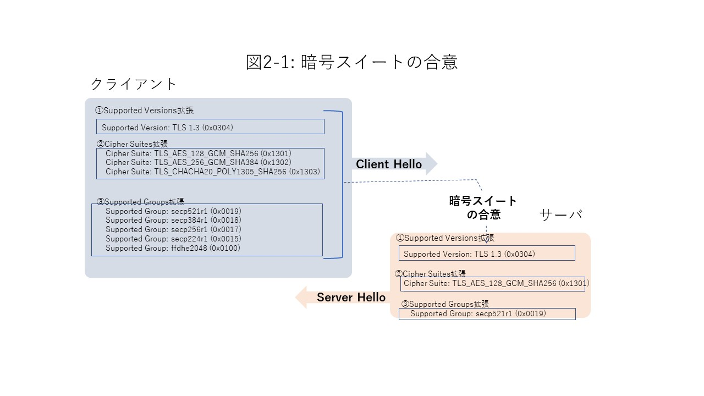
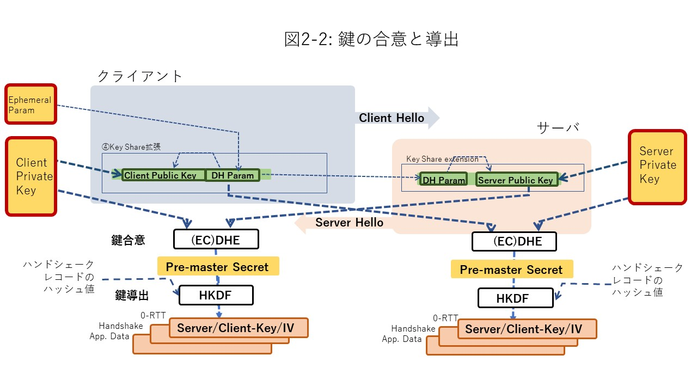
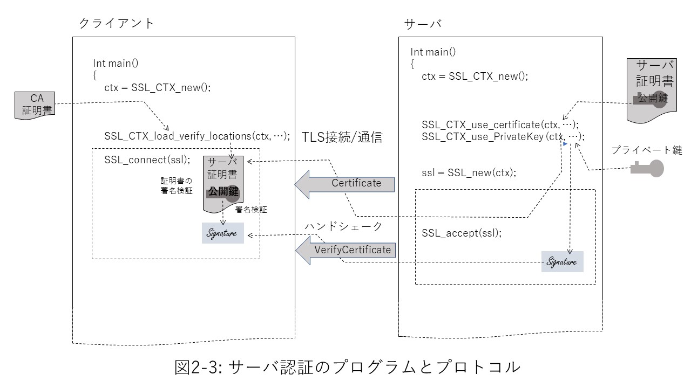
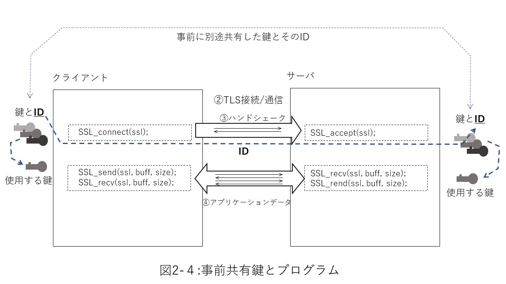
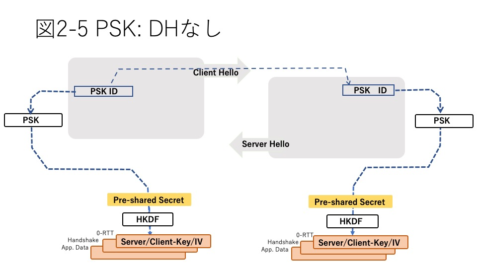
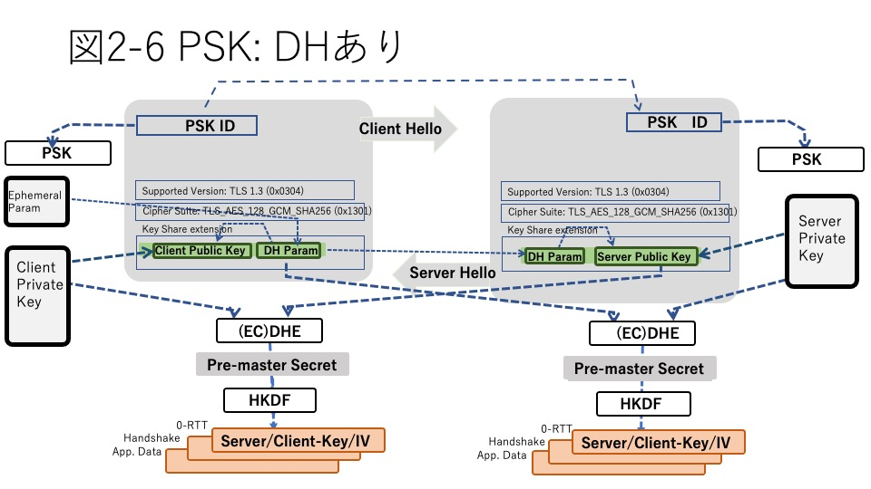
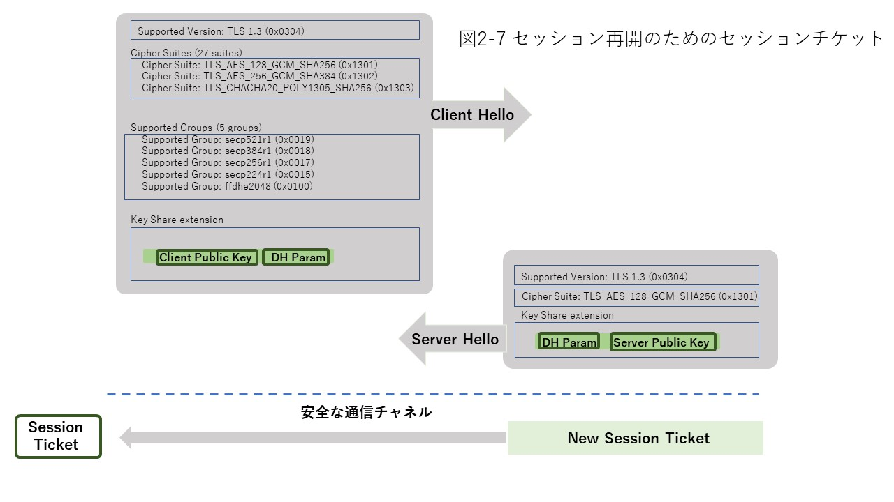

## Introduction
In Part 2, we'll look at the technologies that underlie TLS programming. First, Chapter 2 describes the TLS protocol, Chapter 3 describes the cryptographic algorithms and technologies used in it, and Chapter 4 describes the various related standards. In addition, Chapter 5 summarizes the security considerations in TLS programming.

## 2.1 Full handshake
### 2.1.1 Purpose of full handshake
When a client makes TLS communication with a server for the first time as described in "1.2 Simple TLS Program", the server needs to establish a secure TLS session with the other client without prior information. Full handshake does this.

The main purposes of full handshake are the following three.

1) Agree on the cipher suite used for both communications  
2) Agreeing a series of keys to be used in the session (key agreement)  
3) Confirm that the communication partner is the correct partner and that there is no spoofing (peer authentication)  

Peer authentication consists of server authentication, in which the client authenticates the legitimacy of the server, and client authentication, in which the server authenticates the legitimacy of the client. For TLS, server authentication is mandatory and client authentication is optional.

### 2.1.2 Cipher Suite Agreement
Cipher suite and key agreement, which is the main purpose of handshaking, is made by the ClientHello record that is first sent from the client to the server and the ServerHello record that the server responds to. Let's first look at the cipher suite agreement. Figure 2-1 shows this for Client Hello and Server Hello.

   

   

The ClientHello record and ServerHello record have an area called TLS extension that stores various attribute information required for a TLS session. Information is stored in the following TLS extensions for cipher suite agreements:

1) supported versions extension: List of supported TLS versions  
2) cipher suites extension: List of supported cipher suites  
3) supported group extension: Curve list of supported elliptic curve cryptography  

Each Client Hello TLS extension lists the options that the client has. ServerHello, on the other hand, shows the options that the server has agreed to. In the TLS handshake, after both parties agree on these, the common key used for sending and receiving application data is obtained by the key agreement algorithm and the actual encrypted communication is performed.

Let's take a closer look at this below.

#### 1) TLS version agreement
To establish a TLS session, you must first agree on the version of TLS to use.

In TLS, just as multiple TLS versions of protocols can be mixed on the network, ClientHello can offer multiple versions to support the Supported Versions extension (Figure 2-2 ①). On the other hand, the server side returns Server Hello in the format corresponding to the agreed version. This allows subsequent handshakes to proceed in the form of the agreed version. With TLS1.3, Secure Renegotiation has been deprecated, so if you agree on TLS1.3 here, you will have to comply with 1.3 afterwards.

Also, downgrade is not allowed in TLS 1.3, so even if the client presents multiple versions including 1.3, the server side must agree on 1.3 if it supports TLS 1.3 and Server Hello of TLS 1.3 Must be returned. At this time, if the TLS1.3 suite is not in the cipher suite list shown in ClientHello, it is considered as a kind of downgrade and the handshake ends. Clients who expect to agree on TLS 1.3 also ensure that this value is not the specified value to prevent downgrade attacks.  

On the other hand, when the server supports multiple versions including TLS1.3, if the client side supports only TLS1.2 or less, it is allowed to operate equivalent to the case where the server side also supports only TLS1.2 or less. Has been done. However, in that case, a specific byte string indicating that is displayed at the end of the server random.  

Table 2-1 summarizes the combinations of TLS versions supported by the client and server and the required behavior.
   
[Table 2-1 TLS Version Agreement](./table2-1.md)
   

#### 2) Types of cipher suites
Then agree on the cipher suite to use. Compared to previous versions, TLS 1.3 has significantly reduced the types of cipher suites that can be used as follows.

1) As a key agreement algorithm, static RSA has been abolished and only temporary key DH (including elliptic curve DH) is available.  
2) With the abolition of static RSA, certificates are now used only for peer authentication. This allows key agreement and authentication to be completely separated and treated independently.  
3) The compromised common key cryptographic algorithms have been significantly reorganized.  
4) Authenticity verification by MAC has been abolished, and only the Authenticated Encryption with Associated Data (AEAD) algorithm has been organized.  
5) Hash specifies only the hash algorithm for HKDF key derivation  

Due to the arrangement of 1), the notation of the key agreement algorithm has become meaningless in the cipher suite notation, and it has been deleted from the notation for TLS 1.3. Also, according to 2), the information about the certificate is also separated from the cipher suite, and the necessary information is stored in the TLS extension.

As a result, the hundreds of cipher suites up to TLS1.2 have been narrowed down to the following as currently available as TLS1.3.
   
[Table 2-2 Cipher Suite for TLS 1.3](./table2-2.md)
   

Information about key agreements is separated from the cipher suite, and the types of elliptic curves that can be used for ECDH are listed separately in the TLS Extended (Supported Group). A standard elliptic curve type ID is defined as the group type, and an ID indicating the key length is defined for DH.

Table 2-3 lists the main groups and IDs used by Supported Groups.

#### 3) Cipher suite agreement
For the round trip between ClientHell and ServerHell, we agree on the type of elliptic curve indicated by the Supported Group together with these cipher suites. At this time, if you have agreed on TLS 1.3 as the TLS version, you must agree on the TLS 1.3 cipher suite and the DH parameter shown in Key Share.

If there is nothing that the client can agree on, the server can issue another Client Hello request (HelloRetryRequest) only once.

After agreeing on the TLS version and cipher suite, the server receives the DH parameters shown in the Key Share extension and the client's DH public key. In response, ServerHello returns the server's DH public key. As a result, the session key is derived by Pre-Master Secret and HKDF for each.

The Key Share extension stores DH parameters for Diffie-Hellmann (including elliptic curve DH) key agreements and the client-side DH public key. Key Shere can contain multiple candidates.

#### 4) HelloRetry
If the server side cannot agree on the list of KeyShare extensions presented by the client side, you can request another candidate only once from the client (Hello Retry Request). On the other hand, the client side shows the next candidate in the second Client Hello. If the server side disagrees with this, it will suspend the handshake. If there is something you can agree on in the presented list, we will return the agreed contents of each item on Server Hello.

### 2.1.3 Key agreement
Now that we have agreed on details such as the TLS version, cipher suite, and DH group, we can start the key agreement process to get the common key that is actually used to send and receive application data.

   

   

ServerHello's Key Share stores the server-side DH public key in addition to the cipher suite agreement information so far. Both parties who receive them can calculate the premaster secret by the DH algorithm together with the private key generated by them (key agreement in Figure 2-2). The premaster secret is an integer value that is the basis of various common keys used for communication. TLS 1.3 uses Diffie-Hellmann (DH) algorithms for all key agreements. Key agreements and the Diffie-Hellmann algorithm are described in Chapter 3, 3.5 Public Key Cryptography.

In TLS1.3, the session key can be derived by exchanging one round trip between ClientHello and ServerHello records in this way, but before TLS1.2, two round trips were required. This is because before TLS1.2, ClientHello and ServerHello records only agree on the cipher suite, and the server key and client key for key agreement are exchanged for the next ServerKeyExchange and ClientKeyExchange. In addition, since the session key can be derived at the beginning of the handshake in TLS1.3, it is possible to conceal the handshake after that and improve the security. The main reason why this is possible is that the key consensus algorithm is limited to the DH system.

### 2.1.4 Key derivation

In TLS, the key for subsequent encryption and decryption by common key cryptography, IV, is derived by the key derivation algorithm based on the premaster secret value (key derivation in Fig. 2-2). The key derivation algorithm has been uniquely improved for TLS from TLS 1.1 to 1.2, but in TLS 1.3 the HKDF (HMAC key derivation function, RFC 5869), a more general-purpose key derivation algorithm based on HMAC-SHA256, is available. It has been adopted. As a result, the key and IV are further enhanced in security by deriving different values ​​depending on the source (server side, client side), and depending on the application data transfer, 0-RTT, etc. during handshaking and using them as session keys. (Table 2-3).
   
[Table 2-3 Key Derivation Schedule in TLS 1.3](./table2-3.md)

### 2.1.5 Peer authentication
#### 1) Overview
Another major purpose of handshake is peer authentication (server authentication by client, client authentication by server). Server authentication is mandatory for TLS and client authentication is optional. However, whenever the server side requests client authentication, the client side must respond to it.
   

   
Figure 2-3 shows the relationship between the client, the server program, and the certificates, keys, and protocols used for server authentication. On the TLS program, the client side loads the trusted CA certificate in advance for server authentication. On the server side, load the server certificate and private key signed by the CA.

In handshake, the server side sends the loaded server certificate to the client in a Certificate record. In addition, the signature created with the private key will be sent in the Verify Certificate record. On the receiving client side, after checking the expiration date of the certificate and verifying the authenticity of the certificate sent by the loaded CA certificate, the signature sent by the stored public key To verify.

#### 2) Certificate chain
In actual operation, there are many cases where the CAs are layered and the CA that signs the server certificate is not the trusted CA itself, but an intermediate CA that belongs to its subordinates. In addition, the intermediate CA itself may not be a direct subordinate CA of the trusted CA, and there may be an intermediate CA. In such a case, the server sends not only the server certificate but also the certificate of the intermediate CA to the client as a chain certificate. The receiving client verifies the server certificate with the public key contained in the certificate of the intermediate CA above it, and confirms that the chain is connected to the trusted CA certificate that it holds.

#### 3) Client authentication
Client authentication does much the same thing with the client and server symmetrical. However, client authentication is optional, so the server sends a Certificate Request to the client as needed.

Regarding the peer authentication protocol, up to TLS1.2, the signature sent from the server side was stored in ServerKeyExchange, and there were some parts that were not symmetrical in terms of the protocol, but in TLS1.3, it authenticates with the authenticating side as described above. It has been arranged so that it is symmetrical on the side to be used.

#### 4) TLS extension for authentication
Algorithm information about peer authentication is stored in each TLS extension. The combination (scheme) of algorithms used for signing is defined by the hash algorithm and the public key algorithm for signing it. The list of supported certificate signing schemes is stored in the Signature Algorithms. In TLS1.3, RSA and ECDSA are defined as standard as the signature part. For RSA, it also defines the padding method. For ECDSA, the type of elliptic curve is also specified here. SHA1 or SHA2 is used as the hash.

Table 2-4 lists the signature schemes that can be used with TLS 1.3.

#### 5) Certificate validity verification

The public key certificate can be revoked even before the expiration date in the event of an unforeseen situation such as the leakage of the private key. For this reason, the recipient must verify the validity of the certificate received.

Obtaining certificate revocation information was initially achieved outside the scope of TLS handshakes, such as CRLs and OCSPs, through interactions between the client and the CA or OCSP responder on behalf of the CA. However, OCSP Stapling has incorporated them into TLS extensions as part of their handshake, and TLS 1.3 has organized them to this day. In OCSP Stapling, the certificate validity information is prepared at the same time as the certificate on the peer-authenticated side (in the case of server authentication, the server side). Therefore, the authenticating side (client side in the case of server authentication) can only check the validity of the handshake with the other side trying to establish a TLS session. Multiple authenticated parties
You can bind authentication requests to the OCSP responder, which can significantly reduce traffic to and from the responder.

In TLS1.3, the peer authentication protocol has been organized so that it is almost symmetrical for server authentication and client authentication. As a result, OCSP status confirmation requests can now be requested for both authentications. For server authentication
Make a request with the OCSP_status_request extension on ClientHello and the status_reques extension on the CertificateRequest record for client authentication.

The validity information from OCSP corresponds to the certificate in the certificate chain, and the OCSP response signed in each CertifycateEntry is returned. At this time, the time stamp is also returned, so the authenticator can check the freshness of the status information.

## 2.2 Pre-shared key and session resume
### 2.2.1 Pre-shared key (PSK)

#### 1) PSK program
Pre-shared key (PSK) allows both communicating parties to agree on a key in some way and use it for communication. You can simplify handshaking by using PSK. You can share multiple keys in advance, in which case you should share the key / ID pair. In Client Hello at the beginning of the handshake, tell the server side the ID of the key you want to use in the session. On the server side, the key corresponding to this ID is selected from the keys shared in advance and used for the session. If you have shared only one key in advance, you can omit the ID. In any case, the handshake only conveys the ID and the key itself is not sent over the network (Figure 2-4).
   

   
In the program, the PSK callback function can be defined and registered in the library in order to separate the part that manages the key and ID used for PSK from the library that handles the TLS protocol in common. After securing the TLS context, registering a callback function in that context will cause the library to make PSK connections instead of full handshakes. In addition, the registered callback function is called at the start of handshake.

The client-side callback function returns the ID of the key you want to use and the value of that key in the argument. The received library stores the ID in ClientHello's Pre-Shared Key extension and sends it to the server side. On the receiving server side, the ID is passed to the algorithm of the PSK callback function on the server side registered in the same way, and the callback function searches for the corresponding key from the ID and returns the value to the argument.

#### 2) PSK protocol
In the PSK of TLS1.3, it is possible to use the pre-shared key indicated by the ID as it is (Fig. 2-5), but using that key, the same key agreement as in the case of full handshake is made and it is done. There is also a mode to use as a session key. Continuing to use the pre-shared key poses a so-called forward secrecy risk, where once the session key is compromised, the confidentiality of all sessions can be traced back to the previous session. To avoid that risk, from TLS 1.3 it is recommended to use a PSK key for further key agreement by Diffie-Hellmann (DH).
   

   
In this case, when the client program calls SSL_connect, as shown in Figure 2-6, the PSK handshake begins. By default, ClientHello has a key ID for the Pre-Shared Key extension, as well as DH parameters in the Key Share extension and the client side so that once the PSK used by the client and server is determined, it can be used for key agreement by DH. The DH public key is also stored. The server side also returns the server side DH public key to the Key Share extension.
   

   
If both the client and server agree not to have a DH key agreement, the PSK key will be used as is. After allocating a TLS context programmatically, you can make the library work that way by instructing that context in advance (wolfSSL_CTX_no_dhe_psk for wolfSSL).

### 2.2.2 Session resume
In TLS1.3, session resumption is organized as an extension of PSK, and the resumption protocol follows the PSK protocol. As the PSK key when resuming, use the session ticket exchanged in the previously established TLS session. After the secure TLS session is established, the server side can send the session ticket to the client as one of the post-hand shake protocols. On the client side, the session ticket sent is used when resuming the session (Fig. 2-7).
   

   

TLS1.2 or earler, there were two ways to resume a session: by session ID and by session ticket. In session ID, when the client requests a session ID with an empty session ID extension of ClientHello, the server side returns the corresponding session ID value with the session ID extension of ServerHello. The client makes a resume request using this session ID when making a resume request. The session ticket also gets the ticket by the session ticket extension and uses it when resuming.

Resuming a session by session ID imposes a burden on the server side because it needs to retain its status in some way. In the case of a ticket, all the information required for restarting is included in the ticket, so the burden on the server side does not increase in that respect.

In TLS 1.3, the previous session ID has been abolished, and session resumption has been unified into a session ticket. In addition, ClientHello's session ticket extension has been deprecated and the server will send a ticket in the previous session if there is a possibility of resuming a session (see 2.4 Post-Handshake Protocol).

### 2.2.3 Early Data
In the case of PSK or session resumption, the information can be kept secret by using the key information of the previous session without waiting for the handshake. In TLS 1.3, Client Hello at the beginning of a TLS session has a TLS extension called Early Data Extension, which allows application data to be stored, encrypted, and sent. Early Data is also called 0-RTT because it is a concealed message without Round Trip.

However, it should be noted that this encryption sacrifices forward secrecy because it inherits and uses the key information from the previous session. You should also note that this feature has no defense against replay attacks. In order for the server that receives Early Data to take some self-defense measures, it is necessary to take special measures such as not transmitting data other than the specific pattern that the sender has agreed in advance with both parties.

Early Data does not change much as a handshake flow because it simply puts a dedicated TLS extension on ClientHello in terms of protocol, but programmatically it uses the API for sending and receiving Early Data prepared by the library. It will be. Specific programming is explained in "Part 2 TLS Programming".
   

## 2.3 Other TLS extensions

TLS provides purpose-built TLS extensions to meet the various requirements of real-world network communications. This section describes the major TLS extensions.

#### 1) Server Name Indication (SNI)
In the early days of the Internet, there was a one-to-one correspondence between the physical server and IP address, which are the endpoints of communication transmission and reception, and TCP and TLS communication was also premised on the connection between the endpoints. However, due to advances in virtualization technology, there are many cases where the IP address, which is the physical end point, does not always match the unit of the target communication partner. To solve this, SNI extensions were provided to indicate the logical counterparts of interest.

The client stores the server name of the logical server that it wants to make a TLS connection in the Client Hello SNI extension. The server responds only if the SNI extension shows its server name and returns its server certificate. This allows the client to authenticate the server by distinguishing each server with a logical server name. In order for the SNI function to work, both the client and server must support SNI.

#### 2) Maximum Fragment Length Negotiation
Communication nodes connected to the network are not necessarily machines with abundant memory. In many cases, small embedded devices such as IoT devices have a limited amount of memory that can be used for communication. One of the issues in such cases is the size of the encrypted TLS record. In TLS, if the size of the application data to be sent is large, the TLS record is to be divided into up to 16 kbytes and sent (Maximum Fragment Length). However, in small embedded devices, there are cases where it is necessary to divide the records into smaller records. In that case, the client attempting to initiate TLS communication will display the desired maximum record size in the Maximum Fragment Length extension, and if the server accepts this, communication will be performed with that size as the maximum record size.

#### 3) Certificate Status Request
OCSP Stapling is a protocol for online certificate validity checking for peer authentication. The Certificate Status Request extension is an extension for requesting OCSP (Online Certificate Status Protocol) stapling from the other party of the TLS connection. OCSP and OCSP Stapling are discussed in Chapter 4: Standards Related to TLS.

#### 4) ALPN: Application-Layer Protocol Negotiation
The ALPN extension is an extension to show the protocol of the application layer used on the TLS connection in advance. Originally, the layers of the Internet Protocol are independent in principle, but the ALPN extension was provided to avoid extra handshakes for negotiation at the application layer after TLS connection. Currently, it is used in SPDY, HTTP / 2, etc.

#### 5) Other TLS extensions
In addition, some TLS extensions used up to TLS 1.2 have been cleaned up in TLS 1.3.

The extended_master_secret extension is an extension designed to address the vulnerabilities recognized in the TLS 1.2 era. It shows that the range for finding the hash value, which is one of the elements for calculating the master secret, is extended to Client Hello, which is the first part of communication. This hash range extension is mandatory in TLS 1.3 and has been deprecated as a TLS extension.

The encrypt_then_mac extension indicates that the MAC value of a TLS record is obtained by encrypting the data and then obtaining the MAC value. Also, Truncated HMAC is for using a value with a shorter number of bits than usual as the MAC value. In TLS 1.3, these TLS extensions have been abolished because the authenticity check by MAC value is left to the common key cryptography by AEAD (see "Chapter 5 Security, Vulnerability").

The Compression Methods extension was an extension to show how to compress application data, but TLS 1.3 abolished data compression as a protocol because the regularity of compressed data risks causing vulnerabilities. It was. The ec_point_formats extension is also an extension that shows how to compress key information in elliptic curve cryptography, but it has been deprecated for the same reason.

## 2.4 Post-handshake protocol
When a TLS connection is established by handshake, the target application data is sent and received, but some supplementary protocols are defined.

#### 1) Session ticket
The session ticket is the data used when resuming the session mentioned above. The server can send a session ticket at any time after the handshake is complete and a secure session is established. The client will use the received session ticket the next time the session resumes. The server can send session tickets multiple times if it allows the client side to connect multiple sessions at the same time.

#### 2) Re-key generation, re-authentication
With TLS1.3, the session key can be regenerated at the right time when the session is long-term or when a large amount of data is transferred. The session key is regenerated from the session's master secret using a key derivation algorithm and used as a new generation symmetric key.

Similarly, you can request peer authentication again during the session. In that case, as in the case of full handshake, the Certificate Request record requests the other party to authenticate, and the replied Verify Certificate record authenticates.

Reference RFC: