## 3.1 Overview
Digital encryption technology is a basic technology that has developed rapidly in recent years and includes technologies in a wide range of fields. This chapter summarizes the cryptographic technologies and algorithms used especially in TLS. Figure 1.1 shows these cryptographic elements and their relationships. Arrows indicate technical element dependencies.

As shown in this figure, many of these techniques are built on the difficulty of predicting random numbers. In addition, these cryptographic technologies are made up of three elemental technologies: hash, symmetric key cryptography, and public key cryptography, and complex cryptographic technologies that combine them for different purposes.

<br> <br>
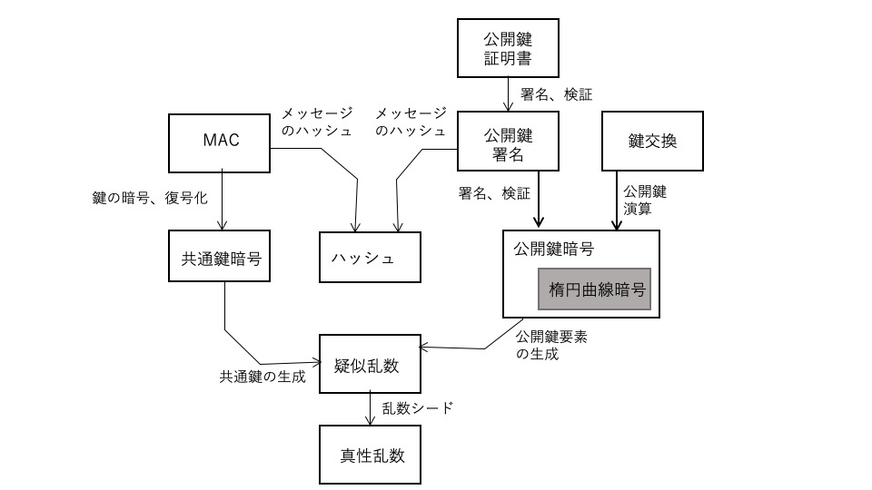
<br> <br>

### 1) Random numbers
Random numbers are the basis of all modern cryptographic algorithms, and their cryptographic strength depends on the quality of the random numbers used. Care should be taken when using low quality random numbers, as the key length for encryption, for example, will not be fully utilized and confidentiality will not be ensured.

Intrinsic random numbers are pure random numbers with no periodicity or statistical bias. It is not easy to obtain high quality true random numbers, and it is not possible to obtain true random numbers only with algorithms that operate deterministically, such as software. Pseudo-random number is a technology that deterministically generates a random number sequence with a sufficiently long period and little statistical bias by giving the original random number seed value from the outside. Pseudo-random numbers are used for the purpose of obtaining high-quality random numbers by combining pseudo-random numbers with the true random numbers as seeds when it is difficult to directly generate high-quality true random numbers. Pseudo-random numbers are also used in applications that require reproducibility, such as simulation, because they generate the same sequence of random numbers when the seed values ​​are the same. In addition, key derivation that generates multiple purpose-specific keys from one master key and key extension for stream cipher processing, which will be described later, are also types of pseudo-random numbers.

Typical pseudo-random number algorithms include Hash_DRBG, HMAC_DRBG, and CTR_DRBG. As a regulation regarding the quality of random numbers, for example, there is SP 800-90A / B by US NIST.

### 2) Hash
Hash is also called a message digest, and is a one-way algorithm for compressing long messages with indefinite length into short fixed length data. Since the data is compressed, there is a possibility that the same hash value will be generated from different original messages (hash collision), and there is a risk that the original message will be inferred from the hash value (original image calculation), so the algorithm used Is required to minimize such risks.

MD5 and SHA1 were widely used as typical hash algorithms in the early days, but due to the risk, SHA2 (SHA256 / 384/512, etc.) and SHA3 are now standardized and used. In TLS 1.3, SHA256 / 384 of SHA2 is adopted as the hash algorithm used in the cipher suite.

### 3) Common key cryptography
A cryptographic algorithm that uses the same key for encryption and decryption is called symmetric key cryptography. Since common key cryptography has the characteristic of being able to efficiently encrypt and decrypt large amounts of data, TLS uses it as an encryption algorithm when transferring application data.

However, when there is a possibility of communicating with a large number of potential parties such as network communication, there is a problem of how to safely pass the key to be used to the other party (key delivery problem). In TLS, cryptographic communication is performed by common key cryptography after securely sharing the same key with the other party of communication using the public key cryptography technology described later (key exchange, key agreement).

Common key cryptography can be divided into a block type that processes in block units and a stream type that does not require such a delimiter. AES is currently the most widely used block type algorithm. In the case of block type, there are various usage modes depending on the information connection method between blocks. AES-CBC was most widely used up to TLS1.2, but in TLS1.3 it is verified that the message is not tampered with at the same time as encryption like AES-GCM and AES-CCM (authenticity). Only what can be done is adopted as standard.

Initially, RC4 was widely used as a stream-type algorithm, but it is now obsolete due to compromise. In TLS 1.3, ChaCha 20 is adopted as the standard in combination with the algorithm of the message authentication code by Poly1305.

### 4) Message authentication code (MAC)
In network communication, the issue is to confirm that the received message has not been tampered with (integrity). Algorithms for that purpose, message authentication code (MAC) includes HMAC using hash (Hash based MAC), AES-MAC using common key cryptography, and so on. A common key is used for MAC verification, and only the legitimate owner of the key can verify the integrity of the message.

However, in TLS, there is an increasing need for message authentication to be performed in smaller units, and message authentication is being incorporated as part of common key cryptography (AEAD). On the other hand, the key derivation algorithm used to be an algorithm unique to TLS, but TLS 1.3 uses HMAC, which is one of the MAC algorithms.

### 5) Key exchange and signature with public key
Initially, public key cryptography (asymmetric key cryptography) was researched to solve the key delivery problem of common keys. In the public key algorithm, both keys are different in the encryption algorithm that uses different keys for encryption and decryption, and the encryption key (public key) can be passed to the other party to receive the encrypted message. Because. However, since the processing of public key cryptography takes an extremely large processing time compared to common key cryptography, in TLS, after the same key value is obtained by key exchange with the public key in the first hand shake, it is common. It is used as a key for key cryptography to efficiently encrypt and multiplex a large number of messages.

In the early days of TLS, a key exchange method using RSA encryption and decryption was widely used, but in recent years even public keys have a risk of confidentiality because the RSA method requires the same key to be reused for a long period of time. Has been pointed out. Therefore, Diffie-Hellmann (DH) type key exchange, which makes it easy to update the original key, is recommended, and in TLS 1.3, only ECDHE with elliptic curve cryptography is accepted as the standard among DH types.

Public key signature is a digital signature algorithm that utilizes the one-way characteristic of public key cryptography. In TLS, public key signatures are used as a means of peer authentication to prevent spoofing of the other party. To prove your legitimacy as a communication partner, first sign an appropriate message (Blob) using the private key for your signature along with the certificate containing your public key (described later). Will be sent. The recipient verifies that the signature on the Blob is correct with the public key stored in the certificate.

Typical signature algorithms include RSA and DSA. Like RSA encryption, RSA signatures use the property of being able to recover data using a different key to provide signature verification, while DSA signatures only use a combination of one-way operations to verify the signature. DSA is not adopted in TLS 1.3 because it requires careful operation for signing, but ECDSA, which realizes the same processing in the world of elliptic curve cryptography, is adopted as a standard.

In this way, the use of public key cryptography has expanded significantly beyond its original purpose, and the color of encryption technology for simple information secrecy is fading.

### 6) Elliptic curve cryptography
Elliptic curve cryptography defines a point on an elliptic curve and a scalar multiplication for it. While RSA and DH are based on the difficulty of inverse calculation of discrete logarithm, elliptic curve cryptography encrypts that if the scalar value is large enough, it becomes difficult to calculate the inverse of scalar multiplication for points on the ellipse. It is used for conversion. ECDH can use this operation on the elliptic curve to safely obtain a common key for both parties communicating in the same way as Diffie-Hellmann. Elliptic curve cryptography is also used as an algorithm for digital signatures. ECDSA, which realizes the principle of DSA by elliptic curve cryptography, is standardized as an elliptic curve signature algorithm.

In general, elliptic curve cryptography can achieve comparable cryptography with shorter keys than algorithms that rely on prime numbers such as RSA. Elliptic curve cryptography has a slightly complicated algorithm, but it tends to take less time as an actual algorithm execution time because it is easy to perform power operations that should have a short key. NIST initially worked on the standardization of elliptic curves and standardized a series of curves, commonly known as NIST curves. It is also mapped to the curve by SECG centering on Europe and is adopted as a standard in TLS.

Recently, special elliptic curves such as Curve25519 and Curve448 that simplify arithmetic processing have also been studied and adopted as standard curves in TLS 1.3.

### 7) Public key certificate
The public key certificate is a signature of the public key and other meta information stored. The certificate is signed by a certificate authority (CA), which is trusted by both parties, using the private key of the certificate authority. The person trying to communicate can use the certificate of the trusted CA to verify that the certificate sent by the other party is a legitimate certificate signed by a certificate authority. You can also use the public key of the communication partner stored in the certificate to authenticate the validity of the communication partner.

The format of the public key certificate is standardized by ITU X.509 and its underlying data structure definitions ASN.1 and DER. The PEM format, which is Base64 converted from DER to text format, is also widely used as a file format.

### 8) Public Key Infrastructure (PKI)
Public key infrastructure (PKI) is a trust model based on a certificate authority, which is a trusted third party using public key cryptography, certificates, etc., and standard rules for realizing it. .. As a series of concrete standards for realizing PKI, there is PKCS (Public Key Cryptography Standards ") that RSA has worked on from the early stage of public key technology. PKCS is numbered according to the category of the standard. The categories referred to as Internet standards are now taken over by the IETF RFC.

## 3.2 Random numbers

### 1) Intrinsic random numbers

Random numbers are the basis of modern cryptographic algorithms, and their cryptographic strength depends on the quality of the random numbers used. It is extremely difficult to define a true random number exactly, but intuitively, it can be defined as an unpredictable bit string with no periodicity or statistical bias, or a numerical string such as an integer. In this chapter, we will focus on the points to be aware of regarding the handling of random numbers in relation to TLS, not a rigorous discussion.

It is not easy to obtain high quality true random numbers, and it is not possible to obtain true random numbers only with algorithms that operate deterministically, especially software.
### 2) Pseudo-random numbers

Pseudo-random number is a technology that deterministically generates a random number sequence with a sufficiently long cycle and little statistical bias by giving the original random number seed value from the outside. Pseudo-random numbers are used to obtain high-quality random numbers by seeding them when it is difficult to directly generate high-quality true random numbers. Also, since the same random number sequence is generated when the seed values ​​are the same, it is also used in applications that require reproducibility, such as simulation. In TLS, it is also used to derive various keys used in the session from the premaster secret. The generation of key bit strings for stream ciphers can also be seen as a kind of pseudo-random number generation.

### 3) Actual random number generation

For pseudo-random numbers, many software algorithms that can generate high-quality random numbers have been studied, but in principle, the generation of true random numbers cannot be generated only by deterministic logic. Generally, high quality random numbers are achieved by using some kind of hardware entropy source such as electrical noise. In addition, since the pseudo-random number algorithm can generate high-quality random numbers with little statistical bias in a random number sequence of a certain length, the quality of the pseudo-random numbers is based on the true random numbers of a certain quality as a seed. You can take the technique of increasing.

Even in the generation of true random numbers by wolfCrypt, a method is used to increase the randomness with pseudo-random numbers by Hash DRBG based on the true random number seeds by Generate Seed. Hash DRBG realizes a random number sequence that is statistically unbiased in a large number of random number generations. But, of course, the same seed value will generate the same series of random numbers. In Hash DRBG, the seed value is calculated from GenerateSeed at appropriate intervals. It is the responsibility of GenerateSeed to generate a seed value that has as many degrees of freedom as the bit width of the seed value.

On the other hand, the seed generation part must be a true random number. It is difficult to define the quality of true random numbers exactly. In addition, since it is difficult to produce high-quality true random numbers by yourself, generally, the true random number generation function provided by hardware such as an MCU or OS is used.

If you absolutely have to make it yourself, realize the statistical quality with pseudo-random numbers, and be careful to accumulate sufficient entropy in the seed part with the following consideration. ..

1) Make sure that the first seed value is generated with sufficient degrees of freedom for the bit width of the seed value.
2) Return a different value for each seed generation
3) Care should be taken to accumulate entropy over time
4) Make sure that the entropy is not reset even when restarting, such as when the system is reset, and that the initial value that is different from the previous one is returned.


### 4) Standards for random number quality

NIST SP 800-90A stipulates the quality of random numbers as pseudo-random numbers such as Hash DRBG. In addition, NIST SP 800-90B defines a test model for testing true random numbers.

https://www.ipa.go.jp/security/jcmvp/documents/atr/atr01e.pdf

Although TLS does not specify the quality of random numbers used, the IETF documents the following guidelines as RFCs.

"Randomness Requirements for Security", BCP 106, RFC 4086
## 3.3 hash

Hash is also called a message digest, and is a unidirectional algorithm for compressing long messages with indefinite length into short fixed length data.

The hash algorithm for obtaining the hash value is required to be (virtually) impossible to obtain a message having such a hash value from the hash value (difficulty in calculating the original image, weak collision resistance). increase. To do this, the algorithm must be such that the hash value changes significantly when the message is changed slightly, and the hash value appears to be uncorrelated with the hash value of the original message. It also requires that it is (virtually) impossible to find pairs of two different messages with the same hash value (strong collision resistance).

MD5 by Ronald Rivest was standardized as RFC1321 in 1992 as a hash algorithm, and then SHA1 and SHA2, which have a longer hash bit length and can be applied to large data, were standardized and widely used as a standard by NIST. SHA1 is a 160-bit hash algorithm, while SHA2 is a general term for a series of algorithms that obtain hash lengths from 224 bits to 512 bits. SHA2 is also called SHA256, SHA512, etc. for each hash length.

Cipher suites based on these have been adopted as standard in TLS, but in recent years, research on attacks related to MD5 and SHA1 has been reported, and there are concerns about the realization of attacks. Therefore, MD5 and SHA1 have been completely abolished in TLS 1.3.

MD5, SHA1 and SHA2 are based on the Merkle–Damgård construction algorithm, and due to concerns about dependence on this algorithm alone, SHA3 was established as a new standard. However, no specific risk has been reported for SHA2 at present, and SHA256 and SHA384 are adopted in TLS1.3.

<br> <br>

| | Algorithm | Digest len(Bit) | Max message len(Bit) |  TLS1.2  | TLS1.3| RFC | 
| ---- | ---- |:----:|:----:|:----:|:----:|:----:| 
| MD  |MD5|128 | |✓ | | | 
| SHA1|SHA1|160||✓|| |  
| SHA2|SHA-224|224| |✓| |
|     |SHA-256|256| |✓|✓||
|     |SHA-384|384| |✓|✓| |
|     |SHA-512|512| |✓|✓| |
|     |SHA-512/224|224| | |
|     |SHA-512/256|256| | |
|SHA3 ||| | || || 
| ||| | || || 
| ||| | || || 


                    Table 3.1 hash algorithms


## 3.4 Common key cryptography

A cryptographic algorithm that uses the same key for encryption and decryption is called symmetric key cryptography. Since common key cryptography has the characteristic of being able to efficiently encrypt and decrypt large amounts of data, TLS uses it as an encryption algorithm when transferring application data. In order to solve the common key delivery problem, TLS uses public key cryptography to securely share the same key with the other party (key exchange, key agreement) and then process the common key cryptography. ..

There are two types of common key cryptographic algorithms: block type and stream type. The block type divides the basic unit of encryption into blocks, and realizes encryption of each block and chaining it to encrypt the entire message of the desired size. On the other hand, the stream type continuously encrypts the entire processing target without dividing the processing unit.

### 1) Stream cipher

In stream cipher, a random bit array of the same size as the plaintext to be encrypted is generated by a kind of pseudo-random number generation based on a given encryption key of a specific size. This bit array is encrypted by performing an exclusive OR encryption operation for each bit (Fig. 3-4-1). In such an exclusive OR of bit strings, there is no correlation between the frequency of occurrence of 1/0 of the input bit string data and the frequency of occurrence in the output. Therefore, by encrypting with such a structure, it is possible to make it impossible to infer the plaintext from the ciphertext based on the frequency of occurrence of bits as long as the randomness of the key can be ensured.

<br> <br>
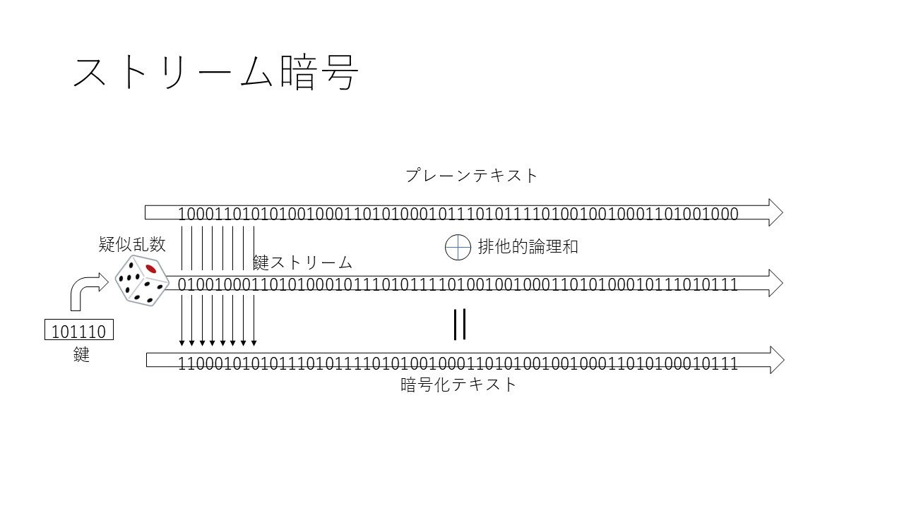
<br> <br>

Stream ciphers have the great feature that they can be processed by a simple algorithm, but their cipher strength depends on the quality of pseudo-random number generation. Early developed by Ronald Rivest, RC4 was widely used in TLS and other protocols, but in recent years, attacks on RC4 have been reported and are no longer used. Meanwhile, the Salsa20, which was subsequently developed and announced by Daniel Bernstein, was upgraded as ChaCha20 (RFC 7539). ChaCha20 realizes authenticated encryption in combination with the message authentication code Poly1305 (see "3) Authenticated encryption"), and is adopted as one of the common key encryption algorithms in the current TLS.

### 2) Block encryption and usage mode

Block-type encryption divides a message into fixed-length blocks and encrypts and decrypts each block. Triple DES, which improved the key length constraint of DES (Data Encryption Standard), which was initially developed as a one-block encryption algorithm, was used as the initial encryption algorithm of TLS. After that, AES (Advanced Encryption Standard) was developed as an algorithm that can be processed more efficiently by computer processing, and those with a block length of 128 bits and a key length of 128, 192, 256 bits were standardized and are widely used until now. ..

In block cipher, multiple blocks are joined together to process the required message size. Various methods have been proposed for connecting blocks. The simplest is called ECB (Electronic Codebook), which uses the same key and IV in all blocks, but this limits the confidentiality of the message. The CBC mode, in which the exclusive OR of the plaintext message of the previous block and the plaintext message of the next block is the IV of the block, can achieve high confidentiality with a relatively simple algorithm, so AES-CBC combined with the AES block cipher. The mode has been widely used in TLS until recently.

<br> <br>
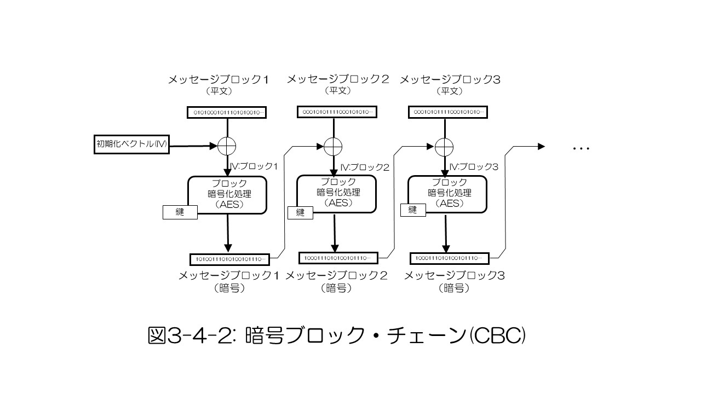
<br> <br>


In CTR mode, as shown in Fig. 3-4-2, an appropriate nonce value is given to the upper part as the overall IV, and a binary integer zero is given to the lower part, and this is incremented by 1 for each block, and the variable length key is used as the IV for each block. To generate. The plaintext message is encrypted by taking an exclusive OR with this variable length key. Although a block cipher such as CTR mode AES is used as an element algorithm, it can be said to be a stream cipher because it generates and encrypts a variable length key in this way.

Although CTR mode is a simple algorithm, it does not impair confidentiality, and since the dependency of each block is only the counter, it is suitable for processing in parallel for each block as long as the block number is known.

<br> <br>
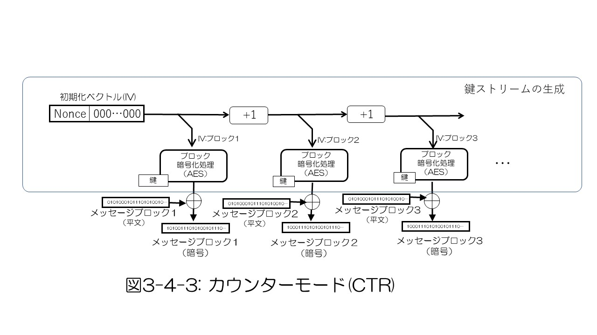
<br> <br>
### 3) authenticated encryption with associated data (AEAD)

This type of encryption algorithm does not guarantee that the original plaintext has not been tampered with (message authenticity) just because it was decrypted. For this reason, in TLS, in addition to encryption, a message authentication code (MAC) is assigned to each record to verify its authenticity. However, in recent years, it has been pointed out that this method cannot completely guarantee the authenticity, and in TLS 1.3, only the AEAD method, which can perform message authentication in finer units in combination with encryption processing, has been adopted. Therefore, although CTR mode continues to be used as a base mechanism for realizing authenticated encryption described below, single CBC mode and CTR mode are excluded from the standard.

Authenticated encryption is a cryptographic algorithm that verifies the authenticity of a message at the same time as encrypting and decrypting the message. An authentication tag used for authenticity check is generated at the same time as the message encryption process, and the authenticity is checked by the authentication tag during the decryption process. Authenticated encryption used in TLS 1.3 includes block type AES-GCM (Galois / Counter Mode), AES-CCM (Counter with CBC-MAC) and AES-CCM_8, and stream type ChaCha20-Poly1305. ..

In AES-GCM, AES-CTR is used for the encryption processing unit, authentication tag is generated, and GMAC (Galois Message Authentication Code) is used for authentication to realize authentication with authentication tag. Figure 3-4-3 shows the flow of the algorithm for encryption processing. The GMAC processing unit takes the authentication data value as input and derives the authentication tag value from the encrypted message. This authentication tag value is used to check the authenticity as input for the decryption process.

<br> <br>
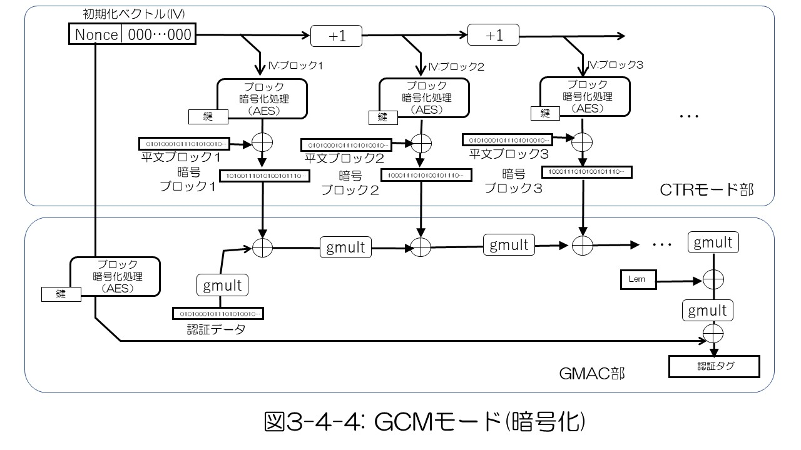
<br> <br>

AES-CCM and AES-CCM_8 also use AES-CTR for the encryption part, but use CBC-MAC for the authentication tag. Since CBC-MAC is lighter in processing than GCM's GMAC, these usage modes are used for embedded systems with relatively low processor processing power.

### 4) Padding scheme
With block-type encryption, if the size of the message to be encrypted is not an integral multiple of the block, it is necessary to supplement the odd part with appropriate padding to encrypt. When decrypting, remove the padding part. As a padding scheme, the scheme defined as part of PKCS # 7 (RFC2315) is widely used. In this scheme, if the size of the fractional part is 1 byte, 1 byte of the numerical value 1 is added, if the size is 2 bytes, the numerical value 2 is added as 2 bytes, and if the message length is an integral multiple of the block, 1 block is added. Add padding.

`` ```
01 --if l mod k = k-1
02 02 --if l mod k = k-2
            ..
            ..
            ..
k k ... k k --if l mod k = 0
`` ```

### 5) Main common key cryptography

Table 3-4-1 summarizes the main TLS common key cryptosystems, including those that are obsolete.

<br> <br>
| Method | Algorithm | Usage mode | Block length <br> (Bit) | Key length <br> (Bit) | Authentication tag length <br> (Bit) | TLS1.2 or earlier | TLS1.3 | Remarks |
|--|--|:--:|:--:|:----:|:--:|:--:|--|--|
|Block||||||||
||3DES_EDE|CBC|64|168|-|✓||RFC5246| 
||Camellia|CBC|128|128/256|-|✓||RFC5932|
|| AES|CBC|128|128/256|-|✓||RFC5246| 
|| AES|GCM|128|128/256|128|✓|✓|RFC5288|  
|| AES|CCM|128|128/256|128|✓|✓|RFC6655|  
|| AES|CCM_8|128|128/256|64|✓|✓|RFC6655| 
|Stream|||||||
||RC4 |-|-|40~256|-|✓||RFC2246|
||Chacha20<br>Poly1305*|-|-|256|128|✓|✓|RFC8439|


- Note 1: Only the key length specified as a cipher suite in RFC is described.
- Note 2: Stream cipher ChcaCha20 and message authentication code Poly1305 are essentially independent algorithms.

                    Table 3.4.1 Key common key cryptographic algorithms used in TLS

<br> <br>
## 3.5 Key derivation

Key derivation is an algorithm for generating a bit string (pseudo random number value) of a size according to the purpose from a bit string of a certain size. It may be used to compress a long bit string such as a stream into a small size bit string, or it may be used to extend a bit string longer than the original bit string. The former works like a hash and the latter works like a pseudo-random number generator. Unlike simple hashes and pseudo-random numbers, a shared key cryptosystem is used in combination so that only legitimate parties who know the key can derive the correct value.

In TLS, after both communication nodes share the same premaster secret value by the key sharing protocol, it is used to obtain a shared key or IV for encryption and decryption of application data based on that value. Until TLS1.2, PRF (Psudo Random Function) dedicated to TLS was used, but in TLS1.3, HKDF (HMAC-based Extract-and-Expand Key Derivation Function), which is also commonly used in other protocols. Is used. HMAC is an algorithm that combines a hash and a common key with AES. In TLS 1.3, HMAC by SHA256 and SHA383 is specified as a standard.

## 3.6 Public-key cryptography and key sharing

### 3.6.1 Background
Public-key cryptography was initially researched as a cryptographic method that allowed one key to be made public by using different keys for encryption and decryption. However, today, the properties of public keys are applied in various aspects, and their fields of application are diverse. The initial usage method for the purpose of encryption and decryption for information confidentiality is becoming a situation that cannot be said to be the main purpose.

In TLS, public key cryptography is mainly used for key exchange or key sharing to solve the key distribution problem of common keys, or as a public key signature and a certificate based on it. This chapter focuses on the basic concept of public keys, key exchange using them, and digital signatures. Certificates are described in 3.8 Public Key Certificates.

RSA cryptography is a typical public key cryptography invented by Ronald Rivest, Adi Shamir, and Leonard Adleman, and is a cryptography that realizes confidentiality based on the difficulty of discrete logarithmic operations. Furthermore, at this time, if an appropriate set of prime numbers (e, d, n) is selected, the plaintext message m is raised to the power of e and divided by n to obtain the encrypted message c, and c is raised to the power of d in the same manner. You can get the original decrypted message m by taking the remainder. In RSA cryptography, integer values ​​e and n are used as the key for encryption and d and n are used as the private key for decryption by using the set of numerical values ​​that satisfy these conditions.

The inverse of the exponential remainder operation used in RSA is the discrete logarithmic operation. This discrete logarithmic operation is extremely difficult if the numerical value is a sufficiently large prime number, and no simple calculation method has been found. In other words, since the exponential remainder operation can be performed in only one direction, the encrypted information can be kept secret even if the encryption key is disclosed. In addition, it is possible to decrypt with a key different from encryption because there is a circular operation that can return to the original numerical value by selecting an appropriate numerical pair.

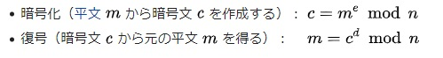

### 3.6.2 RSA practical technology

#### 1) Practical modulo operation
If this principle is left as it is, a huge integer will be handled in the process of calculation, which is not practical. Algorithms for reducing this are also known, and by using them, such calculations are possible if there is an area twice the key size. For example, there are reduction methods based on the Chinese Remainder Theorem and Montgomery reduction. The wolfSSL library uses Montgomery reduction.

#### 2) Probable prime
Larger prime numbers must be used to make inverse operations difficult with algorithms like RSA, but simple prime number generation algorithms take a long time to find large prime numbers. Therefore, many practical cryptographic software employs a probable primality test. Probable primality tests allow numbers that are not prime numbers with a certain probability, but if the probability is sufficiently low, it is possible to prevent the confidentiality of cryptography from being impaired in practice.

#### 3) Padding
Even if public key cryptography can be decrypted, there is no guarantee that the target message has not been tampered with or that it is correct (authenticity guarantee). A method has been developed to verify this by inserting additional padding into the original message. A padding scheme that combines basic cryptographic algorithms for padding in RSA was originally defined in PKCS # 1 by RSA, but is now taken over by the IETF and specified in RFC8017 (details). See 3.6.6 Standards for Public Key Cryptography).

### 3.6.3 Initial key exchange with RSA

Public-key cryptography by RSA was widely used as a key exchange protocol to solve the key delivery problem of symmetric-key cryptography in the early days of TLS (Fig. 3-6-1). First, the recipient who wants to receive the encrypted message sends the public key to the sender as an encryption key. The sender of the message encrypts the sent message with the received public key and sends it to the receiver. In the case of TLS, it sends the premaster secret that is the source of the key used to conceal application messages by symmetric key cryptography. The recipient uses the private key to decrypt it.

<br> <br>
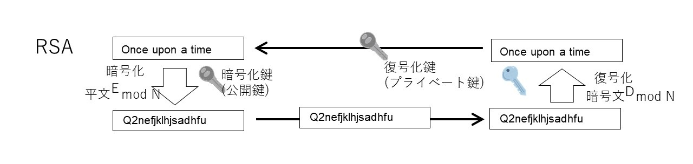
<br> <br>

Considering the TLS usage scenario, it is also necessary to perform server authentication to prevent server spoofing. Initially, if you send the server certificate for server authentication instead of sending the single public key when sending the above public key, it is convenient because the public key contained in it can be used as it is. In the early days of TLS, such usage was standardized.

However, security risks have changed with the times, and the risk of continuing to use the same public key for a long period of time (static public key) has been pointed out (Chapter 5 Security, Vulnerability: Complete forward secrecy). reference). To avoid this risk, key pairs need to be updated frequently, but for certificates, it is not practical to update the certificate authority's signature frequently.

In the meantime, the progress of cryptographic algorithms has been remarkable, and the demand for selecting algorithms to be used for key exchange and certificate algorithms based on independent selection criteria has increased, and the sending of certificates and keys for server authentication have become stronger. There is a growing awareness that the exchange protocols should be independent.

Against this background, in the TLS 1.2 era, RSA static public key key exchange was no longer recommended and was abolished in TLS 1.3, and RSA public key algorithms are for certificates (see Chapter 8 Public Key Certificates). ) Is now limited.

### 3.6.4 Diffie-Hellman Key Exchange

Around the same time as RSA, another public key algorithm, Diffie–Hellman key exchange (DH), was invented. DH cannot decrypt encrypted data like RSA, but it can get a common value between the two trying to communicate. By using this for key exchange (key agreement), the key distribution problem can be solved (Fig. 3-6-2).

Unlike RSA, DH takes advantage of the unidirectionality of discrete logarithmic operations as well as the commutativity of the order of two operations. Specifically, the key exchange is realized by the following procedure.

First, both parties trying to obtain a common key value first share a set of prime numbers (DH parameters), which are common parameters. This parameter is a value that can be disclosed to a third party.

<br> <br>
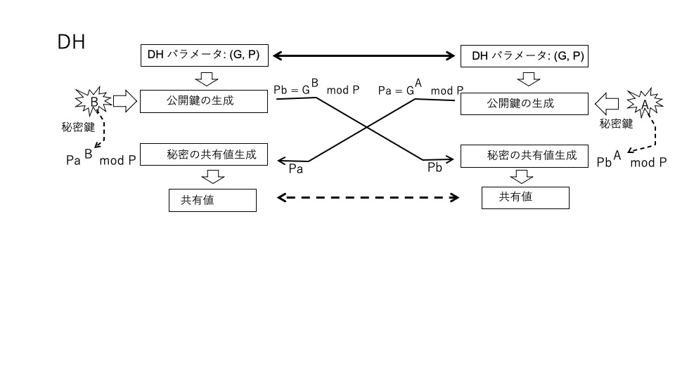
<br> <br>

In order to exchange keys, both parties generate a secret random number value (secret key) for the other party and a third party, respectively. For this value, use the DH parameter above to find the remainder of the exponentiation, and give that value to the other party. Since this is a one-way operation in which it is difficult to know the original value from the encrypted value like the above-mentioned RSA public key encryption, it can be passed to the other party as a public value (DH public key). ..

The recipient uses this value, his private key, and the DH parameter to find the final shared key value. Comparing the contents of both operations, you can see that the operation structure is the same, only the order of operations is different.

Since it can be proved separately that the remainder operation of the power of two steps is commutative, it can be guaranteed that the common value can be obtained by this algorithm regardless of the value of both private keys. TLS uses this value as the premaster secret (the original value for the key, IV, etc. used in subsequent common key cryptography).

The method of sending these parameter values ​​and public keys in the TLS handshake usage scenario is slightly different between TLS 1.2 and TLS 1.3.

Until TLS1.2, ClientHello and ServerHello were limited to agreement on the cipher suite to use, and the DH parameters and DH public key actually used by DH were sent by the second round trip ClientKeyExchange and ServerKeyExchange.

In TLS 1.3, handshakes are organized, DH parameters and public keys are stored in the KeyShare extension of ClientHello and ServerHello, the server uses the contents received by ClientHello, and the client uses the contents received by ServerHello and its own private key. You can now get a premaster secret and derive the session key from it (see 3.5: Key Derivation). This makes it possible to complete the handshake in one round trip with TLS 1.3, and it is also possible to encrypt the contents from the middle of the handshake.

### 3.6.5 Digital signature

Digital signatures (public key signatures) are used to verify the authenticity of a message. In addition, since a digital signature can only be generated by a legitimate signer, it can be used to confirm the signer and, conversely, to prevent denial that the signature was generated.

If you only want to verify the correspondence between the message and the signature, you can use the message authentication code (MAC) with a common key. However, MAC allows a signature verifier who knows the key to generate a legitimate signature, so it cannot be used to confirm the legitimate signer or prevent signature denial.

When signing with a public key, the signature generation key and the verification key are different, so only those with a private key can sign. Therefore, by checking the validity of the signature, it is possible to confirm that the signature is from a legitimate signer. On the contrary, it can also be used for the purpose of preventing denial of signing.

Figure 3-6-3 shows the structure of a digital signature. Digital signatures first find a fixed-length hash value for the target message so that you can sign a message of arbitrary length. Signature generation uses this hash value and some secret value (signature key) known only to the signer to generate the signature. Signature verification, on the other hand, verifies the validity of the signature based on the hash value, the signature and the key for signature verification.
<br>

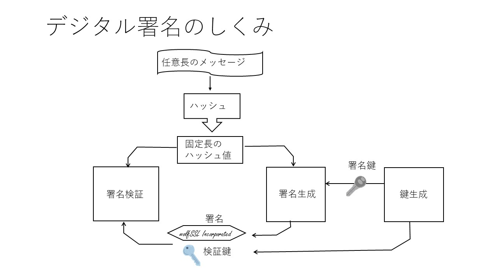

<br>

### 1) RSA signature

In RSA signature, signature generation and verification are realized by utilizing the fact that what is encrypted by RSA operation returns to the original by decryption. The signature is generated from the hash value of the message using the key equivalent to the public key in the RSA encryption algorithm and the algorithm equivalent to encryption.

On the other hand, signature verification uses the hash value of the message, the signature, and the key for signature verification. The verification key corresponds to the private key for decryption during encryption. If the signature verification key yields the original hash value, then the message and signature have been validated.

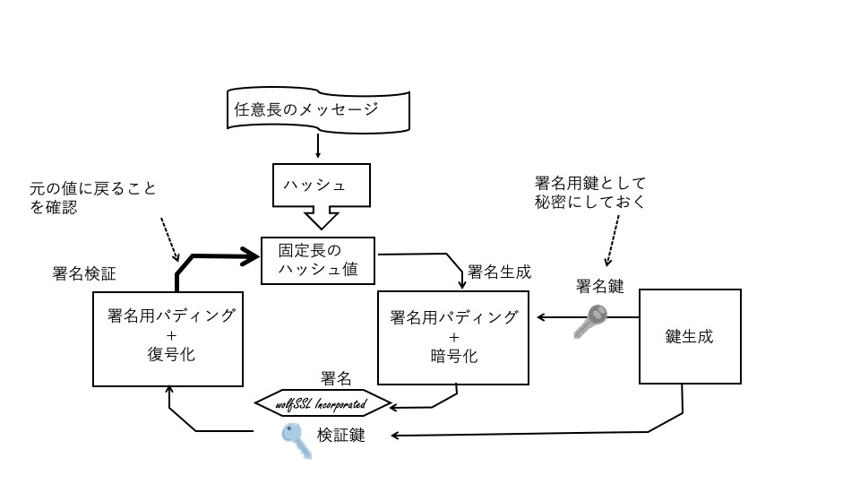

<br>
With RSA signing, the signing key is kept secret only by the signer, and the verification key is disclosed for verification. In principle, it can be realized by using the same algorithm as RSA encryption and decryption by using it in the opposite way to public and private for encryption and decryption. However, in the signature schemes standardized as today's practical RSA signatures, the padding schemes are different from those for decryption and cannot be diverted to each other.
<br>
<br>
<br>

### 2) DSA signature

DSA (Digital Signature Algorithm) signature realizes digital signature by utilizing the fact that the same value can be obtained between two different combinations of one-way operations, instead of using a method like RSA.

In signature generation, the signature key x, the random number k, and the hash value obtained from the message are used to obtain the signature value s and the verification value r. Signature validation uses the validation key y, the signature value s, and the hash value from the message to find the validation value v. At this time, if the hash value of the message is the same at the time of signing and at the time of verification, the values ​​of v and r are calculated to match. If the hash values ​​of both are different, the tampering of the message can be detected by the difference between v and r.

In the realization of DSA, it is difficult to generate a proper key and sufficient caution is required. It is necessary to generate a new different random number k for each signature so that the key cannot be cracked. Also, the amount of calculation for verification tends to be considerably larger than that of RSA. For that reason, RSA signatures are more widely used in the world of integer arithmetic.

However, since operations with properties similar to RSA have not been found in elliptic curve cryptography, ECDSA, EdDSA, etc., which have realized algorithms equivalent to DSA in the world of integer arithmetic in the world of elliptic curve cryptography, are widely used.

See the ECDSA section for an intuitive explanation of the principles of DSA signature verification.

### 3.6.6 Standards for public key cryptography

#### 1) PKCS # 1: RSA cryptography
The standard rules for basic RSA encryption were initially established as PKCS # 1, but now this content has been taken over by the IETF RFC. The latest PKCS # 1 V2.2 (RSA Cryptography Specifications Version 2.2) as of 2021 is defined as RFC 8017 and includes provisions such as cryptography, decryption, signing and verification methods (primitives and schemes). I am.

| Classification | Padding | Abbreviation | Function | Description |
| --- | --- | --- | --- | --- |
| Key type ||| Public key | Basic elements of public key (n, e) |
| ||| Private key format 1 | Simple private key <br> Basic elements (n, d) |
| ||| Private key format 2 | Basic elements of private key (p, q, dP, dQ, qInv) |
Data conversion primitives || I2OSP | Integer octadecimal primitives | Integer to octadecimal conversions |||
| || OS2IP | Integer Integer Primitive | Integer to Integer Conversion |||
Cryptographic Primitives || RSAEP | Cryptographic Primitives | Unencrypted Padding with Public Key |||
| || RSADP | Decryption Primitive | No padding with private key formats 1 and 2 |||
| || RSASP1 | Signature Primitive | Unsigned Padding with Private Key |
| || RSAVP1 | Verification Primitive | No Padding with Public Key |
Cryptography scheme | OAEP | RSAES-OAEP | Cryptographic operation | OAEP padding Public key encryption |
| ||| Decryption operation | Decryption with OAEP padding private key |
|| v1.5 | RSAES-PKCS1-v1_5 | Cryptographic operation | v1.5 Encryption with padding public key |
| ||| Decryption operation | v1.5 Decryption with padding private key |
| Message signature scheme | PSS | RSAES-PSS | Signature operation | PSS padding Private key signature ||
| ||| Verification operation | Verification with PSS padding public key |
|| v1.5 | RSAES-PKCS1-v1_5 | Signature Operation | v1.5 Padding Private Key Signature ||
| ||| Verification operation | v1.5 Verification with padding public key |
| Encoding method | PSS | EMSA-PSS | Encoding operation | PSS padding |
| ||| Verification operation | PSS padding verification |
|| v1.5 | EMSA-PKCS1-v1_5 | Encoding Operation | v1.5 Padding |


<br>
Table 3-6-1 RSA Public Key Scheme in PKCS # 1 (RFC8017)

<br>

This standard also specifies a padding scheme for RSA. As a padding scheme, PKCS # 1 v1.5 initially specified a relatively simple scheme, but as an improved method since then, Optimal asymmetric encryption padding (OAEP) is used for encryption decryption. In addition, the Probabilistic signature scheme (PSS) is standardized as padding when RSA is used for public key signature. PKCS # 1 v1.5 is also left for backward compatibility, but it is currently recommended to use them.

Figure 3-6-6 compares PKCS # 1 v1.5 and OAEP padding schemes.
<br>

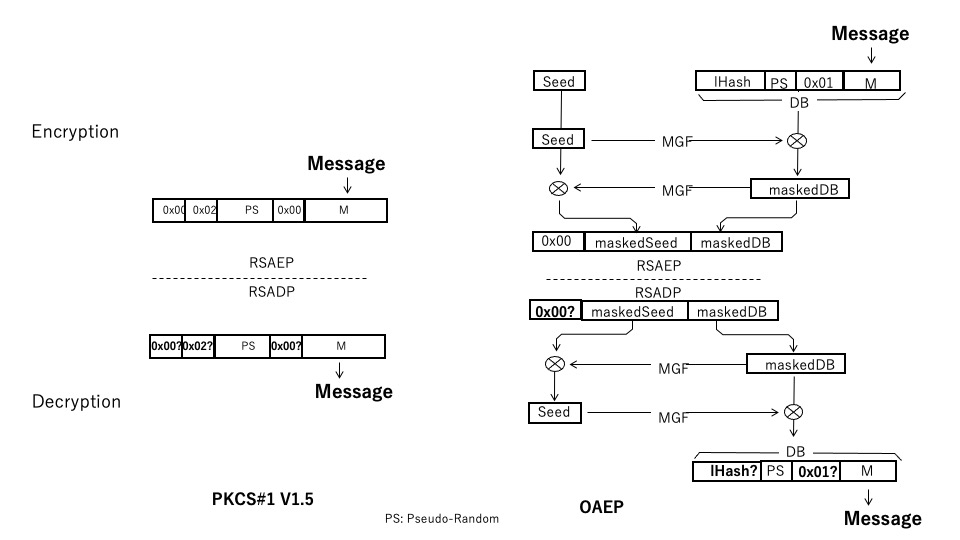
<br>
In the v1.5 scheme, the message to be encrypted is padded with a predetermined fixed bit pattern and pseudo-random numbers by a hash function, and the whole is encrypted with the RSA encryption primitive. With this kind of encryption, it is very difficult to forge the fixed pattern part and the original message without knowing the pseudo-random value of the padding. When decrypting, the authenticity of the original message is judged by confirming that the original fixed pattern is correctly decrypted for the padding part.

OAEP also adds padding to the message to be encrypted. In the figure, lHash is a fixed value determined by the hash algorithm used, and PS is a pseudo-random value. In OAEP, prepare an appropriate Seed value separately. Before encryption, as shown in the figure, this value and two hash functions are used to obtain the hash value, masked by exclusive OR, and the result with 0x00 padding is encrypted with the RSA encryption primitive.

When decrypting, make sure that the last 0x00 added to the RSA decrypted bit string is restored correctly. Next, restore the original seed part from the bit strings of the message part and padding part, and restore the message part using the restored seed value. If the seed value is not restored correctly, it should affect the padding part that is finally restored. This allows for much more robust encryption than just using a fixed value for padding without the decryptor knowing the seed value.

A hash scheme called MGF (Mask Generation Function) is used for the hash function used in OAEP and PSS described below. MGF is a hash scheme that allows you to obtain a hash of the desired size based on a fixed size hash function such as SHA.

<br>


<br>

PSS, on the other hand, is a padding scheme developed for signature verification. In PSS, an appropriately selected salt value is added to the hash value for signature, and then the hash value is calculated. On the other hand, the salt value with padding is masked with the previous hash value and MGF, and the RSA signature primitive is applied with the combination of both and the fixed value 0xbc added as the signature value.

In the verification, first check the fixed value 0xbc part to confirm that the RSA primitive is processed correctly. You can then use the hash value to restore the salt value, so use the hash value and salt value of the message to find the hash value, just as you did when signing. If this value matches the hash value of the signature, the validity of the signature has been verified.

Table 3-6-2 summarizes the padding scheme options used in PKCS # 1 (RFC8017).


Padding type | Hash | OID | Remarks |
| --- | --- | --- | --- |
EMSA-PKCS1-v1_5 | MD2 | id-md2 | limited for compatibility |
|| MD5 | id-md5 | limited for compatibility |
|| SHA-1 | id-sha1 | limited for compatibility |
|| SHA-256 | id-sha224 ||
|| SHA-256 | id-sha256 ||
|| SHA-384 | id-sha384 ||
|| SHA-512 | id-sha512 ||
|| SHA-512 / 224 | id-sha512-224 ||
|| SHA-512 / 256 | id-sha512-256 ||
| OAEP, PSS | SHA-1 | id-sha1 ||
|| SHA-256 | id-sha224 ||
|| SHA-256 | id-sha256 ||
|| SHA-384 | id-sha384 ||
|| SHA-512 | id-sha512 ||
|| SHA-512 / 224 | id-sha512-224 ||
|| SHA-512 / 256 | id-sha512-256 ||


Table 3-6-2 List of padding hash options
#### Standards for DH
#### DSA standard
## 3.7 Elliptic curve cryptography

In "3.4 Public Key Cryptography", we explained public key cryptography in the world of integer arithmetic, but it is known that public key cryptography can also be realized by using the one-way unidirectionality of discrete logarithmic operations on elliptic curves. Elliptic curve cryptography is becoming more important as the attacker's computing power increases and stronger cryptography is required, because even with a key length that is significantly shorter than the public key obtained by integer arithmetic, cryptography of the same or higher level can be obtained. I am.

<br>
[Table 3-7-0: Key length and encryption strength](./table3-7-0.md)
<br>

Initially, elliptic curve cryptography tended to be a little more complicated to realize than integer arithmetic, and there was a problem with processing speed, but it is possible to obtain the same cryptographic strength with a significantly shorter key than RSA. Research on efficient curves and implementation methods has also progressed, and today it is widely used practically in the TLS protocol.

### 3.7.1 Principle

Elliptic curve cryptography first defines operations on elliptic curves. An elliptic curve is not an ellipse that you usually think of intuitively, but a set of xy coordinate points that satisfies the following mathematically generalized cubic polynomial.

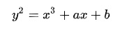
<br>

The set of points is a curve as shown in Figure 3-7-1. First, the addition of points a and b on this curve is defined as the point of symmetry with respect to the x-axis of point c where the straight line passing through a and b intersects the ellipse (point of -y).

Next, when defined in this way, a point twice a is equivalent to the case where a and b have the same value in addition, that is, the same coordinate point on the graph. If the curve is smooth in an intuitive sense, the differential value (slope) and tangent line of any coordinate on the curve are determined to be one, so the x-axis symmetry point of the point that intersects the curve on the extension of that line is determined. If so, the point a is doubled. Therefore, it can be seen that by combining this n times, the coordinates of a times n, that is, the scalar times of any coordinate point can be obtained.

Furthermore, if ax2 is obtained in that way, the operation of the power of 2 of a can be obtained as shown in the figure without repeating it n times. It can also be seen that if these are combined appropriately, the scalar multiple operation can be realized more efficiently by combining some power operations and addition.

<br>

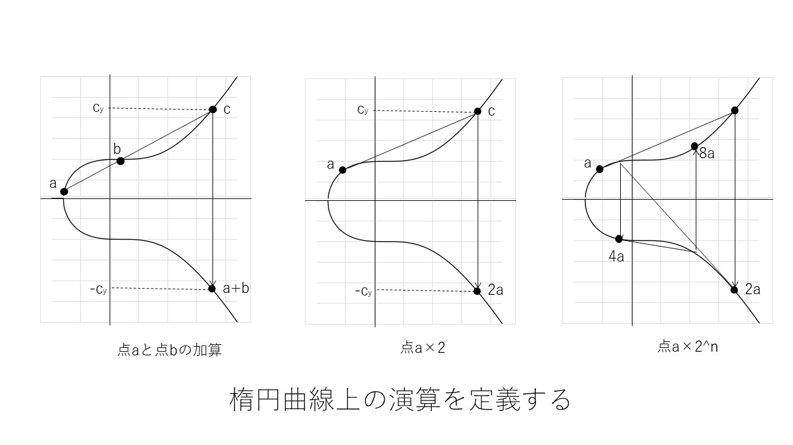

<br>

On the other hand, in the calculation of the scalar multiple n of the base point (G) and the base point on such an elliptic curve, it is extremely difficult to find the original point from the resulting coordinates x when n is a large number. It is also known to be a one-way operation.

#### x = nG

In other words, it is possible to realize public key cryptography in which the coefficient n is the private key and the resulting coordinate point x is the public key by using the unidirectionality of the scalar multiplication operation. Such an encryption algorithm is used as elliptic curve cryptography. I call it.

### 3.7.2 ECDH (Elliptic Curve Diffie Hermann)

By applying the scalar multiple operation of the elliptic curve to the structure equivalent to DH explained in "3.6.3 Diffie-Hellman key exchange", the Diffie-Hellman key exchange by the elliptic curve can be realized (Fig. 3.7.2). Using the coordinates G (base point) on the elliptic curve, which is the origin of the calculation, as a shared parameter, secret random numbers a and b are generated for each, as in the case of DH. The a times of G and the b times of G are calculated respectively, but since it is extremely difficult to estimate a and b from these values, they can be passed to the other party as a public key. On the other side, you can get the shared value by multiplying the received value by your own private key a or b.

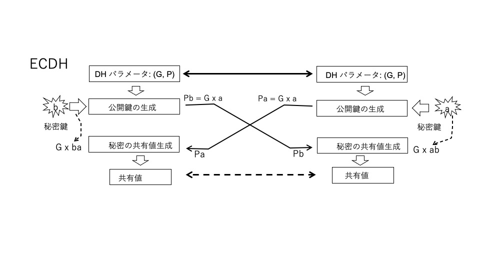

Looking at the contents of this operation, the operations performed on each side differ only in the order of operations. Apart from the rigorous proof, you can intuitively guess that the results will be in agreement. In other words, the Diffie-Hellmann key exchange is established even in the world of elliptic curve cryptography.

#### abG == baG
<br>

### 3.7.3 ECDSA (Elliptic Curve Digital Signature)

ECDSA is a digital signature that uses elliptic curve arithmetic. Since the operation of the elliptic curve has not been found to have the property of a one-way function with a trapdoor, it is not possible to use a method like RSA as a method of realizing a digital signature. However, digital signatures can be achieved by taking advantage of the one-way elliptic curve operation.

To understand this, let's move away from signing once and consider the flow of two functions as shown in the figure. Function E is a one-input function, but functions C and D should also receive another input "input 2". Such a combination of functions creates a function in which the same input 1 is added to the functions C and E, and the same input 2 is added to the functions C and D, so that the functions D and E have the same result.


<br>

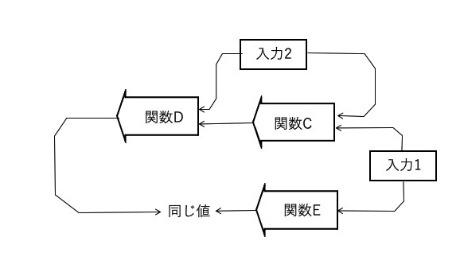

<br>


For the sake of simplicity, let's remove the condition of "one-way function". If input 1 is x and input 2 is y, the following function can be considered, for example.


```math
Func C: x + y、 Func D:(x - y)^{2}
```

```math
Func E: x^2
```

In other words, you can see that you should put an operation that cancels input 2 in the functions C and D. The y added by the function c is subtracted by the function D, so the value naturally returns.

In the previous figure, the same input 2 was given to both C and D, but if different values ​​are given to input 2 of C and D as shown in the following figure, they will not cancel each other out well. .. Of course, the results of function D and function E should be different.

<br>

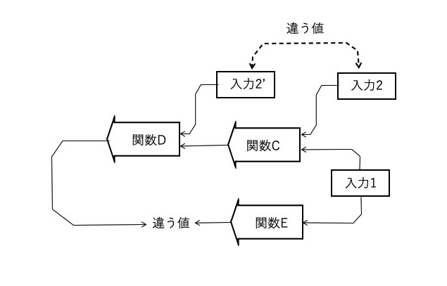

<br>

Let's apply this to the flow of signature verification. Input 1 in the previous figure is the key for signing. Input 2 is the hash value of the message to be signed. In DSA, the signature is a combination of two values, the signature value s and the verification value r. The result of function C is the signature value s, and the result of function E is the validation value r. When applied in this way, it looks like the figure below, and you can see that the right half of the figure is the signature and the left half is the verification flow.

If H (m) is the same value on the signing side and the verification side, the verification values ​​v and r will be the same value.

<br>

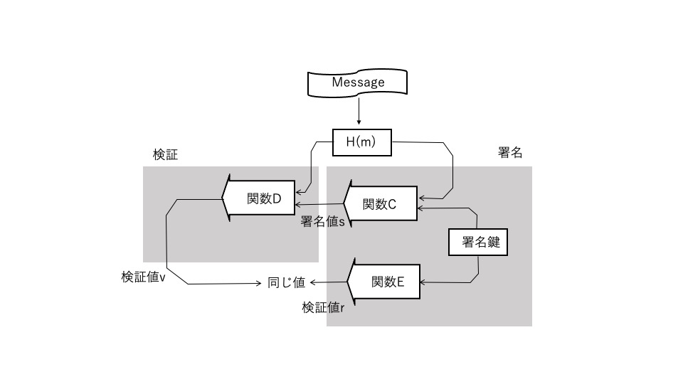

<br>


If, for example, the message has been tampered with and the H (m) on the verification side is different from that on the signing side, the verification values ​​will not match. You have now verified the validity of your signature.

<br>

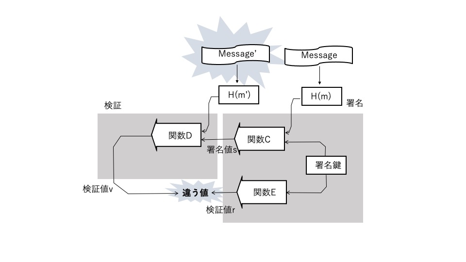

<br>


Applying the actual ECDSA calculation formula to this figure is as shown in the figure below. Although common parameters have been added to realize one-way operation and the signature value r has also been added to the verification operation, details have been added, but the basic structure is the same as the previous figure.


<br>

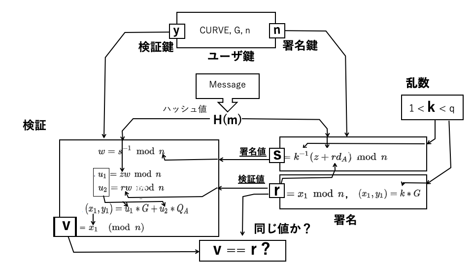

<br>


ECDSA uses the elliptic curve definition CURVE, the coordinate point G on the curve on which the calculation is based, and the maximum value n of the scalar coefficient as common parameters.

Select a random number k that meets the conditions in the range of 1 to n-1.

In signature generation, the signature values ​​r and s are obtained from the hash value H (m) of the message to be signed m, the signature key, and the random number k. r is the value for signature verification.
In signature verification, the verification value v is obtained from the hash value H (m), the verification key, the signature value r, and s. If the message has been tampered with, the H (m) value will be different and the validation values ​​will not match. Therefore, if this value matches r, we have verified that the message and signature are correct.

### 3.7.4 Curve types and standardization

The elliptic curve used for encryption must be standardized in advance and the user must use the same curve. Of course, the curve used does not have elements that cause vulnerabilities such as singular points, but it is also known that the calculation efficiency varies greatly depending on the type of curve. Not all elliptic curves represented by cubic expressions are suitable for cryptographic algorithms. Of the general elliptic curves, the curve represented by the remainder of prime numbers called the prime field and the binary field with 2 votes have been deeply studied as curves for elliptic curve cryptography.

The National Institute of Standards and Technology (NIST), a US research institute, worked on standardizing the curves used for such elliptic curve cryptography at an early stage, and published a series of curves as recommended curves (SP 800-186: so-called NIST curves). ). The curves that NIST recommends to use as standard are also selected from the prime body and the body with 2 votes.

On the other hand, as an international activity, SECG (Standards for Efficient Cryptography Group) has announced recommended curves, and there are many that correspond to both curves. Based on these curves, the IETF defines the curves used for TLS and how they are used in RFC 4492.

#### ECC Brainpool (RFC 5639): Needs to be added

[Table 3-7-4: Elliptic curve standard in TLS (RFC 4492)](./table3-7-4.md)


### 3.7.5 New elliptic curve


RFC 7748

## 3.8 Public Key Certificate

### 3.8.1 Principle
A public key certificate is a certificate that associates a public key with attribute information such as its owner identification, certificate issuer, and signing algorithm. Since the public key is just binary data and anyone can make a complete copy, another method is required to prove that the public key belongs to the owner. That is the public key certificate. The public key certificate contains the key owner identification information and other attribute information, the public key itself, and the public key signature signed for all of them, as shown in Figure 3-8-1.

<br> <br>
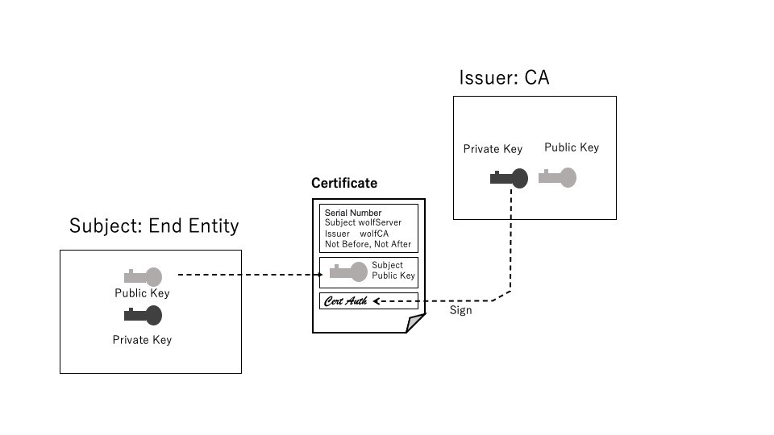
<br> <br>

The public key contained in the certificate is the public key of the owner (End Entity), and the corresponding private key is properly managed by the owner so that it cannot be referenced by others. Also, the signature is signed by a trusted torrent (usually a CA: Certificate Autholity) using your private key.

The certificate created in this way is that the certificate was signed by that CA by verifying the validity of the certificate's signature using the CA's public key, that is, the authenticity of the certificate. (The public key, owner identification information, etc. contained in the certificate have not been tampered with) can be confirmed.

In addition, the certificate owner is required to sign the appropriate challenge with the owner's private key, and the validity is confirmed by the public key included in the certificate. , You can be sure that you are the genuine owner.

In order to operate a public key certificate practically, it is important to ensure the reliability of the signature that all users of the certificate can trust. The trust model, certificate issuance, legitimacy, revocation, etc. for that purpose are explained in 3.9 Public Key Infrastructure.


### 3.8.2 Standard
#### 1) X.509

ITU-defined X.509 is the most widely used and widely used standard for public key certificates. The first version of X.509 was released in 1988 and has since been revised to v2 and v3. The IETF refers to V3 and specifies it as RFC 5280. TLS requires the use of X.509 v2 or v3.

X.509 certificates contain three fields: the TBS certificate field, the signature algorithm, and the signature value. The TBS certificate field is a field of basic attribute information, such as version, serial number, signing algorithm ID, issuer information, certificate validity period, principal (public key owner) information, and principal to certify. The public key information of is included in the public key algorithm and the value of the public key. The signature algorithm and signature value are the signature algorithm and signature value that the CA signed this certificate.

<br> <br>
| Certificate | Field | Description |
| --- | --- | --- |
| TBS Certificate | Version | Certificate Version <br> v3 with extensions |
| | Serial Number | Positive integer value assigned by the CA for each certificate |
| | Signature | Algorithm used by CA for signature <br> Same value as the signature algorithm below |
| | Issuer | Certificate Issuer Information <br> Non-empty DN (Distinguished Name) * |
| | Validity | Start and end dates by UTCTime, GeneralizedTime |
| | Subject | Certificate Proof Subject (CA) Information <br> Non-empty DN (Distinguished Name) * |
| | Subject Public Key Info | Public Key Values ​​and Algorithms Used <br> (RSA, DSA, DH, etc.) |
| | Issuer ID (Issuer Unique ID) | Options |
| | Subject Unique ID | Options |
| | Extensions | X.509 v3 Extension Fields |
| Signature algorithm || Algorithm used by CA for signature <br> Algorithm ID based on OID and incidental information |
| Signature value || Signature value by ASN.1 DER |

Table 3.8.2: X.509 Certificate Fields

<br> <br>

Note *: The following are standard attributes of DN (Distinguished Name).

--Country
--Organization
--Organizational unit
--DN qualifier (distinguished name qualifier)
--State or province name
--common name (eg "Susan Housley")
- Serial number


### Extended field
X.509 v3 adds significant information that can be included in certificates as extended fields.

Extension fields are divided into "standard extension fields" and "community extension fields". Standard extended fields are for v3 certificates
Must be included. The table below summarizes the standard extensions for Internet PKI.

| Extended name | Description |
| --- | --- |
| Institutional key identifier ||
| Subject key identifier ||
| Key usage ||
| Private key expiration date ||
| Certificate Policy ||
| Policy mapping ||
| Subject alternative name ||
| Issuer alternative name ||
| Subject directory attributes ||
| Basic constraints ||
| Name restrictions ||
| Policy constraints ||
| Extended Key Usage Field ||
| CRL distribution points ||


--Key usage type bit

`` ```
KeyUsage :: = BIT STRING {
digitalSignature (0),
nonRepudiation (1),
keyEncipherment (2),
dataEncipherment (3),
keyAgreement (4),
keyCertSign (5),
cRLSign (6),
encipherOnly (7),
decipherOnly (8)}
`` ```


#### 2) ASN.1 (Abstract Syntax Notation One)

ASN.1 is a standard for expressing data used in networks and computers, including X.509, as a set of general-purpose variable-length records, and strictly defining the data format. Originally formulated as part of CCITT's X.409 Recommendation, it has since been revised and taken over by the X.208 and X.680 series, but the ASN.1 designation is still widely used today.

ASN.1 describes the target data by enumerating the object types and their values. The basic types are integer (INTEGER), floating point number (REAL), variable length bit string (BIT STRING), variable length byte string (OCTET STRING), boolean value (BOOLEAN), date time by UTCTime and GeneralizedTime. Something like is also included. There is also a syntax for grouping multiple objects, such as SEQUENCE.

For example, ASN.1 describes that the above-mentioned X.509 certificate is made up of three objects: TBS certificate field, signature algorithm, and signature value. This shows that the TBS certificate field has a further structure defined under the name TBS Certificate, the signature algorithm also has a structure defined by the Algorithm Identifier, and the signature value is represented by a bit string.

`` ```
Certificate :: = SEQUENCE {
    tbsCertificate TBS Certificate,
    signatureAlgorithm AlgorithmIdentifier,
    signatureValue BIT STRING}
`` ```

The structure of TBS Certificate and Algorithm Identifier is defined as follows.

`` ```
TBSCertificate :: = SEQUENCE {
    version [0] EXPLICIT Version DEFAULT v1,
    serialNumber CertificateSerialNumber,
    signature Algorithm Identifier,
    issuer Name,
    ...

AlgorithmIdentifier :: = SEQUENCE {
    algorithm OBJECT IDENTIFIER,
    parameters ANY DEFINED BY algorithm OPTIONAL}
`` ```

In addition to defining such data structures, ANS.1 can also describe the values ​​of individual elements. This allows you to describe not only the structure of an X.509 certificate, but also the specific data of a particular certificate. However, ASN.1 only specifies the logical representation of the data, so we need an encoding rule to map it to the physical data structure.
#### 3) Encoding rules

--BER: Basic Encoding Rules

BER is the first ASN.1 encoding rule developed. Each object is a variable length record consisting of a tag, length, and value (TLV) that represent the type of object. However, since BER allowed multiple different encoding options, there was a problem that when signing a specific certificate, the signature value would differ depending on how the encoding option was selected.

--DER: Distinguished Encoding Rules

To solve this problem, DER has organized the encoding rules so that one ASN.1 description always corresponds to one encoding result. This ensures that certificates defined in ASN.1 always retain the same signature, even in cases such as signing a certificate. DER is widely used as an encoding method for X.509 certificates.

--PEM (Privacy Enhanced Mail)

PEM was not included in the X.509-related provisions as an ASN.1 serialization rule. This provision was originally enacted by the IETF as an encoding rule to improve the confidentiality of email messages, as the name implies. However, the standard for that purpose was taken over by PGP and S / MIME, and "Privacy Enhanced Mail" itself was rarely used. Currently, the content of the regulation is inherited by RFC7468 as a text encoding rule, and it is widely used as a syntax rule for expressing ASN.1 DER serialized data such as X.509 certificates and CSR in ASCII text.


# 3.9 Public Key Infrastructure (PKI)

## 3.9.1 PKCS

PKCS (Public-Key Cryptography Standards) is a set of standards developed by RSA Security from the early stages of public-key cryptography. Today, many have been taken over by the IETF RFCs and referenced as the basis for Internet protocol standards (Table 3-1 PKCS and RFCs).

| PKCS # | RFC | Contents |
|:-: |:-: |:-|
| # 1 | 8017 | RSA Cryptography Scheme |
| # 2 |-| Integrated into PKCS # 1 and abolished |
| # 3 |-| Diffie-Hellman Key Sharing |
| # 4 |-| Integrated into PKCS # 1 and abolished |
| # 5 | 8018 | Password-based key derivation (PBKDF2) |
| # 6 |-| X.509 Extended syntax for certificate v1. Discarded by X.509v3 |
| # 7 | 5652 | Cryptographic Message Syntax (CMS) |
| # 8 | 5958 | Syntax of private key information |
| # 9 | 2985 | Selected object class, attribute type |
| # 10 | 2986,5967 | Certificate signing request (CSR) |
| # 11 || Cryptographic token interface. API for HMS (Hardware Security Module) |
| # 12 | 7292 | File protection with password-based encryption. Syntax for exchanging personal information |
| # 13 |-| Elliptic curve cryptography |
| # 14 |-| Pseudo-random numbers |
| # 15 |-| Cryptographic token format |

Table 3-1 PKCS and RFC

## 3.9.2 Public key trust model
### 1) Trust model

https://www.ipa.go.jp/security/pki/051.html

A model of trust between certificate authorities. Various organizations operate certificate authorities based on various trust models, and the following are typical trust models.

Independent model This is a model in which one certificate authority issues certificates to all users [6], and is used when the number of users is small, such as a certificate authority in a company.

The hierarchical model is a model in which multiple certificate authorities form a tree-type hierarchical structure [6], and the Web model is a model in which a list of certificate authorities is embedded in a client application such as a Web browser in advance [6].

The mesh model is a model in which certificate authorities that do not have a hierarchical structure mutually authenticate each other [6], and when connecting across "CA domains" that have different operational policies (= contents of CP and CPS). Used for [8]. In the mesh model, certificate authorities in different CA domains connect with each other by mutual authentication [8]. The certificate used for mutual authentication is called a mutual authentication certificate.

The bridge CA model is a model in which certificate authorities connect to each other through a certificate authority called a bridge CA [6]. Like the mesh model, it is used when connecting different CA domains, but unlike the mesh model in which each certificate authority mutually authenticates, each certificate authority mutually authenticates with only one bridge CA. As a result, a trust relationship is formed through the bridge CA called Certificate Authority 1 ↔ Bridge CA ↔ Certificate Authority 2. When the number of certificate authorities is large, the number of mutual authentications is enormous in the mesh model in which the certificate authorities directly mutually authenticate each other, but in the bridge CA model, mutual authentication of a star-shaped topology is formed via the bridge CA. Since it is only, it has the advantage that the number of authentication paths can be reduced [9].


## 3.9.3 Certificate life cycle

### 1) Issuance of certificate
CSR (Certificate Signing Request) is a format for requesting the issuance of a public key certificate by a CA. The standard was initially standardized by PKCS # 10 and has been carried over to RFC2986.

A subject who needs a public key certificate, such as a server that wants to receive server authentication, can request the certificate authority to issue a public key certificate by CSR. The CSR contains the principal's public key and identity information, as well as a signature with the principal's private key to prevent forgery of the CSR. The received CA adds the serial number that can identify the certificate, the identity information of the CA as the signer, etc. to this information, and signs with the CA's private key.

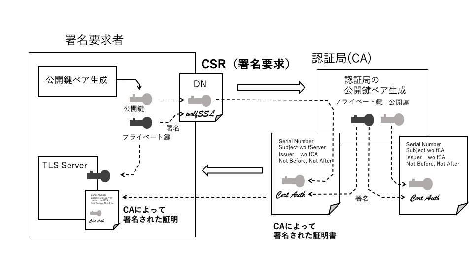


### 2) Certificate validity and revocation
The public key certificate can be revoked even before the expiration date in the event of an unforeseen situation such as the leakage of the private key. For this reason, the recipient must verify the validity of the certificate received. Obtaining certificate revocation information was initially achieved outside the scope of TLS handshakes, such as CRL and OCSP. OCSP Stapling has incorporated them into TLS extensions as part of their handshake, and TLS 1.3 has organized them to this day.

I will summarize the process here, but it is currently recommended to use OCSP Stapling v2 or later. Also, the basic peer authentication protocol for TLS is almost symmetrical for clients and servers, but OCSP for client authentication was supported for the first time in TLS 1.3.

#### 2-1) CRL
As an initial certificate revocation management mechanism, the format of the certificate revocation list (CRL) was standardized for the list of revoked certificates. Clients can check the validity of the received certificate by obtaining the CRL on a regular basis. However, the client itself has to check the certificate information in the CRL, which becomes a burden on the client as the network size increases and the list size increases.

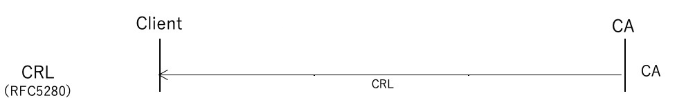 10-

#### 2-2) OCSP
To reduce the burden on clients, OCSP (RFC6960: Online Certificate Status Protocol) was developed as a protocol that queries the OCSP responder for the validity of only the received certificate. In the case of OCSP, the client sends the serial number of the certificate for which you want to confirm the validity to the OCSP responder, and the responder returns the confirmation result for the inquired certificate, so the processing load of the client is reduced to some extent.

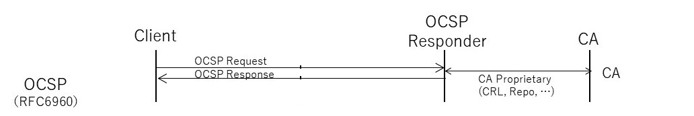

However, in this network configuration, the problem that traffic is excessively concentrated on the responder side has become a big issue. In addition, since it is not specified how the responder obtains the revocation information, the real-time property of the revocation information itself referred to by the responder is not guaranteed.

#### 2-3) OCSP Stapling
Thus, early OCSP provided a protocol independent of TLS for obtaining certificate status information. However, in the subsequent OCSP Stapling, the client standardized the certificate validation request protocol to the server rather than the OCSP responder as part of the TLS handshake. As a result, OCSP for the client has become a part of TLS, and the validity of the certificate can be judged only by the confirmation result from the server.

Specifically, the request from the client uses the Certificate Status Request, which was added as one of the TLS extensions in RFC6066. Along with this, Certificate Status has been added to the handshake record as a response from the server. The server returns the certificate status by putting an OCSP Response on the Certificate Status record.

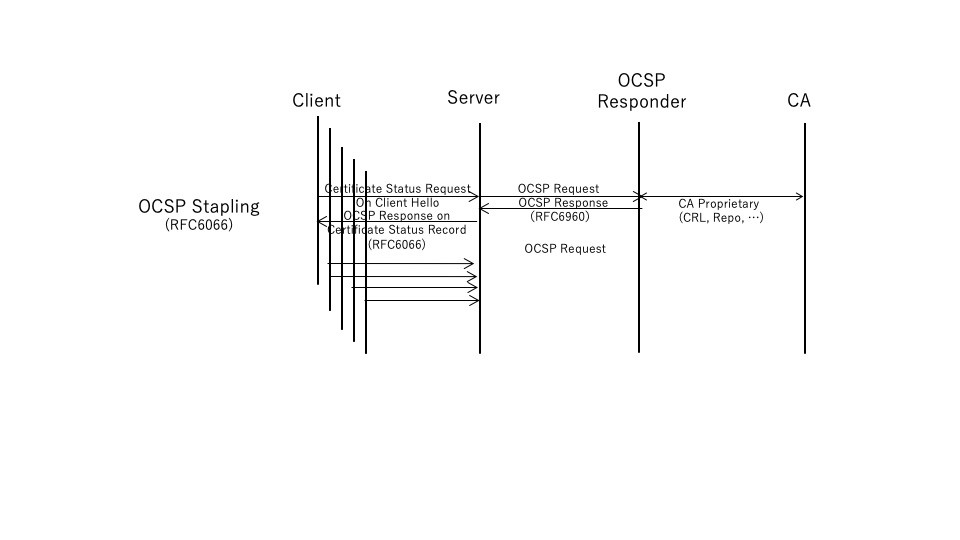

#### 2-4) OCSP Stapling Version 2
CAs typically have a hierarchical structure in which multiple corresponding certificates are chained together. It is necessary to check the validity of the certificate including the intermediate CA, but TLS1.2 has a limitation that only one certificate status request extension can be provided for one Client Hello, and the status of the intermediate CA certificate. Could not be requested including.

To solve this, RFC6961 (Multiple Certificate Status Request Extension) has been amended and extended as OCSP Stapling version 2. In version 2, the server also responds directly to the CA with a validation time stamp (RFC6962: Signed Certificate Timestamp). This allows the client to verify the validity of the certificate, including the freshness of the response. Since the server side can also bundle the validity confirmation requests to the CA as much as the freshness allows, it has become possible to significantly reduce the load on the CA that responds to inquiries.

 OCSP Stapling
Thus, early OCSP provided a protocol independent of TLS for obtaining certificate status information. However, in the subsequent OCSP Stapling, the client standardized the certificate validation request protocol to the server rather than the OCSP responder as part of the TLS handshake. As a result, OCSP for the client has become a part of TLS, and the validity of the certificate can be judged only by the confirmation result from the server.

Specifically, the request from the client uses the Certificate Status Request, which was added as one of the TLS extensions in RFC6066. Along with this, Certificate Status has been added to the handshake record as a response from the server. The server returns the certificate status by putting an OCSP Response on the Certificate Status record.


#### 2-4) OCSP Stapling Version 2
CAs typically have a hierarchical structure in which multiple corresponding certificates are chained together. It is necessary to check the validity of the certificate including the intermediate CA, but TLS1.2 has a limitation that only one certificate status request extension can be provided for one Client Hello, and the status of the intermediate CA certificate. Could not be requested including.

To solve this, RFC6961 (Multiple Certificate Status Request Extension) has been amended and extended as OCSP Stapling version 2. In version 2, the server also responds directly to the CA with a validation time stamp (RFC6962: Signed Certificate Timestamp). This allows the client to verify the validity of the certificate, including the freshness of the response. Since the server side can also bundle the validity confirmation requests to the CA as much as the freshness allows, it has become possible to significantly reduce the load on the CA that responds to inquiries.

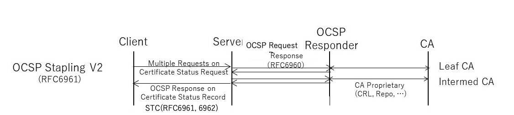

#### 2-5) TLS 1.3 OCSP Stapling
TLS1.3 eliminates this obstacle by allowing the certificate status of multiple OCSP responders to exist. For this reason, in TLS 1.3, the multiple certificate status extension specified by RFC6961 is abolished in the status confirmation request from the client, and the original certificate status request of RFC6066 is adopted. As for the response from the server, an RFC6066 compliant OCSP Response is provided along with the corresponding certificate in the Certificate Entry extension.

With TLS 1.3, the TLS extensions for requests and responses have been cleaned up so that the server can now issue similar certificate status requests to clients as well. In this case, the server issues a CertificateRequest with status_reques (RFC8446 Section 4.4.2.1).

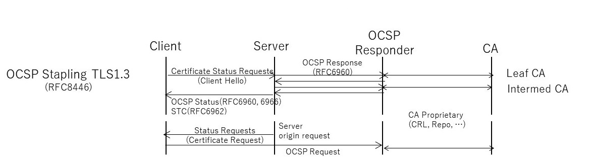

