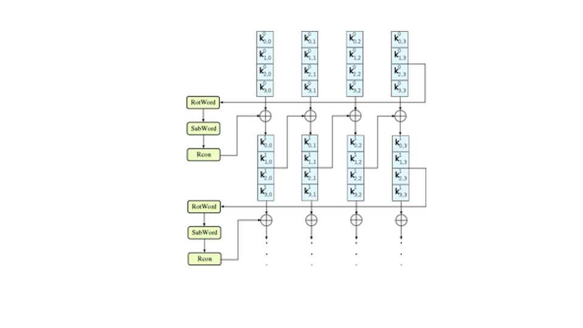
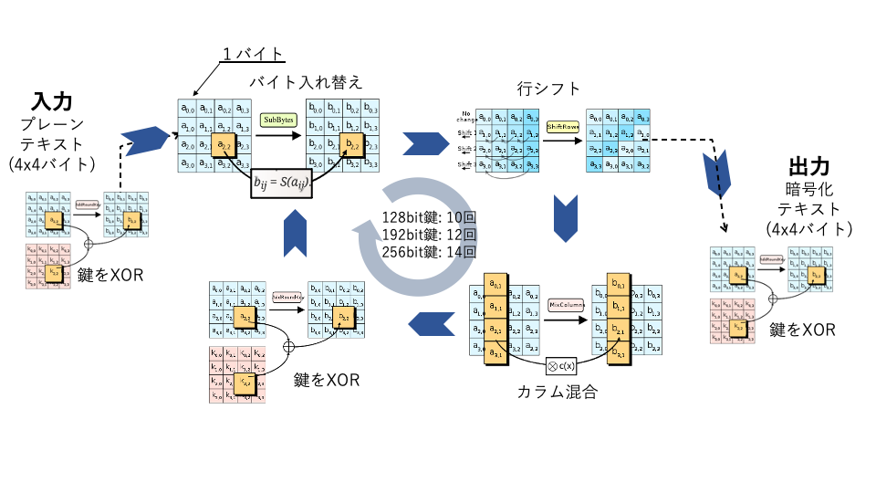
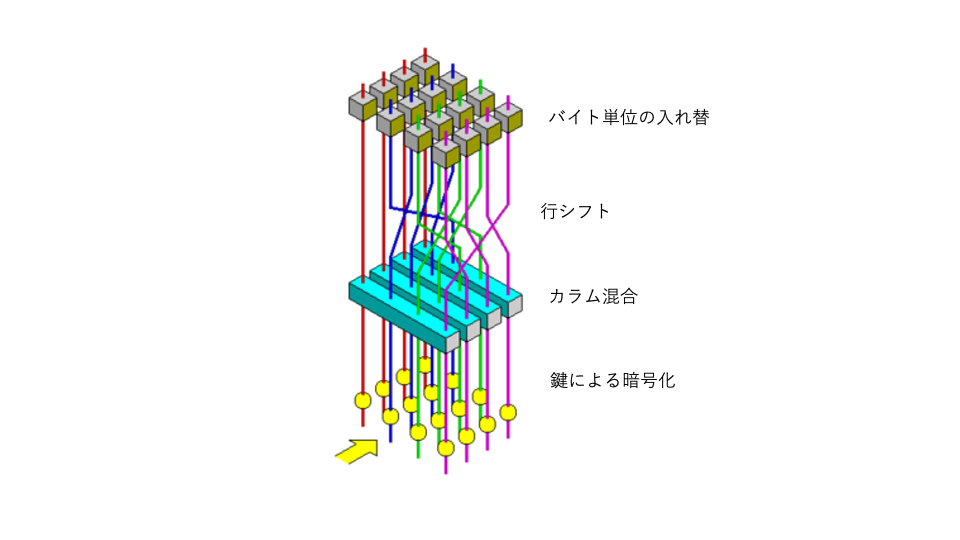
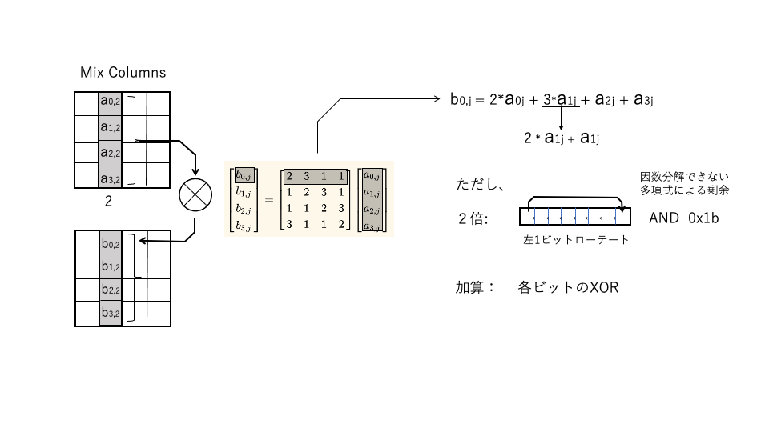
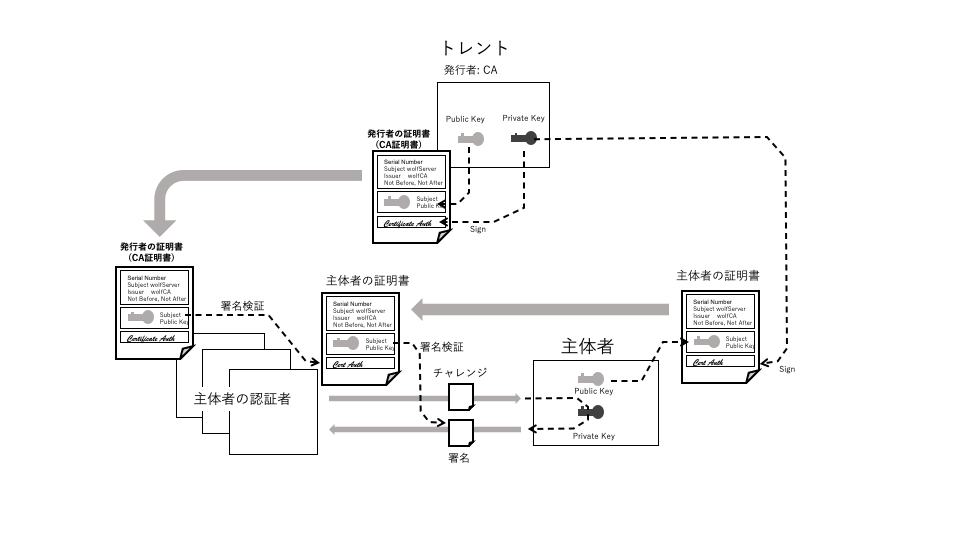
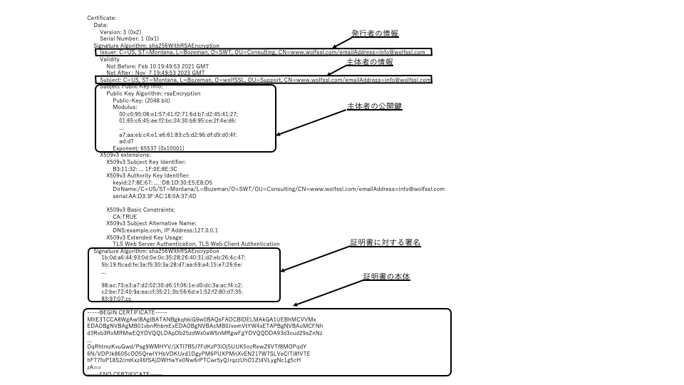
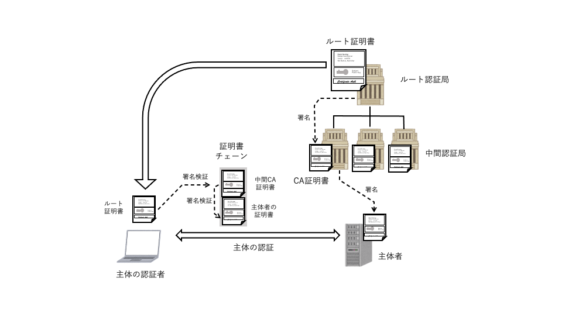
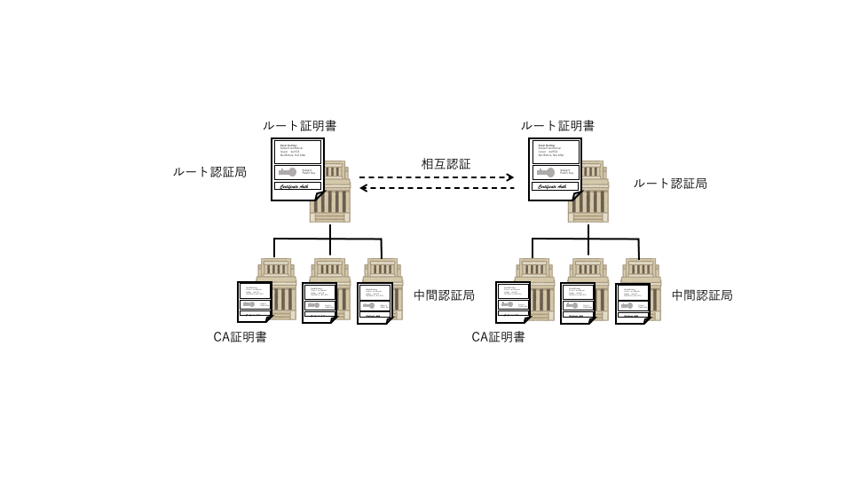
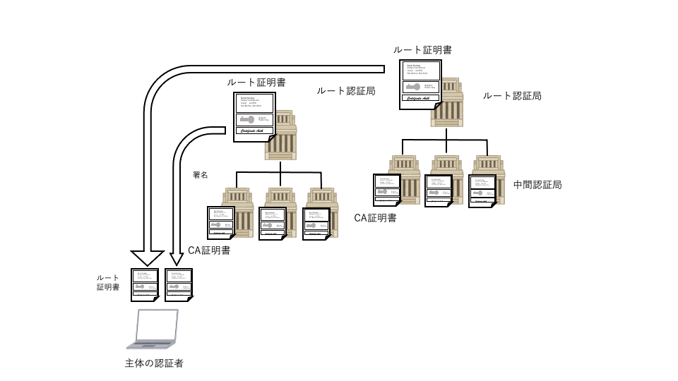

# 3. 暗号技術

## 3.1 概要
　デジタル暗号技術は近年急激に多岐にわたり発展した基盤技術で幅広い分野の技術を含みます。この章ではその中で特にTLSで使用される暗号技術、アルゴリズムについてまとめます。図1.1はそれらの暗号技術要素とその関連を示したものです。矢印は技術要素の依存関係を示します。

この図に示すように、これらの技術の多くが乱数の予測困難性に依存して組み立てられています。また、これらの暗号技術はハッシュ、共通鍵暗号、および公開鍵暗号の3つの要素技術と、それらを組み合わせた目的別の複合的な暗号技術とからできています。

<br><br>

<br><br>

### 1) 乱数
　乱数はすべての近代暗号アルゴリズムの基本となるもので、その暗号強度は利用する乱数の質に依存しています。質の低い乱数を使用すると、例えば暗号化のための鍵の長さのようなものが十分に生かされず秘匿性が確保されないことになるので十分な注意が必要です。

真性乱数は周期性や統計的な偏りがない純粋な乱数です。質の高い真性乱数を得ることは容易ではなく、特にソフトウェアのように決定論的に動作するアルゴリズムだけでは真性乱数を得ることはできません。疑似乱数は、元となる乱数シード値を外部から与え周期が十分に長く統計的な偏りの少ない乱数列を決定論的に生成する技術です。疑似乱数は、質の高い真性乱数をじかに生成するのが難しい場合に、真性乱数をシードとして疑似乱数を組み合わせて質の高い乱数を得るというような目的で使われます。疑似乱数はまた、シード値が同じ場合同一の乱数列を生成するので、例えばシミュレーションのように再現性が必要な応用でも利用されます。また、1つのマスター鍵から複数の目的別の鍵を生成する鍵導出や後述のストリーム暗号処理のための鍵の拡張なども疑似乱数の一種といえます。

代表的な疑似乱数アルゴリズムとしては、Hash_DRBG, HMAC_DRBG, CTR_DRBGなどがあります。乱数の質に関する規定としては、例えば米国NISTによる SP 800-90A/B　があります。

### 2) ハッシュ
　ハッシュはメッセージダイジェストとも呼ばれ、不定長の長いメッセージを固定長の短いデータに圧縮するための一方向性のアルゴリズムです。データを圧縮するため異なるオリジナルメッセージから同一のハッシュ値が生成される（ハッシュ衝突の）可能性や、ハッシュ値から元のメッセージを推測される（原像計算）リスクがあり、使用するアルゴリズムにはそうしたリスクが最小となることが求められます。

代表的なハッシュアルゴリズムとして、初期にはMD5, SHA1が広く使用されましたが危殆化のため現在ではSHA2(SHA256/384/512など)、SHA3などが標準化され使用されています。TLS1.3ではSHA2のSHA256/384が暗号スイートで使われるハッシュアルゴリズムとして採用されています。

### 3) 共通鍵暗号
　暗号化と復号に同じ鍵を使用する暗号アルゴリズムを共通鍵暗号（対称鍵暗号）と呼びます。共通鍵暗号は大容量のデータを効率的に暗号化、復号できる特徴があるので、TLSではアプリケーションデータ転送時の暗号アルゴリズムとして使用します。

しかし、ネットワーク通信のように潜在的に多数の相手方と通信する可能性がある場合には、使用する鍵を相手方にどのように安全に渡すかという問題（鍵の配送問題）を抱えています。TLSでは、後述の公開鍵暗号の技術を使って通信の相手方と安全に同一の鍵を共有したうえで（鍵交換、鍵合意）、共通鍵暗号によって暗号通信を行います。

共通鍵暗号はブロック単位に処理をするブロック型とそのような区切れを必要としないストリーム型に分けることができます。AESは現在ブロック型として一番広く使われているアルゴリズムです。また、ブロック型の場合ブロック間の情報の接続方法によって各種の利用モードがあります。AES-CBCはTLS1.2までは最も広く利用されていましたが、TLS1.3ではAES-GCM, AES-CCMのように暗号化と同時にメッセージが改竄されたものでないこと(真正性)を検証できるものだけが標準として採用されています。

ストリーム型のアルゴリズムとして初期にはRC4が広く使われましたが危殆化により現在は廃止されています。TLS1.3ではChaCha 20がPoly1305によるメッセージ認証コードのアルゴリズムと組み合わされ標準として採用されています。

### 4) メッセージ認証コード(MAC)
　ネットワーク通信においては受け取ったメッセージが改竄されたものでないこと(完全性)の確認が課題となります。そのためのアルゴリズム、メッセージ認証コード(MAC)にはハッシュを利用したHMAC　(Hash based MAC)、共通鍵暗号を利用したAES-MACなどがあります。MACによる検証には共通鍵が使われ鍵の正当な所有者だけがメッセージの完全性を検証するができます。

しかし、TLSにおいてはメッセージ認証はより細かな単位で行う必要性が高まりメッセージ認証は共通鍵暗号の一環として取り込まれるようになってきています(AEAD)。一方、鍵導出アルゴリズムでは従来はTLS独自のアルゴリズムが使われていましたが、TLS1.3ではMACアルゴリズムの1つであるHMACをベースにしたHKDFが採用されています。

### 5) 公開鍵による鍵交換と署名
　当初、公開鍵暗号（非対称鍵暗号）は共通鍵の鍵配送問題解決のために研究されました。公開鍵アルゴリズムでは、暗号化、復号に異なる鍵を使用する暗号アルゴリズムで両者の鍵が異なり、暗号化のための鍵（公開鍵）を通信の相手方に渡して暗号化したメッセージを受け取ることができるからです。ただし、公開鍵暗号の処理は共通鍵暗号に比べて極めて大きな処理時間がかかるため、TLSでは最初のハンドシェイクで公開鍵による鍵交換で通信の両者が同一の鍵値を得たのち、それを共通鍵暗号の鍵として使用し、大量のメッセージを効率的に暗号化、複号するという手法が取られています。

初期のTLSではRSAによる暗号化、復号を利用した鍵交換方式が広く使用されていましたが、RSA方式では同じ鍵を長期に使い回す必要があるため近年は公開鍵といえども秘匿性のリスクが指摘されてきました。そのため、元となる鍵の更新が容易なディフィーヘルマン(DH)型の鍵交換が推奨され、TLS1.3ではDH型の中でも楕円曲線暗号によるECDHEのみが標準として認められるに至っています。

公開鍵署名は、公開鍵暗号の特性である一方向性を利用したデジタル署名のアルゴリズムです。TLSでは、公開鍵署名は通信の相手方の成りすましを防ぐピア認証の手段として使われています。通信相手としての自分の正当性を証明するためには、まず自分の公開鍵の格納された証明書（後述）とともに、自分の署名用のプライベート鍵を使用して適当なメッセージ(Blob)に対する署名を送ります。受け取った側はBlobに対する署名が正しいものかどうかを証明書に格納された公開鍵で検証します。

代表的署名アルゴリズムにはRSA, DSAがあります。RSA署名ではRSA暗号化と同様、別の鍵を使ってデータを復元できる性質を使って署名検証を実現ますが、DSA署名では一方向演算の組み合わせだけで署名を検証します。DSAは署名のための運用に注意が必要な点があります。RSAより演算量を要する点もありTLS1.3では採用されていませんが、同様の処理を楕円曲線暗号の世界で実現するECDSAが標準として採用されています。

このように公開鍵暗号の用途は当初の目的より大きく広がり、単純な情報秘匿化のための暗号化技術という色合いは薄れてきています。

### 6) 楕円曲線暗号
　楕円曲線暗号では楕円曲線上の点とそれに対するスカラー乗算を定義します。RSAやDHが冪乗剰余の逆演算困難性をベースとするのに対して、楕円曲線暗号ではスカラー値が十分大きい場合、楕円上の点に対するスカラー乗算の逆方向の演算が困難となることを暗号化に利用します。ECDHでは、この楕円曲線上の演算を利用してディフィーヘルマンと同様の方法で通信する両者で安全に共通の鍵を得ることができます。楕円曲線暗号はデジタル署名のアルゴリズムとしても利用されています。楕円曲線による署名アルゴリズムとしてDSAの原理を楕円曲線暗号で実現したECDSAが標準化されています。

一般的に、楕円曲線暗号はRSAのような素数に依拠するアルゴリズムより短い鍵で同程度の暗号強度を得ることができます。NISTは初期に楕円曲線の標準化に取り組み通称NIST曲線と呼ばれる一連の曲線を標準化しました。欧州を中心としたSECGによる曲線ともマッピングが取られTLSでも標準として採用されています。

最近では、Curve25519, Curve448のような演算処理が単純化される特別な楕円曲線も研究され、TLS1.3でも標準の曲線として採用されています。

### 7) 公開鍵証明書
　公開鍵証明書は公開鍵とその他のメタ情報格納したものに署名をしたものです。証明書への署名は通信の双方が信頼する認証局（CA：Certification Authority）が認証局のプライベート鍵を使用して署名します。通信を行おうとするものは、信頼するCAの証明書を使って相手から送られてきた証明書が認証局によって正当に署名された正当な証明書であることを確認できます。また、証明書に格納されている通信相手の公開鍵を使って通信相手の正当性を認証することができます。

公開鍵証明書の書式はITU X.509、またそのベースとなるデータ構造定義ASN.1、DERによって物理的構造が標準化されています。DERをBase64でテキスト形式に変換したPEM形式もファイルフォーマットとして広く利用されています。

### 8) 公開鍵基盤 (PKI)
　公開鍵基盤 (PKI:public key infrastructure)は、公開鍵暗号、証明書などを使用した信頼できる第三者機関である認証局をベースとする信頼モデル、またそれを実現するための標準規約などです。PKIを実現するための一連の具体的な標準として、公開鍵技術の初期段階からRSA社が取り組んだPKCS(Public Key Cryptography Standards")があります。PKCSはその標準のカテゴリーにより番号付されていて、今ではインターネットの標準として参照されるカテゴリーについてはIETFのRFCとして引き継がれています。

## 3.2 乱数

### 1) 真性乱数

乱数は現代の暗号アルゴリズムの基本となるもので、その暗号強度は利用する乱数の質に依存しています。真性乱数を厳密に定義することは極めて難しいことですが、直観的には周期性や統計的な偏りがない予測困難なビット列、整数などの数値列というように定義することができるでしょう。本章では、厳密な議論ではなくTLSと関連して、乱数の扱いに関して意識すべき点を中心に解説します。

質の高い真性乱数を得ることは容易ではなく、特にソフトウェアのように決定論的に動作するアルゴリズムだけでは真性乱数を得ることはできません。


### 2) 疑似乱数

疑似乱数は、元となる乱数シード値を外部から与え周期が十分に長く統計的な偏りの少ない乱数列を決定論的に生成する技術です。疑似乱数は、質の高い真性乱数をじかに生成するのが難しい場合に、真性乱数をシードとして質の高い乱数を得るために使用されます。また、シード値が同じ場合同一の乱数列を生成するので、例えばシミュレーションのように再現性が必要な応用でも利用されます。TLSの中ではプリマスターシークレット理からセッションで使用する種々の鍵を導出する際にも使用されます。ストリーム暗号の鍵ビット列の生成も一種の疑似乱数生成と見ることができます。

### 3) 乱数生成の実際

疑似乱数については、質の高い乱数生成が実現できるソフトウェアアルゴリズムが多数研究されていますが、真性乱数の生成は原理的に決定論的なロジックだけでは生成することはできません。一般的には電気的なノイズなど何らかのハードウェア的なエントロピー源を利用して質の高い乱数を実現します。また、疑似乱数アルゴリズムによってある程度の長さの乱数列において統計的な偏りの少ない質の高い乱数を生成することができるので、ある程度の質の真性乱数をシードとして、それをベースに疑似乱数で質を高めるという手法を取ることができます。

wolfCryptの真性乱数生成でも、GenerateSeedによる真性乱数シードをベースにHash DRBGによる疑似乱数でランダム性を高める方法が採られています。Hash DRBGによって多数回の乱数生成においては統計的な偏りのない乱数系列が実現されています。しかし、当然ながら同じシード値からは同じ系列の乱数が生成されます。Hash DRBGでは、適宜の間隔でGenerateSeedにシード値を求めるような仕組みになっています。シード値の持つビット幅分の自由度を持ったシード値を生成することはGenerateSeed側の責任となります。

一方、シード生成部分は真性乱数でなければなりません。真性乱数の質を厳密に定義することは難しいことです。また、質の高い真性乱数生成を自製することは難しいので、一般的にはMCUなどハードウェアやOSの提供する真性乱数生成機能の使用します。

どうしても自製しなければならない場合は、統計的な質については疑似乱数のほうで実現し、シード部分では以下のような配慮のもとに十分なエントロピーが蓄積されるように注意して実現します。

1) 最初のシード値としてシード値のビット幅分の十分な自由度を持った値が生成されるようにすること
2) シード生成ごとに異なる値を返却すること
3) 時間とともにエントロピーが蓄積されるように配慮すること
4) システムリセット時など再開の場合にもエントロピーがリセットされないように、また、前回とは異なる初期値を返却するようにすること


### 4) 乱数の質に関する標準

Hash DRBGなど疑似乱数としての乱数の質についてはNIST SP 800-90A の規定があります。また、真性乱数の検定に関してはNIST SP 800-90Bで検定モデルが規定されています。

https://www.ipa.go.jp/security/jcmvp/documents/atr/atr01e.pdf

TLSでは使用する乱数の質に関する規定はありませんが、IETFでは以下のような指針をRFCとしてドキュメント化しています。

"Randomness Requirements for Security", BCP 106, RFC 4086

## 3.3 ハッシュ

　ハッシュはメッセージダイジェストとも呼ばれ、不定長の長いメッセージを固定長の短いデータに圧縮するための単方向性のアルゴリズムです。

ハッシュ値を求めるハッシュアルゴリズムには、ハッシュ値から逆にそのようなハッシュ値となるメッセージを得ることが（事実上）不可能であること（原像計算困難性、弱衝突耐性）ことが求められます。そのためには、メッセージをほんの少し変えたときハッシュ値は大幅に変わり、元のメッセージのハッシュ値とは相関がないように見えるハッシュ値が得られるようなアルゴリズムであることが求められます。また、同じハッシュ値となる、異なる2つのメッセージのペアを求めることが（事実上）不可能であること（強衝突耐性）も求められます。

ハッシュアルゴリズムとして早い時期にRonald RivestによるMD5が1992年にRFC1321として標準化され、その後NISTによる標準としてハッシュビット長がより長く、大きなデータに適用できるSHA1, SHA2が標準化され広く利用されました。SHA1は160ビットのハッシュのアルゴリズムですが、SHA2は224ビットから512ビットまでのハッシュ長を得る一連のアルゴリズムの総称です。SHA2はそのハッシュ長ごとにSHA256, SHA512などとも呼ばれています。

TLSでもこれらをベースとした暗号スイートが標準として採用されてきましたが、近年MD5, SHA1に関する攻撃に関する研究が報告され、攻撃の現実化が懸念されるようになりました。そのため、MD5、SHA1はTLS1.3では完全に廃止されました。

MD5, SHA1、SHA2はMerkle–Damgård constructionアルゴリズムをベースにしており、このアルゴリズムのみへの依存に対する懸念から、新しい標準としてSHA3が制定されました。しかし、現在のところSHA2に関しては具体的なリスクは報告されておらずTLS1.3ではSHA-
2系のSHA256, SHA384が採用されています。

<br><br>
| 分類 | アルゴリズム | ダイジェスト長<br>(Bit) | 最大メッセージ長<br>(Bit) | TLS1.2<br>以前 |TLS1.3 | RFC |
| ---- | ---- | :----: | :----: | :----: | :----: |:----: |
| MD  |MD5|128 |2^64-1 |✓ | |1321 | 
| SHA1|SHA1|160|"|✓|| 3174|  
| SHA2|SHA-224|224|"|✓||3874|
|     |SHA-256|256|"|✓|✓|4634|
|     |SHA-384|384|2^128-1|✓|✓| "|
|     |SHA-512|512|" |✓|✓|" |
|     |SHA-512/224|224|"| |
|     |SHA-512/256|256|"| |
|SHA3 |SHA3-224|224|制限なし| || || 
|     |SHA3-256|256|"| || || 
|     |SHA3-384|384|"| || || 
|     |SHA3-512|512|"| || ||
|     |SHAKE128|可変長|"|||8692|
|     |SHAKE256| "　　|"| ||"|

                    表3.1 主なハッシュアルゴリズム


## 3.4 共通鍵暗号

　暗号化と復号に同じ鍵を使用する暗号アルゴリズムを共通鍵暗号（対称鍵暗号）と呼びます。共通鍵暗号は大容量のデータを効率的に暗号化、復号できる特徴があるので、TLSではアプリケーションデータ転送時の暗号アルゴリズムとして使用します。共通鍵の配送問題を解決するために、TLSでは公開鍵暗号の技術を使って通信の相手方と安全に同一の鍵を共有したうえで（鍵交換、鍵合意）共通鍵暗号の処理を行います。

共通鍵暗号のアルゴリズムにはブロック型とストリーム型の2つの方式があります。ブロック型は暗号化の基本単位をブロックに分け、ブロック単位の暗号化とそれをチェーンして目的のサイズのメッセージ全体の暗号化を実現します。これに対してストリーム型は、処理の単位を分けずに処理対象全体を連続的に暗号化します。

### 1) ストリーム型暗号

ストリーム暗号では、与えられた特定サイズの暗号鍵をもとに一種の疑似乱数生成によって暗号化しようとする平文と同じサイズのランダムなビット配列を生成します。このビット配列に対して、ビットごとに排他的論理和による暗号化演算をほどこすことによって暗号化を行います(図3-4-1)。このようなビット列の排他的論理和では入力となるビット列データの1/0の出現頻度と出力における出現頻度に相関関係がありません。そのためこのような構造で暗号化することで、鍵のランダム性さえ確保できればビットの出現頻度をもとに暗号文から平文を推測することを不可能とすることができます。

<br><br>

<br><br>

ストリーム暗号は単純なアルゴリズムで処理を実現できるという大きな特徴を持っていますが、その暗号強度は疑似乱数生成の質のいかんにかかっています。ロナルド・リベストにより初期に開発されたRC4はTLSやその他のプロトコルにおいて広く使用されていましたが、近年、RC4に対する攻撃法が報告されるに至り、現在では使用されなくなっています。一方、その後ダニエル・バーンスタインによって開発発表されたSalsa20はChaCha20(RFC 7539)として改良されました。ChaCha20はメッセージ認証符号Poly1305との組み合わせで認証付き暗号を実現し( 「3) 認証付き暗号」参照)、現在のTLSで共通鍵暗号アルゴリズムの1つとして採用されています。

### 2) ブロック型暗号

ブロック型暗号は、メッセージを固定長のブロックに分けてブロックごとに暗号化、復号の処理をします。1ブロックの暗号化アルゴリズムとして初期に開発されたDES(Data Encryption Standard)の鍵長の制約を改善したトリプルDESはTLSの初期の暗号アルゴリズムとして使用されました。その後、コンピューター処理でより効率的に処理できるアルゴリズムとしてAES(Advanced Encryption Standard)が開発され、ブロック長さ128ビット、鍵長128, 192, 256ビットのものが標準化され、現在まで広く使われています。

AESの暗号化アルゴリズムについて、少し詳しく見ていきます。(この部分の図はWikipediaより引用)

始めに与えられた鍵はAES鍵スケジュールに従って図のようにラウンド鍵としてあらかじめ拡張しておきます。これを、次に説明するラウンドごとにシフトして適用することで暗号強度をさらに強化しています。

<br> <br>

<br> <br>

                図 AESの鍵スケジュール


AESのブロック単位の暗号化は図に示すように４つのステップを1回転として、鍵長によって決まった回数だけ処理を繰り返して1ブロックの暗号化を実現します。図のように、まず処理の入り口で与えられた1ブロック(16バイト)のプレーンテキストと鍵の排他的論理和を取ってから、このループに入ります。また、最後の回転では途中で抜けて暗号化ブロックと鍵の排他的論理和をさらにとって処理を完了します。


<br> <br>

<br> <br>

                    図 AES暗号化の流れ


1回転の4ステップでは次のような処理をします。

1）バイト変換：あらかじめ決められたバイトdごとの変換表(Subtute Box)に基づいて、入力メッセージSを変換します。変換表は256個の配列で入力メッセージ1バイト(8bit)の値を引数として対応する変換値を求めます。

2）行シフト：1）で得られたメッセージを4x4の表に配置して行ごとにバイト単位でシフトします。

3）カラム混合：2）で得られたメッセージを4x4の表に配置してカラムごとに4バイトをビットローテートさせながら排他的論理和で混合します。

4）ラウンド鍵：3）で得られたメッセージとラウンド鍵の排他的論理和を求めます。

この様子を次のような図で表すと、1回転分のバイト単位の入れ替え、行シフト、カラム混合、鍵による暗号化が組み合わされる様子が直感的に理解できます。

<br> <br>

<br> <br>


カラム混合は下に示すように一種のマトリックスの掛け算になっています。ただし、個々の要素は通常の掛け算ではなく、
因数分解できない多項式(既約多項式) x^8+x^4+x^3+x+1による剰余とします。また、各要素は排他的論理和を取ります。

<br> <br>

<br> <br>

wolfSSLライブラリにおけるAESの実現については「Part 3 ライブラリの構造」で紹介します。

### 3) 利用モード

ブロック暗号では、必要なメッセージサイズの処理をするためにブロックを複数つなぎ合わせて処理をします。ブロックをつなぐ方式についてもさまざまな方式が提案されています。最も単純なものはECB(Electronic Codebook)と呼ばれ、すべてのブロックで同じ鍵とIVを使用しますが、これではメッセージの秘匿性に限界があります。前のブロックの暗号メッセージと次のブロックの平文メッセージの排他的論理和をブロックのIVとするCBCモードは比較的簡単なアルゴリズムで高い秘匿性を実現できるので、AESブロック暗号と組み合わせたAES-CBCモードは最近までTLSで広く使われてきました。

<br><br>

<br><br>


CTRモードは図3-4-2のように、全体のIVとして上位に適切なnonce値、下位をバイナリ整数ゼロを与え、ブロックごとにこれを1ずつインクリメントさせブロックごとのIVとして可変長の鍵を生成します。平文メッセージをこの可変長の鍵と排他的論理和を取ることで暗号化します。CTRモードAESのようなブロック暗号を要素アルゴリズムとしていますが、このような形で可変長の鍵を生成し暗号化するので実質的にストリーム暗号ともいえます。

CTRモードは簡単なアルゴリズムでありながらす秘匿性を損なわず、またブロックごとの依存性はカウンターだけなのでブロック番号さえわかればブロックごとに並列に処理に適しているという特徴も持っています。

<br><br>

<br><br>

### 4) 認証付き暗号(AEAD: authenticated encryption with associated data)

この種の暗号化アルゴリズムでは、復号ができたからといって元の平文が改竄されていないこと(メッセージの真正性)の保証にはなりません。このためTLSでは、暗号化とは別にレコードごとにメッセージ認証コード(MAC: Message Authentication Code) を付与して真性性の検証をしていました。しかし、近年この方法では真正性を完全に保証できないリスクが指摘され、TLS1.3では暗号化処理と組み合わせてより細かな単位でメッセージ認証ができるAEAD方式のみが採用されることになりました。そのため、CTRモードは次に説明する認証付き暗号を実現するためのベースの仕組みとして利用が継続されているものの、単体のCBCモード、CTRモードは標準から除外されています。

認証付き暗号はメッセージの暗号化、復号と同時にメッセージの真正性の確認も行う暗号アルゴリズムです。真正性のチェックに使用する認証タグをメッセージの暗号化処理と同時に生成し、復号処理の際にその認証タグによって真正性をチェックします。TLS1.3で使用されている認証付き暗号としては、ブロック型のAES-GCM(Galois/Counter Mode), AES-CCM(Counter with CBC-MAC)およびAES-CCM_8、ストリーム型のChaCha20-Poly1305があります。

AES-GCMでは、暗号処理部にAES-CTR、認証タグの生成、認証にGMAC(Galois Message Authentication Code)を使用して認証タグ付き暗号を実現しています。図3-4-3に暗号化処理の場合のアルゴリズムの流れを示します。GMAC処理部は認証データ値を入力として、暗号化されたメッセージから認証タグ値を導きます。この認証タグ値は復号処理の入力として真正性のチェックに使用されます。

<br><br>

<br><br>

AES-CCM、AES-CCM_8も暗号化部分には同じくAES-CTRを使用しますが、認証タグはCBC-MACを使用します。CBC-MACはGCMのGMACより処理が軽いため、これらの利用モードは比較的プロセッサの処理能力の低い組み込みシステム向けなどに利用されています。

### 5) パディングスキーム
ブロック型暗号では、暗号化対象メッセージのサイズがブロックの整数倍でない場合、半端の部分を適当なパディングで補って暗号化する必要があります。復号の際はパディング部分を取り除きます。パディングスキームとしてはPKCS#7(RFC2315)の一部として定義されているスキームが広く利用されています。このスキームでは、端数部分のサイズが1バイトの場合数値1の1バイトを、サイズが2バイトの場合数値2を2バイトのように付加し、メッセージ長がブロックの整数倍の場合は1ブロック分のパディングを付加します。

```
01 -- if l mod k = k-1
02 02 -- if l mod k = k-2
            .
            .
            .
k k ... k k -- if l mod k = 0
```

### 6) 主な共通鍵暗号

表3-4-1 に廃止となったものを含めてTLSの主な共通鍵暗号をまとめます。

<br><br>
|方式|アルゴリズム|利用モード|ブロック長<br>(Bit)|鍵長<br>(Bit)|認証タグ長<br>(Bit)|TLS1.2以前|TLS1.3|備考| 
|--|--|:--:|:--:|:----:|:--:|:--:|--|--|
|ブロック暗号||||||||
||3DES_EDE|CBC|64|168|-|✓||RFC5246| 
||Camellia|CBC|128|128/256|-|✓||RFC5932|
|| AES|CBC|128|128/256|-|✓||RFC5246| 
|| AES|GCM|128|128/256|128|✓|✓|RFC5288|  
|| AES|CCM|128|128/256|128|✓|✓|RFC6655|  
|| AES|CCM_8|128|128/256|64|✓|✓|RFC6655| 
|ストリーム暗号|||||||
||RC4 |-|-|40~256|-|✓||RFC2246り
||Chacha20<br>Poly1305*|-|-|256|128|✓|✓|RFC8439|

注1: 鍵長はRFCで暗号スイートとして規定されているもののみ記載
注2: ストリーム暗号ChcaCha20とメッセージ認証符号Poly1305は本来独立したアルゴリズム

                    表3.4.1 TLSで使用される主な共通鍵暗号アルゴリズム

<br><br>

## 3.5 鍵導出

鍵導出は、一定サイズのビット列から用途に応じたサイズのビット列(疑似乱数値)を生成するためのアルゴリズムです。ストリームのように長いビット列を小さなサイズのビット列に圧縮するために用いる場合と、元となるビット列より長いビット列に拡張するために用いる場合があります。前者はハッシュと同じように機能し、後者は疑似乱数生成と同じように機能します。単なるハッシュや疑似乱数と異なり、共有鍵暗号のメカニズムを併用することで鍵を知っている正当な当事者だけが正しい値を導出できるようになっています。

TLSでは鍵共有プロトコルによって通信ノードの両者が同じり値を共有したあと、その値をもとにアプリケーションデータの暗号、復号のための共有鍵やIVを得るために利用しています。TLS1.2まではTLS専用のPRF(Psudo Random Function)が使用されていましたが、TLS1.3では他のプロトコルでも共通に使用されているHKDF(HMAC-based Extract-and-Expand Key Derivation Function)が使用されています。HMACはハッシュとAESによる共通鍵を組み合わせたアルゴリズムです。TLS1.3ではSHA256とSHA383によるHMACが標準として規定されています。

## 3.6 公開鍵暗号と鍵共有

### 3.6.1 背景
公開鍵暗号は、暗号化と復号に異なる鍵を使うことから、片方の鍵を公開できるようにした暗号方式として研究が始まりました。しかし今日、公開鍵の持つ性質はさまざまな局面で応用され、その適用分野は多岐にわたっています。当初の情報秘匿のための暗号化、復号を目的とした利用方法はむしろ主要の目的とはいえない状況となりつつあります。

TLSの中でも、公開鍵暗号の技術は主に共通鍵の鍵配送問題の解決のための鍵交換ないし鍵共有、あるいは公開鍵署名とそれをベースにした証明書として使用されています。本節では、公開鍵の基本的な考え方と公開鍵を利用した鍵交換、デジタル署名を中心に説明します。証明書については、3.8 公開鍵証明書 で説明します。

RSA暗号はロナルド・リベスト、アディ・シャミア、レオナルド・エーデルマンにより発明された代表的な公開鍵暗号で、冪乗剰余の逆演算の困難性に基づいて秘匿性を実現した暗号方式です。さらにこのとき、適切な素数の組(e, d, n)を選ぶと、下のように平文メッセージmをe乗しnで割ったあまりが暗号化メッセージcとなり、cをd乗し同様に剰余を取ることで元の復号メッセージmを得ることができます。RSA暗号では、このような条件の成立する数値の組を利用して、整数値e, nを暗号化のための鍵、d, nを復号のための秘密鍵として使います。

RSAで使用している指数の剰余演算の逆演算は離散対数演算です。この離散対数演算は数値が十分に大きな素数であれば演算が極めて困難で簡単な計算方法は見つかっていません。つまり、指数の剰余演算は実質的に一方向のみ可能な演算なので、暗号化の鍵は公開しても暗号化した情報を秘匿することができます。また、適切な数値ペアを選ぶことで元の数値に戻すことができるので、暗号化と異なる鍵で復号することが可能となります。


### 3.6.2 RSAの実用化技術

#### 1) 冪(べき)剰余演算の最適化

##### 1-1) バイナリ法

RSAのこの原理のままでは計算過程で巨大な整数を扱うことになり実用的ではありません。また、非常に大きな処理時間を要してしまうことにもなります。それを回避、改善するためのさまざまな研究が行われ、現在では多くの手法が知られています。

aの冪乗xの剰余nを単純に求めるのに、冪乗してから剰余を求めるのでなく、次のように乗算と剰余を繰り返すことで計算の中間値が大きくなるのを防ぐことができます。しかし、このままではx回の乗算と剰余を繰り返さなければなりません。

a ** x % n = (((... ((a * a % n) * a % n) ...)) * a % n)

バイナリ法では、二乗の剰余を繰り返すことで計算量を大幅に減らします。xがちょうど2の冪乗ならば次のような形で計算することができます。

( ... (((a**2 % n) **2 % n) **2 % n) ... ) 


a ** (n + 1) % n     ただし nは2の冪乗

= ( ... (((a**2 % n) **2 % n) **2 % n) ... ) * a % n 

したがって、任意のnについては n を2進数表記にした場合に'1'の桁は a倍、'0'の桁は2乗とすればいいことがわかります。


しかし、このままだとnの値によって計算量が大きく変わるため、実行時間から鍵値の推定を許すことになっていしまいます(サイドチャンネル攻撃のリスク)。実際には、計算量を多少犠牲にして鍵値によらず計算時間を一定化するための手法が提案されています。

また、バイナリ法でも剰余演算の繰り返しが残りますが、剰余演算は計算量が大きくなってしまうのでその点でさらに次に紹介するような工夫が必要です。

##### 1-2) モンゴメリ変換による乗算剰余演算

剰余演算の演算量の削減方法として、例えばモンゴメリ変換とそれによるモンゴメリリダクションが知られています。

N > 0の整数演算において、演算したい値をモンゴメリ表現に変換しておき、この表現によってすべての計算を行ったのち、最後に元の領域の表現に逆変換することで目的の演算結果の値を求めます。1以上の整数Nを法とするモンゴメリ変換は演算したい値にある整数Rを掛けることによって得ることができます。


冪乗剰余 a ** k ^ N を求める場合は、まず a　をモンゴメリ表現 A に変換します。冪乗演算 A ** k の乗算ごとにモンゴメリ
リダクションを行っていくことができます。また、そのとき前述のバイナリ法を適用することで乗算回数を減らすことができます。


#### 2) 確率的素数

RSAのようなアルゴリズムで逆演算を困難にするためには大きな素数を使用する必要がありますが、単純な素数生成アルゴリズムでは大きな素数を見つけるには長い処理時間がかかってしまいます。そのため実用的な暗号ソフトウェアの多くでは確率的素数判定法が取り入れられています。確率的素数判定では一定の確率で素数でなない数値を許してしまいますが、その確率が十分に低いことで実用上暗号の秘匿性を損なわないようにすることができます。

#### 3) パディング

公開鍵暗号は復号ができたからといって、そもそも対象メッセージが改竄されたものでないこと、正しいものである保証（真正性の保証）はありません。元のメッセージに付加的なパディングを挿入することでこれを検証する方法が開発されています。RSAにおけるパディングのために基本的な暗号アルゴリズムを組み合わせたパディングスキームについては、当初RSA社によりPKCS#1にて定義されましたが、現在はIETFに引き継がれRFC8017の中で規定されています(詳細は3.6.6 公開鍵暗号に関する標準を参照)。

### 3.6.3 RSAによる初期の鍵交換

RSAによる公開鍵暗号はTLSの初期には共通鍵暗号の鍵配送問題を解決するための鍵交換プロトコルとして広く利用されました(図3-6-1)。まず、暗号化メッセージを受け取りたい受信側は、送信側に対して公開鍵を暗号化用の鍵として送付します。メッセージの送信側は受け取った公開鍵で送信メッセージを暗号化し受信側に送ります。TLSの場合、その後の共通鍵暗号によるアプリケーションメッセージの秘匿化に使用する鍵の元となるプリマスターシークレットを送ります。受け取った側はプライベート鍵のほうを利用してこれを復号します。

<br><br>

<br><br>

TLSの利用シナリオを考えると、サーバーの成りすましを防止するためのサーバー認証も行う必要があります。当初は、上記の公開鍵の送付の際に単体の公開鍵を送るのではなくサーバー認証のためのサーバー証明書を送るようにすればその中に含まれている公開鍵がそのまま利用できるので好都合であると考えられ、TLSの初期にはそのような利用方法が標準化されました。

しかし、時代とともにセキュリティリスクも変化し、同じ公開鍵を長期に使い続けること(静的公開鍵)のリスクが指摘されるようになってきました(5章 セキュリティ上の課題 参照)。このリスクを回避するためには鍵ペアを頻繁に更新する必要がありますが、証明書の場合、認証局の署名を頻繁に更新するのは現実的ではありません。

またその間、暗号アルゴリズムの進歩も著しく、鍵交換に利用するアルゴリズムの選択と証明書のアルゴリズムは独立の選択基準で選択したいという要求も強くなってきて、サーバー認証のための証明書の送付と鍵交換のためのプロトコルは独立させたほうがよいという認識が強くなりました。

そのような背景で、TLS1.2の時代にはRSAの静的公開鍵による鍵交換は推奨されなくなりTLS1.3では廃止され、RSAによる公開鍵アルゴリズムは証明書用(8章 公開鍵証明書参照)に限定されるようになりました。

### 3.6.4 ディフィーヘルマン鍵交換

RSAとほぼ同時期にもう1つの公開鍵アルゴリズム、ディフィーヘルマン鍵交換(DH: Diffie–Hellman key exchange)が発明されました。DHは、RSAのように暗号化したデータを復号するようなことはできませんが通信しようとする2者の間で共通の値を得ることができます。これを鍵交換（鍵合意)に利用することで、鍵配送問題を解決することができます(図3-6-2)。

DHでは、RSAとは異なり冪乗剰余演算の一方向性とともに2回の演算の順序の可換性を利用します。具体的には、次のような手順で鍵交換を実現します。

まず、共通の鍵値を得ようとする両者は、始めに共通のパラメータである1組の素数(DHパラメータ)を共有しておきます。このパラメータは第三者に公開することができる値です。

<br><br>

<br><br>

鍵を交換するために、両者はそれぞれ相手や第三者に対して秘密の乱数値(秘密鍵)を生成します。この値に対して先ほどのDHパラメータを使って冪乗の剰余を求め、その値を相手側に渡します。これは前述のRSAの公開鍵による暗号化と同様に暗号化した値から元の値を知ることは困難な一方向演算なので、公開の値(DH公開鍵)として相手方に渡すことができます。

受け取った側では、この値と自分の秘密鍵、DHパラメータを使い最終的な共有鍵の値を求めます。両者の演算内容を比べてみると、単に演算の順序が異なるだけで演算の構造は同じとなっていることがわかります。

この2段階の冪乗剰余演算の演算順序が可換であることは別途証明できるので、両者の秘密鍵がどのような値であってもこのアルゴリズムによって共通の値を得ることが保証できます。TLSではこの値をプリマスターシークレット（その後の共通鍵暗号で使用する鍵、IVなどを求める元の値）として使用します。

TLSハンドシェイクの利用シナリオにおけるこれらのパラメータ値や公開鍵の送付方法はTLS1.2までとTLS1.3ではやや異なります。

TLS1.2までは、ClientHelloとServerHelloは使用する暗号スイートの合意のために限定され、実際にDHで使用するDHパラメータやDH公開鍵は2往復目のClientKeyExchangeとServerKeyExchangeによって送られていました。

TLS1.3ではハンドシェイクが整理され、DHパラメータや公開鍵はClientHelloとServerHelloのKeyShare拡張に格納されるようになり、サーバーはClientHelloの受信内容、クライアントはServerHelloの受信内容と自分の秘密鍵を使ってプリマスターシークレットを得て、そこからセッション鍵を導出(3.5：鍵導出参照)できるようになりました。これによってTLS1.3ではハンドシェイクを1往復で完了することができるようになったのとともに、ハンドシェイクの途中から内容を暗号化することも可能となりました。

### 3.6.5 デジタル署名

デジタル署名（公開鍵署名）は、メッセージの正当性の確認のために使用します。また、デジタル署名の署名は正当な署名者以外は正当な署名が生成できないので、署名者の確認、逆に署名を生成したことの否認防止のためにも使用できます。

メッセージと署名の対応関係の検証だけであれば共通鍵によるメッセージ認証コード(MAC)でも可能です。しかし、MACでは鍵を知っている署名の検証者自身も正当な署名を生成することができてしまうので、正当な署名者の確認や署名否認の防止のためには利用できません。

公開鍵による署名では、署名生成鍵と検証鍵が異なるので秘密鍵を持ったものだけが署名可能です。そのため、署名の正当性を確認することでその署名が正当な署名者によるものであること確認することができます。また、逆に署名したことの否認防止の目的にも利用することができます。

図3-6-3にデジタル署名の構造を示します。デジタル署名では、任意長のメッセージに署名することできるように、まず対象メッセージの固定長のハッシュ値を求めます。署名の生成では、このハッシュ値と署名者だけが知る何らかの秘密の値（署名鍵）を使用して署名を生成します。一方署名の検証では、ハッシュ値、署名と署名検証用の鍵をもとに署名の正当性を検証します。
<br>


<br>

### 1) RSA署名

RSA署名では、RSA演算によって暗号化したものが復号で元に戻ることを利用して署名の生成、検証を実現します。署名の生成はRSA暗号化のアルゴリズムの際の公開鍵に相当する鍵と暗号化に相当するアルゴリズムを使って、メッセージのハッシュ値から署名を生成します。

一方署名の検証は、メッセージのハッシュ値と署名、署名検証用の鍵を利用します。検証用の鍵は暗号化の際の復号用のプライベート鍵に相当します。署名検証鍵によって元のハッシュ値が得られれば、メッセージと署名は正当なものであることが検証できたことになります。


<br>
RSA署名では、署名用の鍵は署名者だけの秘密とし、検証用の鍵は検証用として公開します。暗号、復号の際とは公開、非公開としては逆の使い方をすることで、原理的にはRSA暗号、復号と同様のアルゴリズムを使用して実現することができます。しかし、今日の実用的なRSA署名として標準化されている署名スキームでは、パディングスキームは暗号復号用のものとは異なり、互いに流用することはできません。
<br>
<br>
<br>

### 2) DSA署名

DSA(Digital Signature Algorithm)署名では、RSAのような方法を使うのではなく、2つの異なる一方向演算の組み合わせ同士で同一の値を得ることができることを利用してデジタル署名を実現します。

署名の生成では、署名鍵x、乱数k、それにメッセージから得られるハッシュ値を使って署名値sと検証値rを得ます。署名の検証では、検証鍵y、署名値sとメッセージからのハッシュ値を使用して検証値vを求めます。このとき、メッセージのハッシュ値が署名時と検証時で同じであればvとrの値は一致するような演算になっています。もし、両者のハッシュ値が異なればvとrが異なることでメッセージの改竄を検出することができます。

DSAは実現においては適切な鍵生成が難しく十分な注意が必要です。鍵を解読されないためには署名ごとに新しい異なる乱数kを生成する必要があります。また、検証のための計算量はRSAと比べてかなり大きくなる傾向にあります。そうした理由で、整数演算の世界においてはRSA署名のほうが広く利用されています。

しかし、楕円曲線暗号ではRSAのような性質を持つ演算は見つかっていないため、整数演算の世界のDSAと等価のアルゴリズムを楕円曲線暗号の世界で実現したECDSA, EdDSAなどが広く使われています。

DSAの署名検証の原理の直感的な説明についてはECDSAのセクションを参照してください。

### 3.6.6 公開鍵暗号に関する標準

#### 1) PKCS #1: RSA暗号
　基本的なRSA暗号に関する標準規定は当初PKCS #1として制定されましたが、現在ではこの内容はIETFのRFCに引き継がれています。2021年時点での最新であるPKCS #1 V2.2 (RSA Cryptography Specifications Version 2.2)はRFC 8017として定義されていて、暗号、復号、署名と検証の方法（プリミティブとスキーム）などの規定が含まれています。

|分類　　|パディング|略称|機能|説明|
|---|---|---|---|---|
|鍵タイプ|||公開鍵|公開鍵の基本要素(n, e)|
|        |||秘密鍵形式1|簡易秘密鍵の<br>基本要素(n, d)|
|        |||秘密鍵形式2|秘密鍵の基本要素(p, q, dP, dQ, qInv)|
|データ変換プリミティブ||I2OSP |整数八進プリミティブ|整数から八進変換|||
|　　　　　　　　　　　　||OS2IP |八進整数プリミティブ|八進から整数変換|||
|暗号プリミティブ||RSAEP|暗号化プリミティブ|公開鍵によるパディング無暗号化|||
|            ||RSADP|復号プリミティブ|秘密鍵形式１、２によるパディング無復号|||
|            ||RSASP1|署名プリミティブ|秘密鍵によるパディング無署名|
|            ||RSAVP1|検証プリミティブ|公開鍵によるパディング無検証|
|暗号スキーム|OAEP|RSAES-OAEP|暗号化オペレーション|OAEPパディング公開鍵による暗号化|
|　　　　|||復号オペレーション|OAEPパディング秘密鍵による復号|
||v1.5|RSAES-PKCS1-v1_5|暗号化オペレーション|v1.5パディング公開鍵による暗号化|
|　　　　|||復号オペレーション|v1.5パディング秘密鍵による復号|
|メッセージ署名スキーム|PSS|RSAES-PSS |署名オペレーション|　PSSパディング秘密鍵による署名||
|　　　　              |||検証オペレーション　|　PSSパディング公開鍵による検証|
||v1.5|RSAES-PKCS1-v1_5|署名オペレーション|v1.5パディング秘密鍵による署名||
|　　　　              |||検証オペレーション　|v1.5パディング公開鍵による検証|
|エンコード方式|PSS|EMSA-PSS|エンコードオペレーション|PSSパディング|
|　　　　|||検証オペレーシ　　　|PSSパディングの検証|
||v1.5|EMSA-PKCS1-v1_5|エンコードオペレーション|v1.5パディング|


<br>
表3-6-1 PKCS#1 (RFC8017)のRSA公開鍵スキーム

<br>

この標準規定の中には、RSAのためのパディングスキームについても規定されています。パディングスキームとして、当初PKCS#1 v1.5にて比較的単純なスキームが規定されましたが、その後より改善された方式として、暗号化、復号には最適非対称暗号パディング(OAEP: Optimal asymmetric encryption padding)、また、RSAを公開鍵署名のために利用する場合のパディングとしては確率的署名スキーム(PSS: Probabilistic signature scheme)が標準化されています。現在はこれらを使用することが推奨されています。PKCS#1 v1.5も後方互換のために残されてはいます。

図3-6-6にPKCS#1 v1.5とOAEPのパディングスキームを比較します。
<br>


<br>

v1.5のスキームでは、暗号化対象のメッセージに所定の固定のビットパターンとハッシュ関数による疑似乱数で構成されたパディングを付加して、全体をあわせてRSA暗号化プリミティブで暗号化します。このような暗号化を行うと、パディングの疑似乱数値を知らずに固定パターン部分と元のメッセージを捏造することは非常に難しくなります。復号の際は、パディング部分について元の固定パターンが正しく復号されていることを確認することで元のメッセージの真正性を判定します。

OAEPでも、暗号化対象のメッセージにパディングを付加します。図においてlHashは使用するハッシュアルゴリズムによって決まる固定値、PSは疑似乱数値です。OAEPでは、これとは別に適当なSeed値を用意します。暗号化の前に図に示すようにこの値と2つのハッシュ関数を使ってハッシュ値を求め排他的論理和によるマスクをほどこし、0x00のパディングを付加した結果をRSA暗号化プリミティブで暗号化します。

復号の際はRSA復号したビット列にたいして最後に付加した0x00が正しく復元されていることを確認します。次にメッセージ部分とパディング部分のビット列から元のシード部分を復元し、復元したシード値を使ってメッセージ部分を復元します。シード値が正しく復元されていない場合は最終的に復元されるパディング部分に影響するはずです。このようにすることで、復号側でシード値を知らなくてもパディングに単なる固定値を使用するよりはるかに堅牢な暗号化が可能となります。

OAEPや次に説明するPSSで使用されるハッシュ関数にはMGF(Mask Generation Function、マスク生成関数)と呼ばれるハッシュスキームが使用されます。MGFはSHAなど固定サイズのハッシュ関数をベースに所望のサイズのハッシュを得ることができるようにしたハッシュスキームです。

<br>


<br>

これに対してPSSは署名検証のために開発されたパディングスキームです。PSSでは、適当に選ばれたソルト値を署名のためのハッシュ値に付加したうえでそのハッシュ値を求めます。一方、ソルト値にパディングを付加したものに対して、先のハッシュ値とMGFによってマスクし、両者をあわせ固定値0xbcを付加したものを署名値としRSA署名プリミティブを適用します。

検証では、まず固定値0xbcの部分をチェックしRSAプリミティブの処理が正しく行われていることを確認します。その後ハッシュ値を使ってソルト値が復元できるので、署名のときと同じようにメッセージのハッシュ値とソルト値を使ってハッシュ値を求めます。この値が署名によるハッシュ値と一致すれば署名の正当性が検証できたことになります。

表3-6-2にPKCS#1(RFC8017)で使用されているパディングスキームのオプションをまとめます。


パディング種別|ハッシュ|OID|備考|
|---|---|---|---|
|EMSA-PKCS1-v1_5|MD2|id-md2|limited for compatibility|
||MD5     |id-md5       |limited for compatibility|
||SHA-1   |id-sha1      |limited for compatibility|
||SHA-256 |id-sha224    ||
||SHA-256 |id-sha256    ||
||SHA-384 |id-sha384    ||
||SHA-512 |id-sha512    ||
||SHA-512/224|id-sha512-224||
||SHA-512/256|id-sha512-256||
|OAEP, PSS|SHA-1   |id-sha1       ||
||SHA-256 |id-sha224     ||
||SHA-256 |id-sha256     ||
||SHA-384 |id-sha384     ||
||SHA-512 |id-sha512     ||
||SHA-512/224|id-sha512-224||
||SHA-512/256|id-sha512-256||


表3-6-2 パディングのハッシュオプション一覧

## 3.7 楕円曲線暗号

「3.4 公開鍵暗号」では整数演算の世界での公開鍵暗号について説明しましたが、楕円曲線上の離散対数演算の一方向性を利用することでも公開鍵暗号を実現できることが知られています。整数演算による公開鍵よりも大幅に短い鍵長でも同等以上の暗号強度が得られるので、攻撃側の計算能力が上がってより強い暗号強度が求められる中で楕円曲線暗号の重要性は増してきています。

楕円曲線暗号は整数演算に比べると実現がやや複雑になる傾向があって処理速度に課題がありましたが、RSAに比べて大幅に短い鍵で同じ暗号強度を得ることができることやより効率的な曲線や実現手法の研究も進み、今日ではTLSプロトコルの中でも実用的に広く使われています。

### 3.7.1 原理

楕円曲線暗号では、まず楕円曲線上の演算を定義します。楕円曲線といっても通常直観的に思い浮かべるような楕円ではなく、次のような数学的に一般化された三次多項式を満たすようなxy座標点の集合を扱います。


<br>

この点の集合は図3-7-1に示すような曲線になります。まず、この曲線の上の点aと点bの加算を、aとbを通る直線が楕円と交わるc点のx軸に対する対称の点 (-yの点) と定義します。

次に、このように定義すると、aの2倍の点は加算においてaとbが同じ値、つまりグラフ上の同じ座標点となった場合に相当します。直観的な意味で曲線がスムーズであれば、曲線上の任意の座標の微分値(傾き)、接線は1つに決まるので、その線の延長上で曲線に交わる点のx軸の対称点を取れば点aを2倍したことになります。したがって、これをn回組あわせればaのn倍の座標、つまり任意の座標点のスカラー倍を求めることができることもわかります。

さらに、ax2がそのように求まるなら、aの2の冪乗倍の演算はn回繰り返さなくても図のように求まることになります。これを適当に組み合わせればスカラー倍の演算はいくつかの冪乗演算と加算の組み合わせでより効率的に実現できることもわかります。

<br>


<br>

一方、このような楕円曲線上の元になる点(G)、ベースポイントのスカラー倍nの演算は、nが大きな数になると結果の座標xから逆に元の点を求めることは極めて難しくなる一方向演算であることも知られています。

#### x = nG

つまり、スカラー倍演算の一方向性を利用して、係数nを秘密鍵、結果の座標点xを公開鍵とする公開鍵暗号を実現することができ、このような暗号化アルゴリズムを楕円曲線暗号と呼んでいます。

### 3.7.2 ECDH(楕円曲線ディフィーヘルマン)

「3.6.3 ディフィーヘルマン鍵交換」で説明したDHと等価な構造に楕円曲線のスカラー倍演算を当てはめて楕円曲線によるディフィーヘルマン鍵交換を実現することができます(図3.7.2)。演算の原点となる楕円曲線上の座標G（ベースポイント）を共有のパラメータとし、DHの場合と同じようにそれぞれに秘密の乱数値aとbを生成します。それぞれ、Gのa倍、Ｇのb倍を求めますがこの値からaやbを推定することは極めて難しいので、それを公開鍵として相手に渡すことができます。相手側では、それぞれ受け取った値に自分の秘密鍵をa倍あるいはb倍すると共有の値を得ることができます。


この演算内容を見てみると、左右それぞれの側で行っている演算は演算順序が違うだけです。厳密な証明は別として、結果は一致するであろうことが直感的に推測できます。つまり、楕円曲線暗号の世界でもディフィーヘルマン鍵交換が成立しているのです。

#### abG == baG
<br>

### 3.7.3 ECDSA(楕円曲線デジタル署名)

ECDSAは楕円曲線演算を利用したデジタル署名です。楕円曲線の演算では、RSAで利用したような落とし戸付き一方向性関数と呼ばれる異なる鍵で元の値に戻すことができるようような性質を持つ演算は見つかっていません。そのためデジタル署名の実現方法としてRSAのような手法を取ることはできません。しかし、楕円曲線演算の一方向性を利用してデジタル署名を実現することができます。

これを理解するために、いったん署名ということからは離れて、図のような2つの関数の流を考えます。関数Eは1入力の関数ですが、関数CとDにはもう1つの入力「入力2」も受け取るような関数とします。このような関数の組み合わせで関数Cと関数Eに同じ入力1を、そして関数CとDに同じ入力2を加えると関数DとEが同じ結果となるような関数を作り出します。


<br>


<br>


簡単のため「一方向関数」という条件をはずして考えます。入力1をx、入力2をyとすれば、例えば次のような関数が考えられます。

```math
関数C: x + y、 関数D:(x - y)^{2}
```

```math
関数E: x^2
```

つまり、関数CとDの中に入力2を打ち消すような演算を入れておけばいいということがわかります。関数cで足されたyは関数Dで引かれるので、値は当然元に戻ります。

前の図ではC、Dとも同じ入力2が与えられていましたが、次の図のようにもし仮にC,Dの入力2に異なる値が与えられた場合はうまく打ち消し合わないことになります。関数Dと関数Eの結果は当然違う値になるはずです。

<br>


<br>

これを署名検証の流れに当てはめてみます。前の図の入力1は署名のための鍵です。入力2は署名対象のメッセージのハッシュ値です。DSAでは署名は署名値sと検証値rの2つの値の組み合わせとなります。関数Cの結果が署名値s、関数Eの結果が検証値rです。このように当てはめると下の図のようになって、図の右半分が署名、左半分が検証の流れとなっていることがわかります。

署名側と検証側でH(m)が同じ値ならば、検証値vとrは同じ値となります。

<br>


<br>


もし、例えばメッセージが改竄されていて検証側のH(m)が署名側と異なれば検証値は一致しません。これで、署名の正当性が検証できたことになります。

<br>


<br>


この図にECDSAの実際の演算式を当てはめてみると下の図のようになります。一方向演算を実現するための共通パラメータが加えられ署名値rも検証演算に加えられていたりと詳細の追加はありますが、基本的な構造は前の図と変わりません。


<br>


<br>


ECDSAでは、楕円曲線の定義CURVE,演算のベースとなる曲線上の座標点Gとスカラー係数の最大値nを共通のパラメータとして使用します。

1からn-1の範囲で条件にあった乱数値 k を選びます。

署名生成では、署名対象メッセージmのハッシュ値H(m)と署名鍵、乱数kから署名値rとsを求めます。rは署名検証用の値です。

署名検証では、ハッシュ値H(m)と検証鍵、署名値r、sから検証値vを求めます。メッセージが改竄されているとH(m)の値が異なり検証値が一致しません。したがって、この値がrと一致していれば正しいメッセージと署名であることが検証できたことになります。

### 3.7.4 曲線の種類と標準化

暗号に使用する楕円曲線はあらかじめ標準化しておき利用者が同じ曲線を利用する必要があります。使用する曲線は特異点など脆弱性の原因となるような要素がないことはもちろんですが、曲線の種類によって演算効率が大きく違ってくることも知られています。3次式で表される楕円曲線がすべて暗号化アルゴリズムに適しているわけではありません。一般的な楕円曲線のうち特に素体 (Prime Field) と呼ばれる素数の剰余で表される曲線と標数2の体 (Binary Field) が楕円暗号のための曲線として深く研究されています。

米国の研究機関NIST（National Institute of Standards and Technology）は早い段階でこうした楕円曲線暗号に使用する曲線の標準化に取り組み、一連の曲線を推奨曲線として公表しています（SP 800-186: いわゆるNIST曲線）。NISTが標準的に使用を推奨される曲線も素体と票数2の体の中から選ばれています。

一方、国際的活動としてはSECG（Standards for Efficient Cryptography Group）が推奨曲線を発表しており、両者の曲線は対応しているものも多数あります。これらの曲線をベースにIETFではTLSに使用する曲線と利用方法に関して始めRFC 4492で定義され、その後、ECDHにおける利用やTLS1.2での利用などの規定のためにアップデートされています。

TLSで使用される楕円曲線の種類については、第2章TLSプロトコル「表2-3 GroupとIDの一覧」を参照してください。

### 3.7.5 新しい楕円曲線

このように、楕円曲線暗号はNISTやSECGの標準化によって広く実用的に使われるようになりましたが、曲線の種類によってその効率を改善できることが知られています。その後もより良い曲線について研究が進められ、その成果はTLS1.3にも正式に採用されています。

Curve25519は鍵長256ビットのECDH向けの曲線で、その後、さらに長い鍵長に対応できるCurve448が追加され、これらによって従来より効率のよい処理が期待できるようになりました。また、EdDSAをCurve25519, Curve448で実現したEd25519やEd448も標準として規定されています。


## 3.8 公開鍵証明書

### 3.8.1 信頼モデルの基本形

公開鍵証明書は、公開鍵をその所有者の同定、証明書の発行者、署名アルゴリズムなどの属性情報と結びつけるための証明書です。公開鍵は単なるバイナリデータで誰でも完全なコピーを作れてしまうため、公開鍵が所有者本人のものであることを証明するためには別途の方法が必要となります。それが公開鍵証明書です。公開鍵証明書は初期にはSSLにおけるサーバー認証に使用されたためSSL証明書とも呼ばれています。

図3-8-1は公開鍵証明書とそれによる信頼モデルの基本形を説明しています。信頼モデルは、公開鍵証明書によってアイデンティティを証明しようとする「主体者」、主体者のアイデンティティが正当であることを認証しようとする「認証者」、そして両者が信頼する「トレント」の3者によって構成されます。

トレントの証明書は不特定多数に公開しても主体者偽証に利用することはできません。認証局は自分の証明書を一般に公開して不特定多数の認証者が主体者のアイデンティティを認証することができます。このようにこのモデルでは、一人の主体者に対してそのアイデンティティを認証しようとする認証者が直接主体者にアクセスすることなく、また複数の認証者がいても機能するモデルとなっています。

<br><br>

<br><br>

証明書に含まれている公開鍵は主体者の公開鍵で、対応するプライベート鍵は主体者によって他者から参照されないように適切に管理されます。また、署名は信頼するトレント(通常はCA:Certificate Autholity)が自分のプライベート鍵を使って署名します。

このようにして作成された証明書は、CAの公開鍵を使って証明書の署名の正当性を確認することで証明書がそのCAによって署名されたものであること、つまり証明書の真正性(証明書に含まれている公開鍵や所有者の同定情報その他が改竄されたものでないこと)が確認できます。そのためにCAの公開鍵も公開鍵証明書に格納してCAの証明書として用意します。この証明書にはCA自身が署名します(自己署名証明書)。署名した証明書は認証者が参照できるように公開しておきます。

認証者はまた、証明書の所有者に対して適当なチャレンジに対して所有者のプライベート鍵による署名を求めます。その署名の正当性を証明書に含まれている公開鍵でその正当性を確認することで真正な所有者であることを確認できます。チャレンジの内容は両者が共有しているものあれば必ずしも特別なメッセージを送る必要はありません。TLSではハンドシェイク中のメッセージをチャレンジとして署名する方法が使われています。

ここでは、公開鍵証明書の基本となる信頼モデルについて説明しました。公開鍵証明書を実用的に運用するためには、さらに世界中に広がる広範囲の膨大な数の証明書の利用者全員が信頼できる署名の信頼性を担保することが必要となります。そのための信頼モデル、証明書の発行、正当性、失効などについては3.9 公開鍵基盤で説明します。


### 3.8.2 標準
#### 1) X.509

ITUの定めるX.509は公開鍵証明書の標準規格として最も広く普及、利用されています。X.509は最初のバージョンが1988年に公開され、その後v2, v3と改訂されています。IETFではV3が参照されRFC5280として規定されています。TLSではX.509 v2またはv3を使用することが義務付けられています。

X.509証明書は、TBS証明書フィールド、署名アルゴリズム、署名値の3つのフィールドを含みます。TBS証明書フィールドは基本的な属性情報のフィールドで、バージョン、シリアル番号、署名アルゴリズムID、発行者情報、証明書の有効期間、主体者(公開鍵の所有者)情報、証明しようとする主体者の公開鍵情報として、公開鍵アルゴリズム、公開鍵の値を含みます。署名アルゴリズム、署名値はCAがこの証明書に署名した署名アルゴリズムと署名値です。

<br><br>
|証明書|フィールド|説明|
|---|---|---|
|TBS証明書|バージョン(Version)|証明書のバージョン<br>拡張がある場合はv3|
|        |シリアル番号(SerialNumber )|CAが証明書ごとに割り当てる正の整数値|
|        |署名(Signature)|CAが署名に使用するアルゴリズム<br>下の署名アルゴリズムと同じ値|
|        |発行者(Issuer)|証明書の発行者の情報<br>空でない DN（Distinguished Name）*|
|        |有効性(Validity)|UTCTime, GeneralizedTimeによる<br>開始、終了日付|
|        |主体者(Subject)|証明書の証明主体(CA)の情報<br>空でない DN（Distinguished Name）*|
|        |主体者公開鍵情報(SubjectPublicKeyInfo)|公開鍵値と使用されるアルゴリズム<br>(RSA, DSA, DHなど)|
|        |発行者ID(IssuerUniqueID)|オプション|
|        |主体者ID(SubjectUniqueID)|オプション|
|        |拡張|X.509 v3拡張フィールド|
|署名アルゴリズム||CAが署名に使用するアルゴリズム<br>OIDと付帯情報によるアルゴリズムID|
|署名値        ||ASN.1 DERによる署名値|

表3.8.2: X.509証明書のフィールド

<br><br>

注*: DN（Distinguished Name）の標準属性として以下のようなものがあります。

- 国（country）
- 組織名（organization）
- 組織内部署（organizational unit）
- DN qualifier（distinguished name qualifier）
- 州もしくは province の名前
- common name （例： "Susan Housley")
- シリアル番号


X.509 v3では拡張フィールドとして、証明書に記載できる情報が大幅に追加されました。

拡張フィールドは「標準拡張フィールド」と「コミュニティ拡張フィールド」に分かれます。標準拡張フィールドはv3証明書の場合には必ず含まれます。拡張フィールドとしては、機関鍵識別子、サブジェクト鍵識別子、鍵用途、秘密鍵有効期限、サブジェクト代替名称、基本的制約その他が含まれます。


#### 2) ASN.1(Abstract Syntax Notation One)

ASN.1はX.509を始めネットワーク、コンピューターで使われるデータを汎用的な可変長レコードの集合として表現し、データ形式を厳密に定義するための標準です。当初CCITTのX.409勧告の一部として策定されましたが、その後X.208, X.680シリーズへと改訂され引き継がれていますが、今日でもASN.1の呼称が広く使われています。

ASN.1ではオブジェクトの型とその値を列挙することで対象データを記述します。基本的な型には整数（INTEGER）、浮動小数点数（REAL）、可変長ビット列（BIT STRING）、可変長バイト列（OCTET STRING）、真偽値（BOOLEAN）の他、UTCTime、GeneralizedTimeによる日付時刻のようなものも含まれています。また、SEQUENCEのように複数のオブジェクトをまとめるための構文も準備されています。

例えば、前述のX.509証明書がTBS証明書フィールド、署名アルゴリズム、署名値の3つのオブジェクトのならびからできていることはASN.1では次のように記述します。これによって、TBS証明書フィールドはTBSCertificateという名前でさらに構造が定義されること、署名アルゴリズムもAlgorithmIdentifierで定義される構造を持っていること、そして、署名値はビット列で表されることがわかります。

```
Certificate ::= SEQUENCE {
    tbsCertificate TBSCertificate,
    signatureAlgorithm AlgorithmIdentifier,
    signatureValue BIT STRING }
```

TBSCertificateやAlgorithmIdentifierの構造は次のように定義されています。

```
TBSCertificate ::= SEQUENCE {
    version [0] EXPLICIT Version DEFAULT v1,
    serialNumber CertificateSerialNumber,
    signature AlgorithmIdentifier,
    issuer Name,
    ...

AlgorithmIdentifier ::= SEQUENCE {
    algorithm OBJECT IDENTIFIER, 
    parameters ANY DEFINED BY algorithm OPTIONAL }
```

#### 3) エンコーディング規則

ANS.1はデータ構造の定義に加えて、個々の要素の値も記述することができます。これによって、X.509証明書の構造だけでなく、特定の証明書の具体的なデータについても記述することができます。しかし、ASN.1はデータの論理的な表記のみを規定するので、それを物理的なデータ構造にマッピングするためにエンコーディング規則が必要です。

- BER: Basic Encoding Rules

BERは最初に策定されたASN.1のエンコーディング規則です。各オブジェクトはオブジェクトの種別を表すTLV（Tag-Length-Value: タグ-長さ、値）の3つから構成される可変長レコードです。しかし、BERでは複数の異なるエンコーディングオプションを許していたため、特定の証明書に署名をする際、エンコーディングオプションの選び方によって署名値が異なってしまうという問題がありました。

- DER: (Distinguished Encoding Rules

この問題を解決するために、DERでは1つのASN.1記述は常に1つのエンコード結果に対応するようにエンコーディング規則を整理しました。DERのオブジェクトもBERと同様にオブジェクトの種別を表すタグ、長さ、値(TLV)の3つから構成さる可変長レコードの集合ですが、エンコードの結果は一意に決定します。したがって、ASN.1で定義された証明書はDERシリアライズ結果に署名することで必ず同じ署名が維持されます。

DERはX.509証明書や鍵のエンコーディング方式として広く利用されています。TLSにおいても、プロトコル中の公開鍵証明書や鍵の具体値はDER形式で規定されています。

- PEM: Privacy Enhanced Mail

PEMは、ASN.1のシリアライズ規則としてX.509関連の規定に含まれているものではありませんでした。この規定は当初IETFで、その名が示すようにメールメッセージの秘匿性向上のためのエンコード規則として制定されました。しかし、その目的での標準はPGPやS/MIMEに引き継がれて、"Privacy Enhanced Mail" 自身はほとんど使用されることはありませんでした。現在では、規定の内容はテキストエンコーディング規則としてRFC7468に引き継がれ、X.509証明書、CSRなどのASN.1のDERシリアライズデータをASCIIテキストで表記するための構文規則として広く利用されています。

#### 4) 公開鍵証明書の例

PEMによるサーバー証明書の例を下に示します。PEM形式による証明書の本体は、下のほうの"-----BEGIN CERTIFICATE-----"で始まり"-----END CERTIFICATE-----"で終わる行までですが、OpenSSLコマンドなどで表示させると、このようにヒューマンリーダブルな形式でも証明書の内容を表示させることができます。

証明書の中には、証明書に署名をした証明書の発行者(Issuer)の情報、格納されている公開鍵とペアのプライベート鍵を持っている主体者(Subject)の情報とその公開鍵本体、証明書全体に対する署名情報などが格納されていることがわかります。

<br><br>

<br><br>

# 3.9 公開鍵基盤(PKI: Public Key Infrastructure)

## 3.9.1 公開鍵証明書による信頼モデル

インターネットのように不特定多数が利用するネットワーク通信においては、通信の相手方の正当性を確認することが重要な課題となります。TLSでは公開鍵証明書をベースとしたピア認証をプロトコル標準としており、プロトコルを支える基盤として公開鍵基盤(PKI)による信頼モデルが構築、運用されていることを前提としています。「3.8公開鍵証明書」で公開鍵証明書の原理と基本となる信頼モデルについて説明しました。しかし、この基本的な信頼モデルだけでは1つのトレントが世界中に広がる巨大な数の認証者、主体者を取り扱わなければならなくなってしまいます。それでは、性能、信頼性の両面においてネットワークスケーラビリティのネックとなってしまいます。


### 1) 階層モデル

階層モデルは基本の信頼モデルを簡単に拡大できるモデルで、現在運用されている多くの認証システムで利用されています。階層モデルでは、信頼できる認証局と認証主体の間に中間の認証局をツリー状に置くことで取り扱うことのできるネットワークの規模を拡大します。信頼の頂点に位置する認証局をルート認証局(ルートノード)と呼び、下位の認証局を中間認証局と呼びます。中間認証局の階層は複数に拡大することもできます。

中間認証局の証明書はルート認証局によって署名され、主体者の証明書は中間認証局によって署名されます。アイデンティティを認証する場合は、主体者の証明書と同時に中間認証局の証明書を提示することで、認証者は信頼のチェーンをたどることができます。

TLSでは、認証を受けようとするノードは自分の証明書と同時に上位の認証局の証明書をチェーンさせて認証者に送ります。これによって、認証者は最終的に自分の持っているルート認証局の証明書まで信頼のチェーンをたどることができます。

<br>



</br>


### 2) 相互認証モデル

このような階層モデルは複数の異なるルート認証局によって独自の運用ポリシーを持つ階層モデルのツリーを作ることができます。図のように、異なる運用ポリシーを持った階層モデルのルート認証局同士が相互に認証し合うことで複数の階層モデル間で相互接続することもできます。そのような認証をすることによって、片方のルート認証局を信頼の起点として相手のツリー下のノードの信頼関係をたどることができるようになります。

<br>



</br>

### 3) Webモデル

一方、アイデンティティを認証する側が信頼するルート認証局を複数持ち、複数の階層モデルにアクセスすることもできます。このようなモデルは当初Webアクセスでブラウザーが複数の信頼の起点となる認証局を持つようにしたことから、Webモデルと呼ばれています。

<br>



</br>

### 4) 信頼モデルの運用ポリシー

このような階層モデルによる信頼モデルは、技術的には任意のルートCAを立てることによって任意の階層モデルを作ることができます。実験的な自己署名証明書を用意して私的な認証局を立てることも、大規模な商用認証局の信頼モデルも技術的にはこのような公開鍵証明書による信頼モデルによって構築することができます。そこに含まれるノードの現実の信頼性はもっぱら認証局の運用ポリシーによって決まることになります。

インターネットにおける公的な認証局の運用ポリシーについては、インターネット X.509 PKIによる証明書ポリシーと認証実施フレームワークがRFC 3647によって規定されています。また、それぞれの認証局は認証運用規定(CSP:Certification Practice Statement)を定義し、それに基づいて運用をすることになっています。


## 3.9.2 証明書のライフサイクル


### 1) 証明書の発行
CSR(Certificate Signing Request、証明書署名要求)は、CAによる公開鍵証明書の発行を要求するためのフォーマットです。標準は、当初PKCS#10によって標準化され、RFC2986に引き継がれています。

サーバー認証を受けたいサーバーなど公開鍵証明書を必要とする主体者(Subject)はCSRによって認証局に対して公開鍵証明書の発行を要求することができます。CSRには主体者の公開鍵とアイデンティティ情報とともに、CSRの偽造を防ぐために主体者の秘密鍵による署名が含まれます。受け取ったCAは、これらの情報に証明書を識別できるシリアル番号、署名者としてのCAのアイデンティティ情報などを付加し、CAの秘密鍵により署名をします。


### 2) 証明書の正当性と失効
公開鍵証明書は、秘密鍵の流出など不測の事態には有効期限内でも失効させることができます。このため、受け取り側は受け取った証明書の有効性について確認する必要があります。証明書の有効性情報の入手は当初CRLやOCSPのようにTLSハンドシェイクのスコープの外で実現されていました。OCSP Stapling ではハンドシェイクの一部としてTLS拡張に取り込まれ、TLS1.3でそれらが整理され現在に至っています。

ここではその経緯を含めてまとめますが、現在ではOCSP Stapling v2以降の使用が推奨されます。また、TLSの基本的なピア認証プロトコルはクライアント、サーバーでほぼ対称となっているのですが、クライアント認証におけるOCSPはTLS1.3で初めてサポートされました。

#### 2-1) 証明書失効リスト(CRL: Certificate Revocation List)
初期の証明書有効性の管理メカニズムとしては、失効した証明書の一覧は証明書失効リスト(CRL) のフォーマットが標準化されました。クライアントはCRLを定期的に入手しておくことで、受け取った証明書の有効性を確認することができます。しかし、クライアント自身がCRL内の証明書情報を確認しなければならず、ネットワークの規模が大きくなりリストのサイズが大きくなるとクライアントにとって負担となってしまいます。

10-

#### 2-2) OCSP: Online Certificate Status Protocol
そのような負担を軽減するために、受け取った証明書だけに絞ってその有効性をOCSPレスポンダーに問い合わせるプロトコルとしてOCSP(RFC6960: Online Certificate Status Protocol)が開発されました。OCSPの場合、クライアントはOCSPレスポンダーに対して有効性を確認したい証明書のシリアルナンバーを送り、レスポンダーは問い合わせを受けた証明書についての確認結果を返却するので、クライアントの処理負荷がある程度軽減されます。


しかし、このネットワーク構成ではレスポンダー側にトラフィックが過剰に集中してしまう点が大きな課題となってしまいました。また、レスポンダーがどのような形で失効情報を得るかについては規定されていないので、レスポンダーが参照する失効情報自身のリアルタイム性が保証されているわけではありませんでした。

#### 2-3) OCSP Stapling
このように、初期のOCSPでは証明書のステータス情報の入手にはTLSとは独立したプロトコルが規定されていました。しかし、その後開発されたOCSP Staplingでは、クライアントはOCSPレスポンダーではなくサーバーに対して、TLSハンドシェイクの一環としての証明書の有効性確認要求のプロトコルが標準化されました。これによってクライアントにとってのOCSPはTLSの一環となり、サーバーからの確認結果だけで証明書の有効性を判定できるようになりました。

具体的には、クライアントからの要求にはRFC6066でTLS拡張の1つとして追加された証明書ステータス要求(Certificate Status Request)を使用します。これに伴ってサーバーからの応答としてハンドシェイクレコードにCertificateStatusが追加されました。サーバーはCertificateStatusレコードにOCSP Responseを乗せることによって証明書ステータスを返却します。

通常、サーバーは1つのOCSPレスポンダーに対応する多数のクライアントからのアクセスを処理しているはずです。OCSP Staplingではサーバーは図に示すように多数のクライアントからのOCSP要求をまとめる役割を果たすことになります。これによってネットワークトラフィックへの負荷は大幅に削減できるようになりました。


#### 2-4) OCSP Stapling Version 2
通常、CAは階層構造を構成していて、それに対応した複数の証明書がチェーンされます。有効性確認は中間CAを含めた証明書についても行う必要がありますが、TLS1.2では1つのClientHelloには1つの証明書ステータス要求拡張しか設けられないという制限があり、中間CA証明書のステータスを含めて要求することができませんでした。

これを解決するためOCSP Stapling バージョン2 として、RFC6961(Multiple Certificate Status Request Extension)で規定が修正拡張されました。バージョン2ではサーバーは直接CAに対して有効性確認時のタイムスタンプもクライアントに応答します(RFC6962: Signed Certificate Timestamp)。これによって、クライアントはレスポンスの鮮度を含めて証明書の有効性を確認することができるようになりました。サーバー側も鮮度が許す限りCAへの有効性確認要求を束ねることができるので、問い合わせに対応するCAの負荷を大幅に削減することができるようになりました。


#### 2-5) TLS1.3のOCSP Stapling
TLS1.3では、複数OCSPレスポンダーの証明書ステータスが存在できるようになりこの障害がなくなりました。このためTLS1.3ではクライアントからのステータス確認要求においてはRFC6961の規定する複数証明書ステータス拡張は廃止され、当初のRFC6066の証明書ステータス要求のほうが採用されています。サーバーからのレスポンスもCertificate Entry拡張内に対応する証明書とともにRFC6066に準拠したOCSP Responseが設けられました。

TLS1.3ではリクエストとレスポンスのためのTLS拡張が整理されたことにより、サーバーからクライアントに対しても同様の証明書ステータス要求を出すこともできるようになりました。この場合、サーバーはCertificateRequestにstatus_requesを乗せて要求を出します(RFC8446 Section 4.4.2.1)。


