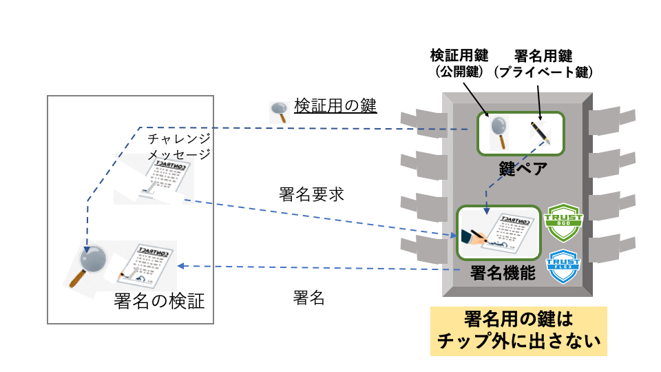

## Chapter 5 セキュリティ上の課題

本章では、TLSを利用したアプリケーションやシステムを開発するうえで重要となるセキュリティ上の課題について、

- 脆弱性の生じる原因箇所
- 安全性に対する脅威と攻撃手法
- 脆弱性インシデントの管理

に関し、TLSを利用するアプリケーションやシステムの開発者として一般的に認識しておかなければならない観点を簡単にまとめます。

### 5.1 脆弱性の階層

「脆弱性」という言葉に厳密な定義があるわけではありませんが、一般的には、ソフトウェア製品／システムの機能や性能を損なう原因となる、セキュリティ上の問題箇所を意味します。

ただし、一言で「脆弱性」といっても、その原因や対策はさまざまです。ここではまず、セキュリティシステムの階層ごとにその要因と性質について見ていきます。

#### 5.1.1 暗号アルゴリズム

セキュリティの最も基本的な部分を担うのは、個々の暗号アルゴリズムです。セキュリティプロトコルに利用される暗号アルゴリズムは、コンピューターセキュリティの歴史の中で数々の改善が重ねられてきました。今日利用されるアルゴリズムは細心の注意を払って設計、標準化されており、このレイヤーでアルゴリズムそのものに脆弱性が検出されることは極めてまれです。

とはいえ、そうした暗号アルゴリズムを使って最終的に安全なシステムを実現するためには、いくつかの点に注意しなければなりません。

例えば、Chapter 3でも述べたように、今日の暗号アルゴリズムのほとんどは鍵のランダム性に依存しています。そのため鍵のランダム性が保証されない場合、その鍵長で保証されるだけの安全性が実現できないことになります。また鍵値を鍵長の自由度より高い確率で予測できるような場合、その分だけ実質的に短い鍵を使用しているのと等価といえ、鍵値を容易に推測される原因になってしまいます。

デジタル技術の進歩、性能の向上は、攻撃側を利する側面もあります。歴史上のある時点で特定の鍵長の暗号アルゴリズムが安全であったとしても、年月を経るうちに、攻撃側の技術とともに性能、攻撃能力も向上することを考慮しなければなりません。このような現象を暗号アルゴリズムの「危殆化」と呼びます。

Chapter 2および3でも触れたように、プロトコル標準が取り入れている暗号アルゴリズムの種別や鍵長は、プロトコルのバージョンアップとともに見直されています。しかし、標準の見直しには長い時間がかかる場合も多く、危殆化のスピードのほうが標準の進化より速くなってしまうケースも多々あります。システムの設計、開発者はこうした課題を考慮して、使用するアルゴリズムや鍵長を適切に取捨選択していく必要があります。

古いバージョンにはさまざまな脆弱性リスクが知られています。また、直近のTLS1.2でも多くの改善が盛り込まれた一方で後方互換性のために古い仕様を捨てるとこができていません。そのため、TLS1.2では使用する暗号スイートやさまざまな機能を注意して選択したうえで使用しないと思わぬセキュリティリスクを内包してしまうことになってしまうことに注意が必要です(脚注)。

### 5.1.2 プロトコル仕様

表：暗号アルゴリズムの危殆化とプロトコル仕様

脚注：例えば、NIST SP 800-52ではTLS実装の選択、設定、使用のためのガイドラインを定めています。

古いバージョンにはさまざまな脆弱性リスクが知られています。また、直近のTLS 1.2でも多くの改善が盛り込まれた一方、後方互換性のために古い仕様は捨てきれませんでした。そのため、TLS 1.2を使用する際には、利用する暗号スイートやさまざまな機能を注意して選択しないと、思わぬセキュリティリスクを内包してしまうことになってしまいます。

[表5.1 暗号アルゴリズムの危殆化とプロトコル仕様]
|アルゴリズム種別||TLS1.2まで|TLS1.3|
|---|---|---|---|
|共通鍵|ブロック型|DES、TDES、Camellia|AES|
||利用モード|ECB、CBC、CTR、CFB|GCM、CCM、CCM_8|
||ストリーム型|RC4|Chacha20|
|ハッシュ|MD4、MD5、SHA-1|SHA-2/256、SHA-2/384|

#### 5.1.3 プロトコル実装

プロトコル実装の品質／安全性と、脆弱性への対応は、各実装ベンダーの努力で担保されることになります。例えば、組み込み向けTLSライブラリベンダーであるwolfSSL社は、同社製品の品質保証について以下のような項目に分けて紹介しています。

##### 基本的品質保証

開発者の手元で行われるローカルテストから、Gitコミット時の検証、プルリクエスト時の自動レグレッションテスト、統合テストとピアレビューによるフィードバックなどのプロセスが規定されています。

##### 品質管理の自動化

Jenkinsをベースとしたオンサイトとクラウドのハイブリッド型のCIを規定しています。これにより、組み込み向け特有のハードウェアアーキテクチャに対応した品質保証の自動化が可能となっています。

##### 暗号アルゴリズム、モジュール

NISTによるFIPS140-2/3など、第三者認証機関による認定について紹介しています。

##### 相互運用性テスト

多数の他社実装との相互運用性テストを実施しています。

##### 単体テスト

最初の単体テストは開発者のマシンで実行され、単体テストのテストカバレッジは毎週計測され開発者にフィードバックされます。

##### APIの一貫性、後方互換性検証

実装の変更、機能拡張がAPI仕様を変更していないこと、バージョン間の一貫性の確認は毎日の自動テストの一項目となっています。

##### 統合テスト

さまざまなアーキテクチャ、コンフィグレーションによるテストを実施します。

##### 安全性の解析

cppcheck、clang静的解析（scan-build）、Facebook infer、valgrindなど、さまざまな静的分析ツールによる定期的な分析を行っています。また、独自のwolfFjzzによるFuzzingテストは、4兆個のPRNGシードを3カ月で検証します。

##### 脆弱性管理

脆弱性発見からアクションの起動、攻撃者に漏洩しない形での対応コードのレビュー、検証から正式な公開までのプロセスを規定します。

#### 5.1.4 アプリケーション実装

##### TLSバージョン

できる限り最新のTLSバージョンのみを使用するようにすべきですが、当面はやむを得ずTLS 1.2を使用するケースも想定されます。その場合には、セキュリティリスクを可能な限り下げるよう、使用するオプションを選択する必要があります。例えば、拡張マスターシークレットのような潜在的脆弱性リスクを回避するためのオプションは有効化し、再ネゴシエーションのようなリスクのあるものは無効化します。

##### 暗号スイート

TLS 1.3では、現時点でリスクの認識されている暗号スイートはすべて排除されています。そのため、すべてのスイートを使用することが可能です。ただし、利用モードCCM、CCM_8などは、比較的低性能のMCU向けである点は認識しておく必要があります。

##### 乱数シード

多くのTLS実装では、実際に内部処理で使用する乱数は、疑似乱数生成などを使って乱数シードで得られる乱数よりランダム性を高める工夫がされています。しかし、乱数シード値もその自由度を高めるよう配慮しておく必要があります。例えば、純粋なソフトウェアによる単純なシード生成では、システム起動時に毎回同じ乱数値を生成することになってしまうので注意しましょう。

##### 開発、テスト用オプション

商用のTLSライブラリでは、多くの場合、アプリケーション開発テスト時に使用できる便利なオプション機能を用意しています。前述の乱数シードを例にすると、アプリケーション開発者が開発当初に特別なものを用意しなくても動作させられるようなテスト用の乱数シード生成機能を用意しています。しかし、そのようなオプションを誤って運用時に実装してしまうと、思わぬ脆弱性の原因となってしまいます。

##### エラーログ

十分なテストをして出荷しても、運用時に予期しない異常が発生する場合があります。そのような場合において、原因が確実に究明できるような動作状態のログ機能を実装することが推奨されます。

### 5.2 脅威と攻撃手法

#### 5.2.1  ネットワーク上の基本的な脅威

ネットワーク通信では、さまざまなセキュリティ上の脅威が想定されます。TLSプロトコルでは、基本的な脅威として主に、
- 盗聴
- 成りすまししおよび不正アクセス
- 改竄
の3つから、情報／システムを守ることを目標としています。

##### 盗聴

ネットワークセキュリティの初期の基本的な目的は、ネットワーク上を流れる情報の秘匿にありました。TLSでは、この目的のために、ネットワーク上を流れる情報に関しては暗号化し、正当な受信者だけが復号できるようなメカニズムを提供します。また、そのための鍵を安全に交換するための仕組みも含まれています。しかし、以下に示すようにそれだけでは十分とはいえません。

##### 成りすまし、不正アクセス

TLSの利用シナリオにおいて、「成りすまし」はサーバーおよびクライアントの双方で想定されます。

Webサーバーとブラウザーを例にすると、不正なサーバーが他のサーバーに成りすましてブラウザーからの情報を盗み取るフィッシングがサーバー成りすましの典型例といえます。反対に、クライアント側が不正に他のクライアントに成りすますことで、サーバー側の情報に不正にアクセスしたりサーバーの動作をかく乱させたりするリスクも考えられます。

IoTデバイスや組み込み機器のような、ROMベースの小規模なデバイスがクライアントとなる場合は、クライアント側の情報には不正アクセスするほどの価値がないように感じるかもしれません。しかし、クライアント側への不正アクセスを許し、クライアントの成りすましを許してしまうことでサーバーへの不正アクセスを許してしまったり、サーバーの動作をかく乱されたりするリスクを招くことにもなります。

このように、成りすましや不正アクセスによって、ネットワーク上に出ない情報についても盗聴と同様な行為が可能となってしまいます。成りすましや不正アクセスを阻止するためには、通信の相手方について、正当な相手であることを確認するピア認証が重要です。

##### 改竄

ネットワークを介して通信する際には、中間者攻撃によってデータが改竄されるリスクもあります。受信者が正常にデータを復号できたとしても、それが元のデータである保証はありません。そこでTLSでは、改竄検出のためにレコードごとのHMACベースのメッセージ認証を使用していました。

しかし近年、これでは潜在的リスクが解消できないことがわかり、データの秘匿と改竄検出を同時に行う認証付き暗号（AEAD：Authenticated Encryption with Associated Data）が採用されるようになってきました。TLS 1.3の暗号スイートではAEAD型のみが採用されています。

#### 5.2.2 新しいセキュリティの脅威

近年、セキュリティに対する攻撃者のモチベーションは、個人的興味から大規模な組織やその連携をベースに金銭的利益を目的とするもの、また国家的なものまで非常に多岐にわたるようになっています。

2010年代中ごろには、組織的で非常に大規模、長期間にわたる漏洩が明るみに出る事件などもあり、それまでの暗号技術、セキュリティ技術の前提の見直しが迫られる事態にまでなっていました。また、セキュリティを必要とするIT機器についても、データセンターのような物理的、組織的に堅牢に守られた場所での運用や、機器の注意深い廃棄を期待できるとは限らなくなってきています。安価で日常生活や通常の企業活動の場で広く使われる機器にも、セキュリティ上守るべき対象が拡散するようになっています。

例えば公開鍵暗号では、対をなすプライベート鍵が安全に守られていることが大前提ですが、大規模で巧妙な攻撃に対して何らかの原因によりプライベート鍵が漏洩する可能性は否定できません。また、ネットワーク上のトラフィックを非常に長期間大量に蓄積しておくことも可能となってきています。そのような環境では、たとえ通信内容がその時点では守られていたとしても、プライベート鍵のような秘匿情報が漏洩した時点で過去にさかのぼって多量の秘匿情報を解読するようなことも可能となってしまうかもしれません。そういった背景で、そうした事態でも秘匿性を保証できる完全前方秘匿性（PFS：Perfect Forward Secrecy）の概念が提唱され、その必要性が認識されるようになってきました。

TLSでは当初、鍵交換方式として公開鍵証明書の機能と組み合わせた静的RSA方式が広く使用されていました。この方式では、クライアントで生成したプリマスターシークレットをサーバーから送られるRSA公開鍵で暗号化して、サーバーに送ります。この際使われるRSA公開鍵は、サーバー証明書に格納されているものを利用します。この方式ではサーバー認証と鍵交換の情報を共有して行うことができるため、効率のよい実現が可能です。しかし一方、サーバー証明書を頻繁に更新することは現実的でなないため、同じ公開鍵を長期間にわたって使い回すことになってしまいます。

このように、静的RSAでは完全前方秘匿性を実現することが難しいため、近年はディフィー・ヘルマン（DH）をベースとした一時鍵（Ephemeral Key）方式に移行しつつあります。TLS 1.3でも、静的RSAを完全に廃止して、一時鍵であるディフィー・ヘルマンのみが採用されています。

#### 5.2.3 サイドチャンネル攻撃

完全前方秘匿性問題以外にも、純粋にアルゴリズム的な暗号理論の範囲を超える攻撃手法が多数知られています。その1つがサイドチャンネル攻撃と呼ばれる一連の攻撃手法です。サイドチャンネル攻撃では、暗号処理を行っているコンピューターの物理的特性を外部から観測することで内部の情報を読み取ることを試みます。具体的には、機器の内部で暗号処理を行う際の処理時間、消費電力の変化、外部に発生する電磁波、音、熱などの物理的変化を測定し、解読のヒントとします。このような、正規の情報の出入り口ではない「サイドチャンネル」を利用することからサイドチャンネル攻撃と呼ばれています。

通常、ハードウェア型の攻撃のうち攻撃対象を破壊しない攻撃をサイドチャンネル攻撃に分類します。サイドチャンネル攻撃の手法はこれからもさまざまなものが出現すると予想されますが、これまでに知られているものとしては次のようなものがあります。

##### タイミング攻撃

暗号処理をする機器の入力値を変えることによる処理時間の違いを計測して鍵情報などを推測する攻撃手法です。

暗号処理の中でも、特に公開鍵の処理は単純に原理的なアルゴリズムを実現するだけだと処理時間が大幅に異なり、比較的容易に鍵が推測できてしまうリスクが知られています。しかし、ソフトウェア的に注意深い実現をすることで処理時間を平準化することができることが知られており、多くの暗号ライブラリなどではそうした対策が採られています。

とはいえ、ハードウェア的に詳細なタイミングが計測できる環境ではさらに精度の高い対策が必要です。

##### 故障利用攻撃

外部からの強い電磁ノイズなどによって故意に誤動作や故障を起こし、正常動作との差異を解析する攻撃です。

##### 電力解析攻撃

機器の消費電力／電流の変化を計測することで、暗号鍵などクリティカルな情報を推測する攻撃です。

##### 電磁波解析攻撃

電力解析とは逆に、機器から発生する電磁波ノイズを解析することでクリティカルな情報を推測する攻撃です。

##### キャッシュ攻撃

処理内容により、キャッシュのヒット率などの変化を観測する攻撃です。マルチコアのサーバーなどでは、同一チップ上のコアの動作状況を観測することが可能な場合もあるので注意が必要です。この攻撃に対しては、処理前にあらかじめキャッシュ状況を揃えておくなど、ソフトウェア的な対策もある程度可能です。

##### 音響解析攻撃

機器から発生する音響ノイズを解析することで処理内容を推測する攻撃です。

#### 5.2.4 ハードウェア層の攻撃手法

サイドチャンネル攻撃は、電気的特性などを使ってソフトウェアの動作状況を解析する攻撃手法ですが、ハードウェア的な手法を用いれば、さらに踏み込んだ解析が可能です。例えば、光学／レーザー顕微鏡などで直接ICチップ上の回路を読み取ることも可能です。また、回路の解析だけでなく、配線の切断／接続などの改造や、バス上のデータの読み取りなどの攻撃も可能です。あるいは、ICチップ上へのレーザー照射によってソフトウェアの動作を強制的に意図しない方向に分岐させ、データを読み取ることや、ソフトウェア的には隠蔽された情報を取得することも可能となります。

こうしたハードウェア層の攻撃に対しては、回路の配線を見えなくするためのシールド配線層を設けたり、レーザー照射を検出するセンサーを実装したり、チップ破壊の検出機構を設けたりする対策が知られています。また、そのような攻撃に耐える性質を「耐タンパー性」と呼びます。

### 5.3 鍵管理

公開鍵暗号によるデジタル署名では、署名鍵を外部に知られることなく第三者がその署名の正当性を検証することができます（3.6.5項「デジタル署名」参照）。この技術を利用し、物理的なハードウェアユニット上に署名鍵を安全に保存して署名検証機能を提供することで、ハードウェアレベルで安全なアイデンティティ管理を実現することができます。

このような鍵管理機能を物理的にも安全に実装した、鍵管理のためのハードウェア的な装置をHSM（Hardware Security Management）と呼びます。従来、HSMはハードウェア的にも極めて堅牢な実装がされており、高い耐タンパー性を実現した大規模なサーバーシステムの一環として利用されてきました。しかし近年ではこのような鍵管理機能を軽装にICチップ上に実現した「セキュアエレメント」と呼ばれる鍵管理チップも広く使用されるようになっています。そのようなデバイスは、IoTデバイスのような軽量なデバイスのアイデンティティを安全に管理するためなど、その利用領域が広がっています。

セキュアエレメントでは、公開鍵ペアは工場での製造工程で安全に管理され封印されている、もしくはチップに鍵生成機能も提供されることで、鍵のライフサイクル全体でプライベート鍵を一切チップの外に出すことなしに機能を果たすことができるようになっています。また、こうした装置やチップは通常耐タンパー性も実現していて、ハードウェアレベルでの安全性も保証されています。

図5.1に、セキュアエレメントによる鍵管理の原理を示します。セキュアエレメント内には署名鍵と検証鍵が保存されていて、署名鍵はチップ外から参照することはできないようになっています。署名検証をする場合は事前に該当チップから検証鍵を得ておき、適当なチャレンジメッセージをエレメントに送ります。エレメントは自分の署名鍵を使ってメッセージに対応する署名を生成しそれを返送します。受け取った側は用意してある検証鍵を使って送られてきた署名を検証します。このように署名鍵自身は一切外部に参照させることなしに自分が正しい署名者であることを証明することができます。

HSMアクセスのためのAPIは標準化も進められています。RSA社のPKCSの一環としてもPKCS #11が早い段階からの標準として普及しています（4.2節「PKCS（Public-Key Cryptography Standards）」参照）。PKCS #11は、比較的大掛かりなサーバー向けの鍵管理とそれに関連した暗号化処理など、一連の処理に関するAPIを標準化しています。

一方、セキュアチップとその周辺サービスの標準化の例としては、TPM（Trusted Platform Module、ISO/IEC 11889）があり、デジタル著作権管理（DRM：Digital Rights Management）やWindowsのアクセス管理用などに広く使われています。

これらの例では単純な鍵管理機能だけではなく、周辺のさまざまな機能やサービスが取り込まれています。一方で、IoTデバイスのように比較的小規模なデバイス向けには、鍵管理だけに特化した軽装のチップも広く利用されています。

### 5.5 インシデント管理

コンピューターシステムにおいて、脆弱性を撲滅することは永遠の課題です。現実的には、問題の発生や潜在的問題を発見した場合の速やかな対処ができる体制、影響を最小限に食い止める体制が大切です。

インターネットの世界では、多くのケースでユーザーは不特定多数です。脆弱性問題を発見した個人、機器やソフトウェアのベンダーは必要とするユーザーにその情報を確実に届ける必要がありますが、個別に対応していたのでは極めて困難なものとなります。ユーザーにとっても、使用しているたくさんの機器やソフトウェアが複雑に関係し合っている中で、必要な脆弱性情報を常に確実に把握しなければいけません。情報はできるだけ早く伝達しなければなりませんが、不確実な情報、不正確な情報はかえって影響を大きくしたり、問題を複雑にしてしまったりすることも考えられます。

米国では早い段階からそうした必要性が認識され、国土防衛政策の一環としてNVD（National Vulnerability Database）の運用が開始されました。NVDでは、発見された各脆弱性インシデントに対してCVE（Common Vulnerabilities and Exposures）と呼ばれるIDを付与し、データベースとして誰でもアクセスできる環境で公開しています。

- https://nvd.nist.gov/

一方、コンピューターウィルスやワームのようなマルウェアの脅威についても、早い段階から認識されていました。米カーネギーメロン大学は米国連邦政府の委託でCERT/CC（Computer Emergency Response Team Coordination Center）を立ち上げ、情報収集、解析、公開などの活動を行っています（後にCSIRT: Computer Security Incident Response Teamと改名）。現在では各国にNational CSIRTが組織されており、日本でもJPCERT/CC（一般社団法人JPCERTコーディネーションセンター）が活動を続けています。

また、IPA（独立行政法人 情報処理推進機構）とJPCERT/CCの共同でJVN（Japan Vulnerability Notes）が運用され、NVDの情報とともに日本国内の製品開発者の脆弱性情報を受け付け、対応状況をとりまとめて公開しています。

- https://jvn.jp/