# Part2. Programming

## Introduction

In each chapter from now on, we will explain sample programs related to typical processing by dividing into TLS protocol, cryptographic algorithm, public key certificate, PKI, etc.
Each sample is explained in the following order. In the command usage example, you will actually run the sample program and use Wireshak's packet capture and the contents of the generated file to deepen your understanding of the TLS protocol and cryptographic algorithms.

- Overview
- Command format and usage example
- Program
- others

"Chapter 6: TLS Protocol" introduces an example of client-server communication using the TLS protocol. At the beginning of Chapter 2, I explained how to make TLS based on a simple TCP client and server program. In this chapter, we will first introduce a sample program that adds a simple augmentation process to its simple client and server so that the reader can perform various experiments. In addition, we will introduce an example of developing the process such as pre-shared key and session restart based on it. In addition, we will actually operate these sample programs and deepen our understanding of the protocol while observing the contents of packet capture by Wireshark.


| Directory name | Description |
| --- | --- |
01.tcp-tls | Simplest TCP Clients and Servers <br> TLS Clients and Servers |
02.client-server | Simple client and server <br> Based on this sample, expand to <br> samples of other functions |
| 03.tls-ext | Sample code for TLS extension |
| 04.psk | Pre-shared key (PSK) |
| 05.resume | Session resume |
06.early-data | Early Data (0-RTT) |


"Chapter 7: Cryptographic Algorithms" introduces various cryptographic processing program examples that are also TLS-based. For each algorithm, we will introduce hash, message authentication code, encryption with RSA public key, signature verification, CRX509 certificate generation, verification, etc.


| Directory name | Description |
| --- | --- |
| 01.hash | hash |
| 02.hmac | Message authentication code by HMAC |
| 03.sym | Common key cryptography (AES-CBC, AES-GCM) |
| 04.keyGen | Public key generation |
| 05.rsaEnc | RSA encryption |
| 06.rsaSig | RSA signature |
07.cert | X509 certificate |

"Chapter 8: Program Structure" introduces program examples to support various configurations and platform operation modes.


| Directory name | Description |
| --- | --- |
| 01.iocallback | Network IO callback |
| 02.nofilesys | No file system |
| 03.nonblocking | Nonblock Networking |
| 04.supperloop | Client by Superloop |

## Common subject matter
### 1) Sample program

In each session, we will summarize the functional outline of the sample program, the C language code, the API used there, and related information. The code of the sample program will be introduced in abbreviated form for details such as error handling due to space limitations. An executable sample program including error handling can be downloaded from the linked site (...).

### 2) Platform

For TLS and cryptographic processing API, we use API common to OpenSSL and wolfSSL as much as possible. Unless otherwise specified, it works with both OpenSSL and wolfSSL. However, "Chapter 8: Program Structure" mainly introduces implementation examples in wolfSSL.

The sample program is designed to work in a command environment with the C language compilers of Linux, Mac OS, and Windows.

The basic network environment below TCP is based on the TCP socket environment provided by each OS and the BSD socket API provided in the C language environment.

For details on the OS and compilation environment, refer to "Appendix 1. Programming Environment".


### 3) How to build

Each sample program folder contains a Makefile, and you can use the make command to create an executable file that can be operated. For details on the build method, refer to "Part 4 Appendix 1 Programming Environment 1) Building Sample Programs".

### 4) Common header file

The sample program introduced in this document includes the following common header files. It contains definitions and logic that are commonly used in each program.

Examples / include / example_common.h

- Header file for C standard library
- Header file for BSD Socket library
- Callback to get TLS 1.3 session key
Refer to "Part4 Appendix 1 Programming Environment 2) Debugging Tool" for how to use it.


<br> <br> <br> <br>

<div style = "page-break-before: always"> </ div>

# Chapter 6 TLS Protocol

## Introduction

This chapter introduces various sample programs for implementing TLS as described in Chapter 2, TLS Protocol.

At the beginning of Chapter 2, I explained how to make TLS based on a simple TCP client and server program. The client in this sample was a sample that establishes a TLS connection based on a TCP connection with a server on the local host on the same node, and communicates one round-trip application message between the client and the server. The source code for this program is stored in 01.tcp-tls.

"6.1 Client-Server Communication" extends the functionality to allow readers to experiment with TLS connections and communications under a slightly different set of conditions. In this sample, for example, the domain name, port number, CA certificate for server authentication, etc. to connect to can be specified in the command argument when the client is started. In "6.1 Client-Server Communication", the TLS connection is realized by the full handshake described in "2.1 Full Handshake" and the communication of application data between the client and server is executed.

With TLS, various optional functions can be specified as TLS extensions along with the connection. In "6.2 TLS Extension", as a supplement to the previous sample, the sample program introduces how to specify various TLS extensions.

In "6.3 Pre-shared key", based on the sample of "6.1 Client-server communication", we will introduce a sample program of TLS connection with pre-shared key instead of full handshake as a form of TLS connection. For this form of connection, the application must provide a callback that specifies the pre-shared key during the connection handshake. The sample program explains how to do this.

Session tickets are used for TLS 1.3 session resumption. The session resumption sample program describes a session resumption sample using a TLS 1.3 session ticket.

## 6.1 Client / Server Communication

### 6.1.1 Overview

This sample performs simple application message communication between the client and server via TLS connection. Specify the IP address or domain name, port number, and CA certificate file name of the TLS connection destination in the command agreement of the client. The server command argument specifies the port number that accepts connections, the filename of the server certificate, and the filename of the private key.

After establishing a TLS connection with the server, the client sends a message from standard input to the server. The server prints the received message on standard output and sends the given message back to the client. The client prints the message returned by the server on standard output. The client repeats this as long as there is an input message. The server will also reply as long as there is a message from the client. If the client's input message is "shutodwn", the client sends it to the server and then disconnects the TLS connection and ends the process. If the server also receives a "break", the process ends.

Perform peer authentication when connecting via TLS. In the sample program, the client side authenticates the server, and the server side responds to the authentication request. Therefore, register the CA certificate on the client side and the server certificate and private key on the server side in advance.

<br> <br>
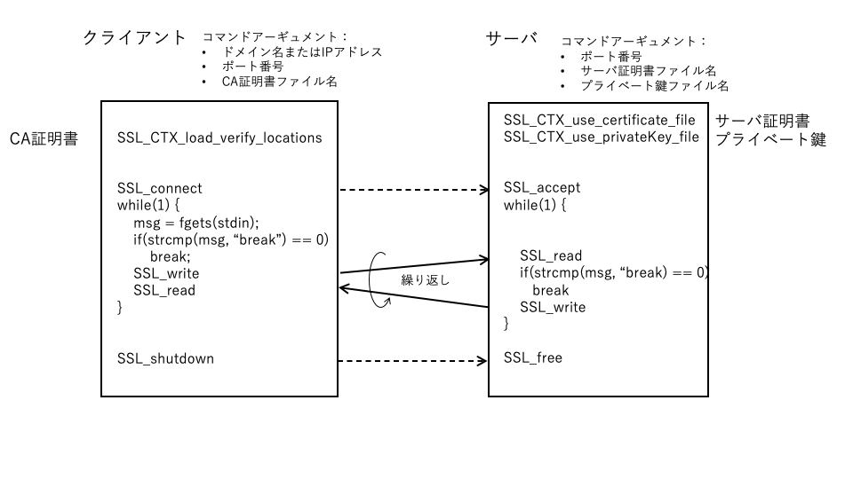
<br> <br>

This sample program is an example of communication using only one connection. The TLS connection is managed by the SSL structure. For example, if you want to establish multiple connections at the same time with multiple threads on the server side and communicate, use the SSL_new function to secure multiple SSL structures and use them.

In addition, there are cases where a client wants to connect to multiple different servers, or a single server program wants to realize servers with multiple different identities (servers with different server certificates). In such cases, the SSL_CTX_new function reserves several different context structures (SSL_CTX) to load and use different certificates.

### 6.1.2 Command format and usage examples

Server-tls:

- First Argument: Server certificate for server authentication (optional)
- Second argument: Private key for server authentication (optional)
- Third argument: Port number (optional)

It can be omitted in the order of 3rd, 2nd, 1st argument.


Client-tls

- First argument: CA certificate for server authentication (optional)
- Second argument: Connection destination IP address (optional)
- Third argument: Port number (optional)

It can be omitted in the order of 3rd, 2nd, 1st argument.

#### Example of using normal connection

#### 1) Normal case

Start the server command in the command window for the server. Waits for a connection request from the client.

```
$ ./Server-tls
Waiting for a connection ...
```

Launch a client command in a command window for clients on the same machine. The TLS connection to the local server is complete and you will be prompted to send it to the server.

```
$ ./Client-tls
Send to localhost (127.0.0.1)
Message to send:
```

A message indicating that the TLS connection with the client has been completed is output to the server side.

```
Client connected successfully
```

When you enter a message on the client side, it is sent to the server and the message sent from the server side is displayed.

```
Message to send: Hello server
Received: I hear ya fa shizzle!
```

If you enter "break" in the message on the client side, it will be sent to the server side, then TLS will be disconnected, and the program will be terminated.

```
Message to send: break
Sending break command
End of TLS Client
```

After displaying that "break" has been received on the server side, TLS is disconnected and the program is terminated.

```
Received: break

Received break command
Closed the connection
```

During this time, if you take a packet capture of Loopal Loop with Wireshark, you can see the following packets being exchanged sequentially.
All TLS handshake is encrypted after Client Hell, Server Hello at the beginning, so all "Application Data" records
Is displayed as, but it actually includes the second half of the handshake. Session key information is required to decrypt these.
See the appendix for decryption methods.

<br> <br>
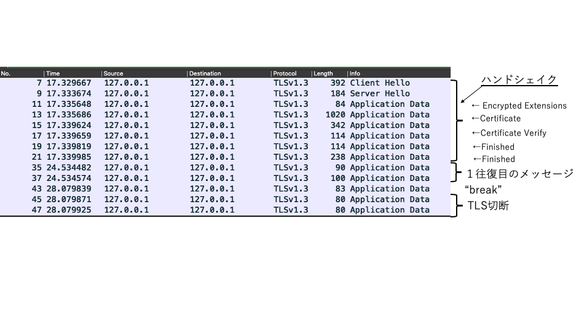
<br> <br>

Let's take a look at the contents of Client Hello. "TLS1.2" as TLS version number information in two places in the record layer and Client Hello message
You can see that is stored. These fields are for backward compatibility and are ignored for TLS 1.3. At the time of network transfer
These fields have past version values ​​because some of the middleboxes at the waypoints do not recognize 0x0304, which indicates TLS 1.3.
It is embedded.

```
TLSv1.3 Record Layer: Handshake Protocol: Client Hello
    Content Type: Handshake (22)
    Version: TLS 1.2 (0x0303)
    Length: 331
    Handshake Protocol: Client Hello
        Handshake Type: Client Hello (1)
        Length: 327
        Version: TLS 1.2 (0x0303)
```

In TLS1.3, a new TLS extension, supported_versions, has been added to provide a list of TLS versions supported for this extension, as shown below.


```
Extension: supported_versions (len = 7)
    Type: supported_versions (43)
    Length: 7
    Supported Versions length: 6
    Supported Version: TLS 1.3 (0x0304)
    Supported Version: TLS 1.2 (0x0303)
    Supported Version: TLS 1.1 (0x0302)
```

In the client sample program, the arbitrary version (SSLv23_client_method) is specified when securing the TLS context, so it is actually sent.
Client Hello lists the three versions of TLS 1.1, 1.2 and 1.3 that are included at build time.


```
ctx = SSL_CTX_new (SSLv23_client_method ()))
```

The Cipher Suites extension includes the following suites for TLS 1.3 in addition to the available cipher suites for TLS 1.2.


```
Cipher Suites (27 suites)
    Cipher Suite: TLS_AES_128_GCM_SHA256 (0x1301)
    Cipher Suite: TLS_AES_256_GCM_SHA384 (0x1302)
    Cipher Suite: TLS_CHACHA20_POLY1305_SHA256 (0x1303)
```

In addition, Supported Groups lists the types of elliptic curves available in the (EC) DHE key agreement, or the DH key length (ffdhe).

```
Supported Groups (5 groups)
    Supported Group: secp521r1 (0x0019)
    Supported Group: secp384r1 (0x0018)
    Supported Group: secp256r1 (0x0017)
    Supported Group: secp224r1 (0x0015)
    Supported Group: ffdhe2048 (0x0100)
```

In TLS1.3, in Client Hello, not only the above cipher suites and curve types, but also the Key Share extension is added, and the parameters and key information for (EC) DH key agreement are also sent.
As a result, if the server side that received the Client Hello agrees with the cipher suite and the contents of this Key Share, the premaster key will be combined with the key information on the server side.
It is now possible to generate, derive the key, and start encryption.


```
Key Share extension
    Client Key Share Length: 69
    Key Share Entry: Group: secp256r1, Key Exchange length: 65
        Group: secp256r1 (23)
        Key Exchange Length: 65
        Key Exchange: 042a9e4759a37da0cab6a1d55071d7…
```

In addition, Client Hello provides a list of signature schemes that can be used to sign the signature_algorithms extension, followed by server, client authentication, and more.
Used for key derivation.


```
Extension: signature_algorithms (len = 32)
    Type: signature_algorithms (13)
    Length: 32
    Signature Hash Algorithms Length: 30
    Signature Hash Algorithms (15 algorithms)
        Signature Algorithm: ecdsa_secp521r1_sha512 (0x0603)
            Signature Hash Algorithm Hash: SHA512 (6)
            Signature Hash Algorithm Signature: ECDSA (3)
        Signature Algorithm: ecdsa_secp384r1_sha384 (0x0503)
            Signature Hash Algorithm Hash: SHA384 (5)
            Signature Hash Algorithm Signature: ECDSA (3)
        Signature Algorithm: ecdsa_secp256r1_sha256 (0x0403)
            Signature Hash Algorithm Hash: SHA256 (4)
            Signature Hash Algorithm Signature: ECDSA (3)
        ...
```


On the other hand, Server Hello sent from the server contains the key information of (EC) DH in the Key_Share extension along with the server's agreed TLS version and cipher suite.
On the client side, this is used to generate the premaster key, derive the key, and start encryption in the same way as on the server side.


```
    Handshake Protocol: Server Hello
        ...
        Cipher Suite: TLS_AES_128_GCM_SHA256 (0x1301)
        ...
        Extension: key_share (len = 69)
            Type: key_share (51)
            Length: 69
            Key Share extension
                Key Share Entry: Group: secp256r1, Key Exchange length: 65
                    Group: secp256r1 (23)
                    Key Exchange Length: 65
                    Key Exchange: 04b09ee9645d87359a4b6729be30c95fad6dda7a660052493d134f0b0740e01bf1c4b1be…
        Extension: supported_versions (len = 2)
            Type: supported_versions (43)
            Length: 2
            Supported Version: TLS 1.3 (0x0304)
```

The server will then send an Encrypted Extention encrypted with the TLS extension that accompanies Server Hello, but for now.
This part does not contain much important information.

The server then sends you a server certificate chain for server authentication and a Certificate Verify, but these parts are encrypted and normally invisible. The Certificate message contains a certificate in DER format.

```
Handshake Protocol: Certificate
    Handshake Type: Certificate (11)
    Length: 938
    Certificate Request Context Length: 0
    Certificates Length: 934
    Certificates (934 bytes)
        Certificate Length: 929
        Certificate: 3082039d30820285020101300d0… (pkcs-9-at-emailAddress = info @ ,,, com, id-at-commonName = www.wolfssl.com, id-at-organizationalUnitName = Support, id-at-organizationName = WolfSSL Japan, id
            signedCertificate
                serialNumber: 0x01
                signature (sha256WithRSAEncryption)
                    Algorithm Id: 1.2.840.113549.1.1.11 (sha256WithRSAEncryption)
                issuer: rdnSequence (0)
            ...

            algorithmIdentifier (sha256WithRSAEncryption)
                Algorithm Id: 1.2.840.113549.1.1.11 (sha256WithRSAEncryption)
            Padding: 0
            encrypted: 5ecc342d4d3fb775600e5e3039da737d0ef7e…
        Extensions Length: 0
```

The following Certificate Verify message sends a signature for signature verification, and the client verifies it using the certificate sent by Certificate.
The message contains the Signature Algorithm and Signature used to sign it.

```
TLSv1.3 Record Layer: Handshake Protocol: Certificate Verify
    Opaque Type: Application Data (23)
    Version: TLS 1.2 (0x0303)
    Length: 281
    [Content Type: Handshake (22)]
    Handshake Protocol: Certificate Verify
        Handshake Type: Certificate Verify (15)
        Length: 260
        Signature Algorithm: rsa_pss_rsae_sha256 (0x0804)
            Signature Hash Algorithm Hash: Unknown (8)
            Signature Hash Algorithm Signature: SM2 (4)
        Signature length: 256
        Signature: 28462795dabf4f86da81b912755a775b850509eaf9bf14…
```

In this sample program, only server authentication is performed, but when client authentication is also performed (mutual authentication), it is also possible from the client side.
Send a similar certificate and signature and the server will validate it.

After these messages, both sides send a "Finished" message indicating the end of the handshake to end the handshake.


#### 2) Use debug logs

In TLS 1.3, the state of the handshake is encrypted, so it is difficult to check it sufficiently. It is possible to obtain the session key in a special way and decrypt the captured content, but it should not be used very easily from the viewpoint of security.

You can see this using the debug log feature of wolfSSL. If you enable the "- enable-debug" option when building the library, the execution status in the library can be output as back information sequentially (see Appendix 1). Protocol state transitions are output with the "connect state:" prefix. Also, the function call is a prefix of "wolfSSL Entering". The function name of each message processing in the handshake is

- Send processing: "SendTLS13"
- Reception processing: "DoTLS13"

It is named with the prefix of. If you extract the logs with those filters, you can get the following logs on the client side.


```
Library initialization, context securing:
wolfSSL Entering wolfSSL_Init
wolfSSL Entering wolfSSL_CTX_new_ex
wolfSSL Entering wolfSSL_CertManagerNew
wolfSSL Leaving WOLFSSL_CTX_new, return 0

Certificate loading, TLS connection preparation:
wolfSSL_CTX_load_verify_locations_ex
wolfSSL_CTX_load_verify_locations_ex

wolfSSL Entering SSL_new
wolfSSL Leaving SSL_new, return 0
wolfSSL Entering SSL_set_fd
wolfSSL Entering SSL_set_read_fd
wolfSSL Leaving SSL_set_read_fd, return 1
wolfSSL Entering SSL_set_write_fd
wolfSSL Leaving SSL_set_write_fd, return 1


TLS connection:
wolfSSL Entering SSL_connect ()
wolfSSL Entering SendTls13ClientHello
connect state: CLIENT_HELLO_SENT
wolfSSL Entering DoTls13ServerHello
wolfSSL Entering wolfSSL_connect_TLSv13 ()
connect state: HELLO_AGAIN
connect state: HELLO_AGAIN_REPLY
wolfSSL Entering DoTls13EncryptedExtensions
wolfSSL Entering DoTls13Certificate
wolfSSL Entering DoTls13CertificateVerify
wolfSSL Entering DoTls13Finished
connect state: FIRST_REPLY_DONE
connect state: FIRST_REPLY_FIRST
connect state: FIRST_REPLY_SECOND
wolfSSL Entering SendTls13Certificate
connect state: FIRST_REPLY_THIRD
wolfSSL Entering SendTls13CertificateVerify
connect state: FIRST_REPLY_FOURTH
wolfSSL Entering SendTls13Finished
connect state: FINISHED_DONE
wolfSSL Leaving wolfSSL_connect_TLSv13 (), return 1

Application message communication:
wolfSSL Entering SSL_write ()
wolfSSL Leaving SSL_write (), return 14
wolfSSL Entering wolfSSL_read ()
wolfSSL Entering wolfSSL_read_internal ()
wolfSSL Leaving wolfSSL_read_internal (), return 22


Disconnect, release resources:
wolfSSL Entering SSL_shutdown ()
wolfSSL Leaving SSL_shutdown (), return 2
wolfSSL Entering SSL_free
wolfSSL Leaving SSL_free, return 0
wolfSSL Entering SSL_CTX_free
wolfSSL Entering wolfSSL_CertManagerFree
wolfSSL Leaving SSL_CTX_free, return 0
wolfSSL Entering wolfSSL_Cleanup
```

#### 3) Try changing the TLS version

The server and client of the sample program accept all versions installed at the time of library build as the TLS version accepted when securing the context.
It is specified to be accepted.

Server side: <br>
ctx = SSL_CTX_new (SSLv23_server_method ())

Client side: <br>
ctx = SSL_CTX_new (SSLv23_client_method ()))

Now, let's change the specification on the client side to accept only TLS1.3.

ctx = SSL_CTX_new (TLSv1_3_client_method ()))


You can see that only TLS 1.3 is listed in the supported_versions of Client Hello.

```
Extension: supported_versions (len = 3)
    Type: supported_versions (43)
    Length: 3
    Supported Versions length: 2
    Supported Version: TLS 1.3 (0x0304)
```

Next, let's change the specification on the client side to accept only TLS1.2.

ctx = SSL_CTX_new (TLSv1_2_client_method ()))


Now you can see that you are connected with TLS 1.2. At this time, looking at the contents of Client Hello, the supported_versions extension does not exist,
You can see that Client Hello is in TLS 1.2 format.


<br> <br>
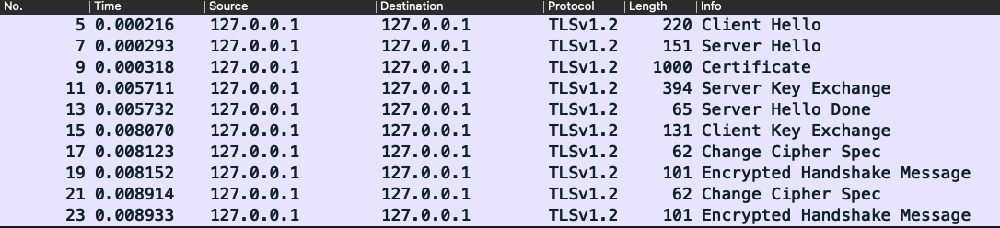
<br> <br>

Next, change the server side to accept only TLS1.3.

ctx = SSL_CTX_new (TLS1_3_server_method ())

If you start the server and client in this state, the server will detect a version error as follows.

```
$ ./Server-tls
Waiting for a connection ...
ERROR: failed SSL accept (err -326, record layer version error)
End of TLS Server
```

On the other hand, on the client side, an error message indicating that an alert message has been received is displayed.


```
$ ./client-tls
Send to localhost (127.0.0.1)
ERROR: failed SSL connect (err -313, received alert fatal error)
End of TLS Client
```

In this way, when an error is detected during communication with TLS, the alert record is simply sent to the other party without indicating the cause of the error.
Disconnect the communication. Can be a hint to the other party if the error was due to some security attack
In order not to send any information, the behavior at the time of error is specified as such.


#### 4) Server authentication error

Here, we will use the client-server sample program to see what happens in the case of a server authentication error. In the certs directory
Copy the server certificate below locally and modify some of its contents to create an invalid certificate. The contents of the original certificate and the modified certificate
Outputs text edited with the "-text" option of the OpenSSL x509 subcommand. Look at the difference with the diff command etc.
Make sure that the corrections do not break the syntax of ASN1 and that the appropriate parts such as the signature have been corrected.


```
$ cp ../../certs/tb-server-cert.pem ./tb-server-cert2.pem

Correct with a text editor

$ openssl x509 -in tb-server-cert.pem -text> tb-server-cert.txt
$ openssl x509 -in tb-server-cert2.pem -text> tb-server-cert2.txt
$ diff tb-server-cert.txt tb-server-cert2.txt
45c45
<74: 62: d8: 6d: 21: 11: eb: 0c: 82: 50: 22: a0: c3: 88: 52: 7c: b3: c4:
---
> 74: 62: d8: 6d: 21: 11: eb: 0c: 82: 50: 22: a4: c3: 88: 52: 7c: b3: c4:
69c69
<oMOIUnyzxOk4dRH + SkcmN8pW17Wp2WbS45BiHjVtgrAALMTv2dJpk8mQUjYQTTyF
---
> pMOIUnyzxOk4dRH + SkcmN8pW17Wp2WbS45BiHjVtgrAALMTv2dJpk8mQUjYQTTyF
```

Start the server by specifying the modified certificate in the server window.

```
$ ./Server-tls tb-server-cert2.pem
Waiting for a connection ...
```

When starting the client in the client window, the connection fails with a server authentication error.

```
$ ./client-tls
Send to localhost (127.0.0.1)
ERROR: failed SSL connect (err -155, ASN sig error, confirm failure)
End of TLS Client
```

A message indicating that an alert record has been sent from the client during SSL_accept is also displayed on the server side, and the process ends.

```
ERROR: failed SSL accept (err -313, received alert fatal error)
End of TLS Server
```


### 6.1.3 Program

 1) Client


```
#include <openssl / ssl.h>

#define constant definition

int main (int argc, char ** argv)
{
    Definition of variables for sockets and variables for messages

    SSL_CTX * ctx = NULL; / * SSL context * /
    SSL * ssl = NULL; / * SSL object * /

    ...
    Command argument processing
    ...

    / * Library initialization * /
        if (SSL_library_init ()! = SSL_SUCCESS)
    {Error handling}

    / * Secure SSL context and load CA certificate * /
        if ((ctx = SSL_CTX_new (SSLv23_client_method ())) == NULL)
    {Error handling}

        if ((ret = SSL_CTX_load_verify_locations (ctx, CA_CERT_FILE, NULL))! = SSL_SUCCESS)
    {Error handling}

    ...
    Secure TCP socket, TCP connection to server
    ...

    / * Create SSL object, attach socket, SSL connection to server * /
        if ((ssl = SSL_new (ctx)) == NULL)
    {Error handling}

        if ((ret = SSL_set_fd (ssl, sockfd))! = SSL_SUCCESS)
    {Error handling}

        if ((ret = SSL_connect (ssl))! = SSL_SUCCESS)
    {Error handling}

    / * Application layer messaging * /
    while (1) {
        printf ("Message to send:");
            if (fgets (msg, sizeof (msg), stdin) <0)
            break;
            if (strcmp (msg, "\ n") == 0) {/ * If blank, send a fixed HTTP request * /
            strncpy (msg, kHttpGetMsg, sizeof (msg));
        } else else
            msg [strnlen (msg, sizeof (msg))-1] ='\ 0';
        
        /* Send Messege*/
            if ((ret = SSL_write (ssl, msg, strnlen (msg, sizeof (msg)))) <0)
        {Error handling}

        / * End with "break" * /
            if (strcmp (msg, "break") == 0) {
            printf ("Sending break command \ n");
            ret = SSL_SUCCESS;
            break;
        }

        / * r message reception * /
            if ((ret = SSL_read (ssl, msg, sizeof (msg) ―― 1)) <0)
        {Error handling}
        
        msg [ret] ='\ 0';
        printf ("Received:% s \ n", msg);
    }

cleanup: cleanup:
    ...
    Freeing resources
    ...
}
```

---

2) Server


```
#include <openssl / ssl.h>
#define constant definition

int main (int argc, char ** argv)
{
    Definition of variables for sockets and variables for messages
    SSL_CTX * ctx = NULL; / * SSL context * /
    SSL * ssl = NULL; / * SSL object * /

    ...
    Command argument processing
    ...
    
    / * Library initialization * /

    / * Secure SSL context, load server certificate, private key * /
        if (SSL_library_init ()! = SSL_SUCCESS)
    {Error handling}

        if ((ctx = SSL_CTX_new (SSLv23_server_method ())) == NULL)
    {Error handling}

        if ((ret = SSL_CTX_use_certificate_file (ctx, server_cert,)
        SSL_FILETYPE_PEM))! = SSL_SUCCESS)
    {Error handling}

        if ((ret = SSL_CTX_use_PrivateKey_file (ctx, server_key,)
        SSL_FILETYPE_PEM))! = SSL_SUCCESS)
    {Error handling}
    
    ...
    Secure TCP socket, bind, listen
    ...

    while (1) {
        connd = accept () / * TCP accept ☆ * /
        {Error handling}

        / * Create SSL object, attach socket, accept ☆ * /
            if ((ssl = SSL_new (ctx)) == NULL)
        {Error handling}

        SSL_set_fd (ssl, connd);

            if ((ret = SSL_accept (ssl))! = SSL_SUCCESS)
        {Error handling}

        / * Application layer messaging * /
        while (1) {
            / * Receive message * /
                if ((ret = SSL_read (ssl, buff, sizeof (buff) -1)) <= 0)
            {Error handling}

            buff [ret] ='\ 0';
            printf ("Received:% s \ n", buff);

            / * If "break", disconnect * /
                if (strcmp (buff, "break") == 0) {
                printf ("Received break command \ n");
                break;
            }

            /* Send Messege */
                if ((ret = SSL_write (ssl, reply, sizeof (reply))) <0)
            {Error handling}
        }
    }
cleanup: cleanup:
    ...
    Freeing resources
    ...
}
```
### Program description:

#### 1) Header file
#Include "openssl / ssl.h": Contains definitions of APIs, data types, etc. used in TLS programs.

#### 2) Management structures and pointers
- SSL_CTX * ctx; <br>
   A structure for managing a series of TLS connection processes (contexts). Manage multiple TLS connections under similar conditions, such as TLS connections to the same server, as a single context.

- SSL * ssl; <br>
It is a structure for managing one TLS connection.

- Securing and releasing structures <br>
    - Securing: SSL_CTX_new (), SSL_new ()
    - Release: SS * _CTX_free (), SSL_free ()

- Related information <br>
The main information associated with the SSL_CTX context is as follows. <br>
    - TLS version: <br>
        When securing the context, specify the protocol version for TLS connection in the SSL_CTX_new argument.
        (See Table 6.1.1 SSL_CTX_new methods, Table 6.1.2 Key APIs related to TLS versioning)
    - Peer authentication: <br>
        Load the CA certificate for authentication, the certificate of the local node, the private key, etc. before connecting (see Table 6.1.3 API related to peer authentication).
    - Socket used for TLS connection <br>
    The SSL_set_fd function associates the socket used for the TLS connection with SSL.
<br> <br> <br>


#### 3) Main API
- SSL_CTX_load_verify_locations <br>
This example loads the CA certificate into the TLS context on the client side for server authentication. Also used on the server side for client authentication. (See Table 6.1.3 APIs related to peer authentication for related APIs)

- SSL_CTX_use_certificate_file <br>
This example loads the server certificate into the TLS context on the server side for server authentication. Also used on the client side for client authentication. (See Table 6.1.3 APIs related to peer authentication for related APIs)

- SSL_CTX_use_privateKey_file <br>
This example loads the private key into the TLS context on the server side for server authentication. Also used on the client side for client authentication. (See Table 6.1.3 APIs related to peer authentication for related APIs)

- SSL_connect <br>
An API that requests a TLS connection from the client to the server. When the TCP connection with the server is completed, specify the SSL secured by SSL_new and request the connection with this API. Handshakes such as TLS version and cipher suite agreements, server authentication, etc. If all the processing is completed normally, this API will return the normal termination.

- SSL_accept <br>
API that accepts TLS connection requests from clients. With the connection completed by the TCP connection request from the client, specify the SSL secured by SSL_new and accept the connection request with this API. Handshakes such as TLS version and cipher suite agreements, and client authentication if necessary. If all the processing is completed normally, this API will return the normal termination.

- SSL_write <br>
Encrypts and sends an application message of the specified length to the other party of the connection. If the transmission is completed normally, the same value as the specified message length will be returned.

- SSL_read, SSL_pending <br>
Receives application messages with the specified maximum length or less from the other party of the connection, decodes them in a buffer, and stores them. If reception is completed normally, the number of bytes of the received message is returned. SSL_pending returns the number of bytes in the incoming message that is currently pending. With SSL_read, messages for this number of bytes can be read non-blocking.

<br> <br>
#### 4) Processing flow
#### Client

- Library initialization <br>
 Call SL_library_init () at the beginning of the program to initialize the library.

- Securing the TLS context <br>
Secure one context with SSL_CTX_new. At this time, specify the TLS version to use for the connection (see Table 6.1.1 SSL_CTX_new method). It also loads the CA certificate for server authentication.

- Socket reservation and TCP connection <br>
Request to secure a socket and TCP connection with the server by socket and connect.

- Securing SSL and requesting TLS connection <br>
Secure the SSL connection management structure with SSL_new. Associate the socket with SSL with SSL_set_fd.
Request a TLS connection with SSL_connect.

- Application message <br>
SSL_write and SSL_read are used to send and receive application messages.

- Disconnect and release resources <br>
TLS and TCP disconnection, release resources. Execute TLS disconnection and SSL release, socket release, and context release in the reverse order of securing.

<br> <br>

#### Server
The processing flow on the server side is almost the same as that on the client side. The parts that differ from the client side are explained below.

- Securing the TLS context <br>
Since you will be the recipient of the server authentication request, load the server certificate and private key.

- TCP, TLS connection <br>
Since it is the side that accepts connection requests, call listen, accept and SSL_accept.

- Application message <br>
Similar to the client side, SSL_read and SSL_write are called, but sending and receiving are in reverse order.
<br> <br>


### 6.1.4 Other notes

The following correspondence is maintained for messages communicated by SSL_write and SSL_read.

TLS records are up to 16 kbytes by default. If the message from one SSL_write call is less than or equal to the maximum record size, it will be sent as one TLS record.

If the message length specified by SSL_read is the same as or longer than the received TLS record, it will be received as one message in one call. If the size of the TLS record sent is longer than the message size specified by SSL_read, the rest will be received by the next SSL_read call.

On the other hand, even if the specified size of SSL_read is long, one call receives only one TLS record. Returns its size as a function return value. You do not receive multiple records at once with a single SSL_read call.

If SSL_wirte specifies a message larger than 16 kbytes, the message is split into 16 kbytes x n records and the remaining message records and sent in multiple records. SSL_read, on the other hand, reads one record for each API call. Therefore, you need to call SSL_read multiple times to receive the entire message.

<br> <br>
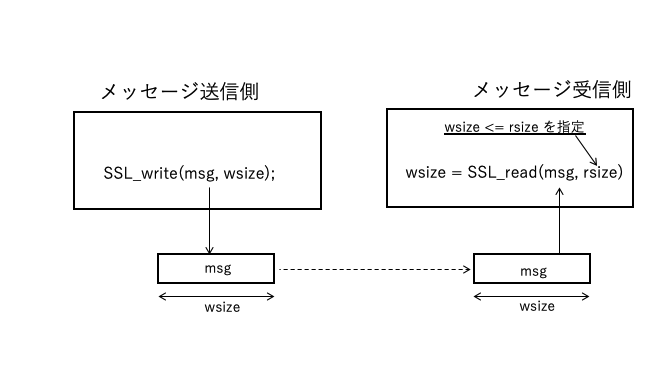
<br> <br>


The maximum TLS record is 16k bytes by default,
If you specify MAX Fragment and specify a smaller size for the maximum size of the TLS record, the above record size will also be that size.

If SSL_MODE_ENABLE_PARTIAL_WRITE is specified in SSL_CTX_set_mode, SSL_write will return the number of bytes when only a part of the message has been sent, if the entire message cannot be sent due to the status of the sending process.

<br> <br>
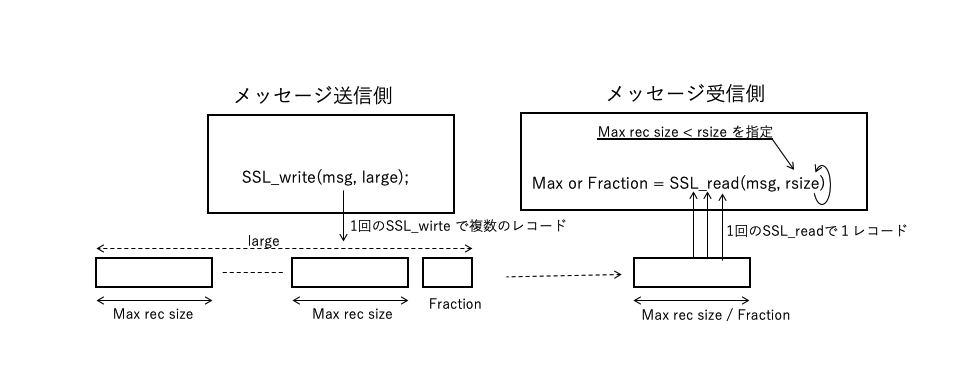
<br> <br>

See ### 6.1.5

| Classification | Name | Description |
|:--- |:--- |:--- |
| Server | SSLv23_server_method | Connect with the highest version supported by both |
|| TLSv1_3_server_method | Connect with TLS 1.3 |
|| TLSv1_2_server_method | Connect with TLS 1.2 |
|| TLSv1_1_server_method | Connect with TLS 1.1 |
|| TLSv1_server_method | Connect with TLS 1.0 |
| Client | SSLv23_client_method | Connect with the highest version supported by both |
|| TLSv1_3_client_method | Connect with TLS 1.3 |
|| TLSv1_2_client_method | Connect with TLS 1.2 |
|| TLSv1_1_client_method | Connect with TLS 1.1 |
|| TLSv1_client_method | Connect with TLS 1.0 |
| Server / Client | SSLv23_method | Connect with the highest version supported by both |
|| TLSv1_3_method | Connect with TLS 1.3 |
|| TLSv1_2_method | Connect with TLS 1.2 |
|| TLSv1_1_method | Connect with TLS 1.1 |
|| TLSv1_method | Connect with TLS 1.0 |


Table 6.1.1 SSL_CTX_new methods
<br> <br>

| Classification | Name | Description |
| --- | --- | --- |
| Settings | SSL_CTX_set_min_proto_version | Specify the lowest protocol version to use |
|| SSL_CTX_set_max_proto_version | Specify the highest protocol version to use |
| Reference | SSL_CTX_get_min_proto_version | Refer to the lowest configured protocol version |
|| SSL_CTX_get_man_proto_version | See the highest configured protocol version |

Table 6.1.2 Key APIs related to TLS versioning
<br> <br>

| Role | Function | Specified unit | With file system | Without file system |
|:--- |:--- | --- |:--- |:--- |
Authenticator | Load CA Certificate | Context | SSL_CTX_load_verify_locations | SSL_CTX_load_verify_buffer |
| | Specifying verification behavior | Context | SSL_CTX_set_verify | SSL_CTX_set_verify |
| | Specifying the depth of the certificate chain | Context | SSL_CTX_set_verify_depth | SSL_CTX_set_verify_depth |
Authenticated side | Load node certificate | Context | SSL_CTX_use_certificate_file | SSL_CTX_use_certificate_buffer |
||| Session | SSL_use_certificate_file | SSL_use_certificate_buffer |
| | Loading Private Keys | Context | SSL_CTX_use_privateKey_file | SSL_CTX_use_privateKey_buffer |
||| Session | SSL_use_privateKey_file | SSL_use_privateKey_buffer |


Table 6.1.3 APIs related to peer authentication
<br> <br> <br> <br>

<div style = "page-break-before: always"> </ div>

## 6.2 TLS extension

### 6.2.1 Overview

 In this sample, the TLS extension program of the ClientHello record is used for message communication by TLS. It is the same as the client sample program except for the setting of the TLS extension part.
 
 In the sample, set the following TLS extension.
| TLS extension type | setting value |
| --- | --- |
| Supported Versions | Minimum Protocol TLS1.2 Maximum Protocol TLS1.3 |
| Supported Group | P-521, P-384 and P-256 |
| Max Fragment Length | 1024 |
| SNI (Server Name Indication) | localhost |
| Signature Algorithm | RSA + SHA256 RSA + SHA384 RSA-PSS + SHA256 |

 The client also specifies `TLS13-AES128-GCM-SHA256` as the Cipher suite to use.
 If the server accepts the client's request, it will reply ServerHello and include the TLS extension as needed.
 
 <br> <br>
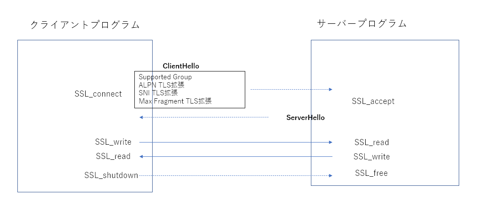
<br> <br>

### 6.2.2 Command format and usage example

The command format is the same as the client in "6.1 Client-server communication".


Start Wireshark and start the commands of both the server and the client.

Server side: <br>
$ ./Server-tls-exts

Client side: <br>
$ ./Client-tls-exts

Check the content of the Client Hello message.


The supported_versions extension contains only TLS 1.3, 1.2.

```
    Extension: supported_versions (len = 5)
        Type: supported_versions (43)
        Length: 5
        Supported Versions length: 4
        Supported Version: TLS 1.3 (0x0304)
        Supported Version: TLS 1.2 (0x0303)
```


The supported_groups extension includes P-521, P-384 and P-256.

```
    Extension: supported_groups (len = 8)
        Type: supported_groups (10)
        Length: 8
        Supported Groups List Length: 6
        Supported Groups (3 groups)
            Supported Group: secp521r1 (0x0019)
            Supported Group: secp384r1 (0x0018)
            Supported Group: secp256r1 (0x0017)
```

max_fragment_length is 1024.

```
    Extension: max_fragment_length (len = 1)
        Type: max_fragment_length (1)
        Length: 1
        Maximum Fragment Length: 1024 (2)
```

The specified "localhost" is set in the server_name extension.

```
Extension: server_name (len = 14)
    Type: server_name (0)
    Length: 14
    Server Name Indication extension
        Server Name list length: 12
        Server Name Type: host_name (0)
        Server Name length: 9
        Server Name: localhost
```

Padding with RSA + SHA256 RSA + SHA384 RSA-PSS + SHA256 algorithm for Signature Algorithm extension
Only PKCS 1.4 and PSS are included.

```
    Extension: signature_algorithms (len = 10)
        Type: signature_algorithms (13)
        Length: 10
        Signature Hash Algorithms Length: 8
        Signature Hash Algorithms (4 algorithms)
            Signature Algorithm: rsa_pkcs1_sha256 (0x0401)
                Signature Hash Algorithm Hash: SHA256 (4)
                Signature Hash Algorithm Signature: RSA (1)
            Signature Algorithm: rsa_pkcs1_sha384 (0x0501)
                Signature Hash Algorithm Hash: SHA384 (5)
                Signature Hash Algorithm Signature: RSA (1)
            Signature Algorithm: rsa_pss_rsae_sha256 (0x0804)
                Signature Hash Algorithm Hash: Unknown (8)
                Signature Hash Algorithm Signature: SM2 (4)
            Signature Algorithm: rsa_pss_pss_sha256 (0x0809)
                Signature Hash Algorithm Hash: Unknown (8)
                Signature Hash Algorithm Signature: Unknown (9)
```

The Cipher Suites extension contains only TLS_AES_128_GCM_SHA256.

```
Cipher Suites (1 suite)
    Cipher Suite: TLS_AES_128_GCM_SHA256 (0x1301)
```


### 6.2.3 Program
```
int main (int argc, char ** argv)
{

    ...
    Command argument processing, library initialization (same as 6.1 client)
    ...

    / * Secure SSL context and load CA certificate * /
        if ((ctx = SSL_CTX_new (SSLv23_client_method ())) == NULL)
    {Error handling}
        if ((ret = SSL_CTX_load_verify_locations (ctx, ca_cert, NULL))! = SSL_SUCCESS)
    {Error handling}

    / * Specify TLS1.3 as the maximum protocol version * /
        if ((ret = SSL_CTX_set_max_proto_version (ctx, TLS1_3_VERSION))! = SSL_SUCCESS)
    {Error handling}

    / * Specify TLS1.2 as the minimum protocol version * /
        if ((ret = SSL_CTX_set_min_proto_version (ctx, TLS1_2_VERSION))! = SSL_SUCCESS)
    {Error handling}

    / * Specifying cipher suites (TLS13-AES128-GCM-SHA256) * /
        if ((ret = SSL_CTX_set_cipher_list (ctx, CIPHER_LIST))! = SSL_SUCCESS)
    {Error handling}

    / * supported group TLS extension settings * /
        if ((ret = SSL_CTX_set1_groups_list (ctx, "P-521: P-384: P-256"))! = SSL_SUCCESS)
    {Error handling}

    / * signature algorithm TLS extended settings * /
        if ((ret = SSL_CTX_set1_sigalgs_list (ctx, "RSA + SHA256: RSA + SHA384: RSA-PSS + SHA256")))! = SSL_SUCCESS)
    {Error handling}

    ...
    Secure TCP connection, TLS connection object (same as 6.1 client)
    ...
    
    / * Set SNI TLS extension * /
        if ((ret = SSL_set_tlsext_host_name (ssl, "localhost"))! = SSL_SUCCESS)
    {Error handling}

    / * Max Fragment Length Set TLS extension * /
        if ((ret = SSL_set_tlsext_max_fragment_length (ssl, TLSEXT_max_fragment_length_1024))! = SSL_SUCCESS)
    {Error handling}


    Same as 6.1 client below
    ...

cleanup: cleanup:
    Freeing resources
}
```

### 6.2.4 Key APIs for TLS extensions

| TLS extension type | function name | description |
| --- | --- | --- |
| Supported Versions | SSL_CTX_set_max_proto_version <br> SSL_CTX_set_min_proto_version | Specify the maximum TLS protocol version available <br> Specify the minimum TLS protocol version available |
| Supported group | SSL_CTX_set1_groups_list | Specifies the curve list of the supported elliptic curve cryptography. <br> When specifying multiple, use ":" as the delimiter. |
| Signature algorithm | SSL_CTX_set1_sigalgs_list | Specifies the combination of signature algorithms to support. <br> Specify the combination of public key algorithm and hash algorithm by combining them with "+", or use a notation such as <br> rsa_pss_pss_sha256. <br> When specifying multiple, use ":" as the delimiter. |
| SNI | SSL_set_tlsext_host_name | Specify the host name. |
| ALPN | SSL_set_alpn_protos | Specifies the protocol used by ALPN. |

<div style = "page-break-before: always"> </ div>


## 6.3 Pre-shared key (PSK)

### 6.3.1 Overview


In this sample, TLS connection is performed using a pre-shared key and message communication is performed using TLS. The communication part of the application message after TLS connection is the same as the sample program of "6.1 Client / Server Communication".

For PSK connection, share a symmetric-key value that is used in some way other than TLS communication. You can use multiple keys. In that case, also decide on an identity for each key.

When SSL_connect is called by the client requesting a connection, the callback function registered in advance is called, and the identity and key value used for this connection are returned to the argument. In the received library, the key value is stored in the library, and only the identity is put on Client Hello and sent to the server side.

On the server side, when there is a PSK connection request from the client, the received identity is specified in the argument in the SSL_accept function and the callback function registered in advance is called. The callback function returns the key value corresponding to the identity specified in the argument to the argument. The library uses this value for PSK connections.

There are two modes of PSK, one is to use this key value directly and the other is to share the key by (EC) DHE based on the key value and obtain the session key. Normally, the latter is used for key sharing and the key value specified in the callback is not used directly. Again, the (EC) DHE parameters and public key are shown in the Client Hello and Server Hello Key Share extensions, so encryption begins immediately after Server Hello without sending any additional messages.


<br> <br>
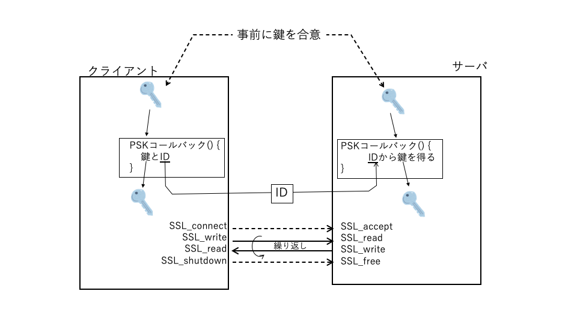
<br> <br>


### 6.3.2 Command format and usage example

The command format of the server and client is the same as "6.1 Client / Server Communication".

Here we will try a simple PSK connection with the server on the local host (Server-tls-psk). First, start the PSK server in the server window.


```
$ ./Server-tls-psk
Waiting for a connection ...
```

Next, when you start the PSK client in the client window, PSK connect to the server and enter the client-side identity name ("Client_identity").
Send to the server side. A PSK connection is established and an outgoing message prompt is output.

```
$ ./Client-tls-psk
Send to localhost (127.0.0.1)
Message to send:
```

At this point, the sent identity name ("Client_idenitity") and PSK connection establishment message are displayed on the server side.

```
Identity: Client_identity
Client connected successfully
```

At this point, the handshake message should look like the one below, and you can see that the message does not contain a certificate compared to 6.1.

<br> <br>
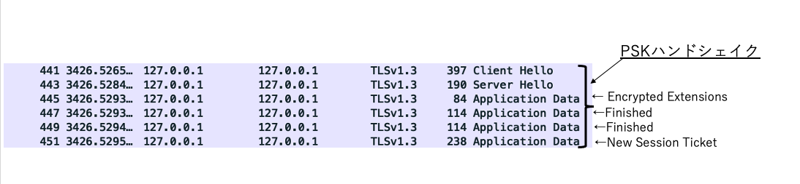
<br> <br>

You can also see that Client Hello contains the psk_key_exchange_modes extension, requesting a PSK connection from the client side.
It shows two options, PSK-only and PSK with (EC) DHE.

```
Extension: psk_key_exchange_modes (len = 3)
    Type: psk_key_exchange_modes (45)
    Length: 3
    PSK Key Exchange Modes Length: 2
    PSK Key Exchange Mode: PSK-only key establishment (psk_ke) (0)
    PSK Key Exchange Mode: PSK with (EC) DHE key establishment (psk_dhe_ke) (1)
```

The identity name is included in the Pre-Shared Key extension extension. "436c69656e745f6964656e74697479" is a callback
You can confirm that it is the specified "Client_identity".

```
Pre-Shared Key extension
    Identities Length: 21
    PSK Identity (length: 15)
        Identity Length: 15
        Identity: 436c69656e745f6964656e74697479
        Obfuscated Ticket Age: 0
    PSK Binders length: 33
    PSK Binders

```

On the other hand, Server Hello has a pre_shared_key extension, which indicates that ECDH secp256r1 has been agreed to key_share.


```
Handshake Protocol: Server Hello
    ...

    Extension: pre_shared_key (len = 2)
        Type: pre_shared_key (41)
        Length: 2
        Pre-Shared Key extension
            Selected Identity: 0
    Extension: key_share (len = 69)
        Type: key_share (51)
        Length: 69
        Key Share extension
            Key Share Entry: Group: secp256r1, Key Exchange length: 65
                Group: secp256r1 (23)
                Key Exchange Length: 65
                Key Exchange: 04631bfc0c693fce42e72a19beedf44bd8d9fcae6f1813f391fb7d591c29405f8563a876…
    ...

```

#### 6.3.3 Program


#### 1) Client


```
/ * PSK client callback * /
static inline unsigned int my_psk_client_cb (SSL * ssl, const char * hint,
        char * identity, unsigned int id_max_len, unsigned char * key,
        unsigned int key_max_len)
{
    / * Copy identity to argument * /
    strncpy (identity, kIdentityStr, id_max_len);
    / * Set pre-shared key in argument * /
    key = (unsigned char *) "\ x1a \ x2b \ x3c \ x4d";

    / * Return key length * /
        if (strlen ((const char *) key) <key_max_len) {
        return strlen ((const char *) key);
    }
    else {
        return 0;
    }
}


int main (int argc, char ** argv)
{
    ...
    Preprocessing (similar to 6.1 client sample)
    ...

    / * Secure SSL context and load CA certificate * /
        if (ctx = SSL_CTX_new (SSLv23_client_method ()) == NULL)
    {Error handling}

    / * PSK callback registration * /
    SSL_CTX_set_psk_client_callback (ctx, my_psk_client_cb);

    Same as the 6.1 client sample below
     ...

cleanup: cleanup:
    Freeing resources
}
```


#### 2) Server


```

/ * PSK server callback * /
static unsigned int my_psk_server_cb (SSL * ssl, const char * identity,
                           unsigned char * key, unsigned int key_max_len)
{

    / * Check if the received identity is what you expect * /
    printf ("Identity:% s \ n", identity);
        if (strncmp (identity, "Client_identity", 15)! = 0) {
        printf ("error! \ n");
        return 0;
    }

    / * Set pre-shared key in argument * /
    key = (unsigned char *) "\ x1a \ x2b \ x3c \ x4d";

    / * Return key length * /
        if (strlen ((const char *) key) <key_max_len) {
        return strlen ((const char *) key);
    }
    else {
        return 0;
    }
}


int main (int argc, char ** argv)
{
    ...
    Preprocessing (same as 6.1 server)
    ...

    / * Secure SSL context, load server certificate, private key * /
        if ((ctx = SSL_CTX_new (SSLv23_server_method ())) == NULL)
    {Error handling}
    
    / * PSK callback registration * /
    SSL_CTX_set_psk_server_callback (ctx, my_psk_server_cb);

    while (1) {

        ...
        TCP, TLS accept (same as 6.1 server)
        ...

        while (1) {

            ...
            Sending and receiving application messages (same as 6.1 server)
            ...

        }
    }

cleanup: cleanup:
    Free up resources (same as 6.1 server)
}
```

### Main management structures and APIs

--Registration of callback function

  Client side: SSL_CTX_set_psk_client_callback

      Register the callback function on the client side with the second argument. The callback function is called to get the pre-key and ID when calling SSL_connect. The pre-key is retained on the client side and only the ID is sent to the server side.

  Server side: SSL_CTX_set_psk_server_callback

      Register the server-side callback function with the second argument. The callback function is called during SSL_accept call-time processing. Since the ID received from the client is passed as an argument, the callback process returns the pre-key corresponding to the ID.


<div style = "page-break-before: always"> </ div>

## 6.4 Resume session

### 6.4.1 Overview

In this sample, message communication is performed by resuming the session.

Use two client programs, one for the first session (Client-tls-session) and one for session resumption (Client-tls-resume).
The server uses the server (Server-tls) of "6.1 Client-server communication" as it is.

In the first session, the client receives the session ticket from the server and saves it in a file.
The session resume client reads the session information saved in the file and uses it to resume.

<br> <br>
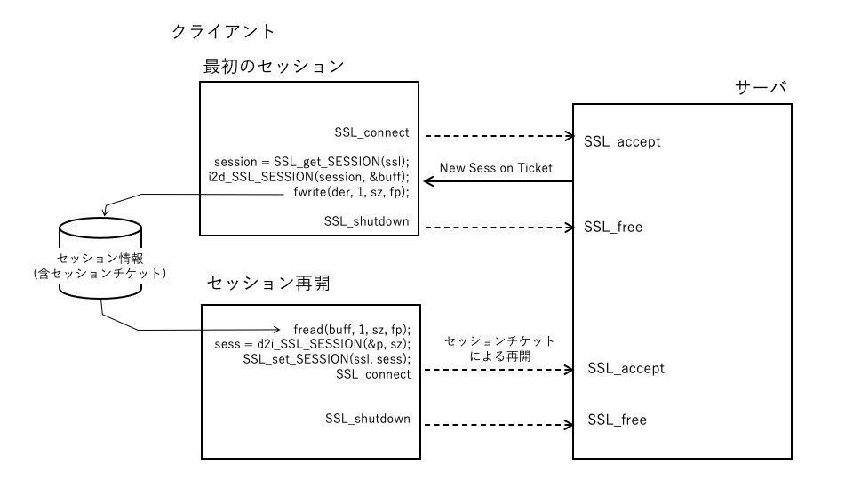
<br> <br>

When the client and server handshake is completed in the first session and a secure session is established, the server issues a New Session Ticket message.
It will be sent. The client stores the sent ticket in a file.

The client that resumes the session reads the ticket from the file at startup and registers it in the context. At the time of SSL_connect, the registered session ticket is
It is sent to the server and the server uses the ticket to resume the session.


### 6.4.2 Command format and usage example

The format of the command argument is the same as that of the server and client in "6.1 Server-Client Communication".

First, start the server side in the server window.

```
$ ./Server-tls
Waiting for a connection ...
```

Then launch the client for the first session and establish a session with a full handshake. At this time, a New Session Ticket is issued from the server.
Since it should have been sent, "break" will terminate the connection to the server. At this time, the session information is saved in a file (session.bin).


```
$ ./Client-session-tls
Send to localhost (127.0.0.1)
Message to send: Hello server
Received: I hear ya fa shizzle!
Message to send: break
End of TLS Client
```

On the server side as well, the message corresponding to the first session is output. After the end of the first session, it goes into the next connection waiting state.

```
Client connected successfully
Received: Hello server
Received: break
Received break command
Closed the connection
Waiting for a connection ...
```

At this point, you can see the full handshake and application message exchanges, even though they are encrypted on Wireshark.

<br> <br>
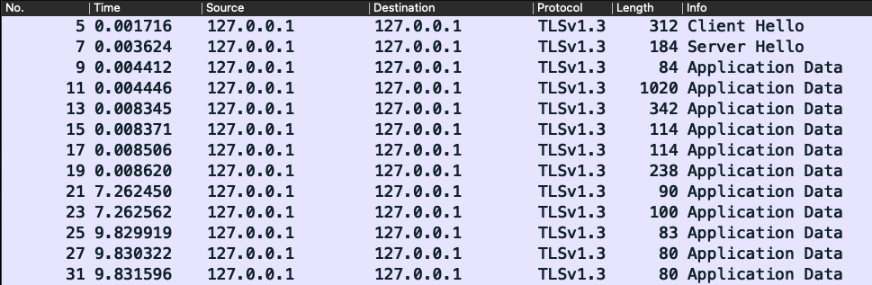
<br> <br>

Then launch the client to resume the session. This client reads the session information saved in the file earlier and executes the session restart.
When the session is resumed, you will be prompted to enter an outgoing message. Enter an appropriate message and click "break" to end the session.

```
$ ./Client-resume-tls
Send to localhost (127.0.0.1)
session.bin size = 255
Resuming session
Session is reused
Message to send: Hello again
Received: I hear ya fa shizzle!
Message to send: break
Sending break command
End of TLS Client
```

During that time, the received message is also displayed on the server side.

```
Client connected successfully
Received: Hello again
Received: break
Received break command
Closed the connection
Waiting for a connection ...
```

In the meantime, additional messages for session restart will be displayed on Wireshark as well.

<br> <br>
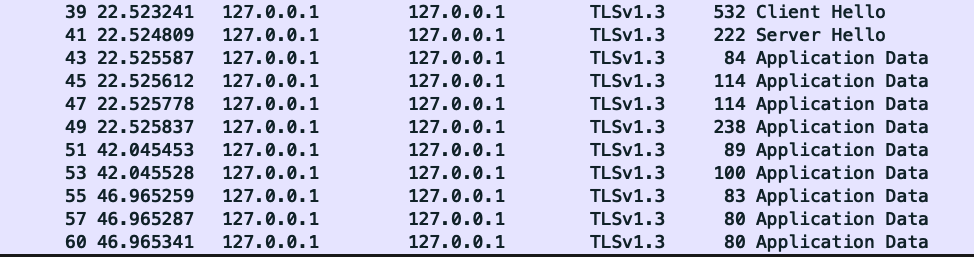
<br> <br>

However, if you look at the details of Client Hello and Server Hello, you can see that session resumption is realized in the same way as PSK in terms of protocol.

Client Hello:

```
TLSv1.3 Record Layer: Handshake Protocol: Client Hello
    ...
    
    Extension: psk_key_exchange_modes (len = 3)
        Type: psk_key_exchange_modes (45)
        Length: 3
        PSK Key Exchange Modes Length: 2
        PSK Key Exchange Mode: PSK-only key establishment (psk_ke) (0)
        PSK Key Exchange Mode: PSK with (EC) DHE key establishment (psk_dhe_ke) (1)
    Extension: key_share (len = 71)
        Type: key_share (51)
        Length: 71
        Key Share extension
            Client Key Share Length: 69
            Key Share Entry: Group: secp256r1, Key Exchange length: 65
                Group: secp256r1 (23)
                Key Exchange Length: 65
                Key Exchange: 0486fb0b50d08da72595027a3a7cc307f075008239e7cdbe9a7db50523aceb9eba5ac8a1…
    ...

    Extension: pre_shared_key (len = 185)
        Type: pre_shared_key (41)
        Length: 185
        Pre-Shared Key extension
            Identities Length: 148
            PSK Identity (length: 142)
                Identity Length: 142
                Identity: a574646e6cdf354513f74092c47a9074e8e4c7342942a70f3a171cf25c868013004c29b8…
                Obfuscated Ticket Age: 3369942077
            PSK Binders length: 33
            PSK Binders]

```


Server Hello:

```
TLSv1.3 Record Layer: Handshake Protocol: Server Hello
    ...

    Cipher Suite: TLS_AES_128_GCM_SHA256 (0x1301)
    ...
    Extension: pre_shared_key (len = 2)
        Type: pre_shared_key (41)
        Length: 2
        Pre-Shared Key extension
            Selected Identity: 0
    Extension: key_share (len = 69)
        Type: key_share (51)
        Length: 69
        Key Share extension
            Key Share Entry: Group: secp256r1, Key Exchange length: 65
                Group: secp256r1 (23)
                Key Exchange Length: 65
                Key Exchange: 04d9f17a76094cceefc17f43acc3ea255b909bb348b6204dfecdba4935953e5d8d688af0…

```

### 6.4.3 Program

#### 1) Client: First session


```
/ * Save session + /
static int write_SESS (SSL * ssl, const char * file)
{
        if ((fp = fopen (file, "wb")) == NULL)
    {Error handling}

    / * Convert session information to DER format * /
        if ((sz = i2d_SSL_SESSION (sess, & buff)) <= 0)
    {Error handling}
    
        if ((fwrite (buff, 1, sz, fp))! = sz)
    {Error handling}

cleanup: cleanup:
    Resource release
    ...
    
    return ret;
}

int main (int argc, char ** argv)
{

    ...
    Preprocessing (same as 6.1 client)
    ...

    while (1) {

        ...
        Enter message, send to server (same as 6.1 client)
        ...

        / * If the message is "break", save and end the session * /
            if (strcmp (msg, "break") == 0) {
            session = SSL_get_session (ssl);
            ret = write_SESS (session, SAVED_SESS);
            break;
        }

        ...
        Receive and display messages (same as 6.1 client)
        ...
    }

cleanup: cleanup:
    Freeing resources
}
```


 #### 2) Client: Session resume


```

/ * Read session * /
static int read_SESS (const char * file, SSL * ssl)
{
    ...
    File open, get file size (sz)
    ...

    / * Allocate a buffer and read session information * /
        if ((buff = (unsigned char *) malloc (sz)) == NULL ||
        (fread (buff, 1, sz, fp)! = sz))
        Error handling
    }
    
    printf ("% s size =% ld \ n", SAVED_SESS, sz);
    
    / * Convert session information from DER to internal format * /
    p = buff;
        if ((sess = d2i_SSL_SESSION (NULL, (const unsigned char **) & p, sz)) == NULL)
    {Error handling}
    
    / * Set session information * /
        if (sess! = NULL && (ret = SSL_set_session (ssl, sess)! = SSL_SUCCESS)) {
        print_SSL_error ("failed SSL session", ssl);
    } else {
       printf ("Resuming session \ n");
       ret = SSL_SUCCESS;
    }

cleanup: cleanup:
    Resource release
}

int main (int argc, char ** argv)
{
    ...
    Preprocessing (same as 6.1 client)
    ...

    / * Securing SSL objects * /
        if ((ssl = SSL_new (ctx)) == NULL)
    {Error handling}

    / * Read session information from file and set * /
        if ((ret = read_SESS (SAVED_SESS, ssl))! = SSL_SUCCESS)
    {Error handling}

    Same as 6.1 client below

cleanup: cleanup:
    Freeing resources
}
```

#### 6.4.4 Main management structures and APIs

- SSL_SESSION <br>
    - A structure that extracts and manages a set of information required for session restart, such as session tickets, from the connection information managed by the SSL structure.

- Securing, setting and releasing structures <br>
    - Securing: SSL_get_SESSION () <br>
        Extract the set of data required to restart the session from the connection information of the SSL structure in the form of the SSL_SESSION structure. At that time, the area required for the SSL_SESSION structure is secured and the pointer is returned. SSL_get_SESSION is called after the client performs SSL_connect and while a secure TLS connection is in place.
    - Setting: SSL_set_SESSION () <br>
        Set the SSL_SESSION structure retrieved by SSL_get_SESSION to the SSL structure for session restart. Call SSL_set_SESSION before doing SSL_connect on the client.
    - Release: SSL_SESSION_free () <br>
        Free the SSL_SESSION structure.
Twice
- Structure data conversion <br>
    - From ANS1 format to internal format: d2i_SSL_SESSION <br>
        d2i_SSL_SESSION reconstructs the data of the SSL_SESSION structure saved in ASN1 format into the SSL_SESSION structure in the internal format and returns the pointer.

    - From internal format to ASN1 format: i2d_SSL_SESSION <br>
        i2d_SSL_SESSION converts internal format SSL_SESSION structure data to ASN1 format data. The conversion data allocates and sets the required memory for the pointer passed in the second argument. The return value of the function returns the length required for ASN1 format conversion. Even if NULL is passed as the second argument, the return value of the function returns the length required for ASN1 format conversion.


## 6.5 Early Data (0-RTT)

### 6.5.1 Overview
 In this sample, message communication by Early Data (0-RTT) is performed based on the sample program of 6.4 session restart.


### Early Data Precautions for use

Early Data uses the key of the previous session and therefore has low forward secrecy and should not be used to send or receive critical information. Also, there are some weak points against replay attacks, so
In a practical program, it is also necessary to consider in advance that the sender / receiver can determine the application-side replay attack based on some agreement on the content of the data.
Please note that the sample program here is only for basic functions in order to understand the basic functions, and no such consideration is given.

### 6.5.2 Command format and usage example

The command execution procedure is the same as in "6.4 Resuming Session".

Start the server (Server-tls-eld) in a server-side window and run the first session (Client-tls-session) on the client side.

```
$ ./Server-tls-eld
Waiting for a connection ...
Client connected successfully
Received: Hello server
Received: break
Received break command
Closed the connection
Waiting for a connection ...
```


```
$ ./Client-tls-session
Send to localhost (127.0.0.1)
Message to send: Hello server
Received: I hear ya fa shizzle!
Message to send: break
End of TLS Client
```

When the first session is terminated, the server side waits for the next session, so use the session resume client (Client-tls-eld) with Early Data.
start up. Early Data is sent when the session resumes and you are prompted to enter an application message. Enter a message
End the session.

```
$ ./Client-tls-eld
Send to localhost (127.0.0.1)
session.bin size = 263
Resuming session
Early Data: good early morning
Session is reused
Early Data was accepted
Message to send: Hello again
Received: I hear ya fa shizzle!
Message to send: break
Sending break command
End of TLS Client
```

On the server side, the Early Data and application messages received by resuming the session are displayed.

```
Early Data Client message: good early morning
Client connected successfully
Received: Hello again
Received: break
Received break command
Closed the connection
Waiting for a connection ...
```

During this time, if you are monitoring the packet with Wireshark, you can capture the packet as shown below in the session restart part in the latter half.


Client Hello contains an early_data extension, indicating that Early Data is present in this session.

```
Extension: early_data (len = 0)
    Type: early_data (42)
    Length: 0

```

You can see that Client Hello is followed by Early Data encrypted in the same format as a regular Application Data record.

<br> <br>
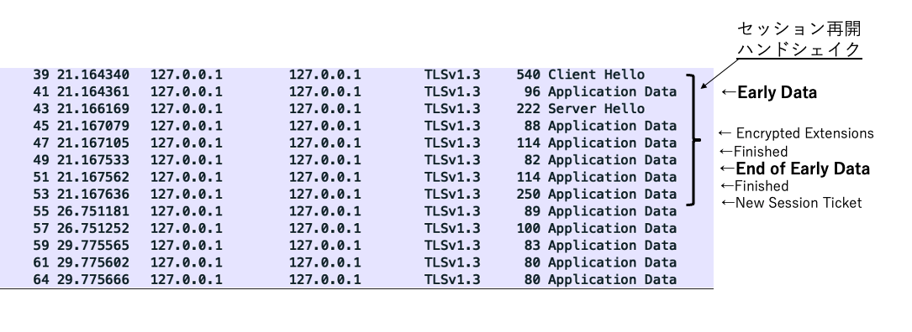
<br> <br>

Also, compared to the normal session restart packet seen in "6.4 Session Resume", the Early Data before Finished from the client.
An "End of Early Data" message has also been added to indicate the end.


### 6.5.3 Program

 1) Client: First session
 
This is the first session on the client side. After TLS connection, save session information including s session ticket at an appropriate timing. This program uses the 6.1 client as is.


 2) Client: Session resume

This client program resumes the session with the server and sends Early Data (0-RTT) when it resumes. The flow of session restart except for the part related to Early Data is the same as the session restart client for 6.4 session restart.


```


/ * Get Ealy Data (0-RTT) status * /
static void EarlyDataStatus (SSL * ssl)
{
    if (earlyData_status <0) return;
    
    printf ("Early Data is");
    
    switch (earlyData_status) {
        case SSL_EARLY_DATA_NOT_SENT:
                printf ("not sent. \ N");
                break;
        case SSL_EARLY_DATA_REJECTED:
                printf ("rejected. \ n");
                break;
        case SSL_EARLY_DATA_ACCEPTED:
                printf ("accepted \ n");
                break;
        default: default:
                printf ("unknown ... \ n");
    }
}

/ * Send Ealy Data (0-RTT) * /
static int writeEarlyData (SSL * ssl, const char * msg, size_t msgSz)
{
    / * Export Ealry Data * /
    ret = SSL_write_early_data (ssl, msg, msgSz, & writtenbytes);
        if (msgSz! = writtenbytes || ret <= 0)
        Error handling
    else else
        ret = SSL_SUCCESS;
    return ret;
}

int main (int argc, char ** argv)
{
    ...
    Preprocessing (same as 6.4 session restart client)
    ...

    if (writeEarlyData (ssl, kEarlyMsg, sizeof (kEarlyMsg) -1))! = SSL_SUCCESS)
    {Error handling}

    if ((ret = SSL_connect (ssl))! = SSL_SUCCESS) {
     {Error handling}

    / * Check the status of Early Data * /
    EarlyDataStatus (ssl);


    / * Sending and receiving application messages * /
    while (1) {
        ...
        6.4 Same as client for session restart
        ...
    }

cleanup: cleanup:
    Freeing resources
}

```
3) Early Data \ reception on the server side

```
static void ReadEarlyData (SSL * ssl)
{
    do {
         .....
         / * Read Early Data * /
         ret = SSL_read_early_data (ssl, early_data, sizeof (early_data) -1, & len);
            if (ret <= 0) {
             Error handling
         }
         / * Display received Early Data * /
        if (len> 0) {
            early_data [len] ='\ 0';
            printf ("Early Data Client message:% s \ n", early_data);
        }
      } while (ret> 0);

}
int main (int argc, char ** argv)
{

    ...
    Preprocessing (same as 6.5 session restart server)
    ...

    while (1) {

        ...
        TCP accept (same as 6.5 session resume server)
        ...

        / * Receiving Early Data * /
        if ((ret = SSL_set_max_early_data (ssl, MAX_EARLYDATA_SZ))! = SSL_SUCCESS)
        {Error handling}

        / * Receive Early Data * /
        ReadEarlyData (ssl);

        / * TLS Accept * /
        if ((ret = SSL_accept (ssl))! = SSL_SUCCESS)
        {Error handling}
        
        while (1) {

            ...
            Sending and receiving application messages (same as 6.5 session restart server)
            ...

        }
    }

cleanup: cleanup:
    Free resources (same as 6.5 session resume server)
}

```

### 6.5.4 Program description:

Except for the Early Data processing part, the processing is the same as 6.5 Session Resume.


- Sending Early Data when resuming client-side session: SSL_write_early_data <br>

    Sends Early Data when the TLS session resumes. The transmission is part of the session resume handshake and is in Early Data.
    The function returns when the transmission is complete. It then calls SSL_connect to complete the rest of the handshake.

- Reception of Early Data when resuming a server-side session: SSL_read_early_data <br> 
