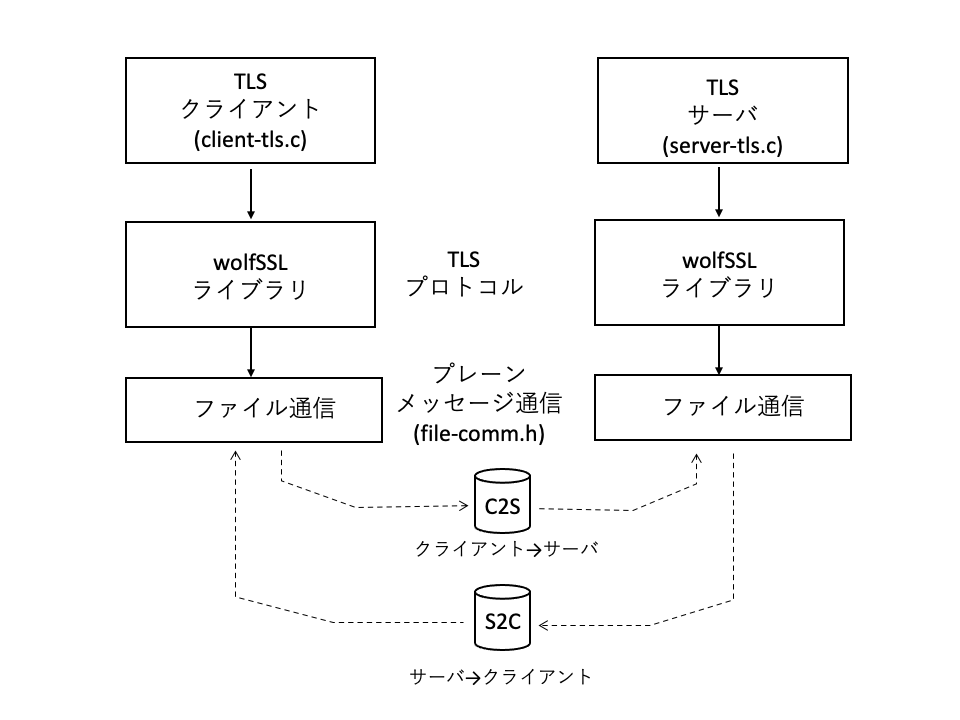

# 8. Program structure

wolfSSL is designed so that the library can be used in applications under various implementation situations and program structures and environments. From that perspective, this chapter introduces a sample program that uses the wolfSSL-specific API.

--Original network messaging

By default, wolfSSL assumes BSD Socket as the transport layer API. You can also choose from a variety of APIs as options, but you can also create your own network callbacks to accommodate those who want to use other proprietary API platforms. This sample program introduces an API for simple interprocess communication via a file as an example.

--Platform without file system

Small embedded systems often do not have a file system. In wolfSSL, files such as certificates and keys for peer authentication at the time of TLS connection can be placed and used in the memory buffer. This sample program introduces an example of using the API for that purpose.

--Non-blocking

In multithreaded programming, there are cases where care must be taken not to block thread execution. This sample shows an example of making a TLS connection non-blocking.

--Super Loop

On many RTOS-less systems, write the entire program as one big event loop (super loop). This example shows how to use the library in such cases.


## 8.1 Proprietary network messaging

### 8.1.1 Feature overview:

This sample program introduces an example of a TLS client and server by file communication as an example of using a unique API for the message communication layer. The sample program is based on the client and server of "6.1 Client / Server Communication" with modifications for file communication.


<br> <br>

<br> <br>

As shown in the figure, the wolfSSL library uses simple file communication as plain message communication to achieve TLS communication. The program for file communication is defined in file-comm.h and is included as a header file for TLS clients and servers.

The TLS client and server programs first register the message sending and receiving functions for file communication in the library.


### 8.1.2 Program:

#### 1) Client

```
client-tls.c:

int main (void)
{
    / * Secure SSL context * /
    if ((ctx = SSL_CTX_new (SSLv23_client_method ())) == NULL) {
        Error handling
    }

    / * Register callback * /
    wolfSSL_SetIORecv (ctx, fileCbIORecv);
    wolfSSL_SetIOSend (ctx, fileCbIOSend);

    / * Create SSL object * /
    if ((ssl = SSL_new (ctx)) == NULL) {
        fprintf (stderr, "ERROR: failed to create an SSL object \ n");
        goto cleanup;
    }

    / * Open communication channel * /
    fsend = open (C2S, O_WRONLY | O_NOCTTY);
    frecv = open (S2C, O_RDONLY | O_NOCTTY);

    / * Register communication channel as context * /
    wolfSSL_SetIOReadCtx (ssl, & frecv);
    wolfSSL_SetIOWriteCtx (ssl, & fsend);

    / * SSL connection to server * /
    if ((ret = SSL_connect (ssl))! = SSL_SUCCESS) {
        Error handling
    }
It was
    Below, the same as a normal client

}
```

#### 2) File communication

```
file-comm.h:

/ * Define the file name used as the communication channel * /
#define C2S "c2s.com"
#define S2C "s2c.com"

/ * File descriptor for files used for communication * /
static int fsend;
static int frecv;

/ * Receive message * /
static int fileCbIORecv (WOLFSSL * ssl, char * buf, int sz, void * ctx)
{
    while (ret <= 0) {
        ret = (int) read (frecv, buf, (size_t) sz);
    }
    return ret;
}

/* Send Messege */
static int fileCbIOSend (WOLFSSL * ssl, char * buf, int sz, void * ctx)
{
    return (int) write (fsend, buf, (size_t) sz);
}
```

### 8.2.3 Program Description:

#### 1) Header file

file-comm.h: <br>

The message reception function fileCbIORecv and the transmission function fileCbIOSend are defined as interprocess communication using files. It uses two files, a client-to-server communication channel (macro name C2S) and a server-to-client communication channel (S2C).

These files are opened in O_NOCTTY mode on the application side before SSL connection to obtain a descriptor, and are registered in the library using the registration API of the SSL connection context.


#### 2) Main API

--Message sending / receiving function:

The function prototype of the message send / receive function has the following 4 arguments.


typedef int (* CallbackIORecv) (WOLFSSL * ssl, char * buf, int sz, void * ctx);

typedef int (* CallbackIOSend) (WOLFSSL * ssl, char * buf, int sz, void * ctx);

ssl: SSL connection descriptor

buf: Send / receive message buffer

sz: size of incoming and outgoing messages

Return value:

```
    If successful, the size of the message sent or received
    In case of abnormal termination, an error code will be returned.
    WOLFSSL_CBIO_ERR_TIMEOUT: Timeout
    WOLFSSL_CBIO_ERR_CONN_RST: Connection reset
    WOLFSSL_CBIO_ERR_ISR: Interrupt
    WOLFSSL_CBIO_ERR_CONN_CLOSE: Connection closed
    WOLFSSL_CBIO_ERR_GENERAL: Other errors
```

Processing for non-blocking:

    When message communication operates non-blocking, if 1 byte or more can be sent and received, the number of bytes for which message transmission or reception has been completed is returned as the return value. If the number of bytes sent or received is 0, WOLFSSL_CBIO_ERR_WANT_READ or WOLFSSL_CBIO_ERR_WANT_WRITE is returned. In this case, the next outgoing callback call will call the callback with the remaining messages to be sent and their bytes, and the incoming callback with the remaining bytes to be received in the argument.

    In case of abnormal termination, an error code will be returned.


--Registration of message send / receive function:

API to register message send / receive function for SSL context.

    wolfSSL_SetIORecv: Message receiving function registration

    wolfSSL_SetIOSend: Message sending function registration


--Registration of SSL connection context:

The message communication channel is normally allocated dynamically for each connection. Therefore, it is necessary to register the secured channel descriptor and other information in the library as a communication context for each connection. The registered context is passed as the 4th argument of the message send / receive function, so it can be used for communication within the send / receive function.

API when the context is different for sending and receiving

    wolfSSL_SetIOReadCtx: Register Incoming Context

    wolfSSL_SetIOWriteCtx: Register Outgoing Context

API when the context is the same for sending and receiving

    wolfSSL_set_fd: Registration of common context for sending and receiving


## 8.2 Platforms without file system

### 8.2.1 Program

For systems that do not implement a file system, such as small embedded systems, there is an API that can store and use data with the same contents as a certificate file in a memory buffer. This sample program shows examples of their use.

The client example uses wolfSSL_CTX_load_verify_buffer, which corresponds to wolfSSL_CTX_load_verify_locations.

The server-side example uses wolfSSL_CTX_use_certificate_buffer, which corresponds to wolfSSL_CTX_use_certificate_file, and wolfSSL_CTX_use_PrivateKey_buffer, which corresponds to wolfSSL_CTX_use_PrivateKey_file.


#### Client

```

client-tls.c:

#define USE_CERT_BUFFERS_2048
#include "wolfssl / certs_test.h"

#define CA_CERT ca_cert_der_2048
#define SIZEOF_CA_CERT sizeof_ca_cert_der_2048


int main (int argc, char ** argv)
{
    
    if ((ctx = SSL_CTX_new (SSLv23_client_method ())) == NULL) {
        Error handling
    }

    / * Load the CA certificate into the context * /
    if ((ret = wolfSSL_CTX_load_verify_buffer)
         (ctx, CA_CERT, SIZEOF_CA_CERT, SSL_FILETYPE_ASN1))! = SSL_SUCCESS) {

             Error handling
    }

    ...

}
```

#### Server

```
server-tls.c:


#define USE_CERT_BUFFERS_2048
#include "wolfssl / certs_test.h"

#define SERVER_CERT server_cert_der_2048
#define SIZEOF_SERVER_CERT sizeof_server_cert_der_2048
#define SERVER_KEY server_key_der_2048
#define SIZEOF_SERVER_KEY sizeof_server_key_der_2048


int main (int argc, char ** argv)
{

    / * Create and initialize an SSL context object * /
    if ((ctx = SSL_CTX_new (SSLv23_server_method ())) == NULL) {
        Error handling
    }

    / * Load server certificates to the SSL context object * /
    if ((ret = wolfSSL_CTX_use_certificate_buffer (ctx, SERVER_CERT, SIZEOF_SERVER_CERT,)
        SSL_FILETYPE_ASN1))! = SSL_SUCCESS) {
            Error handling
    }

    / * Load server key into the SSL context object * /
    if ((ret = wolfSSL_CTX_use_PrivateKey_buffer (ctx, SERVER_KEY, SIZEOF_SERVER_KEY,)
        SSL_FILETYPE_ASN1))! = SSL_SUCCESS) {
            Error handling
    }
    
    ...
}
s
```

### 8.2.2 Related API

wolfSSL supports APIs for loading certificates and keys as shown in the table. Each has both a file and a load from the memory buffer.

<br> <br>
! [Fig. 8-2] (./fig8-2.jpg)
<br> <br>

#### API Arguments

Loading from a Buffer The API argument specifies a pointer to a buffer, a size, and a file type. The buffer contains exactly the same bytes as the contents of the file. Specify DER or PEM as the file type.


DER: SSL_FILETYPE_ASN1

PEM: SSL_FILETYPE_PEM


### 8.2.3 Sample data

Sample data is provided in wolfssl / certs_test.h for easy use during application development. The data corresponds to the filename of the sample certificate file under the certs directory, and the naming rules shown in the example below provide C language default data and its size constants.


certs / ca-cert.der: ca_cert_der_2048, sizeof_cert_der_2048

certs / 1024 / ca-cert.der: ca_cert_der_1024, sizeof_cert_der_1024


The data is grouped into RSA 2048, 1024, ECC 256-bit ones, and the group is enabled by defining the macro corresponding to the group to be used.


RSA 2048 bits: USE_CERT_BUFFERS_2048

RSA 1024 bits: USE_CERT_BUFFERS_1028

ECC 256 bits: USE_CERT_BUFFERS_256


## 8.3 Non-blocking

### 8.3.1 Feature overview:

When SSL connection or message communication is performed in multi-thread processing, the processing may be blocked due to waiting for a message from the other party in the connection or communication processing API. In such a case, the OS gives control to other processes, so other processes are not affected in execution, but threads must be explicitly given execution rights. To do this, you need to run the library API non-blocking. This sample introduces an example of non-blocking operation with TLS connection and message communication.

wolfSSL's TLS connection, TCP connection by socket in message communication processing, processing is not blocked except for sending and receiving messages. Therefore, basically, by specifying the operation mode of the TCP socket as non-block (O_NONBLOCK), it can be operated non-block as the operation of the TLS layer.

In case of non-blocking operation, API for TLS connection and communication (wolfSSL_connect / accept, wolfSSL_read / writhe) informs the processing status by API return value and detailed error value. If it is in the middle of processing, the API return location will return an error (negative value)), and the detailed error value will return WOLFSSL_ERROR_WANT_READ or WOLFSSL_ERROR_WANT_WRITE, but these are not abnormal processing and are processed normally but the processing is still completed. Indicates that you have not. In this case, the application needs to call the same API repeatedly at an appropriate timing.

When the process is completed, the API return location returns normally (SSL_SUCCESS).

### 8.3.2 Program:

```
int main (...)
{
    ...

    / * Socket layer non-blocking mode setting * /
    if ((sockfd = socket (AF_INET, SOCK_STREAM, 0)) == -1) {
        / * Error handling * /
    }

    / * Set the socket options to use nonblocking I / O * /
    if (fcntl (sockfd, F_SETFL, O_NONBLOCK) == -1) {
        / * Error handling * /
    }

    while (connect (sockfd, (struct sockaddr *) & servAddr, sizeof (servAddr))
           == -1) {
        if (errno == EAGAIN || errno == EWOULDBLOCK) {
            / * non-blocking connect, wait for read activity on socket * /
            result = select (nfds, recvfds, sendfds, & errfds, & timeout);
            tcp_select (sockfd, CONNECT_WAIT_SEC, 1);
            continue; continue;
        }
        else if (errno == EINPROGRESS || errno == EALREADY) {
            break;
        }
        / * Error handling * /
    }

    ...

    if ((ssl = wolfSSL_new (ctx)) == NULL) {
        / * Error handling * /
    }

    / * TLS connection * /
    do {
        ret = wolfSSL_connect (ssl);
        err = wolfSSL_get_error (ssl, ret);
        if (err == WOLFSSL_ERROR_WANT_READ)
            tcp_select (sockfd, SELECT_WAIT_SEC, 1);
    } while (err == WOLFSSL_ERROR_WANT_READ || err == WOLFSSL_ERROR_WANT_WRITE);
  
    if (ret! = WOLFSSL_SUCCESS) {
        / * Error handling * /
    }


    / * Send TLS message * /
    do {
        ret = wolfSSL_write (ssl, buff, len);
        err = wolfSSL_get_error (ssl, ret);
    }
    while (err == WOLFSSL_ERROR_WANT_WRITE);
    if (ret <0) {
        / * Error handling * /
    }

    / * Receive TLS message * /
    do {
        ret = wolfSSL_read (ssl, buff, sizeof (buff) -1);
        err = wolfSSL_get_error (ssl, ret);
    } while (err == WOLFSSL_ERROR_WANT_READ);
    if (ret <0) {
        / * Error handling * /
    }
    ...
}

```


## 8.4 Super Loop


### 8.4.1 Feature overview:

Some embedded systems run everything as a single program on bare metal without an RTOS. In that case, the whole is called a super loop, and the whole is made into one big infinite loop, and the program is configured by calling the necessary processing (task) in it. This example program shows how to use the wolfSSL library in such cases, using the TLS client as an example. However, this example is designed to run as a process (program) on Linux rather than bare metal so that the reader can easily try out the program.

Also, for ease of evaluation, this example uses BSD Socket for TCP layer communication. 4.3 As explained in Non-blocking, wolfSSL's TLS connection, TCP connection by socket in message communication processing, processing is not blocked except for sending and receiving messages. Therefore, basically, by specifying the operation mode of the TCP socket as non-block (O_NONBLOCK), it can be operated non-block as the operation of the TLS layer.

If you want to use your own TCP layer, refer to 8.1 Proprietary Network Messaging to create and register a message send / receive function.

In case of non-blocking operation, API for TLS connection and communication (wolfSSL_connect / accept, wolfSSL_read / writhe) informs the processing status by API return value and detailed error value. If it is in the middle of processing, the API return location will return an error (negative value)), and the detailed error value will return WOLFSSL_ERROR_WANT_READ or WOLFSSL_ERROR_WANT_WRITE, but these are not abnormal processing and are processed normally but the processing is still completed. Indicates that you have not. In this case, the application needs to call the same API repeatedly at an appropriate timing.

When the process is completed, the API return location returns normally (SSL_SUCCESS).

As in this sample, the wolfSSL library will run single-threaded when running the program as part of a superloop. When building the library, specify --enable-singlethreaded (SINGLE_THREADED) to build.

The client sample program has the same behavior on the application as the client program introduced in 6.2. Connect to the sample program of the server of 6.2 and operate it.

### 8.4.2 Program:

Defines state constants, state management blocks and their initialization functions (stat_init) for managing the state of the application.

```
enum
{
    CLIENT_BEGIN,
    CLIENT_TCP_CONNECT,
    CLIENT_SSL_CONNECT,
    CLIENT_SSL_WRITE,
    CLIENT_SSL_READ,
    CLIENT_END
};;

typedef struct {
    int stat;
    int sockfd;
    char ipadd [32];
    SSL_CTX * ctx;
    SSL * ssl;
} STAT_client;

void stat_init (STAT_client * stat)
{
    stat-> stat = CLIENT_BEGIN;
    stat-> sockfd = -1;
    stat-> ctx = NULL;
    stat-> ssl = NULL;
}


```

client_main is the main body of client processing that operates non-blocking. This function is called from the super loop of the main function. In this function
Proceed with TLS client processing while making state transitions in the following order.

```
CLIENT_BEGIN: TCP, TLS initialization
CLIENT_TCP_CONNECT: TCP connection
CLIENT_SSL_CONNECT: SSL connection
CLIENT_SSL_WRITE: Send SSL message
CLIENT_SSL_READ: Receive SSL message
```
The state of the connection is stored in stat-> stat, so when client_main is called, the switch (stat-> stat) at the beginning will jump to the current state.
At the beginning of the program, the state is initialized to CLIENT_BEGIN, so when this function is called first, it goes into CLIENT_BEGIN. Library initialization
Prepare for SSL context, TCP context, etc. At this time, set the socket to non-block mode.

When ready, change the state to CLIENT_TCP_CONNECT. This will cause the next time this function is called from CLIENT_TCP_CONNECT
Will run.

Since there is no break statement at the end of the Case statement, the process goes directly to the next CLIENT_TCP_CONNECT (FALLTHROUG is a blank statement to indicate that).
CLIENT_TCP_CONNECT calls connect for a TCP connection. connect works in non-block mode. Client makes a connection request
Since it takes some time for the connection to be established after sending, the return value of the first connect function is usually -1,
errno returns with EAGAIN or EWOULDBLOCK. This is not a processing error, the processing of the connect function has not been completed,
Indicates that another call is required. Client_main returns SSL_CONTINUE to indicate that the superloop needs the next call.

In the super loop of the main function, the return value is SSL_CONITNUE, so call client_main again in the next loop.

In client_main, the state is CLIENT_TCP_CONNECT, so jump to case CLIENT_TCP_CONNECT with a switch statement and press the connect function again.
Call. In this way, non-blocking functions are called repeatedly until processing is complete.

When the process is complete, connnect returns with normal termination, so the while loop ends and the next step is taken. Secure SSL objects and complete preparations
Set the state to the following CLIENT_SSL_CONNECT: Since there is no break statement, enter the next case statement and call SSL_connect. Even with SSL_connect
As with TCP connect, it must be called repeatedly until the process is complete. If the return value of SSL_connect is not SSL_SUCCESS
Determine it with SSL_want (stat-> ssl).

In client_main, in this way, we will proceed with processing while transitioning the state.

```
int client_main (STAT_client * stat)
{
    switch (stat-> stat) {
    case CLIENT_BEGIN:
        / * Library initialization * /
        / * Secure SSL context * /
        if ((stat-> ctx = SSL_CTX_new (SSLv23_client_method ())) == NULL) {
            / * Error handling * /
        }

        / * Secure and initialize TCP Socket * /
        if ((stat-> sockfd = socket (AF_INET, SOCK_STREAM, 0)) == -1) {
            / * Error handling * /
        }
        / * Set socket to non-block mode * /
        fcntl (stat-> sockfd, F_SETFL, O_NONBLOCK); / * Non-blocking mode * /

        stat-> stat = CLIENT_TCP_CONNECT;
        FALLTHROUGH;

    case CLIENT_TCP_CONNECT:
        / * TCP connection * /
        while ((ret = connect (stat-> sockfd, (struct sockaddr *) & servAddr, sizeof (servAddr))) == -1) {
            if (errno == EAGAIN || errno == EWOULDBLOCK) {
                return SSL_CONTINUE;
            }
            else if (errno == EINPROGRESS || errno == EALREADY) {
                break;
            }
            / * Error handling * /
        }

        / * Secure SSL object * /
        if ((stat-> ssl = wolfSSL_new (stat-> ctx)) == NULL) {
            / * Error handling * /
        }

        / * Register socket fd with SSL object * /
        if ((ret = SSL_set_fd (stat-> ssl, stat-> sockfd))! = SSL_SUCCESS) {
            / * Error handling * /
        }

        stat-> stat = CLIENT_SSL_CONNECT;
        FALLTHROUGH;
    case CLIENT_SSL_CONNECT:

        / * SSL connection request * /
        if ((ret = SSL_connect (stat-> ssl))! = SSL_SUCCESS) {
            if (SSL_want (stat-> ssl) == SSL_WRITING ||
                SSL_want (stat-> ssl) == SSL_READING) {
                return SSL_CONTINUE;
            }
             / * Error handling * /
        }
        printf ("\ n");

        / * Sending and receiving messages from the application layer * /
        while (1) {

            printf ("Message to send:");
            if (fgets (msg, sizeof (msg), stdin) <= 0)
                break;

            stat-> stat = CLIENT_SSL_WRITE;
            FALLTHROUGH;

    case CLIENT_SSL_WRITE:
        if ((ret = SSL_write (stat-> ssl, msg, strlen (msg))) <0) {
            if (SSL_want (stat-> ssl) == SSL_WRITING) {
                return SSL_CONTINUE;
            }
            / * Error handling * /
        }
        printf ("\ n");
        if (strcmp (msg, "break \ n") == 0) {
            printf ("Sending break command \ n");
            ret = SSL_SUCCESS;
            goto cleanup;
        }

        stat-> stat = CLIENT_SSL_READ;
        FALLTHROUGH;
    case CLIENT_SSL_READ:
            if ((ret = SSL_read (stat-> ssl, msg, sizeof (msg) -1)) <0) {
                if (SSL_want (stat-> ssl) == SSL_READING) {
                    return SSL_CONTINUE;
                }
            / * Error handling * /
            }
            printf ("\ n");
            msg [ret] ='\ 0';
            printf ("Received:% s \ n", msg);
            ret = SSL_CONTINUE;
        }
    }

    / * Post-processing * /

}
```

Create a super loop in the main function. Call repeatedly as long as the return value of client_main is SSL_CONTINUE.


```
int main (int argc, char ** argv)
{
    STAT_client stat;

    stat_init (& stat);

    / * Supper Loop * /
    while (1)
        if (client_main (& stat)! = SSL_CONTINUE)
            break;

}
``` 
