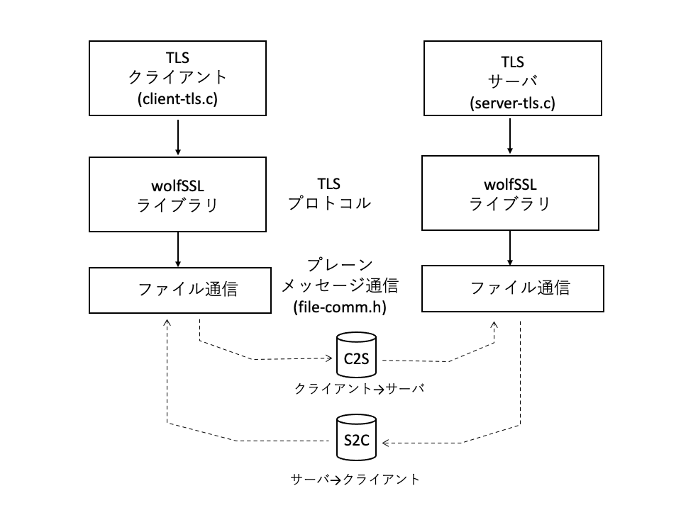
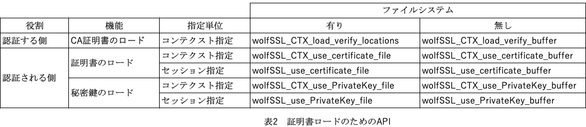

# 8. プログラム構造

wolfSSLではさまざまな実装状況に応じたプログラム構造や環境下のアプリケーションでライブラリを使用できるように配慮されています。この章ではそうした観点からwolfSSL固有のAPIを使用したサンプルプログラムを紹介します。

- 独自ネットワークメッセージング

wolfSSLのデフォルトではトランスポート層APIとしてBSD Socketを想定しています。また各種のAPIをオプションとして選択することができますが、その他の独自のAPIのプラットフォームを使用したい場合にも対応できるようにユーザー独自のネットワークコールバックを登録することができます。このサンプルプログラムではファイル経由の簡単なプロセス間通信のAPIを例として紹介します。

- ファイルシステムのないプラットフォーム

小型の組み込みシステムではファイルシステムを持たないケースも多々あります。wolfSSLではTLS接続時のピア認証のための証明書、鍵などのファイルをメモリーバッファー上に置き利用することができるように配慮されています。このサンプルプログラムはそのためのAPIの利用例を紹介します。

- ノンブロッキング

マルチスレッドプログラミングにおいては、スレッドの実行がブロックされないように配慮しなければならないケースがあります。このサンプルではTLS接続をノンブロッキングで行う例を紹介します。

- スーパーループ

多くのRTOSを使用しないシステムではプログラム全体を1つの大きなイベントループ(スーパーループ)として記述します。この例ではそのような場合のライブラリの使用方法について紹介します。


## 8.1 独自ネットワークメッセージング

### 8.1.1 機能概要：

このサンプルプログラムでは、メッセージ通信層に独自APIを利用する例としてファイルによる通信によるTLSクライアント、サーバーの例を紹介します。サンプルプログラムは　「6.1 クライアント・サーバー通信」のクライアント、サーバーをベースにファイル通信のための修正を加えたものです。


<br> <br>

<br> <br>

図に示すように、wolfSSLライブラリはTLS通信を実現するためのプレーンなメッセージ通信として簡単なファイル通信を利用します。ファイル通信のためのプログラムはfile-comm.hで定義していて、TLSクライアントとサーバーのヘッダーファイルとしてインクルードします。

TLSクライアントとサーバープログラムでは、最初にファイル通信のためのメッセージ送信、受信関数をライブラリに登録します。


### 8.1.2 プログラム:

#### 1) クライアント

```
client-tls.c:

int main(void)
{
    /* SSLコンテクストを確保 */
    if ((ctx = SSL_CTX_new(SSLv23_client_method())) == NULL) {
        エラー処理
    }

    /* コールバックを登録　*/
    wolfSSL_SetIORecv(ctx, fileCbIORecv);
    wolfSSL_SetIOSend(ctx, fileCbIOSend);

    /* SSLオブジェクトを生成 */
    if ((ssl = SSL_new(ctx)) == NULL) {
        fprintf(stderr, "ERROR: failed to create an SSL object\n");
        goto cleanup;
    }

    /* 通信チャンネルをオープン */
    fsend = open(C2S, O_WRONLY | O_NOCTTY);
    frecv = open(S2C, O_RDONLY | O_NOCTTY);

    /* 通信チャンネルをコンテクストとして登録 */
    wolfSSL_SetIOReadCtx(ssl, &frecv);
    wolfSSL_SetIOWriteCtx(ssl, &fsend);

    /* サーバーにSSL接続 */
    if ((ret = SSL_connect(ssl)) != SSL_SUCCESS) {
        エラー処理
    }
　　　
    以下、通常のクライアントと同様

}
```

#### 2) ファイル通信

```
file-comm.h:

/* 通信チャンネルとして使うファイル名を定義 */
#define C2S "c2s.com"
#define S2C "s2c.com"

/* 通信に使うファイルのファイルディスクリプター */
static int fsend;
static int frecv;

/* メッセージ受信 */
static int fileCbIORecv(WOLFSSL *ssl, char *buf, int sz, void *ctx)
{
    while (ret <= 0) {
        ret = (int)read(frecv, buf, (size_t)sz);
    }
    return ret;
}

/* メッセージ送信 */
static int fileCbIOSend(WOLFSSL *ssl, char *buf, int sz, void *ctx)
{
    return (int)write(fsend, buf, (size_t)sz);
}
```

### 8.2.3 プログラムの説明:

#### 1) ヘッダーファイル

file-comm.h:<br>

ファイルを使用したプロセス間通信としてメッセージ受信関数fileCbIORecvと送信関数fileCbIOSendを定義しています。クライアントからサーバーへの通信チャンネル(マクロ名C2S)とサーバーからクライアントへの通信チャンネル(S2C)の2つのファイルを使用します。

これらのファイルはアプリケーション側でSSL接続前に O_NOCTTYモードでオープンしてディスクリプターを得ておき、SSL接続コンテクストの登録APIでライブラリに登録します。


#### 2) 主なAPI

- メッセージ送受信関数：

メッセージ送受信関数の関数プロトタイプは次のような4アーギュメントを持ちます。


typedef int (*CallbackIORecv)(WOLFSSL *ssl, char *buf, int sz, void *ctx);

typedef int (*CallbackIOSend)(WOLFSSL *ssl, char *buf, int sz, void *ctx);

ssl: SSL接続ディスクリプター

buf: 送受信メッセージバッファー

sz:  送受信メッセージのサイズ

返却値：

```
    正常終了の場合、送信または受信完了したメッセージのサイズ
    異常終了の場合はエラーコードを返却します。
    WOLFSSL_CBIO_ERR_TIMEOUT:   タイムアウト
    WOLFSSL_CBIO_ERR_CONN_RST:  接続リセット
    WOLFSSL_CBIO_ERR_ISR:       割り込み
    WOLFSSL_CBIO_ERR_CONN_CLOSE:    接続クローズ
    WOLFSSL_CBIO_ERR_GENERAL:   その他のエラー
```

ノンブロッキングの場合の処理：

    メッセージ通信がノンブロッキングで動作する場合、1バイト以上送受信できた場合は返却値としてメッセージ送信または受信を完了したバイト数を返却します。送信または受信できたバイト数が0の場合はWOLFSSL_CBIO_ERR_WANT_READまたはWOLFSSL_CBIO_ERR_WANT_WRITEを返却します。この場合、次回の送信コールバック呼び出し時には残りの送信すべきメッセージとそのバイト数、受信コールバックでは残りの受信すべきバイト数をアーギュメントに指定してコールバックが呼び出されます。

    異常終了の場合はエラーコードを返却します。


- メッセージ送受信関数の登録：

SSLコンテクストに対してメッセージ送受信関数を登録するAPIです。

    wolfSSL_SetIORecv:    メッセージ受信関数登録

    wolfSSL_SetIOSend:    メッセージ送信関数登録


- SSL接続コンテクストの登録：

メッセージ通信チャンネルは通常接続ごとに動的に確保します。そのため確保したチャンネルディスクリプターのような情報を接続ごとに通信コンテクストとしてライブラリに登録する必要があります。登録したコンテクストはメッセージ送受信関数の第4アーギュメントとして引き渡されるので送受信関数内での通信に使用することができます。

コンテクストが送受信で異なる場合のAPI

    wolfSSL_SetIOReadCtx:    受信コンテクストの登録

    wolfSSL_SetIOWriteCtx:    送信コンテクストの登録

コンテクストが送受信で同じ場合のAPI

    wolfSSL_set_fd:    送受信共通のコンテクストの登録


## 8.2 ファイルシステムのないプラットフォーム

### 8.2.1 プログラム

小型の組み込みシステムなどファイルシステムが実装されないシステムのために、証明書ファイルと同じ内容のデータをメモリーバッファー上に格納して使用できるAPIが用意されています。このサンプルプログラムではそれらの利用例を示します。

クライアントの例では、wolfSSL_CTX_load_verify_locationsに対応するwolfSSL_CTX_load_verify_bufferを使用します。

サーバー側の例では、wolfSSL_CTX_use_certificate_file に対応するwolfSSL_CTX_use_certificate_buffer、wolfSSL_CTX_use_PrivateKey_fileに対応するwolfSSL_CTX_use_PrivateKey_bufferを使用します。


#### クライアント

```

client-tls.c:

#define USE_CERT_BUFFERS_2048
#include "wolfssl/certs_test.h"

#define CA_CERT             ca_cert_der_2048
#define SIZEOF_CA_CERT      sizeof_ca_cert_der_2048


int main(int argc, char **argv)
{
    
    if ((ctx = SSL_CTX_new(SSLv23_client_method())) == NULL) {
        エラー処理
    }

    /* コンテクストにCA証明書をロード　*/
    if ((ret = wolfSSL_CTX_load_verify_buffer
         (ctx, CA_CERT, SIZEOF_CA_CERT, SSL_FILETYPE_ASN1)) != SSL_SUCCESS) {

             エラー処理
    }

    ...

}
```

#### サーバー

```
server-tls.c:


#define USE_CERT_BUFFERS_2048
#include "wolfssl/certs_test.h"

#define SERVER_CERT         server_cert_der_2048
#define SIZEOF_SERVER_CERT  sizeof_server_cert_der_2048
#define SERVER_KEY          server_key_der_2048
#define SIZEOF_SERVER_KEY   sizeof_server_key_der_2048


int main(int argc, char** argv)
{

    /* Create and initialize an SSL context object */
    if ((ctx = SSL_CTX_new(SSLv23_server_method())) == NULL) {
        エラー処理
    }

    /* Load server certificates to the SSL context object */
    if ((ret = wolfSSL_CTX_use_certificate_buffer(ctx, SERVER_CERT, SIZEOF_SERVER_CERT, 
        SSL_FILETYPE_ASN1)) != SSL_SUCCESS) {
            エラー処理
    }

    /* Load server key into the SSL context object */
    if ((ret = wolfSSL_CTX_use_PrivateKey_buffer(ctx, SERVER_KEY, SIZEOF_SERVER_KEY,
        SSL_FILETYPE_ASN1)) != SSL_SUCCESS) {
            エラー処理
    }
    
    ...
}
s
```

### 8.2.2 関連API

wolfSSLでは表に示すように証明書、鍵のロードのためのAPIをサポートしています。それぞれに、ファイルとメモリーバッファーからのロードの両者が用意されています。

<br> <br>

<br> <br>

#### APIのアーギュメント

バッファーからのロードAPIのアーギュメントでは、バッファーへのポインタ、サイズ、ファイルタイプの3つを指定します。バッファーにはファイルの場合の内容とまったく同じバイト列を格納します。ファイルタイプはDERまたはPEMを指定します。


DER: SSL_FILETYPE_ASN1 

PEM: SSL_FILETYPE_PEM


### 8.2.3 サンプルデータ

アプリケーション開発時に簡単に使用できるサンプルデータが wolfssl/certs_test.h に提供されています。データはcertsディレクトリ下のサンプル証明書ファイルのファイル名と対応して、下の例に示すような名前付けルールで、C言語の初期値ありデータとそのサイズ定数が提供されています。


certs/ca-cert.der:      ca_cert_der_2048, sizeof_cert_der_2048

certs/1024/ca-cert.der: ca_cert_der_1024, sizeof_cert_der_1024


データはRSA2048, 1024, ECC 256ビットのものにグループ分けされていて、利用するグループに対応するマクロを定義してグループを有効化します。


RSA 2048ビット： USE_CERT_BUFFERS_2048

RSA 1024ビット： USE_CERT_BUFFERS_1028

ECC 256ビット： USE_CERT_BUFFERS_256


## 8.3 ノンブロッキング

### 8.3.1 機能概要：

マルチスレッド処理の中でSSL接続、メッセージ通信を行う場合、接続や通信処理のAPIの中で相手からのメッセージ待ちなどのために処理がブロックされる場合があります。そのような場合OSによって他のプロセスに制御がわたるので他のプロセスが実行上の影響を受けることはないのですが、スレッドに関しては明示的に実行権をうけわたす必要があります。そのためにはライブラリAPIをノンブロックで動作させる必要があります。このサンプルではTLS接続、メッセージ通信でノンブロックで動作させる例を紹介します。

wolfSSLのTLS接続、メッセージ通信処理ではソケットによるTCP接続、メッセージ送受信以外では処理がブロックされることはありません。そのため基本的にはTCPソケットの動作モードをノンブロック(O_NONBLOCK)を指定することでTLS層の動作としてもノンブロックで動作させることができます。

TLS接続、通信用のAPI(wolfSSL_connect/accept, wolfSSL_read/writhe) はノンブロック動作の場合、APIの返却値と詳細エラー値で処理の状況を知らせます。処理途中の場合はAPI返却地はエラー(負の値)) を返却、詳細エラー値はWOLFSSL_ERROR_WANT_READ または WOLFSSL_ERROR_WANT_WRITE を返却しますが、これらは異常処理ではなく、正常に処理されているけれどまだ処理が完了していないことを示します。この場合、アプリケーションとしては適当なタイミングで繰り返して同じAPIを呼び出す必要があります。

処理が完了するとAPI返却地は正常終了(SSL_SUCCESS)を返却します。

### 8.3.2 プログラム：

```
int main(...)
{
    ...

    /* ソケットレイヤーのノンブロッキングモード設定 */
    if ((sockfd = socket(AF_INET, SOCK_STREAM, 0)) == -1) {
        /* エラー処理 */
    }

    /* Set the socket options to use nonblocking I/O */
    if (fcntl(sockfd, F_SETFL, O_NONBLOCK) == -1) {
        /* エラー処理 */
    }

    while (connect(sockfd, (struct sockaddr*) &servAddr, sizeof(servAddr))
           == -1) {
        if (errno == EAGAIN || errno == EWOULDBLOCK) {
            /* non-blocking connect, wait for read activity on socket */
            result = select(nfds, recvfds, sendfds, &errfds, &timeout);
            tcp_select(sockfd, CONNECT_WAIT_SEC, 1); 
            continue;
        }
        else if (errno == EINPROGRESS || errno == EALREADY) {
            break;
        }
        /* エラー処理 */
    }

    ...

    if ((ssl = wolfSSL_new(ctx)) == NULL) {
        /* エラー処理 */
    }

    /* TLS接続 */
    do {                                                                    
        ret = wolfSSL_connect(ssl);                                         
        err = wolfSSL_get_error(ssl, ret);
        if (err == WOLFSSL_ERROR_WANT_READ)
            tcp_select(sockfd, SELECT_WAIT_SEC, 1);
    } while (err == WOLFSSL_ERROR_WANT_READ || err == WOLFSSL_ERROR_WANT_WRITE); 
  
    if (ret != WOLFSSL_SUCCESS){
        /* エラー処理 */
    }


    /* TLSメッセージ送信 */
    do {
        ret = wolfSSL_write(ssl, buff, len);
        err = wolfSSL_get_error(ssl, ret);
    }
    while (err == WOLFSSL_ERROR_WANT_WRITE);
    if (ret < 0) {
        /* エラー処理 */
    }

    /* TLSメッセージ受信 */
    do {
        ret = wolfSSL_read(ssl, buff, sizeof(buff)-1);
        err = wolfSSL_get_error(ssl, ret);
    } while (err == WOLFSSL_ERROR_WANT_READ);
    if (ret < 0) {
        /* エラー処理 */
    }
    ...
}

```


## 8.4 スーパーループ


### 8.4.1 機能概要：

組み込みシステムの中にはRTOSなしにベアメタルですべてを1つのプログラムとして動作させるようなものもあります。その場合、多くはスーパーループと呼ばれる全体を1つの大きな無限ループとし、その中で必要な処理(タスク)を呼び出す形でプログラムを構成します。このプログラム例では、そのような場合のwolfSSLライブラリの使用方法をTLSクライアントを例にとって紹介します。ただし、この例は読者が簡単にプログラムを試すことができるように、ベアメタルではなくLinux上の1つのプロセス(プログラム)として動作させるように作られています。

また評価の簡単のために、この例ではTCP層の通信としてBSD Socketを使用しています。4.3 ノンブロッキングでも説明したように、wolfSSLのTLS接続、メッセージ通信処理ではソケットによるTCP接続、メッセージ送受信以外では処理がブロックされることはありません。そのため基本的にはTCPソケットの動作モードをノンブロック(O_NONBLOCK)を指定することでTLS層の動作としてもノンブロックで動作させることができます。

ユーザー独自のTCPレイヤーを利用する場合は、8.1 独自ネットワークメッセージング を参照して、メッセージ送受信関数を作成、登録してください。

TLS接続、通信用のAPI(wolfSSL_connect/accept, wolfSSL_read/writhe) はノンブロック動作の場合、APIの返却値と詳細エラー値で処理の状況を知らせます。処理途中の場合はAPI返却地はエラー(負の値)) を返却、詳細エラー値はWOLFSSL_ERROR_WANT_READ または WOLFSSL_ERROR_WANT_WRITE を返却しますが、これらは異常処理ではなく、正常に処理されているけれどまだ処理が完了していないことを示します。この場合、アプリケーションとしては適当なタイミングで繰り返して同じAPIを呼び出す必要があります。

処理が完了するとAPI返却地は正常終了(SSL_SUCCESS)を返却します。

このサンプルのように、スーパーループの一部としてプログラムを動作させるときはwolfSSLライブラリはシングルスレッドで動作することになります。ライブラリのビルド時には--enable-singlethreaded(SINGLE_THREADED)を指定してビルドします。

クライアントのサンプルプログラムは、アプリケーション上の挙動は6.2で紹介しているクライアントプログラムと同じです。6.2のサーバーのサンプルプログラムと接続して動作させます。

### 8.4.2 プログラム：

アプリケーションの状態を管理するための状態定数、状態管理ブロックとその初期化関数(stat_init)を定義します。

```
enum
{
    CLIENT_BEGIN,
    CLIENT_TCP_CONNECT,
    CLIENT_SSL_CONNECT,
    CLIENT_SSL_WRITE,
    CLIENT_SSL_READ,
    CLIENT_END
};

typedef struct {
    int stat;
    int sockfd;
    char ipadd[32];
    SSL_CTX *ctx;
    SSL *ssl;
} STAT_client;

void stat_init(STAT_client *stat)
{
    stat->stat = CLIENT_BEGIN;
    stat->sockfd = -1;
    stat->ctx    = NULL;
    stat->ssl    = NULL;
}


```

client_mainはノンブロックで動作するクライアント処理の本体です。この関数はmain関数のスーパーループから呼ばれます。この関数内では
次の順序で状態遷移させながらTLSクライアントの処理を進めます。

```
CLIENT_BEGIN: TCP,TLSの初期化
CLIENT_TCP_CONNECT: TCP接続
CLIENT_SSL_CONNECT: SSL接続
CLIENT_SSL_WRITE: SSLメッセージ送信
CLIENT_SSL_READ:  SSLメッセージ受信
```
接続の状態は stat->stat に格納されているので、client_mainが呼ばれると冒頭のswitch(stat->stat)で現在の状態にジャンプします。
プログラムの最初は状態はCLIENT_BEGINに初期化されているので、この関数が最初に呼ばれるとCLIENT_BEGINに入ります。ライブラリの初期化
SSLコンテクスト、TCPコンテクストの確保などの準備をします。このとき、ソケットをノンブロックモードに設定します。

準備が完了すると、状態をCLIENT_TCP_CONNECTに変更します。これにより次回、この関数が呼ばれた際にはCLIENT_TCP_CONNECTから
実行することになります。

Case文の最後にbreak文がないため処理はそのまま次のCLIENT_TCP_CONNECTに入ります(FALLTHROUGはそれを示すための空文です)。
CLIENT_TCP_CONNECTではTCP接続のためにconnectを呼び出します。connectはノンブロックモードで動作します。クライアントが接続要求
を送信してから接続が成立するまでには少し時間がかかるので、通常最初のうちのconnect関数は返却値は-1、
errno は EAGAIN または EWOULDBLOCK　でリターンします。これは処理の異常ではなく、connect関数の処理が完了しておらず、
再度の呼び出しが必要であることを示しています。スーパーループに次回呼び出しが必要であることを示すために、client_mainはSSL_CONTINUEを返却します。

main関数のスーパーループでは返却値がSSL_CONITNUEなので、次のループで再びclient_mainを呼び出します。

client_mainでは、状態がCLIENT_TCP_CONNECTなのでswitch文にてcase CLIENT_TCP_CONNECTにジャンプし、再びconnect関数を
呼び出します。このようにしてノンブロックの関数は処理を完了するまで繰り返し呼び出されます。

処理が完了すると、connnectは正常終了でリターンするのでwhileループを終わり、次に進みます。SSLオプジェクトの確保、準備を完了させ
状態を次のCLIENT_SSL_CONNECTに設定します。break文がないので次のcase文に入りSSL_connectを呼び出します。SSL_connectでも
TCPのconnectと同様に処理が完了するまで繰り返して呼び出す必要があります。SSL_connectの返却値がSSL_SUCCESSでない場合に
SSL_want(stat->ssl) でそれを判定します。

client_mainではこのようにして、状態を遷移しながら処理を進めていきます。


```
int client_main(STAT_client *stat)
{
    switch(stat->stat) {
    case CLIENT_BEGIN:
        /* ライブラリ初期化 */
        /* SSLコンテクストを確保 */
        if ((stat->ctx = SSL_CTX_new(SSLv23_client_method())) == NULL) {
            /* エラー処理 */
        }

        /* TCP Socket の確保と初期化 */
        if ((stat->sockfd = socket(AF_INET, SOCK_STREAM, 0)) == -1) {
            /* エラー処理 */
        }
        /* ソケットをノンブロックモードに設定 */
        fcntl(stat->sockfd, F_SETFL, O_NONBLOCK); /* Non-blocking mode */

        stat->stat = CLIENT_TCP_CONNECT;
        FALLTHROUGH;

    case CLIENT_TCP_CONNECT:
        /* TCP接続 */
        while ((ret = connect(stat->sockfd, (struct sockaddr *)&servAddr, sizeof(servAddr))) == -1) {
            if (errno == EAGAIN || errno == EWOULDBLOCK) {
                return SSL_CONTINUE;
            }
            else if (errno == EINPROGRESS || errno == EALREADY) {
                break;
            }
            /* エラー処理 */
        }

        /* SSLオブジェクトを確保 */
        if ((stat->ssl = wolfSSL_new(stat->ctx)) == NULL) { 
            /* エラー処理 */
        }

        /* ソケットfdをSSLオブジェクトに登録 */
        if ((ret = SSL_set_fd(stat->ssl, stat->sockfd)) != SSL_SUCCESS) {
            /* エラー処理 */
        }

        stat->stat = CLIENT_SSL_CONNECT;
        FALLTHROUGH;
    case CLIENT_SSL_CONNECT:

        /* SSL接続要求 */
        if ((ret = SSL_connect(stat->ssl)) != SSL_SUCCESS) {
            if (SSL_want(stat->ssl) == SSL_WRITING ||
                SSL_want(stat->ssl) == SSL_READING){             
                return SSL_CONTINUE;
            }
             /* エラー処理 */
        }
        printf("\n");

        /* アプリケーション層のメッセージ送受信　*/
        while (1) {

            printf("Message to send: ");
            if(fgets(msg, sizeof(msg), stdin) <= 0)
                break;

            stat->stat = CLIENT_SSL_WRITE;
            FALLTHROUGH;

    case CLIENT_SSL_WRITE:
        if ((ret = SSL_write(stat->ssl, msg, strlen(msg))) < 0){
            if (SSL_want(stat->ssl) == SSL_WRITING){
                return SSL_CONTINUE;
            }
            /* エラー処理 */
        }
        printf("\n");
        if (strcmp(msg, "break\n") == 0) {
            printf("Sending break command\n");
            ret = SSL_SUCCESS;
            goto cleanup;
        }

        stat->stat = CLIENT_SSL_READ;
        FALLTHROUGH;
    case CLIENT_SSL_READ:
            if ((ret = SSL_read(stat->ssl, msg, sizeof(msg) - 1)) < 0) {
                if (SSL_want(stat->ssl) == SSL_READING){
                    return SSL_CONTINUE;
                }
            /* エラー処理 */
            }
            printf("\n");
            msg[ret] = '\0';
            printf("Received: %s\n", msg);
            ret = SSL_CONTINUE;
        }
    }

    /* 後処理 */

}
```

main関数内でスーパーループを作ります。client_mainの返却値がSSL_CONTINUEである限り繰り返し呼び出します。


```
int main(int argc, char **argv)
{
    STAT_client stat;

    stat_init(&stat);

    /* Supper Loop */
    while(1)
        if(client_main(&stat) != SSL_CONTINUE)
            break;

}
```
