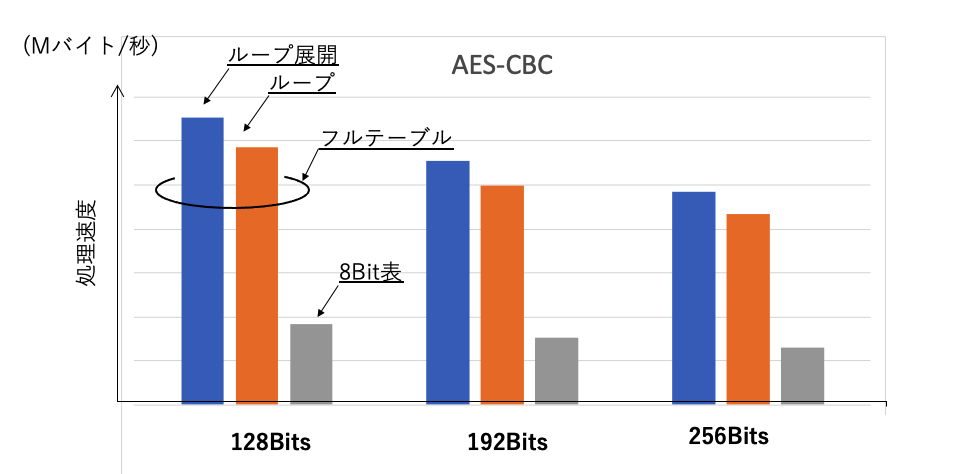
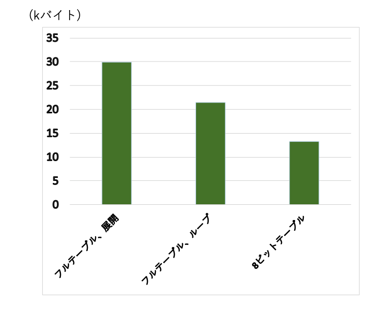
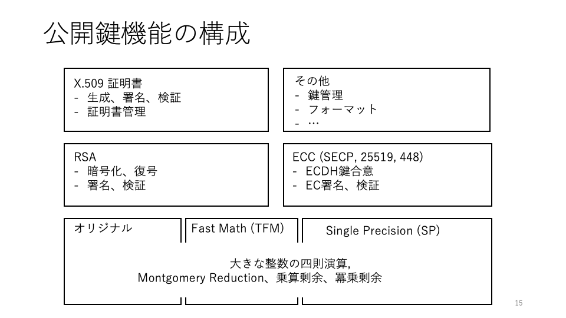
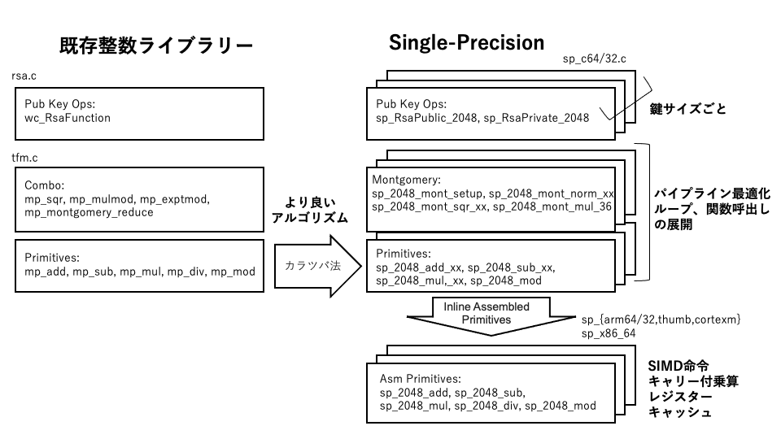
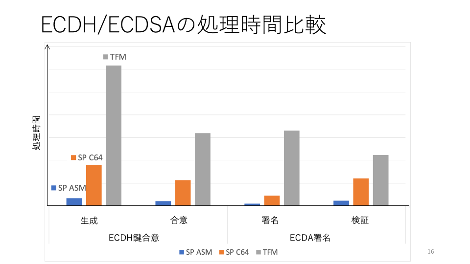
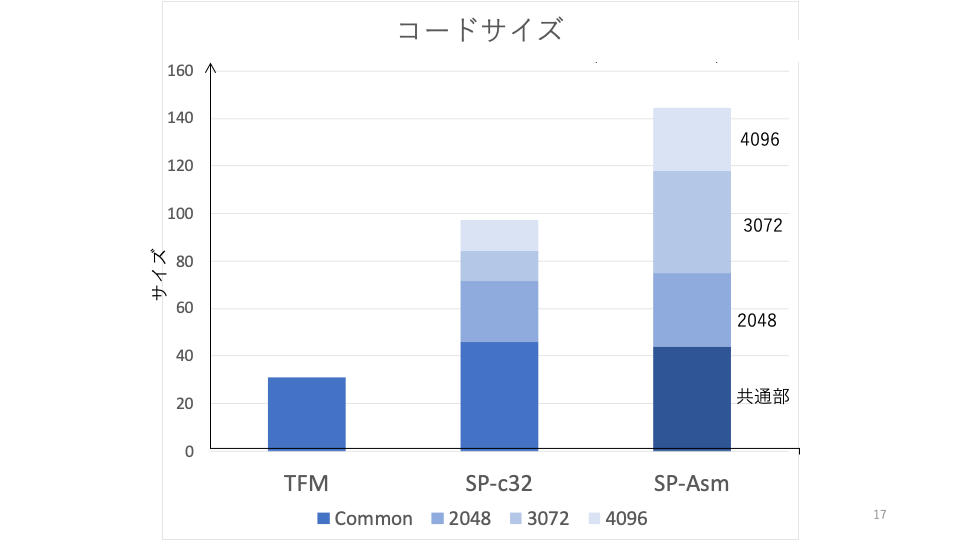

### 11.1 Overview

The realization of hashes, symmetric key cryptography, MAC, etc. is generally divided into source code for each algorithm. In this chapter, as an example of implementing the algorithm, we will explain the basic principle of the AES algorithm, which is widely used as symmetric-key cryptography, its optimization, and the mechanism of the large integer arithmetic library that is the basis of public key cryptography.

| Classification | File | Algorithm |
| --- | --- | --- |
Hash | md5.c | MD5 |
|| sha.c | SHA1 |
|| sha256.c | SHA-256 |
|| sha512.c | SHA-384 / 512 |
|| sha3.c | SHA3 |
Common key cryptography | arc4.c | ARC4 |
|| chacha.c | CHACHA20 |
|| chacha20_poly1305.c | CHACHA20-Poly1305 AEAD |
|| aes.c | AES |
|| camelia.c | Camellia |
|| des3.c | Triple DES |
| Message authentication | cmac.c | CMAC |
|| hmac.c | HMAC |
|| poly1305.c | POLY1305 |
Public-key cryptography | rsa.c | RSA |
|| dh.c | Diffie-Hellman |
|| ecc.c | ECDH, ECDSA, etc. |
|| curve25519.c | ECDH / Curve25519 |
|| curve488.c | ECDH / Curve488 |
||||
||||
| Signature | dsa.c | DSA |
|| ed25519.c | Ed25519 |
|| ed488.c | Ed488 |
| Large integer arithmetic | integer.c | Original |
|| tfm.c | Tom's Fast Math Enhanced Edition |
|| sp.c | Single Precision Optimization |
| Others | pkcs7.c | PKCS # 7 |
|| pkcs12.c | PKCS # 12 |
|| pwdbased.c | Password (PBKDF1 / 2) |
|| random.c | random numbers |

### 11.2 Realization of AES block cipher

Here, we will explain the mechanism of the encryption process by taking the realization of block cipher by AES as an example. wolfSSL provides a key and IV management API, encryption and decryption API for each usage mode. Each API uses a common AES1 block processing function to realize an API corresponding to each usage mode.

Let's see how this is achieved in the actual source code. The following table summarizes the main APIs for AES-CBC.

| Usage Mode | Functions | API |
| --- | --- | --- |
| CBC | Key setting | wc_AesSetKey (Aes * aes, const byte * key, word32 len, <br> const byte * iv, int dir); |
|| IV settings | wc_AesSetIV (Aes * aes, constant byte * iv); |
|| Encryption | wc_AesCbcEncrypt (Aes * aes, byte * out, <br> constant byte * in, word32 sz); |
|| Decryption | wc_AesCbcDecrypt (Aes * aes, byte * out, <br> constant byte * in, word32 sz); |


Key expansion is performed in wc_AesSetKey (internally wc_AesSetKeyLocal) as preprocessing, as shown below.

```
static int wc_AesSetKeyLocal (Aes * aes, const byte * userKey, word32 keylen,
                const byte * iv, int dir, int checkKeyLen)
{
    ...
    rk = aes-> key;
    switch (keylen) {
    case 16:
        rk [5] = rk [1] ^ rk [4];
        rk [6] = rk [2] ^ rk [5];
        rk [7] = rk [3] ^ rk [6];
    ...
```

One block encryption process is performed by wc_AesEncrypt. Even with the implementation of the same above algorithm, the size of the initial value table and whether to expand the loop can be selected with the macro switch depending on the implementation conditions such as the allowable ROM size. In the most principled version, the processing is realized by looping 10 to 14 times by the conversion table of 1 byte 256 entries and the key size according to the principle. The source code looks like this:


```
/ * Byte conversion table * /
static const byte Tsbox [256] = {
    0x63U, 0x7cU, 0x77U, 0x7bU, 0xf2U, 0x6bU, 0x6fU, 0xc5U,
    ...
    0x41U, 0x99U, 0x2dU, 0x0fU, 0xb0U, 0x54U, 0xbbU, 0x16U
};;
```

Defines a 256-entry initial value array Tsbox for byte conversion.

The one-block AES encryption function wc_AesEncrypt first obtains the round key and the exclusive OR as preprocessing.

Enter the rotation process, and first store the byte conversion result of 1 word (4 bytes) in t0 --t3. At this time, the row shift is also taken into consideration when storing.

Next, the column mixture (col_mul) for each column, the exclusive OR of the result, and the exclusive OR of the rotate key are obtained, and this is returned to s0 -s3 as the result of one rotation.

This is repeated for the specified number of revolutions, and finally the round key and the exclusive OR are obtained again, and this is the result.

```
static void wc_AesEncrypt (Aes * aes, const byte * inBlock, byte * outBlock)
{
    XMEMCPY (& s0, inBlock, sizeof (s0));
    XMEMCPY (& s1, inBlock + sizeof (s0), sizeof (s1));
    XMEMCPY (& s2, inBlock + 2 * sizeof (s0), sizeof (s2));
    XMEMCPY (& s3, inBlock + 3 * sizeof (s0), sizeof (s3));

    / * Exclusive OR with the first key * /
    s0 ^ = rk [0];
    s1 ^ = rk [1];
    s2 ^ = rk [2];
    s3 ^ = rk [3];

    r * = 2;
    / * Two rounds at a time * /
    for (rk + = 4; r> 1; r--, rk + = 4) {
        / * Byte conversion: Byte conversion and row shift by conversion table * /
        t0 =
            ((word32) Tsbox [GETBYTE (s0, 3)] << 24) ^
            ((word32) Tsbox [GETBYTE (s1, 2)] << 16) ^
            ((word32) Tsbox [GETBYTE (s2, 1)] << 8) ^
            ((word32) Tsbox [GETBYTE (s3, 0)]);
        t1 = ...
        t2 = ...
        t3 = ...

        / * Exclusive OR of column mixture and key * /
        s0 =
            (col_mul (t0, 3, 2, 0, 1) << 24) ^
            (col_mul (t0, 2, 1, 0, 3) << 16) ^
            (col_mul (t0, 1, 0, 2, 3) << 8) ^
            (col_mul (t0, 0, 3, 2, 1)) ^
            rk [0];
        s1 = ...
        s2 = ...
        s3 = ...
    }

    / * Last conversion table * /
    t0 =
        ((word32) Tsbox [GETBYTE (s0, 3)] << 24) ^
        ((word32) Tsbox [GETBYTE (s1, 2)] << 16) ^
        ((word32) Tsbox [GETBYTE (s2, 1)] << 8) ^
        ((word32) Tsbox [GETBYTE (s3, 0)]);
    t1 = ...
    t2 = ...
    t3 = ...

    / * Exclusive OR with the key * /
    s0 = t0 ^ rk [0];
    s1 = t1 ^ rk [1];
    s2 = t2 ^ rk [2];
    s3 = t3 ^ rk [3];
#endif

    / * write out * /
    XMEMCPY (outBlock, & s0, sizeof (s0));
    XMEMCPY (outBlock + sizeof (s0), & s1, sizeof (s1));
    XMEMCPY (outBlock + 2 * sizeof (s0), & s2, sizeof (s2));
    XMEMCPY (outBlock + 3 * sizeof (s0), & s3, sizeof (s3));

}

```

The column mixing cul_mul function is defined as follows: Column mixing takes the exclusive OR of the elements with the target 4 bytes as a polynomial. The first line of the matrix looks like this:

2 x a0 ^ 3 x a1 ^ a2 ^ a3

In AES MixCulmns, the double operation is a 1-bit left rotation and a remainder of a specific value (and with 0x1b), so we define this with AES_XTIME (x).


```
#define AES_XTIME (x) ((byte) ((byte) ((x) << 1) ^ ((0-((x) >> 7)) & 0x1b)))
```

The processing in col_mul can be transformed as follows.

2 x a0 ^ 2 x a1 ^ a1 ^ a2 ^ a3 <br>
= 2 x (a0 ^ a1) ^ a2 ^ a3

```
/ * Column mixing * /
#define GETBYTE (x, y) (word32) ((byte) ((x) >> (8 * (y))))

static word32 col_mul (word32 t, int i2, int i3, int ia, int ib)
{
    byte t3 = GETBYTE (t, i3);
    byte tm = AES_XTIME (GETBYTE (t, i2) ^ t3);

    return GETBYTE (t, ia) ^ GETBYTE (t, ib) ^ t3 ^ tm;
}


```

### 11.3 AES encryption optimization


Next, let's look at AES optimization. Optimization is mainly achieved by the following two.

1) Use a conversion table that is expanded by calculating the part that can be calculated in advance <br>
2) Expand the loop and eliminate the branch

Below is a look at the byte conversion table for optimization. By preparing a table (full table) with 4 sides and 1 word (4 bytes) in this way, it is possible to perform byte conversion and row shift in 4-byte units at once, which leads to column mixing processing.

```
static const word32 Te [4] [256] = {
{
0xc66363a5U, 0xf87c7c84U, 0xee777799U, 0xf67b7b8dU,
0xfff2f20dU, 0xd66b6bbdU, 0xde6f6fb1U, 0x91c5c554U,
0x60303050U, 0x02010103U, 0xce6767a9U, 0x562b2b7dU,
…
0x4141c382U, 0x9999b029U, 0x2d2d775aU, 0x0f0f111eU,
0xb0b0cb7bU, 0x5454fca8U, 0xbbbbd66dU, 0x16163a2cU,
}
};;
```

The following graph shows the effect of optimization using this conversion table. A relative comparison of the number of bytes of processing messages per second in the case of AES-CBC is shown for loop processing using an 8-bit table and a 1-word full table and for loop expansion (ARM Cortex A). Example). As you can see in the graph, the effect of using a full table is great.

<br> <br>

<br> <br>

On the other hand, the code sizes under those three conditions are compared in the graph below. As you can see, AES optimization is achieved by the trade-off between processing speed and code size.

<br> <br>

<br> <br>


### 11.4 Public key cryptography

#### 1) Overview
Public-key cryptography provides a complex function such as an integer library that realizes a large base integer operation, a layer that uses it to realize basic algorithms for RSA and elliptic curves, and a certificate. It is composed of three layers. The public key algorithm layer provides the desired functions for each algorithm, such as RSA cryptography, decryption, DH, and signature.

The integer library layer was initially implemented as the original integer library (integer.c), but then the integer library (TFM: Fast Math), which was originally enhanced based on Tom's Fast Math in the public domain, was used. rice field.

<br> <br>

<br> <br>

As introduced in Chapter 3, public key cryptographic algorithms can be realized by relatively simple integer operations. One of the challenges in implementing the algorithm is that in simple implementation, huge integers must be handled by exponentiation-modulo operations, and the number of multiplications and modulo operations associated with them becomes enormous. There are several known methods for reducing the size and number of integers in exponentiation modulo operations, but these libraries use the Montgomery reduction-based method introduced in Chapter 3. As a result, the size of the integer required for the operation can be suppressed to twice the size of the target key, and the time-consuming modulo operation can be replaced with multiplication. These optimizations enable practical public key processing.

These libraries can handle arbitrary-length integers (MP: Multiple Precision). On the other hand, even larger processing optimization is possible by limiting the integer length to be processed to a specific size. A library optimized for processing specific integer lengths in this way is called a specific integer length (SP: Single Precision) library in wolfSSL. The SP library's supported key lengths were initially limited to more commonly used key lengths such as RSA 2048 bits and ECC 256 bits, but now their support range is RSA 3072, 4096 bits, ECC 384, 512 bits. It has been extended to.

### 11.5 Optimization of public key cryptography

#### 11.5.1 Overview

Here, we will introduce the Single Precision (SP) optimization realized by wolfSSL. Similar to TFM, SP optimization realizes optimization by utilizing the fixed calculation length in addition to reduction of multiplication number by dichotomy and modulo operation by Montgomery multiplication.

Multiplication expands into a combination of multiplications that are half the digits of the integer you are trying to calculate. The multiplication also expands into a half-multiplication. Finally, write down the algorithm of multiplication short enough in the expanded form. In SP, all the functions for these partial multiplications are defined as static attribute functions in C language, and the optimization function of the C compiler is used to expand the entire multiplication.


In addition, in expanding the above multiplication,
One multiplication is that the multiplication of x and y is a naive expansion.
If the upper part of x is x1, the lower part is x0, the upper part of y is y1, the lower part is y0, and half of the number of digits is b, then x0y0 + x1y0b + x0y1b + x1y1bb four times.
It will be calculated by multiplication. In the Karatsuba method, this can be calculated by multiplying three times as follows.

z2 = x1y1
z0 = x0y0
z1 = x1y0 + x0y1
z1 = z2 + z0-(x1 --x0) (y1 --y0)

The figure shows Kozo of SP optimization in comparison with TFM. The wc_RsaFunction, which implements the top-level RSA primitive, is a common entry point for traditional TFM and SP optimization. wc_RsaFunction is divided into functions that realize public key system operations and private key systems. Also, each key size defines a separate function with a name like sp_RsaPublic_xxxx or sp_Private_xxx (where xxxx is the key size).

Within the sp_RsaPublic_xxxx, sp_PsaPrivate_xxxx functions, call functions for Montgomery multiplication (Montgomery transformation, multiplication, etc.) to perform exponentiation remainder operations for RSA. At that time, the multiplication and other arithmetic functions prepared as primitives are called as appropriate.

The SP optimization logic constructed in this way is individually as a C language program for 32-bit and 64-bit architectures.
It is realized in an optimized form.

In addition, an assembler layer is also prepared to optimize those processes for typical architectures such as Intel and ARM. In the assembler layer, instruction sets such as SIMD system that cannot be used in C language, effective use of register cache, etc. are planned.

<br> <br>

<br> <br>

#### 11.5.2 Program

Let's look at SP optimization in C language. We'll take a closer look at RSA processing, which has a relatively simple structure, but elliptic curve cryptography is optimized in much the same way.

RSA primitive: wc_RsaFunction is implemented by sp_RsaPublic_xxxx, sp_RsaPrivate_xxxx for SP optimization. In the function, in the case of public key processing, the multiplication is minimized by the dichotomy method. Repeated squares, if the corresponding bit is 1, it is a remainder, but the modulo operation is realized by multiplication by Montgomery reduction (see "3.6 Public Key Cryptography and Key Sharing" for the principle of the optimization method of public key processing). ..

The processing time of the exponentiation modulo operation by the dichotomy varies greatly depending on the key value, but in general it is necessary to pay attention to side channel attacks, but since it is a public key here, it is not necessary.

The program below is an extract of the main part of sp_RsaPublic_2048, which is a function for 2048 bits. The for loop repeats the square for each digit of the exponentiation binary. If the corresponding digit is "1", the remainder operation (Montgomery multiplication) is performed.

```
int sp_RsaPublic_2048 (...)
{
        sp_2048_from_mp (m, 36, mm);
        sp_2048_mont_setup (m, & mp);
        sp_2048_mont_norm_36 (norm, m);

        XMEMCPY (r, a, sizeof (sp_digit) * 36 * 2);
        for (i--; i> = 0; i--) {
            sp_2048_mont_sqr_36 (r, r, m, mp);

            if (((e [0] >> i) & 1) == 1) {
                sp_2048_mont_mul_36 (r, r, a, m, mp);
            }
        }
        sp_2048_mont_reduce_36 (r, m, mp);
        mp = sp_2048_cmp_36 (r, m);
        sp_2048_cond_sub_36 (r, r, m, ((mp <0)?)?
                    (sp_digit) 1: (sp_digit) 0) -1);

        sp_2048_to_bin (r, out);
        * outLen = 256;
    }
```

SP multiplication is realized by each function named sp_xxxx_mul_yy (xxxx is the key length and yy is the number of bytes to be multiplied). Multiplication is
By the Karatsuba method, multiplication of half digits is realized in 3 times.

```
SP_NOINLINE static void sp_2048_mul_36 (sp_digit * r, const sp_digit * a,
    const sp_digit * b)
{
    sp_digit * z0 = r;
    sp_digit z1 [36];
    sp_digit * a1 = z1;
    sp_digit b1 [18];
    sp_digit * z2 = r + 36;
    (void) sp_2048_add_18 (a1, a, & a [18]);
    (void) sp_2048_add_18 (b1, b, & b [18]);
    sp_2048_mul_18 (z2, & a [18], & b [18]);
    sp_2048_mul_18 (z0, a, b);
    sp_2048_mul_18 (z1, a1, b1);
    (void) sp_2048_sub_36 (z1, z1, z2);
    (void) sp_2048_sub_36 (z1, z1, z0);
    (void) sp_2048_add_36 (r + 18, r + 18, z1);
}
```

sp_2048_mul_36 calls sp_2048_mul_18, and sp_2048_mul_9 describes the entire process in an expanded state.

```
SP_NOINLINE static void sp_2048_mul_9 (sp_digit * r, const sp_digit * a,
    const sp_digit * b)
{
    sp_uint128 t0 = ((sp_uint128) a [0]) * b [0];
    sp_uint128 t1 = ((sp_uint128) a [0]) * b [1]
                 + ((sp_uint128) a [1]) * b [0];
    sp_uint128 t2 = ((sp_uint128) a [0]) * b [2]
                 + ((sp_uint128) a [1]) * b [1]
                 + ((sp_uint128) a [2]) * b [0];
    ...

    sp_uint128 t15 = ((sp_uint128) a [7]) * b [8]
                 + ((sp_uint128) a [8]) * b [7];
    sp_uint128 t16 = ((sp_uint128) a [8]) * b [8];

    t1 + = t0 >> 57; r [0] = t0 & 0x1ffffffffffffffL;
    t2 + = t1 >> 57; r [1] = t1 & 0x1ffffffffffffffL;
    ...

    t15 + = t14 >> 57; r [14] = t14 & 0x1ffffffffffffffL;
    t16 + = t15 >> 57; r [15] = t15 & 0x1ffffffffffffffL;
    r [17] = (sp_digit) (t16 >> 57);
                       r [16] = t16 & 0x1ffffffffffffffL;
}
```

On the other hand, in the case of a private key, it is necessary to make the processing time constant in order to deal with side channel attacks. As you can see in the example of sp_RsaPrivate_2048_36 below, we perform the modulo operation (by Montgomery multiplication) for all.

```
sp_RsaPrivate_2048_36 (...)
{
    ...
    err = sp_2048_mod_exp_16 (tmpa, a, dp, 1024, p, 1);
    ...
}
```

```
static int sp_2048_mod_exp_16 (sp_digit * r, const sp_digit * a, const sp_digit * e,
        int bits, const sp_digit * m, int reduceA)
{
    ...
    sp_2048_mont_setup (m, & mp);
    sp_2048_mont_norm_16 (norm, m);

    sp_2048_mont_sqr_16 (t [2], t [1], m, mp);
    sp_2048_mont_mul_16 (t [3], t [2], t [1], m, mp);
    ...
    sp_2048_mont_sqr_16 (t [30], t [15], m, mp);
    sp_2048_mont_mul_16 (t [31], t [16], t [15], m, mp);
    ...
    sp_2048_mont_sqr_16 (r, r, m, mp);
    sp_2048_mont_sqr_16 (r, r, m, mp);
    sp_2048_mont_sqr_16 (r, r, m, mp);
    sp_2048_mont_sqr_16 (r, r, m, mp);
    sp_2048_mont_sqr_16 (r, r, m, mp);

    sp_2048_mont_mul_16 (r, r, t [y], m, mp);
    ...
}
```

#### 11.5.3 Performance comparison

Shows a relative comparison of the processing performance of TFM, SP in C language, and assembled SP. The graph compares key agreements by ECDH and signature processing by ECDSA. It can be seen that the processing speed of each process is improved by several to 10 times compared to the conventional TFM. In the case of assembler, especially the SIMD instruction greatly improves the processing speed.

<br> <br>

<br> <br>

On the other hand, it should be noted that the code size of SP optimization is larger than that of the conventional method. Unlike the conventional method, the code size differs depending on the type and combination of key lengths used. The graph shows a code size comparison for RSA. In SP mode, in addition to the common part, the processing part for each key length is added to the size. In the case of realization by C language, the size can be compressed compared to the realization by assembler because the common part is reduced by optimizing the logic part for each key length.

<br> <br>

<br> <br>