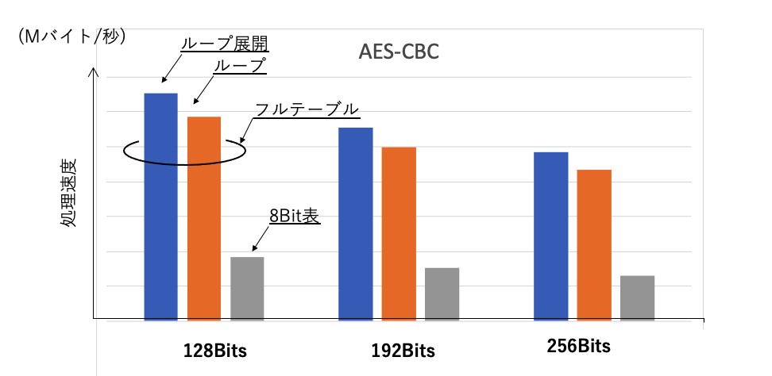
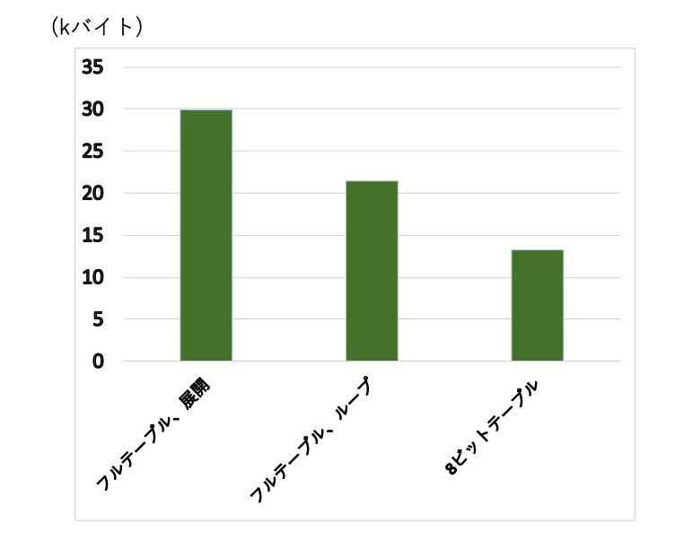
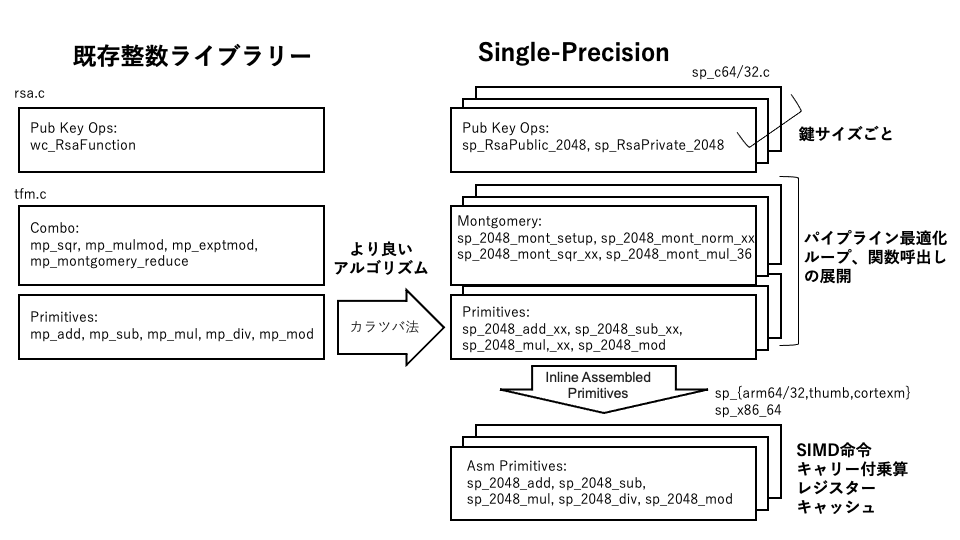

## 第11章　暗号化処理


### 11.1 概要

ハッシュ、共通鍵暗号、MACなどの実現は概ねアルゴリズムごとのソースコードにわかれています。本章では、アルゴリズムの実現例として、共通鍵暗号として広く利用されているAESのアルゴリズムの基本原理とその最適化、公開鍵暗号のベースとなっている大きな整数演算ライブラリーの仕組みについて解説します。

|分類|ファイル|アルゴリズム|
|---|---|---|
|ハッシュ|md5.c|MD5|
||sha.c|SHA1|
||sha256.c|SHA-256|
||sha512.c|SHA-384/512|
||sha3.c|SHA3|
|共通鍵暗号|arc4.c|ARC4|
||chacha.c|CHACHA20|
||chacha20_poly1305.c|CHACHA20-Poly1305 AEAD|
||aes.c|AES|
||camellia.c|Cammelia|
||des3.c|Triple DES|
|メッセージ認証|cmac.c|CMAC|
||hmac.c|HMAC|
||poly1305.c|POLY1305|
|公開鍵暗号|rsa.c|RSA|
||dh.c|ディフィーヘルマン|
||ecc.c|ECDH, ECDSAなど|
||curve25519.c|ECDH/Curve25519|
||curve488.c|ECDH/Curve488|
||||
||||
|署名|dsa.c|DSA|
||ed25519.c|Ed25519|
||ed488.c|Ed488|
|大整数演算|integer.c|オリジナル|
||tfm.c|Tom's Fast Math強化版|
||sp.c|Single Precision最適化|
|その他|pkcs7.c|PKCS#7|
||pkcs12.c|PKCS#12|
||pwdbased.c|パスワード(PBKDF1/2)|
||random.c|乱数|

### 11.2 AESブロック暗号の実現

ここではAESによるブロック暗号の実現を例にその暗号化処理のしくみを説明します。wolfSSLでは各利用モードごとに鍵とIVの管理API、暗号化、復号のためのAPIを提供しています。各APIは共通のAES１ブロックの処理関数を利用してそれぞれの利用モードに対応するAPIを実現しています。

これを実際のソースコードでどのように実現されているか見ていきます。次の表にAES-CBC用の主なAPIをまとめます。

|利用モード|機能|API|
|---|---|---|
|CBC|鍵設定|wc_AesSetKey(Aes* aes, const byte* key, word32 len,<br>const byte* iv, int dir);|
||IV設定|wc_AesSetIV(Aes* aes, const byte* iv);|
||暗号化|wc_AesCbcEncrypt(Aes* aes, byte* out,<br> const byte* in, word32 sz);|
||復号|wc_AesCbcDecrypt(Aes* aes, byte* out,<br> const byte* in, word32 sz);|


鍵の拡張は下に示すように、前処理としてwc_AesSetKey(内部的にはwc_AesSetKeyLocal)の中で行なっておきます。

```
static int wc_AesSetKeyLocal(Aes* aes, const byte* userKey, word32 keylen,
                const byte* iv, int dir, int checkKeyLen)
{
    ...
    rk = aes->key;
    switch (keylen) {
    case 16:
        rk[5] = rk[1] ^ rk[4];
        rk[6] = rk[2] ^ rk[5];
        rk[7] = rk[3] ^ rk[6];
    ...
```

１ブロックの暗号化処理はwc_AesEncryptで行われます。同じ上記のアルゴリズムの実現でも、許されるROMサイズのような実装条件によって初期値テーブルのサイズやループを展開するかどうかなどをマクロスイッチで選べるようになっています。もっとも原理的なバージョンでは、原理通りの１バイト256エントリーの変換テーブルと鍵サイズにより10から14回のループによって処理を実現します。このソースコードは次のようになります。


```
/* バイト変換テーブル */
static const byte Tsbox[256] = {
    0x63U, 0x7cU, 0x77U, 0x7bU, 0xf2U, 0x6bU, 0x6fU, 0xc5U,
    ...
    0x41U, 0x99U, 0x2dU, 0x0fU, 0xb0U, 0x54U, 0xbbU, 0x16U
};
```

バイト変換用の256エントリーの初期値配列 Tsboxを定義します。

１ブロックのAES暗号化関数 wc_AesEncrypt では、まず前処理としてラウンド鍵と排他的論理和を求めます。

回転処理に入り、まず１ワード(4バイト)のバイト変換結果をt0 - t3 に格納します。この時、行シフトも考慮して格納します。

次にカラムごとのカラム混合(col_mul)と結果の排他的論理和とさらにローテート鍵との排他的論理和を求めこれを一回転分の結果としてs0 -s3に戻します。

これを所定の回転数だけ繰り返し、最後にもう一度ラウンド鍵と排他的論理和をもとめ、これを結果とします。

```
static void wc_AesEncrypt(Aes* aes, const byte* inBlock, byte* outBlock)
{
    XMEMCPY(&s0, inBlock,                  sizeof(s0));
    XMEMCPY(&s1, inBlock +     sizeof(s0), sizeof(s1));
    XMEMCPY(&s2, inBlock + 2 * sizeof(s0), sizeof(s2));
    XMEMCPY(&s3, inBlock + 3 * sizeof(s0), sizeof(s3));

    /* はじめの鍵との排他的論理和 */
    s0 ^= rk[0];
    s1 ^= rk[1];
    s2 ^= rk[2];
    s3 ^= rk[3];

    r *= 2;
    /* Two rounds at a time */
    for (rk += 4; r > 1; r--, rk += 4) {
        /* バイト変換：変換テーブルによるバイト変換と行シフト */
        t0 =
            ((word32)Tsbox[GETBYTE(s0, 3)] << 24) ^
            ((word32)Tsbox[GETBYTE(s1, 2)] << 16) ^
            ((word32)Tsbox[GETBYTE(s2, 1)] <<  8) ^
            ((word32)Tsbox[GETBYTE(s3, 0)]);
        t1 = ...
        t2 = ...
        t3 = ...

        /* カラム混合と鍵との排他的論理和 */
        s0 =
            (col_mul(t0, 3, 2, 0, 1) << 24) ^
            (col_mul(t0, 2, 1, 0, 3) << 16) ^
            (col_mul(t0, 1, 0, 2, 3) <<  8) ^
            (col_mul(t0, 0, 3, 2, 1)      ) ^
            rk[0];
        s1 = ...
        s2 = ...
        s3 = ...
    }

    /* 最後の変換テーブル */
    t0 =
        ((word32)Tsbox[GETBYTE(s0, 3)] << 24) ^
        ((word32)Tsbox[GETBYTE(s1, 2)] << 16) ^
        ((word32)Tsbox[GETBYTE(s2, 1)] <<  8) ^
        ((word32)Tsbox[GETBYTE(s3, 0)]);
    t1 = ...
    t2 = ...
    t3 = ...

    /* 鍵との排他的論理和 */
    s0 = t0 ^ rk[0];
    s1 = t1 ^ rk[1];
    s2 = t2 ^ rk[2];
    s3 = t3 ^ rk[3];
#endif

    /* write out */
    XMEMCPY(outBlock,                  &s0, sizeof(s0));
    XMEMCPY(outBlock +     sizeof(s0), &s1, sizeof(s1));
    XMEMCPY(outBlock + 2 * sizeof(s0), &s2, sizeof(s2));
    XMEMCPY(outBlock + 3 * sizeof(s0), &s3, sizeof(s3));

}

```

カラム混合cul_mul関数は次のように定義されています。カラム混合は対象の４バイトを多項式として要素の排他的論理和をとります。マトリックスの１行目は次のようになります。

2 x a0 ^ 3 x a1 ^ a2 ^ a3

AESのMixCulmnsでは、２倍演算は１ビット左ローテーと特定の値の剰余(0x1bとのand)なので、これをAES_XTIME(x)で定義します。


```
#define AES_XTIME(x)    ((byte)((byte)((x) << 1) ^ ((0 - ((x) >> 7)) & 0x1b)))
```

col_mul内の処理は次のように変形できます。

2 x a0 ^ 2 x a1 ^ a1  ^ a2 ^ a3 <br>
= 2 x (a0 ^ a1) ^ a2 ^ a3

```
/* カラム混合 */
#define GETBYTE(x, y) (word32)((byte)((x) >> (8 * (y))))

static word32 col_mul(word32 t, int i2, int i3, int ia, int ib)
{
    byte t3 = GETBYTE(t, i3);
    byte tm = AES_XTIME(GETBYTE(t, i2) ^ t3);

    return GETBYTE(t, ia) ^ GETBYTE(t, ib) ^ t3 ^ tm;
}


```


### 11.3 AES暗号化の最適化


次にAESの最適化について見ていきます。最適化は主に次の二つで実現します。

１）あらかじめ計算できる部分を計算し拡張した変換テーブルを利用<br>
２）ループも展開し、ブランチを排除する

下は最適化用のバイト変換テーブルの様子を示したものです。このように4面、1ワード(4バイト)による表(フルテーブル)を用意することによっていっぺんに4バイト単位のバイト変換、行シフトを行いカラム混合の処理につなぐことができます。

```
static const word32 Te[4][256] = {
{
0xc66363a5U, 0xf87c7c84U, 0xee777799U, 0xf67b7b8dU,
0xfff2f20dU, 0xd66b6bbdU, 0xde6f6fb1U, 0x91c5c554U,
0x60303050U, 0x02010103U, 0xce6767a9U, 0x562b2b7dU,
…
0x4141c382U, 0x9999b029U, 0x2d2d775aU, 0x0f0f111eU,
0xb0b0cb7bU, 0x5454fca8U, 0xbbbbd66dU, 0x16163a2cU,
}
};
```

次のグラフは、この変換表を使った最適化の効果を示したものです。AES-CBCの場合の１秒あたりの処理メッセージのバイト数の相対比較を、8ビット表と１ワードのフルテーブルを使ってループ処理した場合とループを展開した場合について示しています(ARM Cortex Aの例)。グラフでわかるように、フルテーブルを使用する効果が大きいことがわかります。

<br> <br>

<br> <br>

一方、それらの３つの条件でのコードサイズについて下のグラフで比較します。このように、AESの最適化は処理速度とコードサイズのトレードオフで実現されていることがわかります。

<br> <br>

<br> <br>


### 11.4 公開鍵暗号

#### 1) 概要
公開鍵暗号処理は、ベースとなる大きな整数演算を実現する整数ライブラリーとそれを利用してRSAや楕円曲線の基本的なアルゴリズムを実現する層、その上で証明書など複合的な機能を提供する層の三階層で構成されています。公開鍵アルゴリズム層は、RSA暗号、復号、DH、署名などそれぞれのアルゴリズムごとに目的の関数を提供します。

整数ライブラリー層は当初オリジナルの整数ライブラリ(integer.c)として実現されましたが、その後、パブリックドメインのTom's Fast Mathをベースに独自に強化した整数ライブラリ(TFM: Fast Math)が使用されてきました。

<br> <br>

<br> <br>

第三章で紹介したように公開鍵暗号アルゴリズムは比較的単純な整数演算によって実現できます。アルゴリズム実現上の課題一つは、単純な実現では冪乗剰余演算で巨大な整数を扱わなければならなくなり、それに伴った乗算、剰余算の回数が巨大になる点です。冪乗の剰余演算の整数のサイズや回数の縮小には複数の手法が知られていますが、これらのライブラリーでは第三章で紹介したモンゴメリリダクションをベースとした方式を採用しています。これによって、演算に必要な整数のサイズは目的とする鍵のサイズの２倍に抑えることができ、処理時間のかかる剰余演算は乗算に置き換えることができます。それらの最適化によって、実用的な公開鍵の処理が可能となります。

これらのライブラリは任意長の整数(MP: Multiple Precision)を処理することができます。これに対して、処理対象の整数長を特定のサイズに限定することでさらに大きな処理最適化が可能です。このように特定整数長の処理に最適化したライブラリをwolfSSLでは特定整数長(SP: Single Precision)ライブラリと呼んでいます。SPライブラリの対応する鍵長は当初RSA2048ビット、ECC256ビットなどもっと一般的に使用される鍵長のみに限られていましたが、現在ではそのサポート範囲はRSA 3072, 4096ビット、ECC 384、512ビットなどに拡張されています。

### 11.5 公開鍵暗号処理の最適化

#### 11.5.1 概要

ここでは、wolfSSLで実現されているSingle Precision(SP)最適化について紹介します。SP最適化ではTFMと同様に、二分法による乗算数の削減、モンゴメリー乗算による剰余演算の削減に加えて、計算長が固定であることを利用した最適化を実現します。

乗算は演算しようとしている整数の半分の桁の乗算の組み合わせに展開します。その乗算はまたさらに半分の乗算のくみわわせに展開します。最後に十分短い乗算のアルゴリズムを展開した形で書き下します。SPではこれらの部分乗算のための関数はすべてC言語のstatic属性関数として定義し、Cコンパイラの最適化機能を使って乗算全体を展開します。


また、上記の乗算の展開にあたっては、
一つの掛け算は　xとyの乗算はナイーブな展開では、
xの上位をx1, 下位をx0、yの上位をy1、下位をy0、桁数の半分をbとすると、x0y0 + x1y0b + x0y1b + x1y1bb　の４回の
乗算によって計算することになります。カラツバ法では、これを次のように３回の乗算で求めることができます。

z2 = x1y1
z0 = x0y0
z1 = x1y0 + x0y1 
z1 = z2 + z0 - (x1 - x0)(y1 - y0) 

図は、SP最適化の耕三をTFMとの比較で示しています。最上位のRSAプリミティブを実現するwc_RsaFunctionは従来のTFMとSP最適化の共通の入り口です。wc_RsaFunctionは公開鍵系の演算とプライベート鍵系を実現すそれぞれの関数にわかれています。また、鍵サイズごとにsp_RsaPublic_xxxxまたはsp_Private_xxxのような命名(xxxxは鍵サイズ)で個別の関数が定義されています。

sp_RsaPublic_xxxx, sp_PsaPrivate_xxxx関数内ではモンゴメリー乗算のための関数(モンゴメリー変換、乗算など)を呼び出し、RSAのための冪乗剰余演算を行います。その際、、プリミティブとして用意されている乗算その他の演算関数を適宜呼び出します。

このようにして組み立てられたSP最適化のロジックは32ビットと64ビットアーキテクチャ用のC言語プログラムとしてそれぞれに
最適化した形で実現しています。

また、それらの処理をIntel系、ARM系など代表的アーキテクチャ向けに最適化を実現するためにアセンブラ層も用意されています。アセンブラ層ではC言語では利用できないSIMD系などの命令セット、レジスタキャッシュの有効活用などが図られています。

<br> <br>

<br> <br>

#### 11.5.2 プログラム

C言語でのSP最適化についてみていきます。ここでは比較的構造の単純なRSAの処理について詳しくみていきますが、楕円曲線暗号の場合もほぼ同様の手法で最適化されています。

RSAプリミティブ：wc_RsaFunctionはSP最適化の場合は、sp_RsaPublic_xxxx, sp_RsaPrivate_xxxx で実現されます。関数内では、公開鍵処理の場合、二分法で掛け算数を最小化。二乗の繰り返し、該当ビットが１の場合は剰余だが、モンゴメリーリダクションにより剰余演算を乗算で実現しています (公開鍵処理の最適化手法の原理については「3.6 公開鍵暗号と鍵共有」を参照)。

二分法による冪乗剰余演算の処理時間は鍵値により大幅にことなるが一般的にはサイドチャネル攻撃に注意する必要がりますが、ここでは公開鍵なのでその必要はありません。

下のプログラムは2048ビット向け関数であるsp_RsaPublic_2048の主要部分を抽出したものです。forループで冪乗数の二進法の桁ごとに二乗を繰り返します。該当桁が「1」の場合は剰余演算(モンゴメリー乗算)を行います。

```
int sp_RsaPublic_2048( ... )
{
        sp_2048_from_mp(m, 36, mm);
        sp_2048_mont_setup(m, &mp);
        sp_2048_mont_norm_36(norm, m);

        XMEMCPY(r, a, sizeof(sp_digit) * 36 * 2);
        for (i--; i>=0; i--) {
            sp_2048_mont_sqr_36(r, r, m, mp);

            if (((e[0] >> i) & 1) == 1) {
                sp_2048_mont_mul_36(r, r, a, m, mp);
            }
        }
        sp_2048_mont_reduce_36(r, m, mp);
        mp = sp_2048_cmp_36(r, m);
        sp_2048_cond_sub_36(r, r, m, ((mp < 0) ?
                    (sp_digit)1 : (sp_digit)0)- 1);

        sp_2048_to_bin(r, out);
        *outLen = 256;
    }
```

SPの乗算はsp_xxxx_mul_yy(xxxxは鍵長、yyは乗算バイト数)の命名による各関数で実現しています。乗算は
カラツバ法により、半分の桁の掛け算を３回で実現しています。

```
SP_NOINLINE static void sp_2048_mul_36(sp_digit* r, const sp_digit* a,
    const sp_digit* b)
{
    sp_digit* z0 = r;
    sp_digit z1[36];
    sp_digit* a1 = z1;
    sp_digit b1[18];
    sp_digit* z2 = r + 36;
    (void)sp_2048_add_18(a1, a, &a[18]);
    (void)sp_2048_add_18(b1, b, &b[18]);
    sp_2048_mul_18(z2, &a[18], &b[18]);
    sp_2048_mul_18(z0, a, b);
    sp_2048_mul_18(z1, a1, b1);
    (void)sp_2048_sub_36(z1, z1, z2);
    (void)sp_2048_sub_36(z1, z1, z0);
    (void)sp_2048_add_36(r + 18, r + 18, z1);
}
```

sp_2048_mul_36はsp_2048_mul_18を呼び出し、sp_2048_mul_9では処理全体を展開した状態で記述しています。


```
SP_NOINLINE static void sp_2048_mul_9(sp_digit* r, const sp_digit* a,
    const sp_digit* b)
{
    sp_uint128 t0   = ((sp_uint128)a[ 0]) * b[ 0];
    sp_uint128 t1   = ((sp_uint128)a[ 0]) * b[ 1]
                 + ((sp_uint128)a[ 1]) * b[ 0];
    sp_uint128 t2   = ((sp_uint128)a[ 0]) * b[ 2]
                 + ((sp_uint128)a[ 1]) * b[ 1]
                 + ((sp_uint128)a[ 2]) * b[ 0];
    ...

    sp_uint128 t15  = ((sp_uint128)a[ 7]) * b[ 8]
                 + ((sp_uint128)a[ 8]) * b[ 7];
    sp_uint128 t16  = ((sp_uint128)a[ 8]) * b[ 8];

    t1   += t0  >> 57; r[ 0] = t0  & 0x1ffffffffffffffL;
    t2   += t1  >> 57; r[ 1] = t1  & 0x1ffffffffffffffL;
    ...

    t15  += t14 >> 57; r[14] = t14 & 0x1ffffffffffffffL;
    t16  += t15 >> 57; r[15] = t15 & 0x1ffffffffffffffL;
    r[17] = (sp_digit)(t16 >> 57);
                       r[16] = t16 & 0x1ffffffffffffffL;
}
```

一方、プライベート鍵の場合はサイドチャネル攻撃に対処すため処理時間一定化の必要があります。下のsp_RsaPrivate_2048_36の例でわかるのように、全てに関して剰余演算を（モンゴメリー乗算にて）実施します。

```
sp_RsaPrivate_2048_36(...)
{
    ...
    err = sp_2048_mod_exp_16(tmpa, a, dp, 1024, p, 1);
    ...
}
```

```
static int sp_2048_mod_exp_16(sp_digit* r, const sp_digit* a, const sp_digit* e,
        int bits, const sp_digit* m, int reduceA)
{
    ...
    sp_2048_mont_setup(m, &mp);
    sp_2048_mont_norm_16(norm, m);

    sp_2048_mont_sqr_16(t[ 2], t[ 1], m, mp);
    sp_2048_mont_mul_16(t[ 3], t[ 2], t[ 1], m, mp);
    ...
    sp_2048_mont_sqr_16(t[30], t[15], m, mp);
    sp_2048_mont_mul_16(t[31], t[16], t[15], m, mp);
    ...
    sp_2048_mont_sqr_16(r, r, m, mp);
    sp_2048_mont_sqr_16(r, r, m, mp);
    sp_2048_mont_sqr_16(r, r, m, mp);
    sp_2048_mont_sqr_16(r, r, m, mp);
    sp_2048_mont_sqr_16(r, r, m, mp);

    sp_2048_mont_mul_16(r, r, t[y], m, mp);
    ...
}
```

#### 11.5.3 性能比較

TFM,　C言語によるSP, アセンブラ化SPの処理性能の相対比較を示します。グラフはECDHによる鍵合意、ECDSAによる署名処理について比較しています。いずれの処理についても、従来のTFMに比べて数倍から１０倍程度も処理速度が向上していることがわかります。アセンブラの場合、特にSIMD命令によって処理速度が大きく改善されます。

<br> <br>

<br> <br>

一方、SP最適化では従来方式に比べてコードサイズが大きくなる点に注意が必要です。従来方式と異なり、使用する鍵長の種類、組み合わせによってコードサイズが異なります。グラフはRSAの場合のコードサイズ比較を示しています。SPモードの場合、共通部の他に、鍵長毎の処理部分がサイズに加わります。C言語による実現の場合は、鍵長ごとのロジック部分も最適化によって共通部分が削減されるのでアセンブラによる実現よりサイズを圧縮することができます。

<br> <br>

<br> <br>

