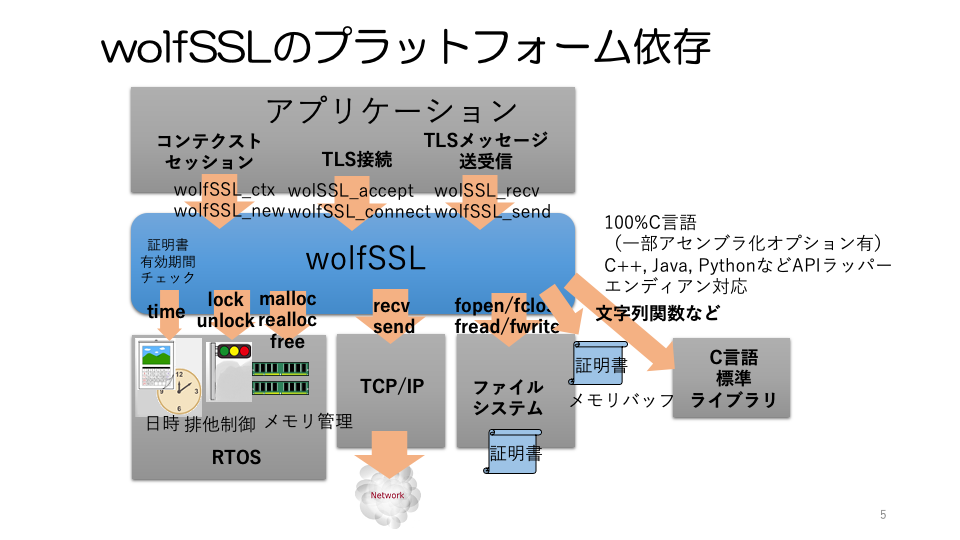

## Chapter 12 Platform Dependencies

### 12.1 Overview

Libraries that are used for a wide range of purposes, such as protocol libraries, are required to operate in a variety of platform environments. Processors are probably the number one factor in platform diversity. Today, different processor architectures and processor chips are used to meet a variety of operating environments and system requirements. The C language compiler is a powerful tool to support a wide range of these issues. C is supported for most processors today. All wolfSSL code is once written in C, so any 32-bit or larger processor can run on most processors regardless of architecture.

However, a realistic system with a built-in protocol library such as wolfSSL has various system-specific dependencies that cannot be dealt with simply by writing in C language. The following figure shows the platform-dependent parts of wolfSSL. This section describes such platform-dependent parts.

Appendix 3 summarizes the options for the major platforms that wolfSSL supports.

   

   

The platform-dependent parts and the corresponding source files are summarized below.

| Dependent part type | File name |
| --- | --- |
| Exclusive control | wc_port.c |
| File system | wc_port.h |
| Network | wolfio.c |
| Real time clock | wc_port.h |
| Heap memory | types.h, memory.c |
| Random seeds | random.c |

### 12.2 Thread / task exclusive control

Applications often run in parallel across multiple threads or tasks and share a library, such as a protocol library. In such a case, it is necessary to perform appropriate exclusive control for parallel processing in the library so as not to cause conflict between threads / tasks.

In wolfSSL, as a library design policy, such parallel processing is required to be separated for each SSL context and SSL session as an application. That is, the same SSL context, or the same SSL session, must belong to a single thread, task. As a library, we guarantee thread safety between different contexts or sessions, and task safety.

In order to achieve this security, it is necessary to perform exclusive control appropriately in the library, but the method of exclusive control differs depending on each OS. Since wolfSSL defaults to pthread, it's easiest to use it on general-purpose operating systems. In RTOS that does not use pthread, specify the platform type by the option at the time of library build.

For platforms that are not directly supported by the configuration options, specify the proprietary exclusive control option (WOLFSSL_USER_MUTEX) to define the API wrapper for exclusive control initialization, release, lock, and unlock. The user should call the API of the original exclusive control in the simple wrapper function defined.

| Features | Wrapper functions |
| --- | --- |
Initialization | int wc_InitMutex (wolfSSL_Mutex * m) {...} |
| Release | int wc_FreeMutex (wolfSSL_Mutex * m) {...} |
| Lock | int wc_LockMutex (wolfSSL_Mutex * m) {...} |
Unlock | int wc_UnLockMutex (wolfSSL_Mutex * m) {...} |

Exclusive control is not required if the application and library run on a non-RTOS (bare metal) or on a single thread or task. In such a case, specify the single thread (SINGLE_THREADED) option that does not have exclusive control in the library.

### 12.3 File system

wolfSSL primarily uses the file system as a storage location for certificates. The default is to open, close, read, write, etc. files using the POSIX API. If your platform provides an API other than POSIX, specify it in the configuration options. For platforms where the option is not directly supported, it is also possible to individually macro define APIs such as file open, close, read and write. In that case, specify the user-specific file system option (WOLFSSL_USER_FILESYSTEM).

| Function | Macro name |
| --- | --- |
Descriptor | XFILE |
| Open, Close | XFOPEN, XFCLOSE |
| Read, write position | XFSEEK, XFTELL, XREWIND, XSEEK_END |
| Read, write | XFREAD (BUF, SZ, AMT, FD)   XFWRITE (BUF, SZ, AMT, FD) |

Below is a summary of the supported platforms and macro names.

Many embedded systems do not have a file system. Due to such usage conditions, wolfSSL provides two types of APIs related to certificates, one with a file system for each function and the other without a file system. If you don't have a file system, put the same file image in a memory buffer and pass its pointer and size. The naming convention for each API is wolfSSL_load_verify_buffer for wolfSSL_load_verify_locations and wolfSSL_xxx_buffer for wolfSSL_xxx. The API corresponding to each function is summarized in the table below.

For information on how to implement TLS communication using these functions, refer to the program example in "Part 2 Programming".

| Role | Function | Specified unit | File system   Yes |   No |
| --- | --- | --- | --- | --- |
Proof side | CA   Certificate   Load | Context | wolfSSL_CTX_load_verify_location | wolfSSL_CTX_load_verify_buffer |
Authenticating side | Node   Certificate   Load | Context | wolfSSL_CTX_use_certificate_file | wolfSSL_CTX_use_certificate_buffer |
| | | | Session | wolfSSL_use_certificate_file | wolfSSL_use_certificate_buffer |
| | Private key   Load | Context | wolfSSL_CTX_use_certificate_file | wolfSSL_CTX_use_certificate_buffer |
| | | | Session | wolfSSL_use_certificate_file | wolfSSL_use_certificate_buffer |

### 12.4 Network

As a lower layer protocol of the TLS protocol, a protocol such as TCP / IP that guarantees transaction stability is assumed. By default, wolfSSL uses BSD Socket as the access API to this layer. If you want to use a platform that provides other than that, specify the appropriate option in the configuration options.

If the platform is not supported, specify your own message I / O option (WOLFSSL_USER_IO) and register a callback function to send and receive messages at run time. For specific usage, refer to the program example in "Part 2 Programming".

### 12.5 Real time clock

wolfSSL mainly uses a real-time clock to check the expiration date of a certificate. The default is UNIX Epoch Time with the time function.
If you want to use your own function, you can specify your own clock option (USER_TIME).

In the wolfSSL library, applications as a whole are rarely aware of word length dependencies, but Epoch Time overflows in 2038 for 32-bit integers. Therefore, for 32-bit architectures, the Epoch time time_t type must be defined to be a 64-bit integer. In that case, specify the unique time_t type option (HAVE_TIME_T_TYPE) and define the time_t type with a typedef.

### 12.6 Heap memory management

By default, the malloc / free / realloc function allocates and releases a variable-length heap area.

If you want to use the platform-specific API, specify the original malloc option (XMALLOC_USER) to define each macro.

| Features | Macros |
| --- | --- |
| Secure | XMALLOC (size. Heap, type) |
Liberation | XFREE (p, heap, type) |
Re-securing | XREALLOC (p, size, heap, type) |

Some embedded platforms may not support variable length heap space. In such a case, by specifying the configuration option (WOLFSSL_STATIC_MEMORY), it is possible to register the static memory buffer area in the library and manage it as a variable length heap area. .. However, keep in mind that there are some restrictions on the library features available with this option.

### 12.7 Intrinsic random numbers, random number seeds

In order to generate high quality true random numbers in wolfSSL, the random number generation functions RNG_GenerateBlock and RNG_GenerateByte called from the application and TLS protocol processing obtain the random number seed value of the platform depend at regular intervals (RESEED_INTERVA) and SHA- based on it. Random number values ​​are obtained by generating pseudo-random numbers with 256 Hash-DRBG. Since it is known that Hash-DRBG by SHA-256 can guarantee a period of about 2 ^ 48 for a 256-bit random number, the value of RESEED_INTERVA is 1000, by default as a sufficiently large and well-cut numerical value of a 32-bit word. It is set to 000.

Footnotes: Table 2, NIST SP 800-90A Recommendation for Random Number Generation Using Deterministic RBGs

Seed generation is done with the wc_GenerateSeed function, but this random number must be a true random number. It is difficult to define the quality of true random numbers exactly, but it is generally very careful to make your own high quality true random numbers. As a general rule, you should use the random number generation function provided by the OS and the true random number generation function provided by hardware such as the MCU.

In wolfSSL, for example, for the random number generation function of a typical OS such as a random number device (/ dev / random) of a Linux OS and the random number generation function of an MCU, the appropriate wc_GenerateSeed function is selected by specifying the configuration option. It has become.

If you make it yourself, you need to be careful. For notes, see 3.2 Random Numbers 3) Random Number Generation Practice.