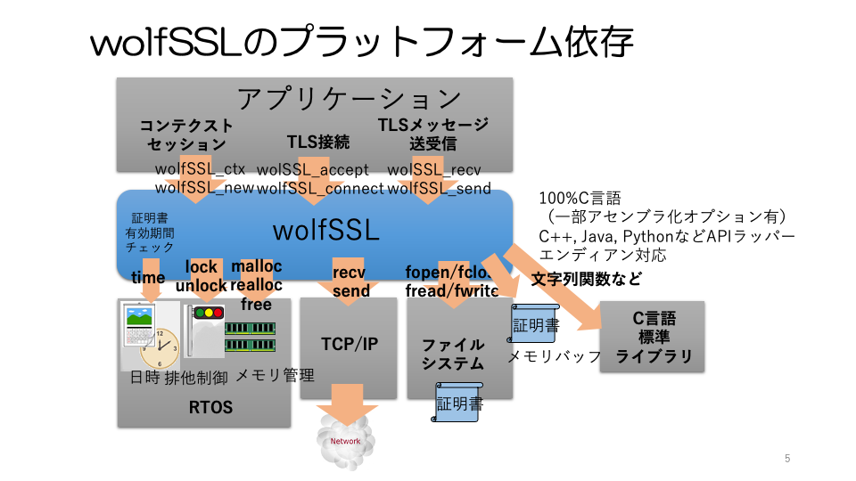

## 12章 プラットフォーム依存部

### 12.1 概要

プロトコルライブラリのように幅広い用途で使用されるライブラリは多様なプラットフォーム環境で動作することが求められます。プラットフォームの多様性の第一のファクターはプロセッサでしょう。今日、多様な動作環境やシステム要件に対応するために様々なプロセッサアーキテクチャやプロセッサチップが使用されています。これらに幅広く対応できるようにするためにはC言語コンパイラが強力な道具となります。C言語は今日のほとんどのプロセッサ向けにサポートされています。wolfSSLのコードはすべて一旦C言語によって記述してあるので32ビット以上のプロセッサであればアーキテクチャによらずほとんどのプロセッサで動作させることができます。

しかし、wolfSSLのようなプロトコルライブラリが組み込まれる現実的なシステムでは単にC言語記述しただけでは対応できない様々なシステム固有の依存部分を抱えています。次の図はwolfSSLのプラットフォーム依存部について示しています。本節ではそうしたプラットフォーム依存部分について解説します。

付録３にwolfSSLのサポートする主なプラットフォーム向けのオプションをまとめます。

   

   

以下にプラットフォーム依存部と対応するソースファイルをまとめます。

|依存部種別|ファイル名|
|---|---|
|排他制御|wc_port.c|
|ファイルシステム|wc_port.h|
|ネットワーク|wolfio.c|
|実時間時計|wc_port.h|
|ヒープメモリ|types.h, memory.c|
|乱数シード|random.c|

### 12.2 スレッド/タスク排他制御

プロトコルライブラリーのようにアプリケーションが複数のスレッドないしタスクで並列に動作し、ライブラリーを共有する場合が多々あります。そのような場合にスレッド/タスク間で競合を起こさないようにライブラリー内の並列処理に対し適切な排他制御を行う必要があります。

wolfSSLでは、ライブラリーの設計ポリシーとしてこのような並列処理はアプリケーションとしてSSLコンテクスト、SSLセッションごとに分けることを義務付けています。つまり同一のSSLコンテクスト、あるいは同一のSSLセッションは単一のスレッド、タスクに所属する必要があります。ライブラリーとしては異なるコンテクストあるいはセッション間のスレッド、タスク安全性を保証しています。

この安全性を実現するためにライブラリー内で適宜排他制御を行う必要がありますが、排他制御の方法は各OSによって異なっています。wolfSSLではpthreadをデフォルトとしているので、汎用OS上ではこれを利用するのが一番簡単です。pthreadを使用しないRTOSではライブラリービルド時のオプションによりプラットフォームの種別を指定します。

コンフィグレーションオプションで直接サポートされないプラットフォームでは、独自排他制御オプション(WOLFSSL_USER_MUTEX) を指定し、排他制御の初期化、解放、ロック、アンロックのAPIラッパーを定義します。ユーザは定義した簡単なラッパー関数の中で独自排他制御のAPIを呼び出すようにします。

|機能|ラッパー関数|
|---|---|
|初期化|int wc_InitMutex(wolfSSL_Mutex* m) { ... }|
|解放|int wc_FreeMutex(wolfSSL_Mutex *m) { ... }|
|ロック|int wc_LockMutex(wolfSSL_Mutex *m) { ... }|
|アンロック|int wc_UnLockMutex(wolfSSL_Mutex *m) { ... }|

アプリケーションとライブラリが非RTOS(ベアメタル)で動作する場合や単一のスレッドまたはタスクだけで動作する場合は排他制御の必要はありません。そのような場合はライブラリー内で排他制御を行わない単一スレッド(SINGLE_THREADED)オプションを指定します。

### 12.3 ファイルシステム

wolfSSLでは主に証明書の保管場所としてファイルシステムを使用します。デフォルトはPOSIX APIによってファイルのオープン、クローズ、読み出し、書き込みなどを行います。プラットフォームがPOSIX以外のAPIを提供している場合にはコンフィグレーションオプションで指定します。オプションが直接サポートされていないプラットフォームの場合は、ファイルのオープン、クローズ、読み出し、書き込みなどのAPIを個別にマクロ定義することも可能です。その場合、ユーザ独自ファイルシステムオプション(WOLFSSL_USER_FILESYSTEM)を指定します。

|機能|マクロ名|
|---|---|
|ディスクリプタ|XFILE|
|オープン、クローズ|XFOPEN, XFCLOSE|
|読出し、書込み位置|XFSEEK, XFTELL, XREWIND, XSEEK_END|
|読出し、書込み|XFREAD(BUF, SZ, AMT, FD) XFWRITE(BUF, SZ, AMT, FD)|

以下にサポートされているプラットフォームとマクロ名をまとめます。

組み込みシステムではファイルシステムを持たないものも多数あります。そのような使用条件のためにwolfSSLでは証明書関係のAPIとして各機能ごとにファイルシステムありの場合とファイルシステムを使用しない場合の２種類のAPIを提供しています。ファイルシステムが無い場合は、ファイルイメージと同じものをメモリーバッファー上に置き、そのポインタとサイズを渡します。各APIの命名はwolfSSL_load_verify_locationsに対してはwolfSSL_load_verify_bufferのように、wolfSSL_xxxに対してwolfSSL_xxx_bufferのようなネーミング規則となっています。各機能に対応したAPIを以下の表にまとめます。

これらの関数を使用してTLS通信を実装する方法については「第二部 プログラミング」のプログラム例を参照してください。

|役割|機能|指定単位|ファイルシステム 有り|　　　　　　 無し|
|---|---|---|---|---|
|証明側|CA 証明書 ロード|コンテクスト|wolfSSL_CTX_load_verify_location|wolfSSL_CTX_load_verify_buffer|
|認証側|ノード 証明書 ロード|コンテクスト|wolfSSL_CTX_use_certificate_file|wolfSSL_CTX_use_certificate_buffer|
|　　　　　|　　　　　　　　　|セッション|wolfSSL_use_certificate_file|wolfSSL_use_certificate_buffer|
|　　　　　|秘密鍵 ロード|コンテクスト|wolfSSL_CTX_use_certificate_file|wolfSSL_CTX_use_certificate_buffer|
|　　　　　|　　　　　　　　　|セッション|wolfSSL_use_certificate_file|wolfSSL_use_certificate_buffer|

### 12.4 ネットワーク

TLSプロトコルの下位プロトコルとしてはTCP/IPに代表されるトランザクションの安定性が保証されたプロトコルが仮定されています。wolfSSLではこのレイヤーへのアクセスAPIとしてデフォルトではBSD Socketが使用されます。それ以外を提供するプラットフォームを使用する場合はコンフィグレーションオプションで適切なオプションを指定します。

プラットフォームがサポートされていない場合は、独自メッセージI/Oオプション(WOLFSSL_USER_IO)を指定し、実行時にメッセージ送受信のためのコールバック関数を登録します。具体的な使用方法については「第二部 プログラミング」のプログラム例を参照してください。

### 12.5 実時間時計

wolfSSLでは、主に証明書の有効期限のチェックに実時間時計を使用します。デフォルトではtime関数によるUNIX Epoch Timeを使用します。
独自の関数を使用する場合は独自時計オプション(USER_TIME)を指定することができます。

wolfSSLライブラリーでは、全体としてはアプリケーションがワード長依存を意識することはほとんどありませんが、Epoch Timeは32ビット整数では2038年にオーバーフローします。そのため、32ビットアーキテクチャの場合はEpoch timeのtime_t型を64ビット整数となるように定義しなければいけません。その場合は、独自time_t型オプション(HAVE_TIME_T_TYPE)を指定して、time_t型をtypedefで定義します。

### 12.6 ヒープメモリ管理

デフォルトではmalloc/free/realloc関数により可変長のヒープ領域の確保、解放を行います。

プラットフォーム独自のAPIを使用する場合は独自mallocオプション(XMALLOC_USER)を指定して各マクロを定義します。

|機能|マクロ|
|---|---|
|確保|XMALLOC(size. heap, type)|
|解放|XFREE(p, heap, type)|
|再確保|XREALLOC(p, size, heap, type)|

組み込み向けのプラットフォームの中には可変長のヒープ領域をサポートしていない場合があります。そのような場合には、コンフィグレーションオプション(WOLFSSL_STATIC_MEMORY)を指定することにより、静的なメモリーバッファー領域をライブラリーに登録してそれを可変長ヒープ領域として管理させるtこができるようになっています。ただし、このオプションで使用できるライブラリー機能にはある程度の制約がある点に注意が必要です。

### 12.7 真性乱数、乱数シード

wolfSSLでは質の高い真性乱数を生成できるように、アプリケーションやTLSのプロトコル処理から呼び出す乱数生成関数 RNG_GenerateBlock, RNG_GenerateByte はプラットフォームディペンドの乱数シード値を一定周期(RESEED_INTERVA)毎に得てそれを元にSHA-256のHash-DRBGによる擬似乱数生成を行うことで乱数値を得ています。SHA-256によるHash-DRBGは２５６ビットの乱数に対して2^48程度の周期を保証できることが知られているので、RESEED_INTERVAの値は32ビットワードの十分大きな切りの良い数値としてデフォルトでは1000,000としています。

脚注：Table 2, NIST SP 800-90A Recommendation for Random Number Generation Using Deterministic RBGs 

シード生成は wc_GenerateSeed関数で行いますが、この乱数は真性乱数でなければなりません。真性乱数の質を厳密に定義することは難しいですが、一般的に質の高い真性乱数生成を自製することは非常に注意が必要です。原則としてOSの提供する乱数生成機能やMCUなどハードウェアの提供する真性乱数生成機能を利用すべきです。

wolfSSLでは、例えばLinux系OSの乱数デバイス(/dev/random)のように代表的OSの乱数生成機能やMCUの持つ乱数生成機能についてはコンフィグレーションオプションの指定で適切なwc_GenerateSeed関数が選択されるようになっています。

どうしても自製する場合は十分注意して実現する必要があります。注意点については、3.2 乱数 3) 乱数生成の実際 を参照してください。

