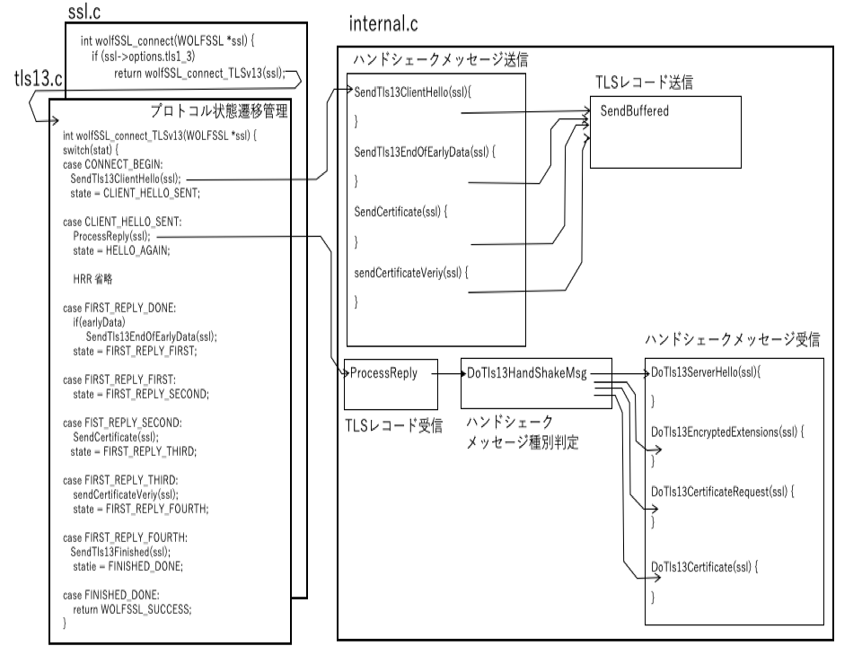

## 第10章 プロトコル処理

### 10.1 TLS接続

前述のようにTLSプロトコル処理部は、プロコトル状態遷移管理、ハンドシェークメッセージ処理、TLSレコード処理の三層に階層化されています。図9-2では、wolfSSL_connect関数を例に処理の流れを示します。

第二章で紹介したように、TLSのハンドシェークプロトコルはTLS1.2までとTLS1.3で大きく変わりました。このためプロトコル状態遷移管理も、wolfSSL_connect関数の入り口部分で対象バージョンによって分岐し、TLS1.3の場合はwolfSSL_connect_TLSv13関数によって処理します。TLS1.2以前の場合はそのままwolfSSL_connect関数にて処理します。図では、TLS1.3の場合の流れを示しますが、どちらの場合も状態をswitch文で管理し、ハンドシェークの状態は上のcaseから下のcaseに流れるようになっています。各caseでは処理が正常の場合は次の状態をセットし、breakせずに次のcaseの処理に直接入るようになっています。エラーの場合は、直ちにアラート処理など適切なエラー処理を行って関数をエラーリターンします。

このように通常の処理モードではswitch文は単に状態の遷移を示すのみで大きな役割は果たしませんが、ノンブロックモードで動作する場合はswitch文によって状態に応じた適切なcase文にジャンプさせ処理を進めます。ノンブロックモードの処理については後述します。


<br> <br>

<br> <br>

以下のプログラムは、wolfSSL_connect_TLSv13関数のソースコードのうちプロトコル状態遷移の前半部分だけを抜き出したものです。


```
int wolfSSL_connect_TLSv13(WOLFSSL* ssl)
{
    switch (ssl->options.connectState) {
        case CONNECT_BEGIN:
            /* Always send client hello first. */
            if ((ssl->error = SendTls13ClientHello(ssl)) != 0) {
                WOLFSSL_ERROR(ssl->error);
                return WOLFSSL_FATAL_ERROR;
            }
            ssl->options.connectState = CLIENT_HELLO_SENT;
            FALL_THROUGH;
        case CLIENT_HELLO_SENT:
            /* Get the response/s from the server. */
            while (ssl->options.serverState <
                                          SERVER_HELLO_RETRY_REQUEST_COMPLETE) {
                if ((ssl->error = ProcessReply(ssl)) < 0) {
                    WOLFSSL_ERROR(ssl->error);
                    return WOLFSSL_FATAL_ERROR;
                }
            }
            ssl->options.connectState = HELLO_AGAIN;
            FALL_THROUGH;
        case HELLO_AGAIN:
            if (ssl->options.serverState ==
                                          SERVER_HELLO_RETRY_REQUEST_COMPLETE) {
                /* Try again with different security parameters. */
                if ((ssl->error = SendTls13ClientHello(ssl)) != 0) {
                    WOLFSSL_ERROR(ssl->error);
                    return WOLFSSL_FATAL_ERROR;
                }
            }
            ssl->options.connectState = HELLO_AGAIN_REPLY;
            FALL_THROUGH
            ...
```


プロコルの状態遷移はSSLセッションごとに管理します。SSL構造体のssl->options.connectStateが状態変数です。コーディング上は、状態遷移全体はswitch文で囲まれて状態に対応するcase文で区切られていますが、各case文の最後にはbreak文はなく処理は次のcaseにそのまま流れます。コーディング上それを明示するためにFALL_THROUGHと入っていますが、それ自身は何も実行しない空文のマクロとして定義されています。このswitch文はノンブロッキングモードの場合に機能しますが、それについては次節で説明します。ブロッキングモードの場合は、状態遷移とともにこのswitch文の中を単純に上から下に処理が進みます。

状態はCONNECT_BEGIN から始まります。この状態のとき関数はSendClientHello関数を呼び出します。SendClientHelloではハンドシェークの最初のメッセージのClientHelloを構成し、SendBuffered関数にてTLSレコードとして送信します。正常に送信が終了したら、状態を次のCLIENT_HELLO_SENTにセットしProcessReply関数にてサーバからの応答を待ちます。

ProcessReply関数ではサーバからのTLSレコードが受信されるのを待ちます。受信されたTLSレコードの正当性をチェックしたのちハンドシェークメッセージが期待するものであれば該当するメッセージ処理関数を呼び出します。この場合、DoServerHallo関数を呼び出して受信したメッセージを処理します。

このようにハンドシェークの状態を遷移し、最後にFinishedメッセージを正常に送信したらFINISHED_DONE 状態となり、wolfSSL_Connect 関数は正常にリターンします。


### 10.2 ノンブロッキングモード

ノンブロッキングモードの場合もライブラリーのコードとしては同じものが動作します。wolfSSL_connect(その中でwolfSSL_connect_TLSv13)が呼び出されると、初期状態ではswitch文により CONNECT_BEGINからSendTls13ClientHelloを呼び出し、TLSレコードの送信処理のためSendBufferedを呼び出しメッセージをバッファリングし正常にリターンします。SendTls13ClientHello関数が正常に終了すると次の状態であるCLIENT_HELLO_SENTが設定され、ProcessReply関数が呼び出され、その中で最終的にSocketのrecv関数が呼び出されます。Socketがノンブロッキングモードであればサーバーからの応答メッセージが受信されていなくてもrecv関数はすぐにリターンします。

この時、戻り値としてはノンブロッキング処理の戻りであることを示すEWOULDBLOCKが返却されます。これは内部的にはエラーコードの一つであるWANT_READと翻訳され、ProcessReply関数の戻り値としてこのコードが返却されます。wolfSSL_connect内ではこの戻り値を詳細エラーコードに設定し、関数をエラー終了と同様の戻り値 WOLFSSL_FATAL_ERROR でリターンします。

wolfSSL_connect関数を呼び出したアプリケーション側では、関数の戻り値がWOLFSSL_FATAL_ERRORである場合、詳細エラーがWANT_WRITE, WANT_READのいずれかである場合はノンブロッキング処理が正常に戻ったと判定し（場合によってはスーパーループなどを経て）繰り返しwolfSSL_connect関数を呼び出します。

再び呼び出されたwolfSSL_connect内ではプロトコルの状態はCLIENT_HELLO_SENTになっており、再びProcessReplyが呼び出されることになります。何度目かのProcessReplyの呼び出し時にサーバからの応答メッセージが受信されていれば、Socketのrecv関数はそのメッセージを返却するのでProcessReplay内でその内容を解析し、適切なハンドシェーク処理を呼び出します。この場合は、DoServerHelloが呼び出され処理を正常に完了すると関数は正常終了の返却値とともにリターンします。正常終了なので次の状態に遷移し次の処理が行われます。

このようにwolfSSL_connect関数内でメッセージ受信などのブロッキング状態に遭遇ごとに、関数の返却値としてはWOLFSSL_FATAL_ERROR、詳細エラーがWANT_WRITE, WANT_READのいずれかが返却されるので、呼び出し側で繰り返しwolfSSL_connect関数を呼び出すことでプロトコルの状態が進んでいくことになります。最終的にハンドシェークがすべて完了しFINISHED_DONEの状態まで遷移すると、関数の返却値として正常終了を返却するのでアプリケーション側はハンドシェーク処理全体が正常に完了したことを知ります。

このようにノンブロッキング処理では、ノンブロッキング処理時の関数の返却値としてエラー値を利用し、詳細エラーでノンブロッキング処理を判別することで、ブロッキングモードの場合と同じコードでノンブロッキング処理を実現しています。タイムアウトに関してはノンブロッキングモード、ブロッキングモードともにソケット層ないしアプリケーション層で実現する必要があります。

