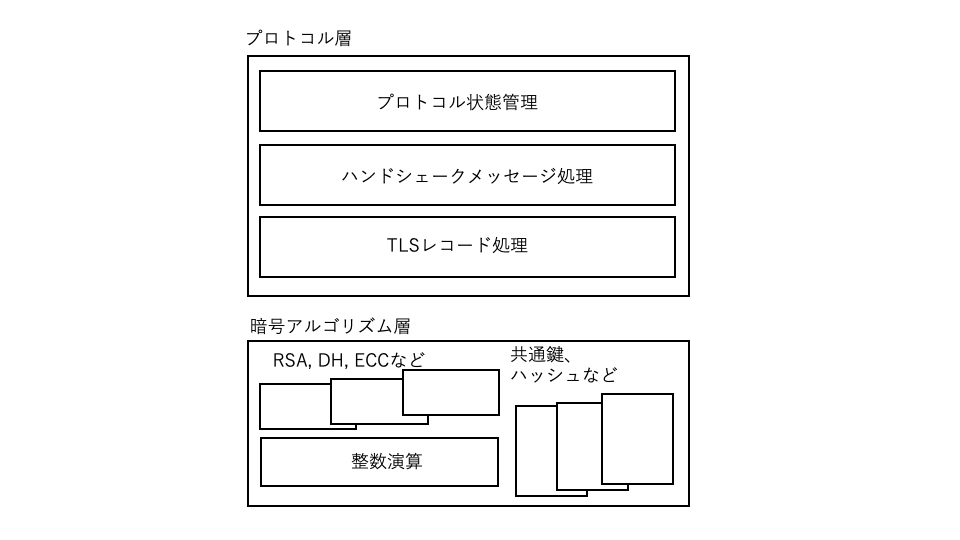

# Part 3 Library structure

Part 3 explains the internal structure of the TLS library using wolfSSL as a sample.

## Chapter 9 Library Structure

### 9.1 Library structure and file structure

As shown in Figure 9-1, the wolfSSL library is roughly divided into two layers: a protocol layer that realizes the TLS protocol and a cryptographic algorithm layer that is the basis of the protocol layer. The protocol layer is mainly layered into protocol state management that manages handshake state, message layer that processes each handshake message, and TLS record layer processing. The cryptographic algorithm layer is divided into modules that perform algorithm-specific processing such as hashing and symmetric key cryptography, and public key cryptosystems. Public key cryptography is layered into processing modules for each algorithm and integer processing that handles the underlying large integers.

<br> <br>

<br> <br>

The wolfSSL source files are available on the download page of the wolfSSL website for the stable version and on the Github repository (github.com/wolfssl) for the latest community version. The file structure of wolfSSL is summarized in the table below. In addition to the library source code, the set of files also contains files such as test programs, benchmarks, sample programs, test certificates, and keys.

In the library source code, the program itself and the header file are separated into their respective directories. They are also stored in two directories, the TLS protocol layer and the crypto engine layer.

The base development language for the library is C. The source code is written using only general-purpose code that is sufficient to support various C compilers, so a single code set can support various C compilers.

The source code of the assembler for performance optimization etc. is also included in the source file, but it is made so that the entire library works even with the C language source code alone without using them. In addition, the source files for porting to operate on platforms such as individual OS are stored under the port directory, but those files are not used when operating on general-purpose OS such as Linux and Windows. , Can only work with core source files.


| Item | Hierarchy | Directory name |
| --- | --- | --- |
| Programs | TLS Layer | src / |
| | Cryptographic engine layer | wolfcrypt / src |
| | Porting | wolfcrypt / src / port |
| Header file | TLS layer | wolfssl / |
| | Cryptographic engine layer | wolfssl / wolfcrypt |
| | OpenSSL extension | wolfssl / openssl |
| | Porting | wolfssl / wolfcrypt / port |
| Tests | TLS Layer | tests / |
| | Cryptographic engine layer | wolfcrypt / test |
Benchmark | TLS layer | examples / benchmark |
| | Cryptographic engine layer | wolfcrypt / benchmark |
| Sample programs | | examples / client <br> examples / server <br> Others <br> https://gihutb.com.wolfssl/wolfssl-examples |
| IDE sample project || IDE / |
| Test Certificate, Key | File | certs / *. {Pem, der} |
| | Memory data | wolfssl / certs_test.h |
| User-defined options || user_settings.h |

To build from the source code, in the command environment, generate a Makefile with the configure command and use the make command. If you downloaded it directly from Github, use Autoconf (shell script ./autogen.sh) to generate a configure script before building.

```
$ ./autogen.sh ← Only for community version

$ ./configure build options
$ make
```

When using an IDE, refer to the sample projects stored for each IDE under the IDE directory as appropriate.