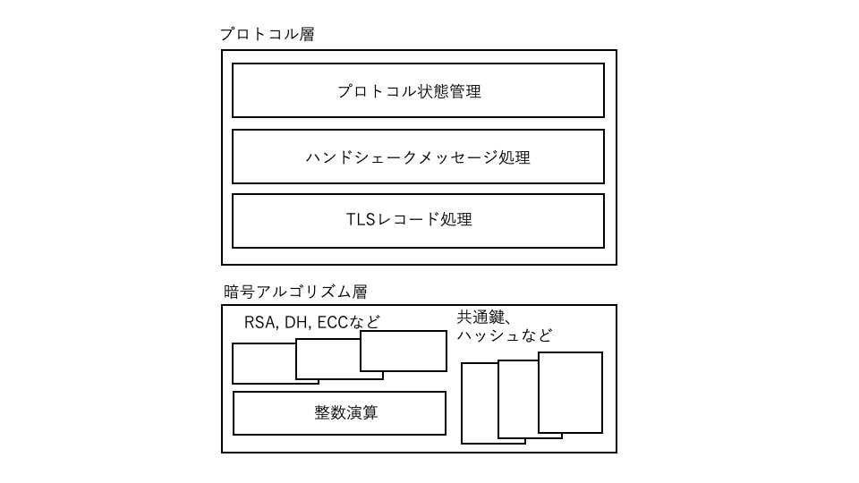

# Part 3 ライブラリーの構造

Part 3ではTLSライブラリーの内部構造についてwolfSSLをサンプルとして解説します。

## 第9章　ライブラリーの構成

### ９．1 ライブラリーの構造とファイル構成

wolfSSLライブラリーは図9-1に示すように大きくTLSプロトコルを実現するプロトコル層とその基盤となる暗号アルゴリズム層の二つに分かれています。プロコトル層は主にハンドシェークの状態管理をするプロトコル状態管理、ハンドシェークメッセージごとの処理をするメッセージ層とTLSレコード層の処理に階層化されています。暗号アルゴリズム層は、ハッシュや共通鍵暗号などアルゴリズム個別の処理を行うモジュールと、公開鍵暗号系にわかれています。公開鍵暗号処理は個々のアルゴリズムごとの処理モジュールと基盤となる大きな整数を扱う整数処理に階層化されています。

<br> <br>

<br> <br>

wolfSSLのソースファイルは、ステーブル版はwolfSSL社サイトのダウンロードページ、最新コミュニティー版はGithubレポジトリ (github.com/wolfssl) で入手することができます。wolfSSLのファイル構成を以下の表にまとめます。ファイル一式の中にはライブラリーのソースコードの他にテストプログラム、ベンチマーク、サンプルプログラム、テスト用の証明書、鍵などのファイルも含まれています。

ライブラリーソースコードはプログラム本体とヘッダーファイルがそれぞれのディレクトリーに分けられています。また、それらはTLSプロトコル層と暗号エンジン層の二つのディレクトリーにわけて格納されています。

ライブラリーのベース開発言語はC言語です。ソースコードは各種のCコンパイラーに対応できるように十分汎用なコードのみを使用して記述されているので、単一のコードセットで各種のCコンパイラーに対応することができます。

ソースファイルの中には性能最適化などのためのアセンブラーのソースコードも含まれていますが、それらを使用せずC言語ソースコードだけでもライブラリー全体が動作するように作られています。また、portディレクトリー下には個別のOSなどのプラットフォーム上で動作させるためのポーティング用のソースファイルが格納されていますが、Linux, Windowsなど汎用OS上で動作させる場合はそれらのファイルを使用せず、コアのソースファイルのみで動作させることができます。


|項　目|階層|ディレクトリ名|
|---|---|---|
|プログラム|TLS層|src/|
|        |暗号エンジン層|wolfcrypt/src|
|        |ポーティング|wolfcrypt/src/port|
|ヘッダーファイル|TLS層|wolfssl/|
|              |暗号エンジン層|wolfssl/wolfcrypt|
|　　　　　　　　|OpenSSL拡張|wolfssl/openssl|
|              |ポーティング|wolfssl/wolfcrypt/port|
|テスト|TLS層|tests/|
|     |暗号エンジン層|wolfcrypt/test|
|ベンチマーク|TLS層|examples/benchmark|
|          |暗号エンジン層|wolfcrypt/benchmark|
|サンプルプログラム||examples/client<br>examples/server<br>その他<br>https://gihutb.com.wolfssl/wolfssl-examples|
|IDEサンプルプロジェクト||IDE/|
|テスト用証明書, 鍵|ファイル|certs/*.{pem, der}|
|               |メモリーデータ|wolfssl/certs_test.h|
|ユーザ定義オプション||user_settings.h|

ソースコードからのビルドは、コマンド環境の場合はconfigureコマンドでMakefileを生成し、makeコマンドにて行います。Githubから直接ダウンロードした場合はAutoconf(シェルスクリプト ./autogen.sh)でconfigureスクリプトを生成してからビルドします。

```
$ ./autogen.sh ← コミュニティー版の場合のみ

$ ./configure  ビルドオプション
$ make
```

IDEを使用する場合は、IDEディレクトリ下に各種IDE別格納されているサンプルプロジェクトを適宜参照します。
